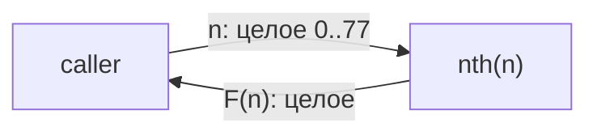
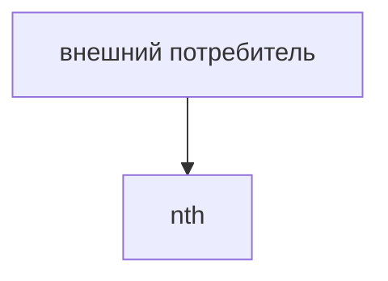

# Module: nth

<!--SECTION:MODULE_VISION-->
## Module Vision
<!-- УДАЛИ ПОСЛЕ ЗАПОЛНЕНИЯ: подсказка из скелета осталась. -->
Модуль владеет единственной публичной функцией `nth(n)` — чистой функцией вычисления
`n`-го числа Фибоначчи. Модуль реализует требования скоупа
[fibonacci](../fibonacci.spec.md), родительских и дочерних модулей нет. За пределами
модуля ничего не изменяется: у функции нет состояния, ввода-вывода и внешних
зависимостей.
<!--/SECTION:MODULE_VISION-->

<!--SECTION:OVERVIEW-->
## Overview
Вызов `nth(n)` проходит два шага внутри одного модуля: проверку входа и вычисление.
Допустимый вход возвращает целое число Фибоначчи, недопустимый — завершается
исключением с явным сообщением.


_Единственный путь вызова nth: проверка домена и возврат числа Фибоначчи — FIB-REQ-2._
<!--/SECTION:OVERVIEW-->

<!--SECTION:MODULE_USAGE_EXAMPLE-->
## Module Usage Example
```ts
import { nth } from './nth';

nth(0);   // 0
nth(1);   // 1
nth(10);  // 55
nth(77);  // 5527939700884757

// Ошибочные входы завершаются исключениями:
nth(-1);   // RangeError: n должно быть в диапазоне [0, 77]
nth(1.5);  // TypeError: n должно быть целым числом
nth(78);   // RangeError: n должно быть в диапазоне [0, 77]
```
<!--/SECTION:MODULE_USAGE_EXAMPLE-->

<!--SECTION:MODULE_REQUIREMENTS-->
## Requirements
No module-specific requirements. Implements parent requirements: FIB-REQ-1, FIB-REQ-2,
FIB-REQ-3, FIB-REQ-4.
<!--/SECTION:MODULE_REQUIREMENTS-->

<!--SECTION:INTER_MODULE_DEPENDENCIES-->
## Inter-Module Dependencies
- **Depends on:** none
- **Scope Reference (cross-scope):** none
- **Provides to:** none (публичный API библиотеки для внешних потребителей)


<!--/SECTION:INTER_MODULE_DEPENDENCIES-->

<!--SECTION:ENTITY_INVENTORY-->
## Entity Inventory

_Это полный список сущностей модуля. Любое введение сущности execution-агентом помимо этого списка считается drift'ом и требует обновления spec._

| Name | Type | Purpose |
|------|------|---------|
| `nth` | Function | Чистая функция: проверка индекса и вычисление F(n) |

Сущность одна, отношения рисовать нечего — ER-схема не нужна.

Ошибки: throw (`TypeError` / `RangeError`) → владелец: `nth`
<!--/SECTION:ENTITY_INVENTORY-->

<!--SECTION:ENTITY_SURFACES-->
## Entity Surfaces
Одна сущность `nth` — чистая функция с контрактом на операцию `nth(n)`, включая
поведение на недопустимых входах.

<details>
<summary>Полные поверхности сущностей</summary>

### `nth`
- **Type:** Function
- **Purpose:** Возвращает `n`-е число Фибоначчи для целого `n` из `[0, 77]`.
- **Public Properties:** N/A
- **Public Operations:**
  - `nth(n): number` — вернуть F(n), где F(0)=0, F(1)=1 и F(n)=F(n−1)+F(n−2) при n≥2.
- **Lifecycle:** N/A — функция без состояния, создавать и завершать нечего.
- **Events Emitted:** N/A
- **Errors & Degradation:** `TypeError` (n не целое: дробное, NaN, ±∞) и `RangeError`
  (n целое вне `[0, 77]`) через throw; сообщение называет переданное значение и
  нарушенное ограничение. Обработку ошибки владелец не перехватывает — вызывающий
  решает сам.
- **Consumers:**
  - Internal: нет
  - External: TS-потребители библиотеки (публичный экспорт `fibonacci-library`)

</details>
<!--/SECTION:ENTITY_SURFACES-->

<!--SECTION:MODULE_CONTRACTS-->
## Module Contracts
Один Service-контракт на функцию `nth`. Port/Adapter в модуле нет — поведение одно,
вариативности и внешних зависимостей нет, слой абстракции был бы пустым (FIB-DL-2).

Граф не рисуется: в модуле нет Port/Adapter, только Service `nth`.

Call Chain не рисуется: абстракций меньше двух — единственная функция `nth` без вызовов
вовне.

<details>
<summary>Контракты DbC</summary>

### Service: `nth`
- **Purpose:** Вычислить `n`-е число Фибоначчи.
- **Consumers:** внешние TS-потребители библиотеки.
- **Runtime Backing:** `not-implemented`
- **Verification Levels:** `unit`
- **Deferred Runtime Scope:** None

**Contract (DbC)**:
- `nth(n)`:
  - Pre: `n` — целое число от 0 до 77 включительно.
  - Post: возвращено точное целое F(n) как `number`, F(0)=0, F(1)=1,
    F(n)=F(n−1)+F(n−2); побочных эффектов и мутаций нет.
  - On pre-violation: если `n` не целое (дробное, NaN, ±∞) — `TypeError` с сообщением,
    называющим `n` и требование целочисленности; если `n` целое вне `[0, 77]` —
    `RangeError` с сообщением, называющим `n` и допустимый диапазон.

**Invariants**: модуль не хранит состояние; повторный вызов с тем же `n` даёт тот же
результат.

</details>
<!--/SECTION:MODULE_CONTRACTS-->

<!--SECTION:PUBLIC_OPTIONS-->
## Public Options & Policies
Публичных опций и политик нет — функция не настраивается.

<details>
<summary>Опции и политики</summary>

Все публично наблюдаемые опции отсутствуют: сигнатура `nth(n)` фиксирована, конфигурация
и флаги не потребляются в v1.

</details>
<!--/SECTION:PUBLIC_OPTIONS-->

<!--SECTION:FILE_STRUCTURE-->
## File Structure
```
src/
├── nth.ts
└── nth.test.ts
```

**File Mapping:**
- `src/nth.ts`: публичный экспорт чистой функции `nth`
- `src/nth.test.ts`: unit-тесты контракта `nth` (счастливый путь и негативные сценарии)
<!--/SECTION:FILE_STRUCTURE-->

<!--SECTION:MODULE_DECISION_LOG-->
## Module Decision Log
Отдельных решений модуля нет — оба решения по поведению API записаны в Decision Log
скоупа (FIB-DL-1, FIB-DL-2).

<details>
<summary>Полные записи Decision Log</summary>

### Approval #1 — current specification set
- **Status:** pending
- **Reviewed set:** `specs/fibonacci/fibonacci.spec.md`, `specs/fibonacci/nth/nth.spec.md`
- **Independent review:** pending
- **Operator decision:** pending
- **Recorded:** 2026-09-02

</details>
<!--/SECTION:MODULE_DECISION_LOG-->

<!--SECTION:HANDOFF-->
## Handoff to Tasks
- **Implementation files to be created:** `src/nth.ts`
- **Test files to be created:** `src/nth.test.ts`
- **Stack dependencies:**
  - Language: TypeScript (resolves to `ai/directives/coding/typescript-rules.xml`)
  - Test framework: `node:test` (resolves to `ai/directives/testing/node-test.xml`)
- **Module Rules Additions:** None

- **Open risks & validation needs:** нет открытых рисков; негативные сценарии заданы
  FIB-REQ-3 и FIB-REQ-4 и проверяются unit-тестами контракта.
<!--/SECTION:HANDOFF-->

