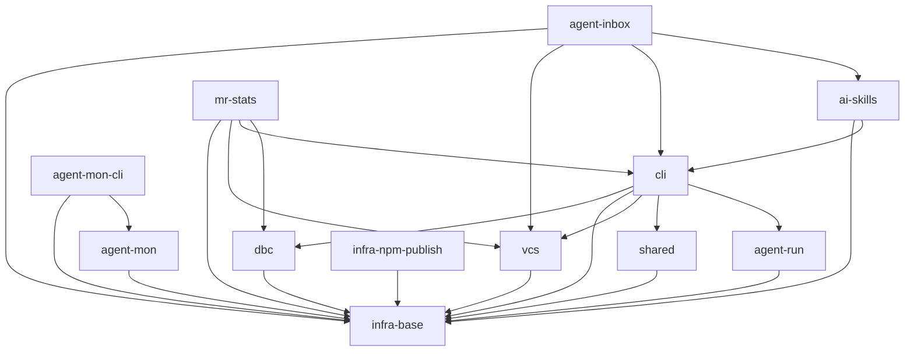

# Project Tasks

## Entry Points

- [Specs Portal](./README.md) — Scope Graph + all scope specs.
- Tickets execute ONLY via the `/sdd-execute` flow (one ticket) or its batch form; the orchestrator dispatches phase-workers then audit — the operator does not invoke audit by hand.

## Project-Wide Conventions (declared once, inherited)

- **File-header:** owned by the coding rule (`@file` / `@consumers` / `@tasks`), enforced by `sdd-verify`.
- **Baseline Completion Rule:** a Round cannot go `[x] DONE` until — every phase `[x]`; every BDD scenario mapped to a test or `Deferred Test Ownership`; verification commands run with exit recorded; every entity beyond the Inventory logged `intro …`; a Handoff line closes each phase.
- **Execution-Log token vocabulary:** `intro <Entity> ← <reason>` · `decision <key>=<value> ← <reason>` · `tried <approach> → <result>` · `discovery <fact>` · `insight <observation> → <spec-section>` · `verified <tool>@<version> 
` · `ver <cmd> → pass|fail exit=<N>` · `BLOCKED <cause>` · `DONE`. A `[x]` line with an unreplaced `<…>` placeholder is fabricated (BLOCKER).
- **Post-task hook:** after a Round closes the orchestrator runs audit; until PASS the round is closed-but-unverified and dependents are blocked.

## Cross-Scope DAG

Cross-scope edges + integration tickets only; intra-scope edges live in each scope index. Order follows the Portal Scope Graph (`specs/README.md`).

<!-- no cross-scope integration tickets exist yet — this scaffolding run only decomposed
ai-skills/directive-assembly, a single-scope module with no cross-scope integration ticket of its
own (its only cross-scope reference, `sdd-step` in scope `cli`, is DEFERRED — DA-DL-15). -->

## Scope Tracker

| Scope             | Type           | Index                                       | Tasks | Done |
| ----------------- | -------------- | ------------------------------------------- | ----- | ---- |
| infra-base        | infrastructure | —                                           | 0     | 0/0  |
| shared            | infrastructure | —                                           | 0     | 0/0  |
| cli               | product        | —                                           | 0     | 0/0  |
| vcs               | product        | —                                           | 0     | 0/0  |
| dbc               | library        | —                                           | 0     | 0/0  |
| agent-mon         | library        | —                                           | 0     | 0/0  |
| agent-mon-cli     | product        | —                                           | 0     | 0/0  |
| infra-npm-publish | infrastructure | —                                           | 0     | 0/0  |
| ai-skills         | library        | [3-tasks](./ai-skills/ai-skills.3-tasks.md) | 1     | 0/1  |
| agent-run         | library        | —                                           | 0     | 0/0  |
| agent-inbox       | product        | —                                           | 0     | 0/0  |
| mr-stats          | product        | —                                           | 0     | 0/0  |

<!-- Scopes without a v2 "Index" here still carry legacy v1 tickets under tasks/<scope>/ — untouched
by this scaffolding run, out of its blast radius (ai-skills/directive-assembly only). -->

## Decision Log (project task level)

- PROJECT-TASKS-D-1 · первая v2-задача проекта (`specs/3-tasks.md` не существовал до этого прогона);
  скаффолдинг ограничен модулем `directive-assembly` скоупа `ai-skills` — остальные 11 скоупов
  остаются на legacy v1-раскладке (`tasks/<scope>/`), не мигрируются этим прогоном
