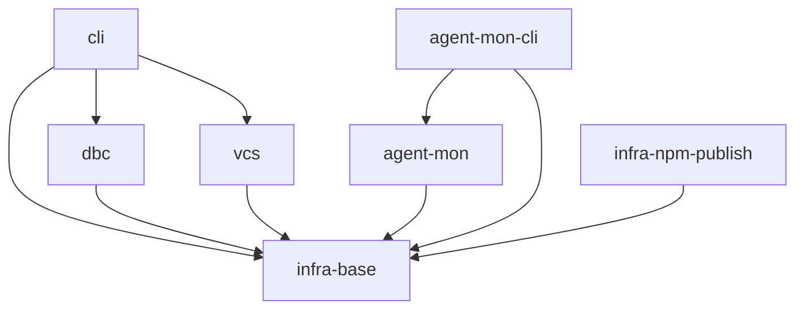

# Gennady

## Vision

CLI-инструмент для AI-агентов: работа с git-изменениями, merge-конфликтами и GitLab review-пайплайном. Чистая архитектура, zero runtime deps, бандлится в чанки (Vite).

## Scope Graph

## Scopes

| Scope                                                                | Type           | Spec                     | Description                                                                 |
| -------------------------------------------------------------------- | -------------- | ------------------------ | --------------------------------------------------------------------------- |
| [`infra-base`](./infra-base/infra-base.spec.md)                      | infrastructure | ✅                       | Node.js 22+, npm, tsc, prettier, node:test, vite                            |
| [`cli`](./cli/cli.spec.md)                                           | product        | ✅                       | CLI-модуль: lint, alt-opinion, cat — команды для AI-агентов                 |
| [`vcs`](./vcs/vcs.spec.md)                                           | product        | ✅                       | VCS-клиент (GitLab + GitHub): Merge Requests, Discussions, Repository Files |
| [`dbc`](./dbc/dbc.spec.md)                                           | library        | ✅                       | DBC-фреймворк: парсинг и валидация текстовых контрактов                     |
| [`agent-mon`](./agent-mon/agent-mon.spec.md)                         | library        | 🚧 (awaiting setup sync) | Пассивный мониторинг активных сессий AI-агентов через провайдеры            |
| [`agent-mon-cli`](./agent-mon-cli/agent-mon-cli.spec.md)             | product        | 🚧 (awaiting setup sync) | Интерактивный терминальный дашборд для мониторинга сессий агентов           |
| [`infra-npm-publish`](./infra-npm-publish/infra-npm-publish.spec.md) | infrastructure | 🚧 (awaiting setup sync) | Автоматизированная публикация npm-пакета через release-it                   |
