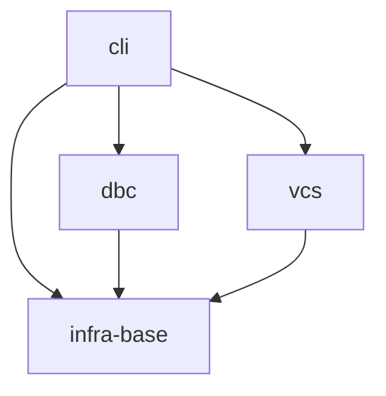

# Gennady

## Vision

CLI-инструмент для AI-агентов: работа с git-изменениями, merge-конфликтами и GitLab review-пайплайном. Чистая архитектура, zero runtime deps, бандлится в чанки (Vite).

## Scope Graph

## Scopes

| Scope                                           | Type           | Spec | Description                                                       |
| ----------------------------------------------- | -------------- | ---- | ----------------------------------------------------------------- |
| [`infra-base`](./infra-base/infra-base.spec.md) | infrastructure | ✅   | Node.js 22+, npm, tsc, prettier, node:test, vite                  |
| [`cli`](./cli/cli.spec.md)                      | product        | ✅   | CLI-модуль с командами для AI-агентов: lint (валидация TS-файлов) |
| [`vcs`](./vcs/vcs.spec.md)                      | product        | ✅   | VCS-клиент для GitLab: Merge Requests, Discussions, Users          |
| [`dbc`](./dbc/dbc.spec.md)                      | library        | ✅   | DBC-фреймворк: парсинг и валидация текстовых контрактов           |
