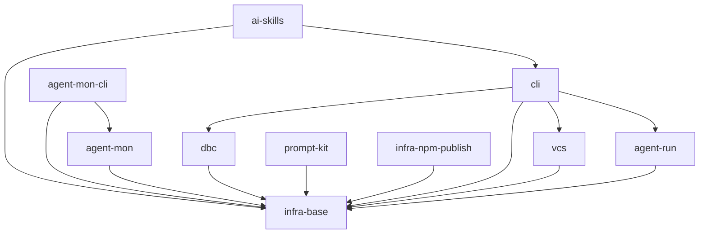

# Gennady

## Vision

CLI-инструмент для AI-агентов: работа с git-изменениями, merge-конфликтами и GitLab review-пайплайном. Чистая архитектура, zero runtime deps, бандлится в чанки (Vite).

## Scope Graph

## Scopes

| Scope                                                                | Type           | Spec | Description                                                                     |
| -------------------------------------------------------------------- | -------------- | ---- | ------------------------------------------------------------------------------- |
| [`infra-base`](./infra-base/infra-base.spec.md)                      | infrastructure | ✅   | Node.js 22+, npm, tsc, prettier, git-hooks (pre-commit), node:test, vite        |
| [`cli`](./cli/cli.spec.md)                                           | product        | ✅   | CLI-модуль: lint, alt-opinion, cat, sync — команды для AI-агентов               |
| [`vcs`](./vcs/vcs.spec.md)                                           | product        | ✅   | VCS-клиент (GitLab + GitHub): Merge Requests, Discussions, Repository Files     |
| [`dbc`](./dbc/dbc.spec.md)                                           | library        | ✅   | DBC-фреймворк: парсинг и валидация текстовых контрактов                         |
| [`agent-mon`](./agent-mon/agent-mon.spec.md)                         | library        | ✅   | Пассивный мониторинг активных сессий AI-агентов через провайдеры                |
| [`agent-mon-cli`](./agent-mon-cli/agent-mon-cli.spec.md)             | product        | ✅   | TUI-дашборд для мониторинга сессий агентов (ink + React)                        |
| [`infra-npm-publish`](./infra-npm-publish/infra-npm-publish.spec.md) | infrastructure | ✅   | Автоматизированная публикация npm-пакета через release-it                       |
| [`ai-skills`](./ai-skills/ai-skills.spec.md)                         | library        | ✅   | AI-навыки для агентов: SDD-воркфлоу + alt-opinion                               |
| [`prompt-kit`](./prompt-kit/prompt-kit.spec.md)                      | library        | ✅   | JSX-библиотека для сборки промптов из примитивов с рендером в XML/Markdown      |
| [`agent-run`](./agent-run/agent-run.spec.md)                         | library        | ✅   | Запуск внешнего AI-движка (opencode первым) с заданием и директориями, readonly |
