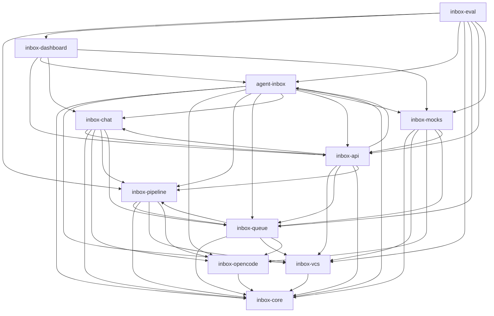

# Tasks: agent-inbox

## Scope Spec

- [Scope spec](./agent-inbox.spec.md)

## Cascade Table

<!-- ЗАПОЛНЯЕТ АГЕНТ: действующие правила scope из Scope Graph (транзитивное замыкание depends-on). -->

## Inter-Module DAG

## Tracker

| Task-ID     | Title                                                                      | Module          | Dependencies                                                                   | Status   | Reopens |
| ----------- | -------------------------------------------------------------------------- | --------------- | ------------------------------------------------------------------------------ | -------- | ------- |
| AI-seed     | test-infra: seed-DSL + контракт-сьют портов + кассеты                      | —               | IC-journal, IV-gitlab                                                          | [ ] TODO | —       |
| AI-fasttest | test-suite health: изоляция тяжёлых integration-тестов                     | —               | —                                                                              | [ ] TODO | —       |
| AI-skip-fix | test-honesty: раскатка over-skip + shutdown hygiene (архитектор, same-day) | —               | AI-fasttest                                                                    | [ ] TODO | —       |
| AI-roots    | Isolate runtime profiles and bootstrap the pivot                           | —               | —                                                                              | [ ] TODO | —       |
| AI-cutover  | Wire journal-first runtime and retire legacy role orchestration            | —               | IV-vcs-port, IO-runtime, IP-control, IQ-actions, IC-handoff, IA-proj, IM-cases | [ ] TODO | —       |
| IA-rest-sse | inbox-api: REST/SSE + DTO-проекции                                         | inbox-api       | IV-gitlab, IQ-executor                                                         | [ ] TODO | —       |
| IA-health   | serve/test-infra: утечка хэндлов, orphan-restart, вынос v1-легаси red      | inbox-api       | AI-fasttest                                                                    | [x] DONE | —       |
| IA-proj     | Journal projections and typed local API                                    | inbox-api       | IC-state, IV-vcs-port, IP-control, IQ-actions, IC-handoff                      | [ ] TODO | —       |
| IC-anchors  | inbox-chat: якоря + operator-сессия + мутации                              | inbox-chat      | IA-rest-sse                                                                    | [ ] TODO | —       |
| IC-handoff  | MR chat, artifact mutation and full/delta DEV handoff                      | inbox-chat      | IC-state, IO-runtime, IP-control, IQ-actions                                   | [ ] TODO | —       |
| IC-journal  | Bootstrap: журнал событий + per-MR layout                                  | inbox-core      | —                                                                              | [ ] TODO | —       |
| IC-decision | inbox-core: датасет решений + барьер готовности + dry-run                  | inbox-core      | IC-journal                                                                     | [ ] TODO | —       |
| IC-state    | Canonical review state and accumulated change batches                      | inbox-core      | AI-roots                                                                       | [ ] TODO | —       |
| ID-spa      | inbox-dashboard: загрузка / доска / лента / чат-колонка                    | inbox-dashboard | IA-rest-sse, AI-seed                                                           | [ ] TODO | —       |
| ID-design   | inbox-dashboard: приведение UI к Carbon & Steel (design-system compliance) | inbox-dashboard | ID-spa                                                                         | [x] DONE | —       |
| ID-cockpit  | Carbon & Steel operator dashboard and MR workspace                         | inbox-dashboard | IC-handoff, IA-proj, IM-cases, AI-cutover                                      | [ ] TODO | —       |
| IE-harness  | inbox-eval: харнесс S1–S8 + метрики автономии                              | inbox-eval      | IP-review, ID-spa, AI-seed                                                     | [ ] TODO | —       |
| IE-realeval | Adaptive real validation and product acceptance                            | inbox-eval      | IV-vcs-port, IP-control, IQ-actions, IA-proj, IM-cases, AI-cutover, ID-cockpit | [ ] TODO | —       |
| IM-cases    | Deterministic isolated mock runtime and port contract kit                  | inbox-mocks     | IC-state, IV-vcs-port, IO-runtime, IQ-actions, IA-proj                         | [ ] TODO | —       |
| IO-session  | inbox-opencode: TTL-паркинг + единый пул + промпт-компиляция               | inbox-opencode  | IC-journal                                                                     | [ ] TODO | —       |
| IO-runtime  | Agent runtime contracts, sessions and coverage traces                      | inbox-opencode  | IC-state                                                                       | [ ] TODO | —       |
| IP-review   | inbox-pipeline: план-шаблон + 3 слоя + линзы + coverage + синтез + хвосты  | inbox-pipeline  | IQ-executor                                                                    | [ ] TODO | —       |
| IP-control  | Deterministic full, delta and cross-review control plane                   | inbox-pipeline  | IC-state, IV-vcs-port, IO-runtime                                              | [ ] TODO | —       |
| IQ-executor | inbox-queue: реестр типов + executors + маршрут сессий                     | inbox-queue     | IC-decision, IV-gitlab, IO-session                                             | [ ] TODO | —       |
| IQ-actions  | Hybrid action packages and intent-preserving automation                    | inbox-queue     | IC-state, IV-vcs-port, IP-control                                              | [ ] TODO | —       |
| IV-gitlab   | inbox-vcs: двухъярусный sync + ось внимания + эффекты                      | inbox-vcs       | IC-journal                                                                     | [ ] TODO | —       |
| IV-vcs-port | Unified GitLab read, sync, effects and reconciliation                      | inbox-vcs       | IC-state                                                                       | [ ] TODO | —       |

## Decision Log (scope task level)

<!-- <ACR>-DL-N scope-уровневых решений декомпозиции/планирования. -->
