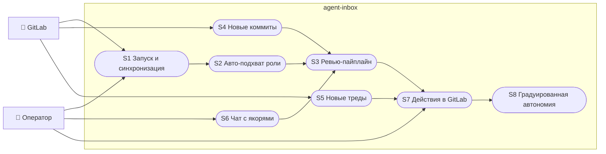
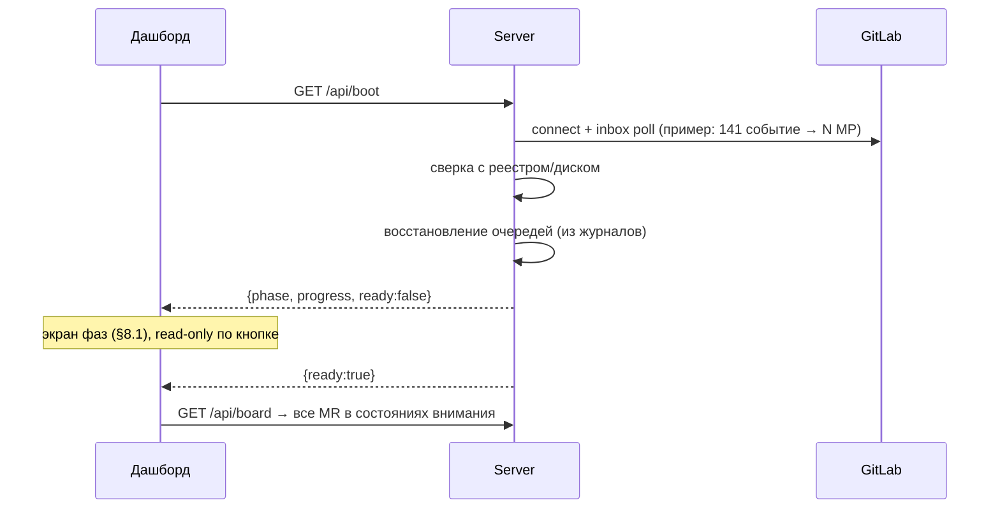
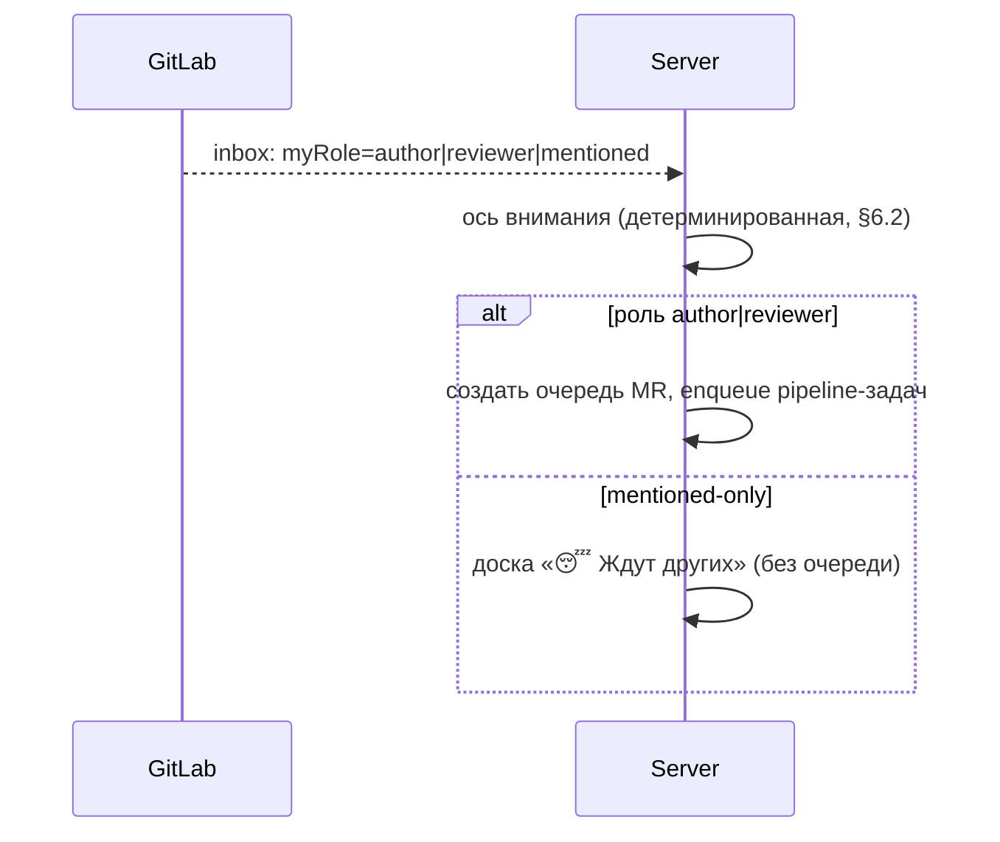
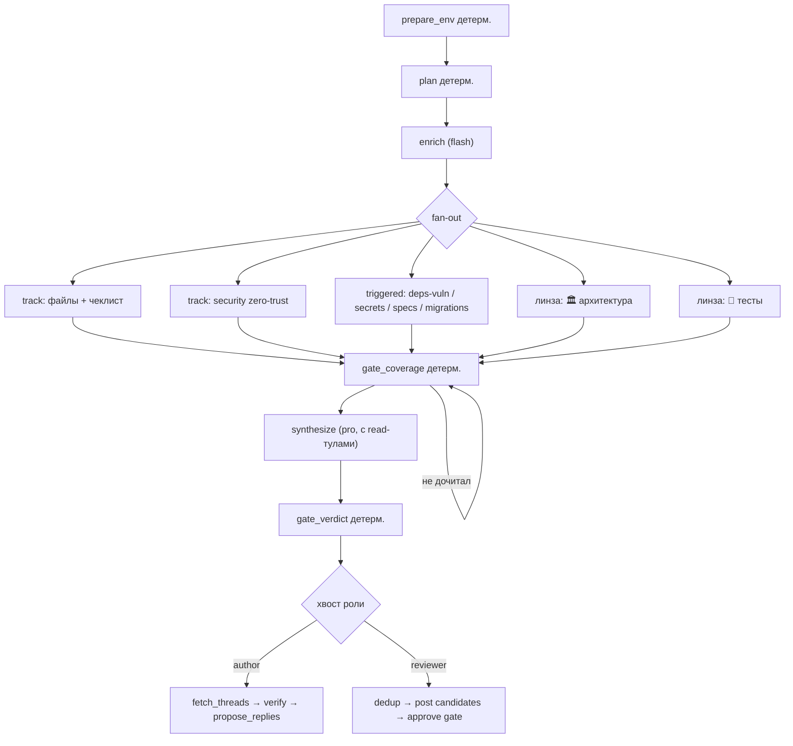
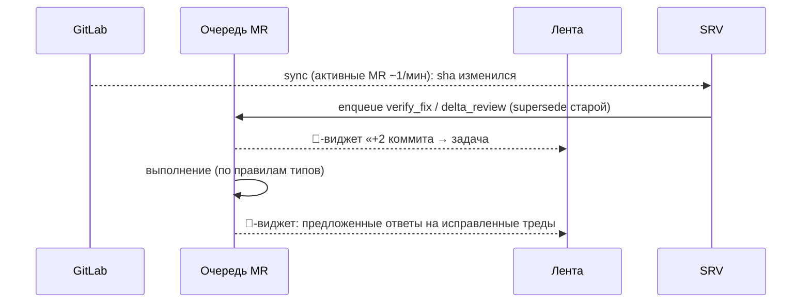
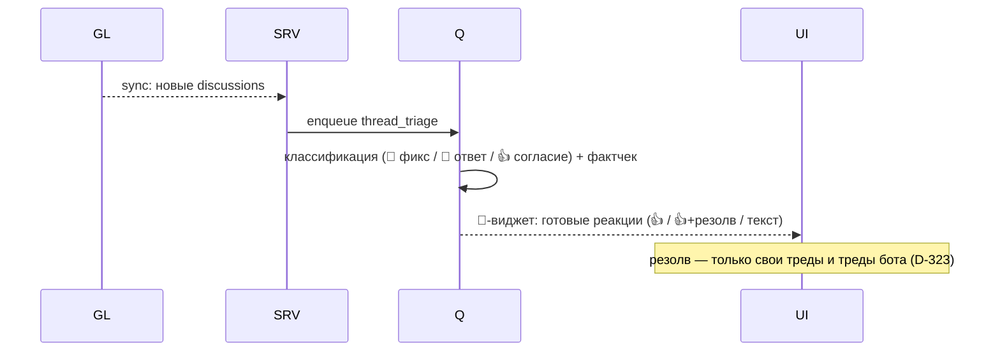
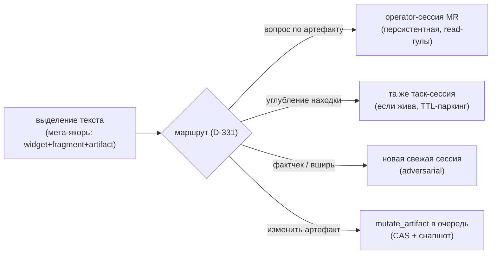
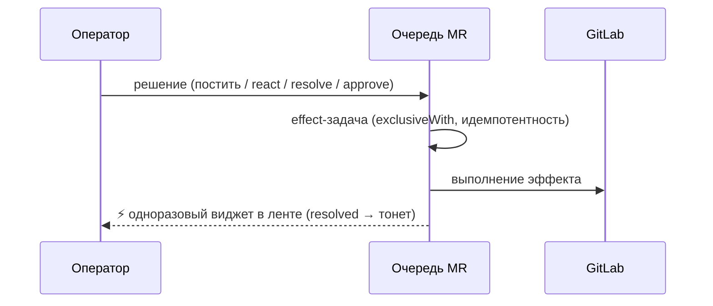
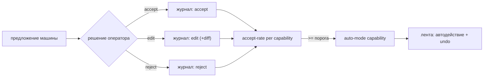
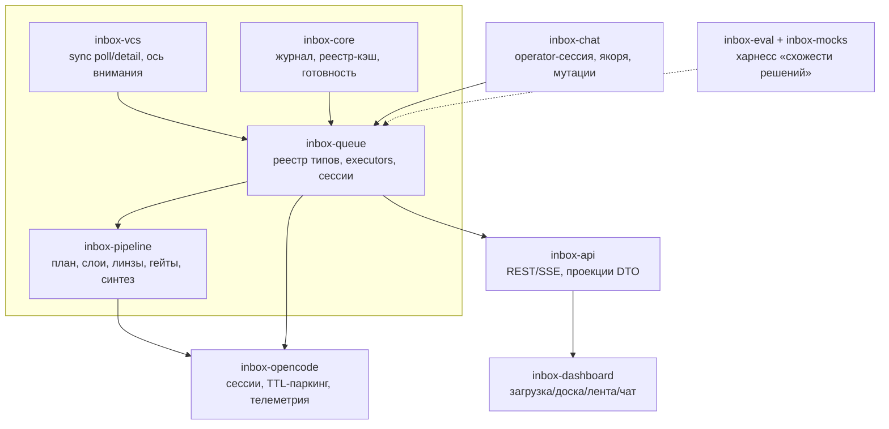

# agent-inbox: Scope Specification (v2 — полный рерайт)

<!--SECTION:SCOPE_TYPE-->

## scope-type

product

<!--/SECTION:SCOPE_TYPE-->

> **Статус:** v2, полный рерайт по итогам дизайн-сессии 2026-07-28/29. v1 сохранён в
> git-истории. Модульные спеки (`inbox-*`) и DAG тасок регенерируются из этого документа
> после его утверждения. Одна спека — одно согласование.

> **Правило наполнения корня (анти-монстр):** в корне живут только — vision/иерархия
> целей, карта сценариев (одна UC-диаграмма), карта модулей, реестр решений (строка на
> решение), перечень поверхност (строка на поверхность), non-goals, приёмка. Детали —
> в модульных спеках: секвенс-диаграммы, API-таблицы, реестры (типов задач, линз,
> триггеров), UX-макеты, DTO, BDD. Новая функциональность = новая строка в карте/реестре
> корня + деталь в модуле-владельце. Рост любой секции корня = триггер пересмотра.
>
> Текущие детальные секции — временно здесь для единого согласования; после
> регенерации модульных спек: S1/S2 → `inbox-core`+`inbox-vcs`, S3/S4/S5 →
> `inbox-pipeline`+`inbox-queue`, S6 → `inbox-chat`+`inbox-queue`, §5 → `inbox-api` +
> модули портов, §6 → `inbox-queue`+`inbox-pipeline`, §7 → `inbox-dashboard`.

<!--SECTION:VISION-->

## 1. Vision & иерархия целей

Локальная **машина ревью** для моих GitLab MR: сама находит, что требует моей реакции,
сама готовит всю фактуру, работает как настоящий ревьюер с бесконечным временем.

| Стадия         | Цель                                                                                           | Критерий «мы там»                                                  |
| -------------- | ---------------------------------------------------------------------------------------------- | ------------------------------------------------------------------ |
| 🏁 **Финал**   | Автономный ревьюер: **схожие решения в схожих ситуациях, как человек**, с бесконечным временем | решения машины ≈ решения оператора (измеряется по журналу решений) |
| **2**          | Второй ревьювер: всё изучает, всё готовит; человек только подтверждает/правит                  | оператор не собирает контекст руками вообще                        |
| **1 (сейчас)** | Ассистент-фактчекер: приносит всю фактуру, оператор решает                                     | нулевая ручная сборка контекста                                    |

**Градуированная автономия (D-302):** каждая capability (react, resolve, post, approve)
стартует в режиме «предложение». Журнал фиксирует _предложение машины vs решение
оператора_ (accept / edit / reject). Capability переходит в auto-mode при высоком
accept-rate. Журнал событий = журнал решений = датасет для финальной цели.

**Dogfooding:** первый пользователь — мы сами (этот репозиторий, корп. GitLab).
Удобство разработчика-оператора — первичный критерий.

<!--/SECTION:VISION-->

## 2. Use Cases (диаграммы через призму сценариев)

> Читаемый рендер всех кейсов (ASCII-переходы + неочевидные детали, включая UI-уровень
> UC-9…15): [inbox-dashboard/ux-usecases.md](inbox-dashboard/ux-usecases.md).

<!--SECTION:USE_CASES-->

### 2.0 Карта сценариев

### S1. Запуск: фазы → ready → доска

Правила: доска закрыта до `ready` (read-only по кнопке); worktree — лениво, не фаза;
падение фазы = видимая ошибка + retry (D-305).

### S2. Авто-подхват роли и постановка в очередь

Роль — факт из GitLab, не ручной акт; «без роли» = только упомянут (D-304).

### S3. Ревью-пайплайн (план → дорожки → синтез)

Слои дорожек (D-328): 1️⃣ механический пол (всегда) · 2️⃣ детерминированные триггеры
(всегда при совпадении паттерна) · 3️⃣ интеллектуальное расширение enrich (advisory).
Гейты требуют слои 1–2.

### S4. Новые коммиты → верификация → предложенные ответы

### S5. Новые треды → триаж → виджет «Ждут мой ответ»

### S6. Чат с якорями → маршрутизация сессий

### S7. Действия в GitLab (эффекты)

POST/react/resolve/approve/edit-description — задачи типа `effect`: последовательные
(`exclusiveWith`), идемпотентные (маркер в журнале), с правом резолва по D-323. Каждый
эффект = одноразовый виджет ленты (resolved → тонет, D-318). Undo автодействия (S8) =
компенсирующий эффект, где VCS позволяет (unapprove/unresolve/delete-note), иначе —
видимая пометка оператору.

### S8. Градуированная автономия

<!--/SECTION:USE_CASES-->

## 3. Архитектура: модули

<!--SECTION:MODULES-->

| Модуль                                                       | Ответственность                                                                                                                   | Происхождение  |
| ------------------------------------------------------------ | --------------------------------------------------------------------------------------------------------------------------------- | -------------- |
| [`inbox-core`](inbox-core/inbox-core.spec.md)                | журнал событий/решений (event store), конфиг, реестр-кэш, барьер готовности, dry-run                                              | rework         |
| [`inbox-vcs`](inbox-vcs/inbox-vcs.spec.md)                   | двухъярусный sync, контракты GitLab, детерминированная ось внимания, верификация исправлений                                      | split          |
| [`inbox-queue`](inbox-queue/inbox-queue.spec.md)             | реестр типов задач + правила, per-MR executors, маршрутизация сессий, приоритетный пул                                            | **новое**      |
| [`inbox-pipeline`](inbox-pipeline/inbox-pipeline.spec.md)    | план-шаблон, 3 слоя дорожек, реестр линз, мульти-модель, coverage-гейты, синтез, role-хвосты                                      | **новое**      |
| [`inbox-opencode`](inbox-opencode/inbox-opencode.spec.md)    | сессии (создание/паркинг/TTL), пулы, tool-телеметрия, промпт-компиляция                                                           | reuse + extend |
| [`inbox-chat`](inbox-chat/inbox-chat.spec.md)                | operator-сессия, мета-якоря, MutationApplier (CAS+снапшоты)                                                                       | reuse core     |
| [`inbox-api`](inbox-api/inbox-api.spec.md)                   | REST/SSE, DTO-проекции (доска/лента/очередь), enqueue                                                                             | rework         |
| [`inbox-dashboard`](inbox-dashboard/inbox-dashboard.spec.md) | экран загрузки, доска двух осей, лента-виджеты, чат-колонка                                                                       | rewrite        |
| [`inbox-eval`](inbox-eval/inbox-eval.spec.md)                | прогон на реальном MR, метрики схожести решений; моки — только для UI-разработки ([inbox-mocks](inbox-mocks/inbox-mocks.spec.md)) | keep           |

Переиспользуется (не трогаем по сути): OutcomeClassifier, PhaseTelemetry/X-ray,
EffectExecutor, context-builder (worktree/changeset), MutationApplier, VCS-клиент.
Выбрасывается: RoleScheduler/RoleInstance/два графа/review-progress/колонки-роли.

<!--/SECTION:MODULES-->

## 4. Сущности (closed-world inventory)

<!--SECTION:ENTITIES-->

| Сущность                      | Ключ                                                                         | Назначение                                                                             |
| ----------------------------- | ---------------------------------------------------------------------------- | -------------------------------------------------------------------------------------- |
| `MrRef`                       | `project!iid` (project = path-with-namespace GitLab, напр. `mail/messenger`) | идентичность MR                                                                        |
| `MrCard`                      | MrRef                                                                        | DTO карточки: роль, внимание, счётчики (✅ n/m, 👁, 🏗, 💬, 🔀, 📬), работа            |
| `AttentionState`              | —                                                                            | детерминированная ось внимания (§6.2): review/reply/commits/approve/others             |
| `WorkState`                   | —                                                                            | ось работы: queued/planning/reviewing/verifying/synthesis/awaiting/error/done          |
| `TaskInstance`                | `taskId` (`#N` на MR)                                                        | задача в очереди: type, status, params, dependsOn, dedupKey, priority                  |
| `TaskType`                    | имя типа                                                                     | запись реестра: parallelWith/exclusiveWith/dependsOn/supersedes/sessionPolicy/priority |
| `SessionInstance`             | `sessionId`                                                                  | таск-сессия (TTL-паркинг) или operator-сессия (персистентная)                          |
| `ArtifactRef`                 | путь                                                                         | артефакт + `producedBy: {sessionId, taskId, model}`                                    |
| `LensSpec`                    | id линзы                                                                     | декларативная запись: вопрос, директива, модель(и), триггеры, входы других линз        |
| `TrackSpec`                   | id дорожки                                                                   | источник `mandatory\|triggered:<rule>\|proposed`, чеклист файлов                       |
| `JournalEntry`                | cursor                                                                       | запись журнала: событие задачи/GitLab/решения/чата (источник истины)                   |
| `FeedWidget`                  | widgetId                                                                     | проекция журнала: тип, lastActivity, resolved, payload, якоря                          |
| `Proposal` / `DecisionRecord` | id                                                                           | предложение машины + решение оператора (accept/edit/reject) — датасет автономии        |
| `ReviewVerdict`               | `review.json`                                                                | канонический результат: verdict, findings[F-n], revision                               |

<!--/SECTION:ENTITIES-->

## 5. Публичные поверхности (API)

<!--SECTION:PUBLIC_API-->

> **Владение:** это контракт-**сводка** для единого согласования. Канонический дом
> таблиц — модульные спеки: REST/SSE → `inbox-api.spec.md`, порты → спеки
> модулей-владельцев (`inbox-vcs`, `inbox-opencode`, `inbox-queue`, `inbox-core`).
> После регенерации модульных спек здесь остаётся только перечень поверхност.

### 5.1 REST (публичный контракт дашборда)

| Метод | Путь                          | Назначение                                                         |
| ----- | ----------------------------- | ------------------------------------------------------------------ |
| GET   | `/api/boot`                   | фазы загрузки, ready-флаг, прогресс                                |
| GET   | `/api/board`                  | доска: группы внимания + карточки + «ждут других»                  |
| GET   | `/api/state?mr=<ref>`         | батч-реконсиляция: карточка + очередь + виджеты                    |
| GET   | `/api/mr/:ref/feed?cursor=`   | лента (проекция журнала, пагинация)                                |
| POST  | `/api/mr/:ref/task`           | enqueue `{type, params}` → `{taskId, position}` (дедуп на сервере) |
| GET   | `/api/mr/:ref/artifact?path=` | артефакт (markdown/mermaid/json)                                   |
| POST  | `/api/mr/:ref/chat`           | вопрос с опциональным мета-якорем                                  |
| POST  | `/api/mr/:ref/decision`       | решение по proposal: accept/edit/reject + payload                  |
| GET   | `/api/mr/:ref/stream`         | SSE-канал всё-в-одном                                              |
| GET   | `/api/diagnostics`            | хвост серверного лога                                              |

### 5.2 SSE-фреймы

| Фрейм                           | Назначение                                                 |
| ------------------------------- | ---------------------------------------------------------- |
| `task_update`                   | смена статуса задачи (queued/running/done/failed + taskId) |
| `widget_update`                 | обновление виджета ленты (bump/resolved/payload)           |
| `board_hint`                    | инвалидация доски (клиент догоняет `/api/board`)           |
| `token` / `turn_done` / `error` | стрим чата (как сейчас)                                    |
| `mutation` / `refresh`          | мутации артефактов (CAS) — как сейчас                      |

### 5.3 Internal API (порты между модулями)

| Порт                | Методы                                                                                                | Реализация                       |
| ------------------- | ----------------------------------------------------------------------------------------------------- | -------------------------------- |
| `VcsPort`           | getInbox, getMrDetail, getDiscussions, postNote, react, resolve, approve, editDescription, compareSha | vcs-client (GitLab)              |
| `OpenCodePort`      | createSession, prompt, continue, park, resume, close, abort, messages(tool-trace)                     | opencode serve                   |
| `TaskQueuePort`     | enqueue(dedupKey), next(rules), state, supersede                                                      | inbox-queue                      |
| `JournalPort`       | append, read, since(cursor)                                                                           | inbox-core                       |
| `SessionRouterPort` | route(anchor/intent) → session                                                                        | inbox-queue + inbox-opencode     |
| `ProjectionPort`    | board(), feed(mr), queue(mr)                                                                          | inbox-api поверх журнала+реестра |

<!--/SECTION:PUBLIC_API-->

## 6. Модель исполнения

<!--SECTION:EXECUTION-->

### 6.1 Очередь и правила типов (D-307, D-330)

Per-MR executor; между MR — полный параллелизм (предел — приоритетный пул сессий);
**ноль глобальных мьютексов**. Приоритеты: 👤 пользовательские > 🦊 событийные >
🏗 пайплайн. Supersede по dedupKey. Новые коммиты не убивают идущие задачи — дельта
в хвост. **Канонический реестр типов задач — inbox-queue §3** (11 типов, включая
`thread_triage` и `delta_review`).

### 6.2 Ось внимания (детерминированная, серверная)

`⏳ ревью · 💬 ответ/фикс · 🔀 ре-ревью (коммиты) · ✅ аппрув · 😴 ждут других` —
функция от данных sync (роль, треды, sha, approvals). Не вычисляется из «живого
инстанса»; инстанс не источник истины для UI.

### 6.3 Сессии (D-311, D-331)

Маршрутизация: валидация/гейт → та же; углубить → та же (если жива); фактчек/вширь →
новая свежая; мутация артефакта → та же (или новая с артефактом); свободный чат →
operator-сессия MR. Таск-сессии паркуются с idle-TTL (конфиг, дефолт 45 мин, диапазон
30–60). Артефакты и находки
несут `producedBy` — вопрос разрешается в сессию-продюсера.

### 6.4 Пайплайн (D-303, D-326–D-328, D-314–D-316)

Три слоя дорожек (механический пол / триггеры / интеллект). Линзы = декларативные
записи (🏛🎯📜🧪🔐⚡ + 🧾 код-строки). Мульти-модель: `models[]`, N именованных
артефактов, синтез консенсус/спор/уникальные (дефолт 1 модель). Чеклисты файлов в
каждой дорожке; coverage-гейт по **tool-trace** (не по самоотчёту). Синтез с
read-тулами, указатели вместо инлайна. Промпты — единый маршрут Handlebars+кирпичи
(D-312); статическая конкатенация умирает.

### 6.5 Отказы зависимостей в steady-state (D-309)

| Отказ                          | Состояние                                                                  |
| ------------------------------ | -------------------------------------------------------------------------- |
| GitLab недоступен/токен протух | sync на паузе + `syncState: degraded` на доске (видимо, не молча)          |
| opencode serve упал            | очередь ждёт рестарта + алерт-виджет; задачи не теряются (журнал)          |
| модель: таймаут/ошибка         | задача `failed` → лесенка continue/restart (inbox-opencode §5) → эскалация |

<!--/SECTION:EXECUTION-->

## 7. UX-контракты

<!--SECTION:UX-->

### 7.1 Загрузка (D-305)

Экран фаз: connect → опрос inbox → сверка реестр/диск → восстановление очередей →
ready; read-only по кнопке; падение фазы = видимая ошибка + retry.

### 7.2 Доска и карточка (D-306, D-308)

Группы по вниманию: `⏳ ЖДУТ МОЁ РЕВЬЮ · 💬 ЖДУТ МОЙ ОТВЕТ · 🔀 ЖДУТ РЕ-РЕВЬЮ ·
✅ ЖДУТ АППРУВ/РЕЗОЛВ · 😴 ЖДУТ ДРУГИХ (сворачиваемая)`. Карточка — вариант A (4 строки: идентичность+📬🔀 ·
заголовок · ✅n/m 👁 🏗 💬⏳ · ⚙ работа+таймер).

### 7.3 Лента виджетов (D-317, D-318)

Умные виджеты: Находки (группа: severity, file:line, разворот в diff-note; дедуп с
чужими тредами: скрытые/возражение/👍+инсайт) · Треды-ждут-меня (готовые реакции, репорт
для dev-агента после фактчека) · Артефакт-пост (FB-style, mermaid как «фото») ·
**Текущий план** (активная стадия, прогресс дорожек M/N, позиция в очереди) ·
GitLab-событие (сигнал → задача) · Прогресс (схлопнутый). Жизненный цикл: циклические всплывают по новому содержимому,
одноразовые тонут при resolved. Непрочитанное: разделитель «новое с прошлого визита» +
📬 на карточке. Шапка МР (D-325): описание, состояния, быстрые действия по текущему
ожиданию.

### 7.4 Чат-колонка (D-321)

Постоянная правая колонка на всех страницах; выделение → мета-якорь (виджет+фрагмент+
артефакт); чат мутирует артефакты через очередь (CAS+снапшот+отчёт); operator-сессия
персистентная, артефакты по якорю.

<!--/SECTION:UX-->

## 8. Реестр решений (Decision Log)

<!--SECTION:DECISIONS-->

| ID    | Решение                                                                                                                                                                    |
| ----- | -------------------------------------------------------------------------------------------------------------------------------------------------------------------------- |
| D-301 | Иерархия целей: финал (автоном-эмулятор) > стадия 2 (второй ревьювер) > стадия 1 (ассистент-фактчекер)                                                                     |
| D-302 | Градуированная автономия: proposal → accept-rate/edit-rate → auto (порог: accept ≥ 90% на выборке ≥ 20); журнал решений = датасет                                          |
| D-303 | Единый пайплайн для обеих ролей; различия только в хвосте (author: треды/верификация/отчёт; reviewer: реакции/постинг)                                                     |
| D-304 | Роль = факт из GitLab; «без роли» = только mentioned; авто-подхват в очередь                                                                                               |
| D-305 | Барьер готовности: доска после ready; фазы с прогрессом; worktree лениво                                                                                                   |
| D-306 | Две оси: внимание (GitLab, детерминированно) × работа (очередь); смерть трём словарям                                                                                      |
| D-307 | Per-MR очередь/DAG, ноль глобальных мьютексов; приоритеты 👤>🦊>🏗; supersede                                                                                              |
| D-308 | Карточка идентичная для всех MR, вариант A; CI в первой итерации                                                                                                           |
| D-309 | Оптимистичный UI со скелетонами/статусами; ошибка = видимое состояние, не амнезия                                                                                          |
| D-310 | Транспорт: SSE-на-MR-для-всего + батч-реконсиляция; taskId синхронно при enqueue; доска — poll `/api/board` 10–15с, `board_hint`/`dryrun` шлются во все активные MR-каналы |
| D-311 | Один opencode-сервер; таск-сессии с TTL-паркингом                                                                                                                          |
| D-312 | Единый стандарт промптов (Handlebars+кирпичи); смерть статической карте                                                                                                    |
| D-313 | Контент добывает агент; промпт несёт указатели (файлы/SHA/пути), не дифы                                                                                                   |
| D-314 | Планирование двухъярусное: детерм-черновик + flash-обогащение + семантические триггеры                                                                                     |
| D-315 | Чеклисты файлов в дорожках; обязательный пофайловый отчёт                                                                                                                  |
| D-316 | Coverage-гейт по tool-trace, не по самоотчёту; недочит → continue той же сессии                                                                                            |
| D-317 | Лента событий/решений с read/unread и 📬-счётчиком                                                                                                                         |
| D-318 | Лента = умные виджеты; циклические vs одноразовые; скрытые/история внутри                                                                                                  |
| D-319 | Цель-образ: ассистент приносит фактуру → оператор решает → автомат наблюдается                                                                                             |
| D-320 | Спеки переписываются с нуля (этот документ); модули/таски регенерируются                                                                                                   |
| D-321 | Чат — перманентная колонка; мета-якоря; мутации артефактов через очередь                                                                                                   |
| D-322 | Дедуп находок с чужими тредами: совпадает+👍 → скрытые; не согласны → возражение; отвечено+инсайт → 👍+инсайт                                                              |
| D-323 | Треды-виджет с готовыми реакциями; репорт dev-агенту только после фактчека и только мои дискуссии; резолв — только свои треды и бота (в своих MR)                          |
| D-324 | Фон-верификация активных MR (~1/мин): коммиты → верификация → предложенные ответы                                                                                          |
| D-325 | Шапка-информер MR: описание + состояния + быстрые действия по ожиданию                                                                                                     |
| D-326 | Измерения ревью (линзы) — декларативные записи; расширение без кода                                                                                                        |
| D-327 | Мульти-модель: models[], N именованных артефактов, синтез консенсус/спор/уникальные; дефолт 1 модель                                                                       |
| D-328 | Три слоя дорожек: механический пол / детерминированные триггеры / интеллектуальное расширение (advisory)                                                                   |
| D-329 | Модульная карта: 8 модулей + eval; переиспользование X-ray/EffectExecutor/MutationApplier/VCS                                                                              |
| D-330 | Реестр типов задач с правилами (parallel/exclusive/dependsOn/supersede/sessionPolicy/priority)                                                                             |
| D-331 | Маршрутизация сессий: та же vs новая — таблица (валидация/углубление → та же; фактчек/вширь → новая)                                                                       |

<!--/SECTION:DECISIONS-->

## 9. Non-goals

<!--SECTION:NON_GOALS-->

- Не заменяем GitLab UI целиком (ревью кода построчно — там; мы — над ним).
- Не автопостинг без градации (стадия 1 — только предложения).
- Не мобильный клиент (responsive — да, натив — нет).
- Не мультипользовательность (один оператор, локальный сервер).
- Не экономика/бюджеты моделей (отдельный трек позже; механизм не ограничен ею).

<!--/SECTION:NON_GOALS-->

## 10. Приёмка и проверка

<!--SECTION:ACCEPTANCE-->

1. **S1–S8 воспроизводятся на реальном MR** (без моков; AGENTS.md visual-proof):
   скриншоты фаз загрузки, доски, ленты, виджетов, чата-мутации.
2. **Параллелизм:** два MR в работе одновременно — прогресс одного не блокирует другой
   (контрольный сценарий по мотивам инцидента 2026-07-28).
3. **Coverage-гейт:** дорожка с непрочитанным файлом не проходит; continue доезжает.
4. **Eval-харнесс:** прогон S3 на реальном MR с отчётом PASS + метрика
   «предложенные vs принятые решения» (зародыш D-302).
5. Журнал: после краша сервера состояние очередей и ленты восстанавливается из
   `events.jsonl` без потери карточек.

<!--/SECTION:ACCEPTANCE-->

## Critic Rounds

### Round 1 — 2026-07-29

- Verdict: NEEDS_WORK (3 MAJOR + уточнения)
- Accepted: 4 — реестр типов «как в диалоге» (самоссылка невалидна) → каноника делегирована inbox-queue §3; транспорт доски (board_hint/dryrun во все MR-каналы + poll 10–15с); failure-матрица steady-state (GitLab/opencode/модель); уточнения (141=пример, MrRef=path-with-namespace, TTL=конфиг 45 мин, аудит=журнал, undo=компенсирующий эффект)
- Rejected: 0
- Reconcile: реестр типов → REUSE inbox-queue §3 (уже полный)
- Changes: §6.1 ссылка на реестр; D-310 транспорт доски; §6.5 failure-матрица; мелкие уточнения S1/S7/§4/§6.3

### Round 2 — 2026-07-29

- Stop: лимит оператора (2 раунда); валидация R2 для core/chat/eval не вернулась (пустые отчёты диспетчей) — правки R1 остаются в силе, отмечено как риск-недовалидация

## 11. Rules (cascade source, product 4.5)

| Category | Rule                                                                                                                                | Активация                        |
| -------- | ----------------------------------------------------------------------------------------------------------------------------------- | -------------------------------- |
| coding   | [typescript-rules](../../ai/directives/coding/typescript-rules.xml)                                                                 | все impl-фазы с \*.ts            |
| testing  | [node-test](../../ai/directives/testing/node-test.xml) (+ testing-common)                                                           | все test-фазы (раннер node:test) |
| testing  | [playwright-cli](../../ai/directives/testing/playwright-cli.xml) → [playwright-e2e](../../ai/directives/testing/playwright-e2e.xml) | e2e-фазы дашборда/eval           |

## 12. Bootstrap Requirements (product §8)

| #   | Requirement                                                                                                                                              | Owner           | Resolution                                   |
| --- | -------------------------------------------------------------------------------------------------------------------------------------------------------- | --------------- | -------------------------------------------- |
| B1  | Бинарь `opencode` доступен в PATH (спавн `opencode serve`)                                                                                               | operator-action | `which opencode` exit 0 (уже есть в среде)   |
| B2  | GitLab token (`GITLAB_PERSONAL_TOKEN`) для real-режима                                                                                                   | operator-action | env присутствует (уже используется v1)       |
| B3  | Инвентарь reuse-звеньев v1 зафиксирован в коде v2: OutcomeClassifier, PhaseTelemetry/X-ray, EffectExecutor, context-builder, MutationApplier, VCS-клиент | this-scope-task | импорты разрешаются, type-check проходит     |
| B4  | Дисциплина сборки SPA: `npm run inbox-serve:build` → `dist/inbox-serve` после изменений dashboard                                                        | this-scope-task | команда задокументирована в тикете dashboard |
