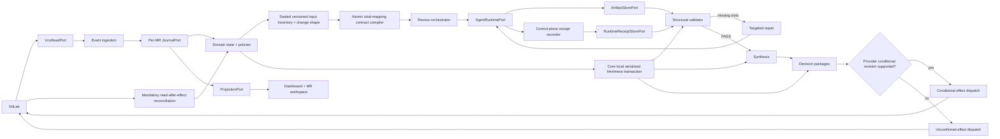
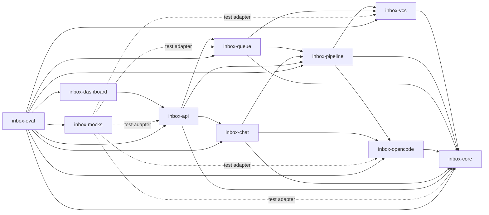

# agent-inbox: Scope Specification (v0 pivot)

<!--SECTION:SCOPE_TYPE-->

## scope-type

product

<!--/SECTION:SCOPE_TYPE-->

<!--SECTION:VISION-->

## 1. Vision & Primary Goal

Agent Inbox — локальный однопользовательский ассистент ревьювера для GitLab. Он сам
находит все актуальные MR, в которых оператор участвует, собирает полную фактуру по
реальному коду, независимо перепроверяет MR, чужие ревью и дискуссии, а затем приносит
оператору готовые решения. Оператор остаётся ответственным за решение, но не собирает
контекст руками и не переходит в GitLab для выполнения обычного review-flow.

Первая полезная версия обязана замкнуть реальный цикл:

`обнаружить MR → полностью проверить → подготовить пакет → применить в GitLab →
отследить изменения → верифицировать → завершить`.

Это локальный инструмент, а не SaaS-платформа: один оператор, один GitLab-аккаунт,
один процесс, локальное состояние. Распределённость, tenancy и серверная
мультипользовательская авторизация не являются архитектурными целями.

<!--/SECTION:VISION-->

<!--SECTION:PROJECT_TYPE-->

## 2. Project Type

- **Type:** app[spa]
- **Why this type:** основной интерфейс — локальный dashboard и MR workspace в
браузере; CLI только запускает и обслуживает приложение.
<!--/SECTION:PROJECT_TYPE-->

<!--SECTION:GOLDEN_DX-->

## 3. Approved UX Flow Example

1. Оператор запускает Agent Inbox; [core](./inbox-core/inbox-core.spec.md#2-module-usage-example)
   восстанавливает локальное состояние, а [VCS](./inbox-vcs/inbox-vcs.spec.md#2-module-usage-example)
   синхронизирует реальные MR. После boot видны две очереди: **Ревью** и **Мои / назначенные**.
2. До запуска агента [review runtime](./review-runtime/index.md) запечатывает immutable
   Review Input Manifest с полным versioned inventory и change shape, затем атомарно
   компилирует видимый Review Contract с total input mapping: обязательные секции,
   сущности, файлы, lenses и типизированные диаграммы для конкретной формы изменений
   MR.
3. Агент параллельно собирает фактуру и заполняет адресуемые слоты контракта. Его
   самоотчёт не считается доказательством: структурный validator сверяет артефакты и
   реальный tool trace, а для каждого пробела создаёт узкое repair-задание. Synthesis и
   действия недоступны, пока contract не получил `PASS`; исчерпание лимита явно даёт
   `BLOCKED` с незакрытыми слотами и причинами.
4. Карточка показывает роль, фактическое состояние, текущую работу, новые события и
   необходимость решения.
5. Оператор открывает MR и видит хронологическую ленту smart widgets: описание,
   артефакты, findings, дискуссии, дельту, план и подготовленные действия.
6. [Queue](./inbox-queue/inbox-queue.spec.md#2-module-usage-example) формирует гибридный
   пакет. Оператор снимает ненужные чекбоксы, выбирает
   вариант во взаимоисключающих группах и нажимает **Применить выбранные**.
7. Действия немедленно выполняются в GitLab без второго подтверждения; результат и
   частичная ошибка видны возле каждого действия.
8. Для исправлений оператор использует [handoff](./inbox-chat/inbox-chat.spec.md#2-module-usage-example):
   нажимает **Сгенерировать задание**, копирует краткие
   инструкции со ссылками на артефакты и передаёт их DEV-агенту.
9. После push оператор нажимает **Верифицировать изменения** либо ждёт фоновой
   проверки накопленной дельты.
10. Подтверждённо исправленные разрешённые треды закрываются автоматически; ранее
    выраженный approve восстанавливается, если review coverage доказан и blocking-
    проблем нет.
11. После merge/close оператор при необходимости обновляет описание и нажимает
    **Завершить**.

Degradation path: если GitLab, agent runtime или локальный effect executor недоступен,
задача не теряется и не повторяется вслепую. UI показывает наблюдаемую ошибку,
reconciliation сверяет реальное состояние, после чего доступен безопасный retry.

<!--/SECTION:GOLDEN_DX-->

<!--SECTION:REQUIREMENTS_AND_CONSTRAINTS-->

## 4. Requirements & Constraints

### 4.1 Functional Requirements

#### MR discovery and lifecycle

- **FR-001** — На первом запуске импортировать только открытые MR, где оператор явно
  является author, assignee или reviewer либо участвовал через mention, comment или
  approval.
- **FR-002** — MR без активности более трёх месяцев не отображать, включая уже
  отслеживаемый merged/closed MR без нажатого **Завершить**. Локальная история
  сохраняется; новое событие возвращает отслеживаемый MR в видимую выборку.
- **FR-003** — Уже отслеживаемый merged/closed MR в пределах activity horizon
  сохранять и явно маркировать до нажатия **Завершить**. Кнопка доступна только для
  merged/closed; за пределами horizon карточка скрывается автоматически.
- **FR-004** — **Обновить описание** доступно на карточке любого MR всегда.
- **FR-005** — MR отображается ровно один раз. Пересечение ролей разрешается в пользу
  колонки **Мои / назначенные**, остальные роли остаются бейджами.

#### Full review and cross-review

- **FR-006** — Для любого подходящего MR выполнять одинаково полное независимое
  ревью; роль не уменьшает глубину анализа и влияет только на права и допустимые
  эффекты.
- **FR-007** — Проверять реальный код, цель MR, архитектуру, спецификации, тесты,
  security и оптимальность; coverage подтверждать фактическим чтением, а не
  самоотчётом агента.
- **FR-008** — Чужие findings, approvals и дискуссии считать отдельным входом для
  cross-review: перепроверять, соглашаться реакцией, дополнять, возражать или задавать
  вопрос, сохраняя provenance каждого вывода.
- **FR-009** — Если полный review coverage не доказан, запрещено предлагать или
  автоматически восстанавливать approve.

#### Events and delta verification

- **FR-010** — Любое изменение MR — commit, описание, новый/изменённый тред, ответ,
  approval или другой наблюдаемый event — накапливается и оттягивает quiet timer.
- **FR-011** — Любой человеческий ответ в дискуссии запускает верификацию после
  конфигурируемого debounce (начальное значение 5 минут), независимо от смысла ответа.
- **FR-012** — При отсутствии новых событий конфигурируемый quiet timeout (начальное
  значение 10 минут) запускает проверку накопленной дельты.
- **FR-013** — Новые события не прерывают уже выполняющуюся задачу; актуальная
  delta-задача supersede/dedup предыдущие ожидающие задачи и закрывает разрыв.
- **FR-014** — В v0 любое новое событие помечает весь неприменённый пакет устаревшим.
  Устаревший пакет остаётся видимым, но недоступен до повторной проверки.
- **FR-015** — **Верифицировать изменения** немедленно, без debounce, проверяет дельту
  от baseline последнего задания, связанные findings и весь накопленный diff.

#### Hybrid decision package and GitLab effects

- **FR-016** — Один review round формирует один гибридный пакет на MR: независимые
  рекомендации — чекбоксы, взаимоисключающие решения — single-choice, зависимые
  действия — упорядоченные группы. Рекомендации выбраны по умолчанию.
- **FR-017** — Нажатие **Применить выбранные** является достаточным подтверждением и
  немедленно создаёт реальные GitLab effect-задачи; дополнительного confirm-screen нет.
- **FR-018** — Поддержать comment/reply, reaction, resolve/reopen разрешённого треда,
  approve/unapprove, request changes и edit description.
- **FR-019** — Независимые действия продолжаются после частичной ошибки. Ошибка
  блокирует только зависимые действия; каждый effect имеет собственный статус и retry.
- **FR-020** — Effects идемпотентны. При потерянном/неопределённом ответе система
  сначала читает GitLab и только затем решает, требуется ли повтор.
- **FR-021** — Разрешено резолвить собственные треды оператора и треды явно
  allowlisted review-ботов в MR, где оператор author; остальные чужие треды не
  изменяются.

#### Blocking semantics and intent-preserving automation

- **FR-022** — Finding/thread имеет семантику `blocking | non-blocking`. Открытые
  non-blocking треды не препятствуют approve.
- **FR-023** — Approve, поставленный при открытом треде, является наблюдаемым сигналом,
  что этот тред non-blocking, пока оператор явно не изменил решение.
- **FR-024** — Подтверждённо исправленный разрешённый тред может быть автоматически
  resolved.
- **FR-025** — Если оператор ранее approve-нул MR, а GitLab сбросил approval после
  push, ассистент автоматически восстанавливает approve после доказанного coverage и
  при отсутствии blocking-проблем.
- **FR-026** — Отказ автора исправлять non-blocking замечание не блокирует
  восстановление approve, но принятие аргумента автора не автоматизируется: оператору
  предлагаются согласие+resolve, возражение или дополнительный вопрос.
- **FR-027** — Политики ручного/автоматического выполнения расширяются через единый
  каталог типизированных действий; автоматизация не имеет отдельного executor.

#### DEV-agent handoff

- **FR-028** — На любом MR независимо от роли доступна кнопка **Сгенерировать
  задание**.
- **FR-029** — Задание — короткая инструкция для DEV-агента: актуальный SHA, цель,
  выбранные findings, изменившиеся части артефактов, обязательные пути/якоря для
  чтения и критерии проверки. Полный контент артефактов не дублируется без причины.
- **FR-030** — По умолчанию генерируется delta-задание от последнего handoff; доступен
  явный вариант с полным контекстом.
- **FR-031** — **Скопировать задание** копирует текст в clipboard. Скачивание файла и
  встроенный редактор задания не требуются в v0.
- **FR-032** — Finding или выбранную группу findings можно скопировать как отдельное
  задание; любой reviewer может подхватить работу, даже если не является author.

#### Dashboard and MR workspace

- **FR-033** — Основной dashboard — две колонки ответственности: **Ревью** и
  **Мои / назначенные**. Внутри каждой — приоритетная очередь: требуется решение,
  агент работает, ждём внешнего события, без действий.
- **FR-034** — Карточка компактно показывает роли, title, approvals, reviewers, CI,
  threads, unread/new commits, текущую работу, таймер и все причины внимания.
- **FR-035** — MR workspace — хронологическая лента smart widgets с `lastActivity`,
  read/unread и разделителем нового: Findings, Awaiting Threads, Artifact Post,
  GitLab Event, Progress Group, Current Plan и одноразовые Action outcomes.
- **FR-036** — Ошибка или ожидание принадлежат конкретному виджету/действию и не
  заменяют MR workspace пустым глобальным состоянием.
- **FR-037** — Постоянный MR-scoped chat принимает мета-якорь
  `widget + fragment + artifact`, объясняет и углубляет фактуру; основные действия
  остаются контекстными элементами виджетов, а не командами чата.

#### Test runtime

- **FR-038** — Production, test и mock используют физически разные state namespaces;
  reset теста не может прочитать, изменить или удалить рабочее состояние.
- **FR-039** — Каждый test run по умолчанию получает чистый `run-id`; сохранённый run
  можно повторно открыть для диагностики.
- **FR-040** — Mock mode детерминированно моделирует GitLab read/effect события,
  время, частичные ошибки, approval reset и recovery.
- **FR-041** — Real-readonly принимает явный пул MR, выполняет precondition probe и
  выдаёт `PASS | FAIL | SKIP | INCONCLUSIVE` с наблюдаемой причиной. Изменение внешнего
  состояния во время сценария даёт `INCONCLUSIVE`, а не ложный `FAIL`.
- **FR-042** — Полностью пропущенный прогон не считается зелёным; отчёт показывает
  обязательные сценарии, фактически выполненные сценарии и легитимные skips.
- **FR-043** — Real-effects разрешён только для явно allowlisted тестовых MR/проектов;
  произвольный рабочий MR никогда не становится effect-target только из-за попадания
  в discovery pool.

#### Deterministic agent control loop

- **FR-044** — До запуска агента компилировать для каждого full/delta/cross-review
  machine-readable Review Contract с устойчивыми slot ID, потребляя только sealed
  Review Input Manifest. Compiler атомарно создаёт total mapping каждого manifest
  input в один или несколько slots либо в детерминированно обоснованный
  `not-applicable`; неклассифицированный файл получает обязательный
  `file-fallback:<path>` slot. Mapping gap отклоняет весь contract до запуска агента и
  не может достичь `PASS`. Контракт фиксирует полный план работы для наблюдаемой формы
  изменений: цель, архитектуру, спецификации, тесты, security и optimality, а также
  требуемые сущности, файлы, review lenses, секции артефактов и диаграммы. Каждое
  измерение получает `required` либо детерминированно обоснованное `not-applicable`;
  агент не может сам исключить его молчанием.
- **FR-045** — Считать агента недоверенным исполнителем. Slot получает `complete`
  только когда детерминированный validator подтвердил непустой неплейсхолдерный
  артефакт требуемого типа и фактическое чтение/использование обязательных источников
  по реальному tool trace; текстовый самоотчёт агента не является evidence.
- **FR-046** — Диаграммные обязанности выводить из change shape как разные
  типизированные slots: entity/dependency map; `before → after` при изменении
  поведения или архитектуры; runtime/event flow, когда затронут исполняемый поток.
  Одна универсальная диаграмма не закрывает несколько обязанностей, кроме явно
  доказанной validator-ом эквивалентности их структурных контрактов.
- **FR-047** — Для каждого отсутствующего или невалидного slot создавать адресное
  repair-задание только с незакрытыми slot ID, ожидаемым типом evidence и ссылками на
  исходный contract. Цикл `validate → repair → validate` продолжается до полного
  `PASS` либо до наблюдаемого `BLOCKED` после ограниченного числа попыток; сохраняются
  причины, попытки, provenance и незакрытые slots.
- **FR-048** — До `PASS` запрещены synthesis, публикация decision package, approve и
  любые ручные или автоматические GitLab effects, чьи входы потребляют artifacts,
  findings или proposals текущего неполного round. Ручной запуск не обходит gate:
  effect из неполного round остаётся запрещённым. До `PASS` разрешены только явные
  команды оператора, входы которых доказуемо не используют данные этого round и
  проходят собственные permission/policy gates. Неполные артефакты и прогресс видимы,
  но не могут быть выданы за завершённое review.
- **FR-049** — Перед Review Contract фиксировать immutable Review Input Manifest с
  ключом `mr + head SHA + event cursor`. Manifest владеет полным immutable versioned
  inventory всех изменённых файлов, затронутых сущностей, дискуссий и обязательных
  источников round, а также их детерминированными classifications и change shape.
  Manifest не владеет slots, mapping или fallback policy. Невозможность построить и
  запечатать полный inventory переводит round в `BLOCKED` до contract compilation и
  запуска агента.
- **FR-050** — Каждый slot Review Contract объявляет output schema, source anchors,
  cardinality и evidence reuse policy. Entity-slot как минимум требует identity,
  responsibility/behavior, dependencies, risks и test impact. Одно evidence может
  закрывать несколько slots только когда это явно разрешено их reuse policy и
  validator сохранил отдельное соответствие каждому контракту; одинаковый generic
  текст или механическое дублирование не закрывают несвязанные slots.
- **FR-051** — Каждый source input в Review Input Manifest хранит immutable canonical
  identity и точную version/digest либо захваченные immutable bytes. Contract и
  validator читают и подтверждают именно эту версию; ссылка на mutable path, thread
  или URL без зафиксированной версии не является evidence.
- **FR-052** — Перед structural verdict, synthesis/publication и созданием effect
  intent core выполняет локальную per-MR сериализованную транзакцию: атомарно
  сравнивает latest observed `head SHA + event cursor` с manifest key и записывает
  guarded verdict/handoff intent. Эта транзакция не объявляется атомарной с внешним
  GitLab dispatch. Для каждого effect adapter передаёт provider conditional
  revision/precondition, когда GitLab поддерживает её для операции. Без такой
  precondition effect остаётся `unconfirmed`, а обязательный read-after-effect
  reconciliation классифицирует его `applied | not-applied | ambiguous`; blind retry
  запрещён. Любое вновь наблюдённое несовпадение с manifest инвалидирует оставшиеся
  intents, помечает round `STALE` и создаёт новую delta.
- **FR-053** — Фактические tool operations доказываются только append-only typed
  runtime receipts, которые создаёт control plane, а не агент, и сохраняет независимо
  от редактируемых review artifacts. Receipt связывает `contract ID/version`, manifest
  key, `session/task`, canonical source identity/version/digest, operation, outcome и
  монотонный sequence. Validator отклоняет agent-authored substitutes, нарушенную
  последовательность, receipt другого contract/manifest и повторное использование
  уже потреблённого receipt вне разрешённой reuse policy.
- **FR-054** — Repair loop использует конфигурируемый `maxRepairAttempts` с начальным
  значением `3` и монотонный per-round attempt counter. Counter не сбрасывается при
  crash, retry или resume того же round. После исчерпания budget round получает
  `BLOCKED`; продолжение требует явного решения оператора создать новый round либо
  увеличить budget, причём увеличение сохраняет уже накопленный counter и provenance.

### 4.2 Non-Functional Constraints

- **NFR-001** — Один локальный процесс и один оператор; сложная распределённая
  инфраструктура запрещена без нового подтверждённого use case.
- **NFR-002** — Реальные GitLab sync/effects, agent runtime, persistence и dashboard
  обязательны в первой полезной версии; simulation не заменяет acceptance.
- **NFR-003** — Per-MR очереди независимы; разные MR обрабатываются параллельно без
  глобального mutex.
- **NFR-004** — После crash восстанавливаются очередь, решения, smart-widget feed и
  незавершённые effects без потери и слепого повтора.
- **NFR-005** — Все input manifests, contracts, runtime receipts, verdicts, findings,
  artifacts, proposals, decisions, автоматические действия и outcomes имеют `mr`,
  `sha/cursor`, `task`, `session/model`, время и provenance.
- **NFR-006** — Работа, ожидание, деградация и ошибка наблюдаемы в UI в течение всего
  lifecycle.
- **NFR-007** — Порты создаются только на реальных change/trust boundaries, имеющих
  минимум два потребителя или production+test adapters; interface-per-class запрещён.
- **NFR-008** — Приёмка UI выполняется на реальных GitLab данных по AGENTS.md; mock
  используется для детерминированного покрытия, но не как визуальное доказательство
  production-flow.
- **NFR-009** — Carbon & Steel: глубокие carbon surfaces, safety orange `#fc6d26`,
  steel secondary, Geist для UI, JetBrains Mono для metadata/code, 1px borders,
  tonal layering без декоративных теней, базовый radius 8px, высокая информационная
  плотность IDE/cockpit. Основные UX-референсы: две компактные очереди dashboard,
  двухколоночный MR workspace с Agent Terminal, findings/threads/plan widgets.
- **NFR-010** — Компиляция Review Contract и структурная проверка completeness
  детерминированы: одинаковые normalized inputs дают одинаковые slots и одинаковый
  verdict. Наличие, тип, trace coverage и placeholder-нарушения проверяются
  schema/parser/regex-подобными правилами без LLM-суждения.
- **NFR-011** — Семантическое качество содержимого проверяется review/cross-review
  агентами, но их оценка не может удалить обязательный slot или обойти структурный
  gate; смена модели не изменяет контракт полноты.
- **NFR-012** — Repair loop идемпотентен и crash-resumable: после рестарта он
  продолжает от сохранённого contract/version и последнего verdict, не повторяя уже
  подтверждённые slots и не теряя историю попыток.
- **NFR-013** — Runtime receipts и их монотонная последовательность durable раньше,
  чем соответствующий tool outcome может закрыть slot; artifact storage не может
  перезаписать, удалить или подменить receipt log.

### 4.3 Out-of-Scope v0

- Multi-user, multi-account, tenancy, remote deployment и SaaS.
- Мобильный native client.
- Точечная инвалидация отдельных действий пакета.
- Автономное принятие новых неоднозначных решений за оператора.
- Полная копия административного GitLab UI.
- Скачиваемые файлы заданий и inline-редактор задания.
- Обязательная plugin-system или внешний scheduler.

### 4.4 Runtime Backing & Deferred Scope

| Capability                                    | Posture                           |
| --------------------------------------------- | --------------------------------- |
| GitLab discovery, facts and effects           | `real-runtime`                    |
| Full review and delta verification            | `real-runtime`                    |
| Review Contract, validation and repair loop   | `real-runtime`                    |
| Local journal, queues, artifacts and recovery | `real-runtime`                    |
| Dashboard, MR workspace and clipboard handoff | `real-runtime`                    |
| Production/test/mock state isolation          | `real-runtime`                    |
| Deterministic GitLab test adapter             | `simulation` for exhaustive tests |
| Selective action invalidation                 | `not-implemented` (deferred)      |
| Multi-user/remote runtime                     | `not-implemented` (out-of-scope)  |

Trust boundaries requiring real hooks: GitLab token and permissions, GitLab effect
reconciliation, agent-runtime tool trace for coverage, filesystem namespace isolation,
browser clipboard permission, целостность версии Review Contract и соответствующего
ей completeness verdict, control-plane ownership append-only runtime receipts,
latest-observed freshness transaction, provider conditional preconditions и
read-after-effect reconciliation.

### 4.5 Rules

| Rule                                | Category | Source                                                                                 |
| ----------------------------------- | -------- | -------------------------------------------------------------------------------------- |
| `typescript-rules`                  | coding   | `ai/directives/coding/typescript-rules.xml`                                            |
| `testing-common` + `node-test`      | testing  | `ai/directives/testing/common.xml`, `ai/directives/testing/node-test.xml`              |
| `playwright-cli` → `playwright-e2e` | testing  | `ai/directives/testing/playwright-cli.xml`, `ai/directives/testing/playwright-e2e.xml` |

No new infrastructure or architecture rule is activated: this pivot does not replace
the repository toolchain, and the selected architecture is fully specified below.

<!--/SECTION:REQUIREMENTS_AND_CONSTRAINTS-->

<!--SECTION:ARCHITECTURE-->

## 5. High-Level Architecture

Selected variant: **hexagonal journal-first modular monolith**.

Stable domain chain:

`event → MR state → immutable input manifest → Review Contract → agent evidence →
deterministic completeness verdict → synthesis → proposal → operator/automatic
decision → effect → reconciled outcome`.

Review control plane является обязательной частью цепочки, а не инструкцией в
prompt. Immutable manifest закрывает versioned inventory, classifications и change
shape для конкретных `mr + head SHA + event cursor`, но не знает о slots. Contract
compiler потребляет sealed manifest и одной атомарной операцией создаёт адресуемые
slots, total input mapping, `not-applicable` decisions и file fallbacks; mapping gap
отклоняет contract до agent launch. Structural validator принимает только сохранённые
артефакты и control-plane receipts. Core атомарно сверяет latest observed head/cursor
с manifest и сохраняет guarded intent только внутри локальной per-MR транзакции.
Внешний dispatch не входит в эту атомарность: adapter использует provider precondition,
если она доступна, иначе сохраняет `unconfirmed` и обязательно читает GitLab после
effect. Reconciliation различает `applied | not-applied | ambiguous` и никогда не
делает blind retry; новое observed состояние инвалидирует оставшиеся intents и
создаёт `STALE`/delta. Repair planner возвращает агенту незакрытый остаток. Только
свежий `PASS` открывает synthesis и зависящие от round effects. `BLOCKED` —
терминальный наблюдаемый исход конкретного review round, а не скрытый успех или
бесконечный retry.

Domain entities and events do not expose GitLab DTO, OpenCode session DTO, JSONL rows
or SSE messages. Versioned event/action contracts form the migration boundary.

Required ports:

| Port                      | Current adapters                                   | Confirmed reason to exist             |
| ------------------------- | -------------------------------------------------- | ------------------------------------- |
| `VcsReadPort`             | GitLab real, mock                                  | production and deterministic tests    |
| `VcsEffectPort`           | real, readonly guard, mock-effects                 | real actions and safe test modes      |
| `AgentRuntimePort`        | OpenCode, test double                              | review execution and repeatable tests |
| `JournalPort`             | local append-only, in-memory test                  | recovery and isolated test runs       |
| `ArtifactStorePort`       | local files, in-memory test                        | durable evidence and mock scenarios   |
| `RuntimeReceiptStorePort` | local append-only, in-memory test                  | independent non-agent coverage proof  |
| `ClockPort`               | system, controlled test clock                      | debounce/quiet timers without sleeps  |
| `TaskExecutorPort`        | local per-MR executor, deterministic test executor | parallel runtime and tests            |
| `ProjectionPort`          | dashboard/feed projections                         | UI transport independent of domain    |
| `RuntimeProfilePort`      | production/test/mock namespaces                    | hard state isolation                  |

Policies and action types are registries inside the domain, not infrastructure ports.
Dependencies are wired in one composition root. Every adapter implements a shared
contract-test kit. v0 uses one process and local files; ports are not permission to add
distributed infrastructure.

### 5.1 Rejected Alternatives

- **SQLite-centric workflow as canonical model:** convenient queries, but makes replay,
  provenance and deterministic scenario reproduction secondary concerns. SQLite may
  later replace the journal adapter without changing domain contracts.
- **Session-first assistant:** quicker prototype, but agent context becomes a hidden
  source of truth and weakens recovery, coverage proof and testing.
- **Microservices/plugin platform:** no confirmed local use case; operational cost
contradicts v0 constraints.
<!--/SECTION:ARCHITECTURE-->

<!--SECTION:DECISION_LOG-->

## 6. Decision Log

### Superseded v2 decisions (body preserved)

| ID    | Status              | Original decision                                                         |
| ----- | ------------------- | ------------------------------------------------------------------------- |
| D-301 | superseded by D-332 | Иерархия: автономный эмулятор → второй ревьювер → ассистент-фактчекер     |
| D-302 | superseded by D-335 | Любая capability стартует proposal-only и переходит в auto по accept-rate |
| D-303 | superseded by D-333 | Единый pipeline с role-specific author/reviewer tails                     |
| D-304 | superseded by D-333 | Роль author/reviewer/mentioned из GitLab; mentioned-only без очереди      |
| D-305 | active              | Барьер ready, наблюдаемые фазы и ленивый worktree                         |
| D-306 | superseded by D-336 | Ось внимания как основные dashboard-группы                                |
| D-307 | active              | Per-MR очередь, параллелизм между MR, priority и supersede                |
| D-308 | superseded by D-336 | Одинаковая четырёхстрочная карточка в attention-board                     |
| D-309 | active              | Оптимистичный UI; ошибка является видимым состоянием                      |
| D-310 | active              | SSE per MR и reconciliation polling                                       |
| D-311 | active              | Один agent server и TTL-паркинг task sessions                             |
| D-312 | active              | Единый стандарт prompt compilation                                        |
| D-313 | active              | Агент читает контент по указателям вместо inline-копирования              |
| D-314 | active              | Детерминированный план с интеллектуальным enrichment                      |
| D-315 | active              | File checklists и обязательный пофайловый отчёт                           |
| D-316 | active              | Coverage gate по tool trace                                               |
| D-317 | active              | Feed событий/решений с read/unread                                        |
| D-318 | active              | Smart widgets: cyclic и one-shot lifecycle                                |
| D-319 | superseded by D-332 | Ассистент приносит фактуру, а operator выполняет решение вне closed loop  |
| D-320 | active              | Спеки и задачи можно регенерировать в v0                                  |
| D-321 | active              | Постоянный MR chat с meta anchors                                         |
| D-322 | superseded by D-334 | Дедуп чужих findings по трём фиксированным исходам                        |
| D-323 | superseded by D-335 | Только proposal reactions и ограниченный dev-agent report                 |
| D-324 | superseded by D-334 | Фоновая проверка каждого нового SHA примерно раз в минуту                 |
| D-325 | active              | MR header с описанием, состояниями и quick actions                        |
| D-326 | active              | Review lenses расширяются декларативно                                    |
| D-327 | active              | Multi-model artifacts и synthesis, default one model                      |
| D-328 | active              | Механический, trigger и intelligent review layers                         |
| D-329 | superseded by D-339 | Модульная карта v2 без обязательной hexagonal migration boundary          |
| D-330 | active              | Typed task registry с dependency/exclusion/supersede/session policy       |
| D-331 | active              | Session routing зависит от требуемого контекста                           |

### D-332 — Closed-loop local reviewer assistant (rework)

- **Status:** active
- **Recorded:** session Discovery, agent-inbox, pivot
- **Supersedes:** D-301, D-319
- **Pre-rework state:** git ref `8283e9ab8ee19bd7069e1734b1c48997fd1be45d`
- **Was:** первая стадия считалась fact-check assistant, а GitLab effect loop не был критерием полезности.
- **Now:** первая полезная версия полностью обрабатывает MR и выполняет подтверждённые действия в GitLab без перехода оператора в GitLab UI.
- **Why:** «Если я не смогу через этот инструмент выполнить действия с GitLab, то мне он не нужен».
- **Risk accepted:** реальный effect runtime увеличивает объём v0.
- **Downstream invalidation:** see Pivot Invalidation List.

### D-333 — Role-invariant full review and inclusive discovery (rework)

- **Status:** active
- **Recorded:** session Discovery, agent-inbox, pivot
- **Supersedes:** D-303, D-304
- **Pre-rework state:** git ref `8283e9ab8ee19bd7069e1734b1c48997fd1be45d`
- **Was:** author/reviewer имели разные tails, а mentioned-only не запускал очередь.
- **Now:** роль влияет только на права и UX-группу; любой participation signal запускает одинаково полное review и cross-review.
- **Why:** агент пишет любой MR, а оператор всегда отвечает за решение; чужой контекст нужно перепроверять.
- **Risk accepted:** больше вычислительной работы на каждый MR.
- **Downstream invalidation:** see Pivot Invalidation List.

### D-334 — Accumulated event verification (rework)

- **Status:** active
- **Recorded:** session Discovery, agent-inbox, pivot
- **Supersedes:** D-322, D-324
- **Pre-rework state:** git ref `8283e9ab8ee19bd7069e1734b1c48997fd1be45d`
- **Was:** новый SHA почти сразу запускал фоновую проверку, а thread cross-review имел узкие фиксированные исходы.
- **Now:** любые MR events накапливаются; human reply, debounce, quiet timeout или ручная команда запускают связанную delta/thread verification.
- **Why:** ассистент должен реагировать как активный человек, а не бездумно проверять каждый commit.
- **Risk accepted:** v0 целиком инвалидирует неприменённый пакет.
- **Downstream invalidation:** see Pivot Invalidation List.

### D-335 — Hybrid packages and intent-preserving automation (rework)

- **Status:** active
- **Recorded:** session Discovery, agent-inbox, pivot
- **Supersedes:** D-302, D-323
- **Pre-rework state:** git ref `8283e9ab8ee19bd7069e1734b1c48997fd1be45d`
- **Was:** все capabilities начинались только как proposals и применялись по одной.
- **Now:** оператор применяет выбранный гибридный пакет сразу; исправленные треды и восстановление прежнего approve могут выполняться автоматически после доказанных gates.
- **Why:** пакет сохраняет общий контекст, а восстановление уже выраженного intent не является новым решением за оператора.
- **Risk accepted:** частичные outcomes требуют dependency-aware execution и reconciliation.
- **Downstream invalidation:** see Pivot Invalidation List.

### D-336 — Responsibility queues instead of attention Kanban (rework)

- **Status:** active
- **Recorded:** session Discovery, agent-inbox, pivot
- **Supersedes:** D-306, D-308
- **Pre-rework state:** git ref `8283e9ab8ee19bd7069e1734b1c48997fd1be45d`
- **Was:** MR распределялись по нескольким attention columns.
- **Now:** две колонки ответственности содержат по одной карточке MR; множественные причины внимания отображаются внутри приоритетной карточки.
- **Why:** у MR нормально иметь несколько одновременных состояний, но дублирование карточек разрушает рабочую очередь.
- **Risk accepted:** альтернативный четырёхколоночный attention-Kanban откладывается.
- **Downstream invalidation:** see Pivot Invalidation List.

### D-337 — Artifact-addressed DEV handoff

- **Status:** active
- **Recorded:** session Discovery, agent-inbox
- **Why:** любой reviewer должен иметь возможность передать найденную работу своему DEV-агенту без копирования всей фактуры.
- **Risk accepted:** нужно хранить baseline каждого handoff.
- **Rejected alternatives:** скачиваемый файл; полное inline-дублирование артефактов; задания только для author.

### D-338 — Isolated adaptive test runtime

- **Status:** active
- **Recorded:** session Discovery, agent-inbox
- **Why:** тесты должны объяснять результат через реально наблюдаемое состояние GitLab и никогда не зависеть от рабочего локального state.
- **Risk accepted:** real test report имеет `SKIP` и `INCONCLUSIVE`, а не только бинарный результат.
- **Rejected alternatives:** reset рабочего `~/.gennady`; фиктивные данные как единственная acceptance; effects на произвольных MR.

### D-339 — Hexagonal journal-first local architecture (rework)

- **Status:** active
- **Recorded:** session Discovery, agent-inbox, pivot
- **Supersedes:** D-329
- **Pre-rework state:** git ref `8283e9ab8ee19bd7069e1734b1c48997fd1be45d`
- **Was:** модульная карта фиксировала реализации, но не строгие migration boundaries.
- **Now:** versioned domain events/actions и узкие ports отделяют GitLab, agent runtime, journal, clock, executor, projections и runtime profiles.
- **Why:** архитектуру должно быть возможно заменить по частям, не усложняя локальный v0.
- **Risk accepted:** полная смена domain semantics всё равно потребует миграции.
- **Downstream invalidation:** see Pivot Invalidation List.

### D-340 — Carbon & Steel as visual source of truth

- **Status:** active
- **Recorded:** session Discovery, agent-inbox
- **Why:** текущий сервер визуально расходится с согласованной IDE/cockpit моделью; прототипы задают дизайн-зерно, а не точную компоновку.
- **Risk accepted:** ранние prototype screens отсутствуют; поведение определяется spec, внешний вид — сохранёнными правилами и v3 references.
- **Rejected alternatives:** копирование текущего UI; свободная новая палитра.

### D-341 — Hybrid hierarchical module specifications

- **Status:** active
- **Recorded:** session ModuleDecomposition, agent-inbox
- **Why:** Project Manager задаёт видение и проблемы, а архитектурная детализация остаётся ответственностью агента; небольшие module specs должны помещаться в контекст и связываться индексами и cross-links.
- **Risk accepted:** появляются навигационные index-файлы, которые не являются runtime-модулями и не должны дублировать дочерние контракты.
- **Rejected alternatives:** плоский список всех модулей без смысловых групп; вертикальные use-case модули, смешивающие VCS, runtime, persistence и UI.

### D-342 — Deterministic control plane over untrusted agents

- **Status:** active
- **Recorded:** session Discovery, agent-inbox, refine
- **Why:** «Агент на самом деле не проходит все шаги, он их забывает. Самая важная
  ценность проекта — сверху детерминированными инструментами разметить полный план,
  проверить целостность и заставить агента доделать пробелы».
- **Risk accepted:** структурный `PASS` доказывает полноту контракта, но не абсолютную
  истинность анализа; семантическую ошибку по-прежнему ищет независимый cross-review.
- **Rejected alternatives:**
  - доверять prompt и самоотчёту агента;
  - проверять полноту другим LLM без детерминированного контракта;
  - разрешать synthesis при частично заполненном плане.

Control plane, а не agent session, владеет immutable manifests, latest-observed
freshness transitions, guarded intents, effect reconciliation и runtime receipts.
Поэтому агент не может объявить прочитанным источник другой версии, сфабриковать tool
trace или применить устаревший результат после нового observed event. Локальная
атомарность намеренно не распространяется на внешний GitLab dispatch.

<!--/SECTION:DECISION_LOG-->

<!--SECTION:SCOPE_DEPENDENCIES-->

## 7. Scope Dependencies

- **Depends on:** `infra-base`, `vcs`, `cli`, `ai-skills`.
- **External services/tools:** GitLab API, OpenCode-compatible agent runtime, browser
  clipboard API.
- **Provides to:** local operator only; no public multi-user service contract.
<!--/SECTION:SCOPE_DEPENDENCIES-->

<!--SECTION:BOOTSTRAP_REQUIREMENTS-->

## 8. Bootstrap Requirements

| Requirement                                 | Kind          | Owner                 | Resolution                                                                                             |
| ------------------------------------------- | ------------- | --------------------- | ------------------------------------------------------------------------------------------------------ |
| Node.js/npm/Vite/React/Playwright toolchain | tool          | external-prereq-scope | Exists in `package.json` and `infra-base`                                                              |
| GitLab read/effect API contracts            | external-type | external-prereq-scope | Extend/reuse `vcs`; missing action surfaces become explicit `vcs` prerequisite tasks                   |
| GitLab token and identity                   | env           | operator-action       | Operator provides the existing GitLab PAT environment/config; boot reports missing/invalid credentials |
| OpenCode-compatible runtime                 | tool          | operator-action       | `opencode` binary/runtime must be available; boot reports unavailable/version mismatch                 |
| Production/test/mock state roots            | structural    | this-scope-task       | Create disjoint runtime-profile namespaces; test reset accepts test `run-id` only                      |
| Real-effects test allowlist                 | file          | operator-action       | Operator configures explicit project/MR allowlist; absent allowlist disables real-effects mode         |
| Browser clipboard permission                | service       | operator-action       | Clipboard action reports permission failure and never falls back to file download                      |

No new third-party package is required by the selected architecture.

<!--/SECTION:BOOTSTRAP_REQUIREMENTS-->

<!--SECTION:MODULE_MAP-->

## 9. Module Map

### 9.1 Canonical modules

| Module                                                       | Ownership                                                                                               |
| ------------------------------------------------------------ | ------------------------------------------------------------------------------------------------------- |
| [inbox-core](./inbox-core/inbox-core.spec.md)                | Events, MR state, participation and lifecycle; artifact persistence, journal and runtime-profile ports. |
| [inbox-vcs](./inbox-vcs/inbox-vcs.spec.md)                   | GitLab reads, effects, permissions and reconciliation.                                                  |
| [inbox-pipeline](./inbox-pipeline/inbox-pipeline.spec.md)    | Full/delta/cross-review, evidence, review artifacts, coverage and synthesis.                            |
| [inbox-queue](./inbox-queue/inbox-queue.spec.md)             | Tasks, action/effect intents, hybrid packages, decisions, automation and domain outcomes.               |
| [inbox-opencode](./inbox-opencode/inbox-opencode.spec.md)    | Agent runtime, prompts, sessions and tool traces.                                                       |
| [inbox-chat](./inbox-chat/inbox-chat.spec.md)                | MR chat, artifact mutation and DEV-agent handoff.                                                       |
| [inbox-api](./inbox-api/inbox-api.spec.md)                   | Journal-backed projections, commands and SSE.                                                           |
| [inbox-dashboard](./inbox-dashboard/inbox-dashboard.spec.md) | Carbon & Steel board and MR workspace.                                                                  |
| [inbox-mocks](./inbox-mocks/inbox-mocks.spec.md)             | Deterministic isolated test runtime.                                                                    |
| [inbox-eval](./inbox-eval/inbox-eval.spec.md)                | Contract, adaptive real-readonly and real-effects validation.                                           |

Navigation: [review runtime](./review-runtime/index.md),
[operator assistant](./operator-assistant/index.md), [verification](./verification/index.md).

### 9.2 Dependency map

Every edge is `module --> dependency`.

### 9.3 Stack and scaffolding handoff

- Languages: TypeScript 5+, React/TSX for dashboard.
- Runtime: Node.js 22+, local files, GitLab API, OpenCode-compatible agent runtime.
- Tests: node:test and Playwright; shared port contract kit.
- Task scaffolding consumes the root spec plus all ten module specs; navigation indexes
do not own implementation tickets.
<!--/SECTION:MODULE_MAP-->

<!--SECTION:HANDOFF-->

## 10. Handoff to module-decomposition

- **Primary input:** `specs/agent-inbox/agent-inbox.spec.md`
- **Areas requiring decomposition:** all ownership areas in Module Map.
- **Named abstractions:** `ReviewEvent`, `ReviewState`, `ReviewEvidence`,
  `ReviewFinding`, `ReviewArtifact`, `ReviewProposal`, `ReviewDecision`,
  `ReviewEffect`, `ReviewOutcome`, `ReviewActionPackage`, `ReviewHandoff`,
  `ReviewContract`, `ReviewContractSlot`, `ReviewCompletenessVerdict`,
  `ReviewInputManifest`, `ReviewInputClassification`, `ReviewContractInputMapping`,
  `ReviewRuntimeReceipt`, `ReviewFreshnessGate`, `ReviewRepairTask`,
  `RuntimeProfilePort` and ports from §5.
- **Bootstrap tickets ready for cascade:** state namespaces, VCS gaps, real-effects
  allowlist and contract-test kit.
- **Open risks:** exact GitLab participation-query completeness; GitLab semantics of
  request-changes; browser clipboard permissions; coverage proof reliability; live
  event churn during real tests; provider-specific support matrix conditional
  revisions и reconciliation probes для разных GitLab effects.

### 10.1 Pivot Invalidation List

- **Module specs requiring refine:**
  - `inbox-core` — runtime profiles, event contracts, lifecycle and 3-month eligibility;
  - `inbox-vcs` — inclusive participation, full effect catalog and reconciliation;
  - `inbox-queue` — hybrid package dependencies, stale-package and auto policies;
  - `inbox-pipeline` — role-invariant full/cross/delta review and hard coverage gate;
  - `inbox-opencode` — `AgentRuntimePort` contract and coverage trace;
  - `inbox-chat` — clipboard handoff and artifact-addressed task generation;
  - `inbox-api` — responsibility queues, packages, outcomes and test-run DTO;
  - `inbox-dashboard` — two queues, Carbon & Steel MR workspace and direct effects;
  - `inbox-eval` / `inbox-mocks` — isolated mock/real-readonly/real-effects modes;
  - any legacy role module — remove role-specific review depth; retain permission policy only.
- **Tasks regenerated:** historical TSK-156…170 remain immutable DONE evidence; the
  pivot execution DAG is TSK-172…183 and does not depend on obsolete role/attention contracts.
- **Rules to revisit:** none; active coding/testing rules remain valid.

### Acceptance after downstream regeneration

1. The approved UX flow is completed on a real allowlisted GitLab MR without opening GitLab UI.
2. Two simultaneous MR progress independently and recover after process termination.
3. Coverage failure prevents approve; verified fix resolves allowed threads and restores
   prior approve only when gates pass.
4. Hybrid package demonstrates immediate real effects and a partial failure with
   independent continuation plus safe retry.
5. Clipboard full/delta handoff and manual verification work from stored baselines.
6. Mock suite covers all branches; adaptive real suite reports observed preconditions,
   legitimate skips and never reports all-skipped as green.
7. Mandatory visual proof uses rebuilt production dashboard with real GitLab and real
   local state, not mock/demo seeding.
8. Для намеренно неполного agent output validator перечисляет точные missing/invalid
   slot ID, создаёт только адресное repair-задание и не допускает synthesis/effects.
9. После repair все обязательные сущности, источники, lenses и типизированные
   диаграммы подтверждены артефактами и tool trace; только тогда round получает `PASS`.
10. Пустые заголовки, placeholder-текст, один общий граф вместо разных обязательных
    diagram slots и самоотчёт «всё прочитано» не проходят deterministic gate.
11. Исчерпание лимита repair-попыток даёт восстанавливаемый `BLOCKED` с provenance,
    причинами и незакрытыми slot ID, не публикуя пакет и не выполняя GitLab effects.
12. Намеренно пропущенный changed file, entity, discussion или required source не
    исчезает из работы: sealed manifest сохраняет его в inventory, а contract compiler
    атомарно создаёт slot / justified `not-applicable` / file fallback либо отклоняет
    contract из-за mapping gap; orphan input не достигает агента и synthesis.
13. Каждый entity-slot отклоняет отчёт без identity, responsibility/behavior,
    dependencies, risks или test impact; нарушение schema, anchors, cardinality или
    reuse policy остаётся точным invalid slot для repair.
14. Один generic-фрагмент, скопированный в несвязанные slots, не закрывает их. Явно
    разрешённое reuse сохраняет отдельную evidence mapping для каждого slot.
15. Ручной запуск не обходит completeness gate:
    - effect, использующий finding/proposal неполного round, остаётся заблокированным;
    - независимая команда без входов из round проходит только собственные
      permission/policy gates.
16. Новое observed значение head SHA или event cursor до локальной freshness
    транзакции даёт `STALE`, создаёт новую delta и не записывает guarded
    verdict/handoff intent.
17. Mutable source без точной version/digest или captured bytes отклоняется; validator
    подтверждает source anchors только против версий из immutable manifest.
18. Поддельный, replayed, out-of-order или относящийся к другому contract/manifest
    runtime receipt не закрывает slot; перезапись review artifact не меняет независимо
    сохранённый receipt log.
19. Четвёртый repair при default `maxRepairAttempts=3` не стартует: round получает
    `BLOCKED`. Crash/retry не обнуляет counter; продолжение возможно только после
    явного операторского нового round или увеличения budget с сохранением счётчика.
20. Effect с поддерживаемой provider precondition получает conditional reject при
    смене revision. Без precondition он остаётся `unconfirmed` до обязательного
    read-after-effect результата `applied | not-applied | ambiguous`; ambiguous не
    повторяется вслепую, а новое observed состояние инвалидирует remaining intents.

<!--/SECTION:HANDOFF-->
