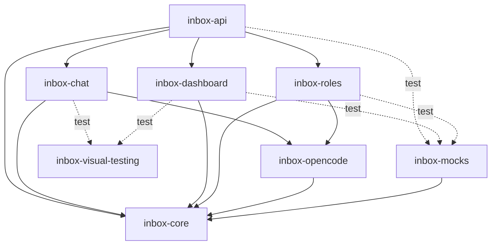

# agent-inbox: Scope Specification

<!--SECTION:SCOPE_TYPE-->

## scope-type

product

<!--/SECTION:SCOPE_TYPE-->

> Детальный исследовательский PRD (проблема, полный список EARS, Decision Log D1–D36,
> карта покрытия, машина состояний, стадии автономии) — в
> [`services/agent-inbox/README.md`](../../services/agent-inbox/README.md). Эта спека —
> каноничный SDD-вход; не дублирует README, а фиксирует scope, surface и решения.

<!--SECTION:VISION-->

## 1. Vision & Primary Goal

Локальный ассистент входящих GitLab MR: находит то, что требует моей реакции (где я
ревьювер / упомянут / автор), вводит в контекст, делает честную сверку, готовит
ответ/ревью. Старт — роль ревьювера/упомянутого. Долгосрочно — обобщённый диспетчер
задач (ревью — первый тип), с автономией по явным гейтам.

Запуск локально (стадия прототипа — `/loop`/ручной; production — foreground в tmux, оператор сам настраивает launchd при желании). Раздача —
через шаримый скилл + CLI.

**Serve-режим** — эволюция от ручного CLI к постоянно работающему сервису с
веб-дашбордом и программируемыми ролями-пайплайнами. Роль = TypeScript-модуль,
детерминированный конечный автомат с AI-узлами (OpenCode). Оператор управляет
через дашборд (Kanban по ролям) и может работать с мобильного.

<!--/SECTION:VISION-->

## 2. Project Type

- **Type:** product (скилл-оркестратор + поддерживающие CLI-команды).
- **Why:** Навык `agent-inbox` (SKILL.md, интенты list/loop/reset) оркеструет команды
  `inbox` / `vcs-worktree` / `vcs-reply` и порт `vcs-client.Inbox`. Детерминированная
  механика — в CLI/клиенте; диалог, сверка и согласование — в навыке.

## 3. Approved Golden DX Example

<!--SECTION:GOLDEN_DX-->

### 3.1 CLI DX (существующий)

```text
# первый запуск: конфиг отсутствует → structured сигнал
gennady inbox --json
→ {"configured": false, "missing": ["reposBase", "vcsHost"]}

# агент спрашивает юзера → сохраняет
gennady inbox config --set reposBase=/Users/k.lebedev/Developer --set vcsHost=gitlab.corp.mail.ru
→ {"configured": true, "reposBase": "/Users/k.lebedev/Developer", "vcsHost": "gitlab.corp.mail.ru"}

# проверка конфига (--state-dir переносит и конфиг тоже)
gennady inbox config --state-dir=/tmp/gn
→ {"configured": false}  # ищет /tmp/gn/agent-inbox/config.json

# теперь работает: все команды используют --url (webUrl из ответа inbox)
gennady inbox --json
→ {"total": 3, "delta": {"new": 1, "updated": 2}, "groups": [...]}

# контекст MR одним вызовом — --url вместо --ref
gennady inbox-context --url https://gitlab.example.com/group/proj/-/merge_requests/510
                                                              # worktree + repoLayout + changeset
                                                              # + headChanged + newCommits
                                                              # + stage + threadStats + meta
gennady inbox-context --url https://.../merge_requests/510 --skip-worktree
gennady inbox-context --url https://.../merge_requests/510 --skip-threads

# обсуждения перед постингом (проверка дубликатов)
gennady vcs-discussions --url https://gitlab.example.com/group/proj/-/merge_requests/510 --all

# постинг и approve — тоже --url
echo '[...]' | gennady vcs-reply --url https://gitlab.example.com/group/proj/-/merge_requests/510
gennady vcs-approve --url https://gitlab.example.com/group/proj/-/merge_requests/510

# финализация
gennady vcs-todo --done group/proj!510
gennady inbox --reset                                        # чистый лист
```

### 3.2 Serve DX (новый)

```text
# первый запуск — нет конфига
$ gennady inbox serve
✖ agent-inbox не настроен. Запустите gennady inbox config --init

# конфигурация (как в CLI)
$ gennady inbox config --init
reposBase: /Users/k.lebedev/Developer
vcsHost: gitlab.corp.mail.ru
→ {"configured": true}

# запуск serve
$ gennady inbox serve

  agent-inbox serve  v0.1.0
  ──────────────────────────────────────────
  OpenCode .................... spawning
  OpenCode .................... ready (pid=12345)
  Polling VCS ................. started (interval: 5m)
  Role Engine ................. 2 roles loaded
    • reviewer    (active, auto-assign on)
    • author      (inactive, manual only)

  Dashboard → http://localhost:4174

  [14:02:01] MR !510 (group/proj) → INBOX [reviewer]
  [14:02:01] MR !511 (group/ui)   → INBOX [reviewer]
  [14:02:01] MR !512 (group/api)  → INBOX [без роли]

# degraded-режим: OpenCode не поднялся
$ gennady inbox serve

  OpenCode .................... FAILED (retry 3/3)
  ⚠ OpenCode unavailable — AI steps disabled
  Dashboard → http://localhost:4174

# дашборд: оператор открывает http://localhost:4174
# доска группирует MR по ролям, внутри роли — Kanban:
#   INBOX → IN PROGRESS → AWAITING ME → DONE
# карточка MR показывает проект, номер, время ожидания, статус,
# доступные действия («начать», «назначить роль», «смотреть отчёт»)
# на «смотреть» — модалка с отчётом агента, кнопки [Постить] [Отклонить]

# эскалация прав (бездействие оператора):
# 24h без реакции → can_post: true (роль постит сама)
# 72h → can_approve: true (упрощённая схема)
# все изменения прав — в audit log
```

### 3.3 Review Chat DX (композиция — inbox-chat + inbox-api + inbox-dashboard)

```text
# оператор на экране #/mr/:id (постоянный сплит, D-87):
#   слева — ArtifactBrowser (отчёт), справа сверху — «Кандидаты» (ActionPanel),
#   справа снизу — «Чат» (ChatPanel); на узком viewport — ViewSwitch + одна панель (D-106)

# выделяет фразу в кандидате C-3 → всплывает SelectionPill «Спросить · В контекст»
# клик → контекст-чип прикреплён в ChatComposer, фокус на вводе (CH-01)

Оператор: Почему C-3 понижен до minor?

# ChatSession стримит ответ токен-за-токеном (D-89); Stop доступен, пока идёт генерация (CH-11)
Ассистент: В треде автор пояснил — это дублирует проверку в validate(). Понижаю severity.
           [Применить: C-3 severity error → minor]  ← MutationProposalCard, диф-превью (CH-09)

# клик «Применить» → MutationApplier: снапшот review.json (undo доступен) → CAS-запись →
# chat_mutation в audit → живой refresh «Кандидаты» И у всех, кто смотрит этот MR (D-100)

Оператор: [↺ Undo]  # снапшот восстановлен, находка вернулась в error (CH-10)
```

Детали компонентов — `inbox-chat` §2 (`./inbox-chat/inbox-chat.spec.md#2-module-usage-example`),
`inbox-api` §2 (`./inbox-api/inbox-api.spec.md#2-module-usage-example`), `inbox-dashboard` §2
(`./inbox-dashboard/inbox-dashboard.spec.md#2-module-usage-example`).

<!--/SECTION:GOLDEN_DX-->

<!--SECTION:REQUIREMENTS_AND_CONSTRAINTS-->

## 4. Requirements & Constraints

### 4.1 Functional Requirements (сводка; полный EARS — в README §4)

| ID    | Требование                                                                                                                                                                                                                                                                                                                                                                                                                                                                                                                                                                                                                                                                                                                                                                                                                                                                                                                                                                                                                                                                                                                                                                                                                                                                                                                                                                                                                          |
| ----- | ----------------------------------------------------------------------------------------------------------------------------------------------------------------------------------------------------------------------------------------------------------------------------------------------------------------------------------------------------------------------------------------------------------------------------------------------------------------------------------------------------------------------------------------------------------------------------------------------------------------------------------------------------------------------------------------------------------------------------------------------------------------------------------------------------------------------------------------------------------------------------------------------------------------------------------------------------------------------------------------------------------------------------------------------------------------------------------------------------------------------------------------------------------------------------------------------------------------------------------------------------------------------------------------------------------------------------------------------------------------------------------------------------------------------------------- |
| AI-01 | Источник actionable MR — `vcs-client.Inbox.getActionable()` (один GraphQL-запрос; роль + события). `markTodoDone(todoId)` — гашение одного todo через VCS-порт (GitLab: GraphQL `todoMarkDone`; GitHub: эквивалент определяется провайдером).                                                                                                                                                                                                                                                                                                                                                                                                                                                                                                                                                                                                                                                                                                                                                                                                                                                                                                                                                                                                                                                                                                                                                                                       |
| AI-02 | Группировка по роли, отсев шума. По умолчанию список сужен до **actionable**: стадии `awaiting_reply`/`idle` и MR с моим approve скрыты. **Исключение:** MR, где HEAD изменился после моего последнего завершённого разбора (`headChanged != none` относительно `lastReviewedHeadSha`) — actionable, не прячется (автор молча исправил и ждёт перепроверки). Полный список — `--all`.                                                                                                                                                                                                                                                                                                                                                                                                                                                                                                                                                                                                                                                                                                                                                                                                                                                                                                                                                                                                                                               |
| AI-03 | Реестр `~/.gennady/inbox-registry.json` — дельта `NEW`/`↑` и кэш стадии (глобальный, не пер-репо). **Правила дельты:** MR отсутствует в реестре → `NEW`; присутствует, но `updatedAt` изменился → `↑`; присутствует и `updatedAt` не изменился → без дельты (`idle`). Кэш стадии — последняя вычисленная стадия MR, сохраняется в реестре для `idle` MR (без повторного скана обсуждений).                                                                                                                                                                                                                                                                                                                                                                                                                                                                                                                                                                                                                                                                                                                                                                                                                                                                                                                                                                                                                                          |
| AI-04 | Стадия MR (review_needed/reply_needed/awaiting_reply/idle) через скан обсуждений + identity + система детекции новых коммитов                                                                                                                                                                                                                                                                                                                                                                                                                                                                                                                                                                                                                                                                                                                                                                                                                                                                                                                                                                                                                                                                                                                                                                                                                                                                                                       |
| AI-05 | Код-ревью — read-only worktree клона (`vcs-worktree`), код MR не исполняется. Первый ревью (`review_needed`) = `arch-interrogation` + отдельный сабагент со своими скиллами code-review (имя не хардкодим — какие есть в среде запуска агента: opencode task/subagent, Claude Agent, etc.) по диффу MR (merge-base → HEAD); не запускается, если нужен только ответ в открытых тредах (`reply_needed`/`awaiting`). **Харнесс** = среда запуска агента (opencode/Claude Code), список доступных скиллов — через `<available_skills>` или эквивалентный механизм.                                                                                                                                                                                                                                                                                                                                                                                                                                                                                                                                                                                                                                                                                                                                                                                                                                                                     |
| AI-06 | reply (ревьювер) — честная сверка собеседника (прав/не прав) по треду+коду + один краткий ответ                                                                                                                                                                                                                                                                                                                                                                                                                                                                                                                                                                                                                                                                                                                                                                                                                                                                                                                                                                                                                                                                                                                                                                                                                                                                                                                                     |
| AI-07 | Постинг (стадия B) — `vcs-reply` ТОЛЬКО после Ask-согласования каждого ответа                                                                                                                                                                                                                                                                                                                                                                                                                                                                                                                                                                                                                                                                                                                                                                                                                                                                                                                                                                                                                                                                                                                                                                                                                                                                                                                                                       |
| AI-08 | Итог оператору — только в чат. Рабочие артефакты конвейера ревью — в **плоской** папке на MR `<state-dir>/agent-inbox/reports/<group__proj-iid>/`. **Уборка автоматическая по TTL 7 дней**. Реестр дельты `~/.gennady/inbox-registry.json` — внутреннее состояние команд.                                                                                                                                                                                                                                                                                                                                                                                                                                                                                                                                                                                                                                                                                                                                                                                                                                                                                                                                                                                                                                                                                                                                                           |
| AI-09 | Жизненный цикл worktree — **TTL-only**: worktree живёт 7 дней (168ч) от последнего обращения (`inbox-context`). GC `gcStaleWorktrees` запускается при каждом `inbox` (listing) и `inbox-context` (кроме `--skip-worktree`), удаляет worktree старше TTL по `mtime`. Агент НЕ удаляет worktree явно (в SKILL.md шаг 9 убран `--cleanup`). Ручная очистка — `--cleanup`/`--cleanup-all` у `vcs-worktree` (для отладки) и `inbox --reset` (сносит все worktrees).                                                                                                                                                                                                                                                                                                                                                                                                                                                                                                                                                                                                                                                                                                                                                                                                                                                                                                                                                                      |
| AI-23 | **Переиспользование worktree** — при повторном `inbox-context` для того же MR, если worktree уже существует и не stale: не удалять и не создавать заново, а сделать `git fetch origin +refs/merge-requests/N/head:refs/remotes/origin/merge-requests/N/head && git -C <worktree> reset --hard FETCH_HEAD`. При ошибке fetch **или** reset (сеть, auth, MR удалён, lock, permissions) — fallback на полное пересоздание worktree (delete + `prepareMrWorktree`). При ошибке и recreate → `WORKTREE` error (AI-22). После каждого успешного обращения (создания или обновления) — `utimes` (best-effort) на директорию worktree для обновления `mtime` (отсчёт TTL). Без переиспользования каждый повторный заход на MR требует полного пересоздания worktree (fetch + checkout заново), теряя время на больших репозиториях.                                                                                                                                                                                                                                                                                                                                                                                                                                                                                                                                                                                                         |
| AI-10 | Перед ревью подтягиваются существующие треды (`review-issues --all`) и мои черновики (`--draft`): чужие доводы учитываются, уже сказанное (Reviewer/Author/AI_Agent/мой draft) не дублируется, упоминания меня помечаются как ждущие ответа                                                                                                                                                                                                                                                                                                                                                                                                                                                                                                                                                                                                                                                                                                                                                                                                                                                                                                                                                                                                                                                                                                                                                                                         |
| AI-11 | `getActionable` несёт контекст для карточек/хедера одним GraphQL-запросом: `description`, `author`, `reviewers`, `approvedBy`. `approvedBy` — основа отсева «я уже заапрувил»; `description` потребитель усекает для показа                                                                                                                                                                                                                                                                                                                                                                                                                                                                                                                                                                                                                                                                                                                                                                                                                                                                                                                                                                                                                                                                                                                                                                                                         |
| AI-12 | Интерактивный разбор (режим по умолчанию) — управляемый оператором: выбор задач `AskUserQuestion` `multiSelect` (≤4 чекбокса + Other), контроллер «Дальше?» (углубиться/вопрос/действия/следующий), меню действий одним `multiSelect` (замечания+треды+approve+пропуск). Постинг сразу live — dry-run во флоу не используется (флаг `--dry-run` у `vcs-reply` остаётся в CLI для ручной отладки: печатает что было бы запощено, но не делает POST). Если задача уже названа (или взята через tick) — без переспрашивания: сразу анализ; варианты действий предлагаются ТОЛЬКО после анализа. Отчёты/итоги — в чат, не на диск                                                                                                                                                                                                                                                                                                                                                                                                                                                                                                                                                                                                                                                                                                                                                                                                       |
| AI-13 | Полный VCS-инструментарий с политикой «когда что»:<br>**Контекст:** `inbox`/`inbox-context --url`.<br>**Обсуждения:** `vcs-discussions --url`.<br>**Постинг:** `vcs-reply --url` (reply/line/discussion/resolve/reopen/suggestion/edit/delete), `vcs-react --url --comment <noteId> --emoji <name>` (реакции).<br>**Утверждение:** `vcs-approve --url`.<br>**Черновики:** `vcs-draft-note --url`.<br>**CI:** `vcs-pipeline --url` + `vcs-job` + `vcs-job-log`.<br>**Финализация:** `vcs-todo --done <ref>` (гашение todo).<br>**Ревью-план:** `inbox-review-plan --path` (классификация по дорожкам).<br>**Описание MR:** `vcs-mr-edit --url --description` (архитектурный обзор).<br>Резолв = «вопрос снят»; approve — только без открытых блокирующих замечаний; approve по MR (`--revoke` для отзыва), resolve по треду.<br>**Убрано из основного flow:** `inbox --pick` (legacy, заменён на `inbox-context`), `vcs-diff --path` (агент читает из worktree), `review-issues` (заменён на `vcs-discussions`).                                                                                                                                                                                                                                                                                                                                                                                                                     |
| AI-14 | Роль автора в скоупе для self-review: каждый исходящий MR проходит inbox (его `idle` не прячется, пока нет моей сводки) и получает **один общий комментарий-сводку** (Mermaid-overview + scope + «готово к ревью») для ревьюеров; плюс ответы/резолв в тредах ревьюеров                                                                                                                                                                                                                                                                                                                                                                                                                                                                                                                                                                                                                                                                                                                                                                                                                                                                                                                                                                                                                                                                                                                                                             |
| AI-15 | Ревью большого MR разбивается на сабагентов: скаут классифицирует изменённые файлы по дорожкам (security/ui/logic/tests/docs) простыми правилами по пути/расширению; малый MR (<=6 файлов, <=300 строк, <=1 дорожка) — один сабагент; крупный/многодорожечный — по сабагенту на дорожку + ВСЕГДА отдельный security; находки сводятся в один helicopter-отчёт (дедуп, сквозные ID). Cost-aware и портативно: inline по умолчанию, fan-out ≤~5 сабагентов только когда окупается. **Inline mode = ОДИН отдельный сабагент, не ревью в сессии оркестратора** (AX_INDEPENDENT_ANALYSIS, D70).                                                                                                                                                                                                                                                                                                                                                                                                                                                                                                                                                                                                                                                                                                                                                                                                                                          |
| AI-16 | **`inbox-context`** — атомарный сбор всего контекста MR в один JSON. Один вызов `gennady inbox-context --url <webUrl> [--vcs-host=<host>]` возвращает плоскую структуру: `ref`, `title`, `webUrl`, `sourceBranch`, `targetBranch`, `createdAt`, `updatedAt` — метаданные MR из GitLab API; `myLogin`, `myRole` — кто я на этом MR; `author`, `reviewers`, `description`, `approvedBy` — контекст MR (бывший `package`, развёрнут на корень); `headChanged` — всегда присутствует на корневом уровне ({ kind: "fast_forward" \| "rewritten" \| "none", newCommitCount }), `null` только при `--skip-worktree`; `newCommits: [{sha, subject, author, date}]` — список новых коммитов, `[]` если HEAD не изменился, `null` при `--skip-worktree`; `worktree { path, base, diffRefs, repoLayout: { dirs, rootFiles } }`; `changeset { files: [{path, status, plus, minus}], totals, byCategory }` (byCategory = `{code, tests, docs, config, assets}` с полями `files, plus, minus, added`); `stage` — одно из значений AI-04 (`review_needed` \| `reply_needed` \| `awaiting_reply` \| `idle`), из обсуждений; `openQuestions`, `lastAuthor`; `threadStats { total, drafts }` — только количество, не содержимое (сырые треды — через `vcs-discussions`). Флаги: `--skip-worktree` — `worktree`, `changeset`, `headChanged`, `newCommits` = `null`; `--skip-threads` — `stage`, `openQuestions`, `lastAuthor`, `threadStats` = `null`. |
| AI-24 | **Дельта коммитов** — `inbox-context` вычисляет `headChanged` и `newCommits` относительно `lastReviewedHeadSha` (HEAD на момент последнего завершённого разбора). Дельта MR вычисляется по `lastSeenUpdatedAt` в реестре. `vcs-todo --done` при финализации обновляет `lastReviewedHeadSha`.                                                                                                                                                                                                                                                                                                                                                                                                                                                                                                                                                                                                                                                                                                                                                                                                                                                                                                                                                                                                                                                                                                                                        |
| AI-25 | **Unified `--url` interface** — все команды, работающие с конкретным MR, принимают унифицированный флаг `--url=<webUrl>` вместо разнородных `--ref`/`--project --iid`. `webUrl` — полный URL MR (например `https://gitlab.example.com/group/proj/-/merge_requests/510`). Резолвинг URL → host/project/iid происходит в `resolveVcsContext` (единая точка входа для всех VCS-команд), поэтому добавление `--url` в резолвер автоматически покрывает все команды. **Приоритет host:** host из `--url` используется для API-запросов; `--vcs-host` (если передан) переопределяет host из URL (флаг > URL > config). Команды, получающие `--url`: `inbox-context`, `vcs-discussions`, `vcs-reply`, `vcs-approve`, `vcs-worktree`, `vcs-pipeline`, `vcs-draft-note`. Старые флаги (`--ref`, `--project --iid`) остаются для обратной совместимости, но в SKILL.md используются только `--url`. `vcs-todo --done <ref>` — исключение (работает по ref из ответа `inbox-context`/`inbox --json`, не по URL).                                                                                                                                                                                                                                                                                                                                                                                                                               |
| AI-17 | **Golden chat output example** — файл `ai/directives/agent-inbox/golden-chat-output.example.md` с конкретным образцом финального отчёта агента в чате: от шапки до подвала, все 10 секций `OutputFormat` на вымышленных правдоподобных данных. Демонстрирует: ASCII-дерево карты файлов, таблицу категорий, C4-диаграмму в ASCII, карточки сущностей с [E-IDs] и вердиктами, таблицу кандидатов с осями и kind. Используется агентом как эталон структуры перед выдачей отчёта — сверяет свой вывод с примером.                                                                                                                                                                                                                                                                                                                                                                                                                                                                                                                                                                                                                                                                                                                                                                                                                                                                                                                     |
| AI-18 | **Self-check** — блок `<SelfCheck>` в `arch-interrogation.directive.xml` — единственный владелец чек-листа. `take` и спека ссылаются, не копируют.                                                                                                                                                                                                                                                                                                                                                                                                                                                                                                                                                                                                                                                                                                                                                                                                                                                                                                                                                                                                                                                                                                                                                                                                                                                                                  |
| AI-19 | **Remit-триггер в скилле** — в шаге 4 `SKILL.md`: `RE_READ("ai/directives/agent-inbox/arch-interrogation.directive.xml")` — маркер перечитывания директивы при каждом MR (в отличие от `INCLUDE_ONCE` — один раз за сессию).                                                                                                                                                                                                                                                                                                                                                                                                                                                                                                                                                                                                                                                                                                                                                                                                                                                                                                                                                                                                                                                                                                                                                                                                        |
| AI-20 | **Structured config signal** — `gennady inbox --json` и `gennady inbox-context --url ...` при отсутствии конфига (`<state-dir>/agent-inbox/config.json`, с учётом `--state-dir`) или отсутствии обязательных ключей в нём НЕ падают с ошибкой, а возвращают JSON: `{"configured": false, "missing": ["reposBase", "vcsHost"]}`. Если конфиг есть и полный — в JSON добавляется `"configured": true`. Текстовый режим (без `--json`) печатает человекочитаемое сообщение: «agent-inbox не настроен. Запустите gennady inbox config --init». Флаги `--vcs-host` и `--repos-base` всегда имеют приоритет над конфигом (backward compat: если флаг передан, проверка конфига для этого ключа пропускается). **Исключение для `--url`**: если передан `--url`, хост уже извлечён из URL → `vcsHost` в конфиге не обязателен (проверяется только `reposBase`).                                                                                                                                                                                                                                                                                                                                                                                                                                                                                                                                                                            |
| AI-21 | **Config management CLI** — подкоманда `gennady inbox config` управляет `~/.gennady/agent-inbox/config.json`:<br>• `gennady inbox config` — печатает текущий конфиг в JSON: `{"configured": true, "reposBase": "...", "vcsHost": "..."}`<br>• `gennady inbox config --set reposBase=/path` — устанавливает значение (атомарно: читает, меняет ключ, пишет). Можно передать несколько `--set` за раз<br>• `gennady inbox config --set vcsHost=gitlab.example.com` — устанавливает хост<br>• `gennady inbox config --unset reposBase` — удаляет ключ из конфига<br>• `gennady inbox config --path` — печатает абсолютный путь к файлу конфига<br>• `gennady inbox config --init` — интерактивный wizard: спрашивает `reposBase` и `vcsHost` через stdin/stdout, валидирует, пишет конфиг<br>**Формат хранения** (в файле): `{"version": 1, "reposBase": "/abs/path", "vcsHost": "hostname"}`. Поле `version` — внутреннее (только в файле, не выводится в CLI-ответах).<br>**Формат вывода** (в CLI-ответах): `{"configured": true, "reposBase": "...", "vcsHost": "..."}`. Поле `configured` — вычисляемое (только в ответах CLI, не хранится в файле).<br>Конфиг — per-machine (в `~/.gennady/`), не per-repo. Повреждённый конфиг → `configured: false`. Флаг `--state-dir` переносит **весь** конфиг (config.json живёт внутри state dir: `<state-dir>/agent-inbox/config.json`).                                                 |
| AI-22 | **Error response contract** — все команды (`inbox`, `inbox-context`, `inbox config`) при ошибках возвращают структурированный JSON (в `--json` режиме) или человекочитаемое сообщение + ненулевой exit code (в текстовом режиме). Единый формат ошибки: `{"ok": false, "error": "<CODE>", "detail": "<human-readable>"}`. Коды ошибок: `NETWORK` (timeout/DNS/connection refused), `AUTH` (401/403 — токен невалиден или недостаточно прав), `RATE_LIMIT` (429), `NOT_FOUND` (404 — MR/проект не существует), `INVALID_REF` (невалидный формат `--ref`), `CONFIG` (файл конфига существует, но невалидный JSON / нечитаемый / `version` несовместим), `WORKTREE` (ошибка клона/worktree: диск полон, permission denied, репо не найдено). Отсутствие файла или отсутствие обязательных ключей при валидном JSON → `configured: false` (не ошибка, exit 0). Отсутствие `GITLAB_PERSONAL_TOKEN` (NFC-04) → `AUTH`. Текстовый режим: печатает `style.redBright.bold('✖ Ошибка:')` + detail. `--json` режим: JSON на stdout, exit code ≠ 0.                                                                                                                                                                                                                                                                                                                                                                                             |
| AI-26 | **`vcs-discussions` фильтры** — `vcs-discussions --url <URL> --json` — все дискуссии (шаг 4 флоу: чужие). `--my` — только дискуссии, где я участвовал (хотя бы одна нота с `author.username === myLogin`). `--with-drafts` — только вместе с `--my` (без `--my` → ошибка `INVALID_ARGS`), включает мои черновики в ответ отдельным полем `drafts`. Комбинация `--my --with-drafts` → шаг 3 флоу: мои дискуссии + черновики. Ответ: `{ discussions: [...], drafts?: [...] }`.                                                                                                                                                                                                                                                                                                                                                                                                                                                                                                                                                                                                                                                                                                                                                                                                                                                                                                                                                        |
| AI-27 | **`vcs-draft-note --delete-all`** — удаляет ВСЕ черновики текущего пользователя на MR одним вызовом. `vcs-draft-note --url <URL> --delete-all`. Ответ: `{ deleted: N }`.                                                                                                                                                                                                                                                                                                                                                                                                                                                                                                                                                                                                                                                                                                                                                                                                                                                                                                                                                                                                                                                                                                                                                                                                                                                            |
| AI-28 | **`update-review.directive.xml`** — загружается когда `headChanged.kind == "fast_forward"` **И** моё ревью существует (мои треды непусты или `approvedBy` содержит меня). `kind == "rewritten"` — история переписана → полный `arch-interrogation` (update-review не грузится). Нет моего ревью → полный `arch-interrogation` при любом `kind`. `changeset` в правилах = полный дифф MR `base..HEAD`. Файл замечания отсутствует в changeset → код удалён из MR → resolve.                                                                                                                                                                                                                                                                                                                                                                                                                                                                                                                                                                                                                                                                                                                                                                                                                                                                                                                                                          |
| AI-29 | **Ассистент автора (AuthorMode)** — ветка `<AuthorMode>` в `arch-interrogation.directive.xml` для `role=author`. На своём MR ассистент разбирает замечания и готовит, что передать разработчику, — сам в треды не пишет. Анализ той же глубины, что у ревьювера (батарея + лесенка). Разбирает два источника: (1) уже оставленные замечания ревьюверов — `vcs-discussions --all --json` (не `--my`), каждое сверяется с кодом (ревьювер может ошибаться) — обычно это главное; (2) собственную проверку диффа. Каждый пункт (замечание ревьювера или своя находка) относит к одному из трёх: **нужна правка** / **нужен ответ** (ревьювер не прав или задал вопрос) / **согласен** (правка ясна — реакция 👍 без текста). Выдаёт три вещи: **Сводка** (что написали ревьюверы и мой вывод по каждому); **Задание на исправление** — один готовый блок (файл:строка / что не так / почему / правка / кто сказал), который оператор передаёт разработчику; **Черновики ответов** — текст на несогласие или вопрос, либо реакция на согласие. Финальный Ask: согласовать ответы и реакции к публикации (`vcs-reply`/`vcs-react` по согласию), задание оператор забирает себе. Замечаний нет → остаётся своя проверка как задание (+ по желанию обзор архитектуры в описание MR через `vcs-mr-edit --description`).                                                                                                                     |
| AI-30 | **ReactionMatrix** — секция `<ReactionMatrix>` в `posting-rules.directive.xml`: таблица роль×ситуация→действие. **Реакция = вызов инструмента `vcs-react --comment <noteId> --emoji <name>`, НЕ эмодзи в теле комментария** (аксиома `AX_REACTION_IS_A_TOOL_CALL`). **Согласие = только реакция, без текста:** ревьювер просит исправить и я согласен / чужая находка верна / автор уже исправил → один 👍, без «согласен/принято/исправлю». Текст — исключение: только (a) не согласен (позиция), либо (b) чужой тред, куда добавляю недостающую информацию. Набор эмодзи кросс-платформенный (GitLab+GitHub): 👍 🚀 ❤️ 🎉 👀; 💯 не использовать (ни инструмент, ни GitHub его не поддерживают).                                                                                                                                                                                                                                                                                                                                                                                                                                                                                                                                                                                                                                                                                                                                  |
| AI-31 | **Валидация постинга в `vcs-reply`** — 5 механических проверок до POST: (1) body начинается с 🤖 (авто-дописать если нет), (2) discussionId сверить с реальными, (3) suggestion-блок синтаксически цел, (4) newPath в диффе MR, (5) атомарность — одна ошибка → не постится ничего (`INVALID_ARGS`).                                                                                                                                                                                                                                                                                                                                                                                                                                                                                                                                                                                                                                                                                                                                                                                                                                                                                                                                                                                                                                                                                                                                |
| AI-32 | **Eval-набор проверочных MR** (deferred) — 3–5 MR с известным ответом в `ai/directives/agent-inbox/evals/`. После правки директив — ручной прогон конвейера и сверка с эталоном.                                                                                                                                                                                                                                                                                                                                                                                                                                                                                                                                                                                                                                                                                                                                                                                                                                                                                                                                                                                                                                                                                                                                                                                                                                                    |
| AI-33 | **Счётчики исходов** (deferred) — `inbox stats --record <ref>` на финализации: предложено/одобрено/запощено + галочка «помог понять». Агрегат за период через `inbox stats`.                                                                                                                                                                                                                                                                                                                                                                                                                                                                                                                                                                                                                                                                                                                                                                                                                                                                                                                                                                                                                                                                                                                                                                                                                                                        |
| AI-35 | **ThreadModel** — секция `<ThreadModel>` в `posting-rules.directive.xml`: каждому треду owner (mine/peer/author), goal (fix-code/answer-question/record-decision/fyi), nextActor, status. Правила: resolve — только своих тредов (исключение: я автор MR); чужой правильный → 👍-реакция (vcs-react) без резолва; свой тред закрывается по достижению ЕГО цели, не по тишине; пинг автора — никогда автоматически (кандидат «напомнить» только если автор был активен в MR ≥2 раз после моего треда и пропустил его, либо тред блокирует approve; всегда через Ask); частичные ответы автора → пропущенные треды `waiting-author`, действия нет («ждут автора: N»).                                                                                                                                                                                                                                                                                                                                                                                                                                                                                                                                                                                                                                                                                                                                                                 |
| AI-36 | **Документный конвейер ревью** — план материализуется в документы: `inbox-review-plan --scaffold` создаёт `PLAN.md` + болванку `tasks/<track>.task.md` на каждую дорожку (frontmatter со статусом scaffolded→enriched→filled→validated; секции Scope prefilled механикой · Context заполняет оркестратор · Findings/Candidates/Verdict заполняет сабагент; схема таблицы кандидатов и словари токенов Ось/Kind — единые с posting-rules) + болванки `README.md` и `HISTORY.md` (append-only лента визитов). Оркестратор обогащает Context (смысл, который механика не знает), `--validate --stage enriched` гейтит диспатч, сабагенты заполняют свои файлы, `--validate` детерминированно проверяет заполненность/схему/словари/headSha/закрытость mermaid (структуру, НЕ качество текста). Ошибка валидации → точечный retry одного сабагента (max 1), затем эскалация. Синтез читает task-файлы с диска целиком. **`--validate` (filled) требует в `README.md` ≥1 Mermaid-диаграммы (секция Архитектура непуста) — «no diagram» → синтез не проходит: диаграмму нельзя забыть.**                                                                                                                                                                                                                                                                                                                                                  |
| AI-37 | **Линтер стоп-слов** — общий модуль `shared/prompt-lint/stop-words.ts` (словарь книжных слов/калек/сленга + `findStopWords`, пропускает код и HTML-комментарии, опт-аут `<!-- stop-ok -->`). `inbox-review-plan --validate` гоняет его по README/task-файлам: находка → `{ok:false}` со «стоп-слово «X» → «Y»». Значения-токены (English) не трогаются. Расширяем словарь по находкам; подключение к `gennady lint` (SDD/репо) — отдельным заходом.                                                                                                                                                                                                                                                                                                                                                                                                                                                                                                                                                                                                                                                                                                                                                                                                                                                                                                                                                                                 |
| AI-34 | **review-plan command** — `inbox-review-plan --path <worktree> --base <sha>`: детерминированная классификация diff-файлов по дорожкам (security/logic/ui/tests/docs/config/assets) с порогами fan-out (≤6 файлов, ≤300 изменённых строк, ≤1 содержательная дорожка → inline; иначе → fan_out). **Агент всегда получает план:** первый ревью / rewritten → `--base <worktree.base>` (полный план); fast_forward → `--base <lastReviewedHeadSha>` (дельта-план: только изменившиеся файлы). Возвращает `ReviewPlan { mode, tracks[{name,files,lineCount,focus,directive}] }`. `inbox-context` возвращает `lastReviewedHeadSha` и сигналит `reviewPlanRequired: boolean`. `reviewPlanRequired = true` когда: `stage === 'review_needed'`, ИЛИ `myRole === 'reviewer' AND threadStats.total === 0`, ИЛИ `headChanged.kind === 'fast_forward' AND myRole === 'author'`. Все остальные случаи → `false`. `arch-interrogation` содержит `H_NO_REVIEW_PLAN`.                                                                                                                                                                                                                                                                                                                                                                                                                                                                                |
| AI-38 | **Возврат апрува после сброса** — `inbox-context` помнит `lastApprovedHeadSha` (ставится, когда я в `approvedBy`) и выдаёт `myApprovalReset: true`, если мой апрув был, но пропал, а head сдвинулся (пуш сбросил апрув). `update-review` смотрит дельту с моего апрува: если в ней нет нового функционала — только мерж целевой ветки, форматирование, комментарии — апрув возвращается автоматически (`vcs-approve`), БЕЗ финального Ask (аксиома `AX_APPROVAL_RESTORE`, единственное исключение из D62). Есть новый функционал или сомнение → обычный разбор + Ask.                                                                                                                                                                                                                                                                                                                                                                                                                                                                                                                                                                                                                                                                                                                                                                                                                                                               |

### 4.1.1 Serve Mode (новые требования)

| ID    | Требование                                                                                                                                                                                                                                                                                                                                                                                                                                                                                                                                                                                                                                                                                                                                                                                                                                                                                                                                                                                           |
| ----- | ---------------------------------------------------------------------------------------------------------------------------------------------------------------------------------------------------------------------------------------------------------------------------------------------------------------------------------------------------------------------------------------------------------------------------------------------------------------------------------------------------------------------------------------------------------------------------------------------------------------------------------------------------------------------------------------------------------------------------------------------------------------------------------------------------------------------------------------------------------------------------------------------------------------------------------------------------------------------------------------------------- |
| SV-01 | **`gennady inbox serve`** — foreground веб-сервер на `node:http` (zero-dep, по образцу `ai/inspector/serve.ts`). При старте spawn `opencode serve` как дочерний процесс. Путь к бинарю `opencode` ищется в `PATH`; если не найден → ошибка старта «opencode not found in PATH». При падении OpenCode — перезапуск (max 3 попытки). Если не поднялся → degraded-режим.                                                                                                                                                                                                                                                                                                                                                                                                                                                                                                                                                                                                                                |
| SV-02 | **REST API** — единый HTTP API для дашборда и будущих клиентов (бот). Эндпоинты: `GET /api/board`, `POST /api/mr/:id/assign`, `POST /api/mr/:id/action`, `GET /api/mr/:id/audit`. Детальные схемы запросов/ответов — в модуле [`inbox-api`](./inbox-api/inbox-api.spec.md).                                                                                                                                                                                                                                                                                                                                                                                                                                                                                                                                                                                                                                                                                                                          |
| SV-03 | **Дашборд (React SPA)** — рабочий инструмент — очередь «Ждут меня» (закреплена сверху: все MR в AWAITING ME со всех ролей); ниже обзор: группировка по ролям, внутри роли Kanban-колонки INBOX → IN PROGRESS → AWAITING ME → DONE (read-only, колонки двигает движок — D-80). Роль «БЕЗ РОЛИ» для неназначенных MR, назначение — dropdown. Карточка MR: проект, номер, время ожидания, статус. Детальный экран — маршрут `#/mr/:id` (deep-link для нотификаций). Бандл Vite, раздаётся сервером как статика. shadcn/ui (Radix + Tailwind), тёмная тема.                                                                                                                                                                                                                                                                                                                                                                                                                                              |
| SV-04 | **Role Engine** — сервер загружает роли из `services/agent-inbox/roles/*.role.ts`. Роль — граф типизированных узлов. Узлы: `prep` (детерминированный код: worktree/контекст/план/чтение обсуждений/выбор ветки, без LLM), `session` (агентная opencode-сессия: cwd=worktree + тулы, директива-система через `services/ai-kit` per-node, пишет артефакт, VCS не трогает), `gate` (детерминированная проверка артефактов: `ArtifactValidator` — структура + coverage ledger + tool-call сверка + mermaid), `ask` (пакет действий оператору), `effect` (публичное действие — только движок `EffectExecutor`). Статус артефактов переводит движок (NFC-SV-08), не агент. Reviewer-роль — три ветки от `prepare` по `stage`: `review_needed` (полная батарея), `reply_needed` (обработка тредов), `update-review` (дельта) — паритет с CLI-конвейером D57/D70. security — линза по всему changeset (NFC-SV-09). `OutcomeClassifier` + SV-05. Детали — [`inbox-roles`](./inbox-roles/inbox-roles.spec.md). |
| SV-05 | **OpenCode integration** — сервер spawn'ит `opencode serve` (динамический порт 4096–4106, D-85), общается через `@opencode-ai/sdk`. AI-узел — **агентная многоходовая сессия**: `createSession({ directory: worktree, tools: on })` → `prompt` с директивой-системой (per-node через ai-kit) + предметной задачей; агент сам ходит по коду тулами; `prompt` возвращается по завершении хода агента (не one-shot). Таймаут — на сессию, в **минутах** (агентный ход многошаговый), не 300s фиксированно. Порт отдаёт **tool-call лог** сессии (какие файлы агент открывал) — для `ArtifactValidator`. `OutcomeClassifier` классифицирует исход. **Урок TSK-117:** 45 КБ агентной директивы one-shot в пустую директорию виснет; фикс — реальный worktree + тулы + предметная задача, тогда агент завершает ход. Детали — [`inbox-opencode`](./inbox-opencode/inbox-opencode.spec.md).                                                                                                                 |
| SV-06 | **Polling VCS** — переиспользует существующий `vcs-client.Inbox.getActionable()`. VCS-провайдер авто-детектится из конфига (GitLab/GitHub), как в CLI. Интервал polling: настраиваемый, по умолчанию 5 минут. При появлении нового MR: если есть активированная роль с подходящими критериями → авто-назначение; иначе → в «БЕЗ РОЛИ».                                                                                                                                                                                                                                                                                                                                                                                                                                                                                                                                                                                                                                                               |
| SV-07 | **Авто-назначение роли** — роль в состоянии «активна» получает все новые MR, matching её критериям (project, source). При авто-назначении роль переводит MR в состояние IN_PROGRESS и диспатчит первый AI-узел согласно своей стейт-машине. Права назначаются из defaults роли.                                                                                                                                                                                                                                                                                                                                                                                                                                                                                                                                                                                                                                                                                                                      |
| SV-08 | **Ручное назначение** — оператор с дашборда выбирает MR из «БЕЗ РОЛИ» (или из INBOX другой роли), назначает роль. В момент назначения можно переопределить права.                                                                                                                                                                                                                                                                                                                                                                                                                                                                                                                                                                                                                                                                                                                                                                                                                                    |
| SV-09 | **Динамические права** — v1 эскалирует только нотификации (VK Teams-пинг при бездействии оператора). Права (canPost/canApprove) — всегда явным действием оператора. Бездействие = оператор не выполнял POST-запросов к `/api/mr/:id/*`. GET-запросы не сбрасывают таймер.                                                                                                                                                                                                                                                                                                                                                                                                                                                                                                                                                                                                                                                                                                                            |
| SV-10 | **Audit log** — JSON Lines файл `~/.gennady/agent-inbox/audit.jsonl`. Каждая запись: `{ ts, mr, role, event, detail }`. События: `role_assigned`, `state_transition`, `ai_node_start`, `ai_node_done`, `ai_node_retry`, `ai_node_fail`, `operator_action`, `rights_escalated`, `posted`, `approved`. На дашборде — лента событий по MR.                                                                                                                                                                                                                                                                                                                                                                                                                                                                                                                                                                                                                                                              |
| SV-11 | **Параллельность** — настраиваемый лимит одновременных AI-узлов на роль (по умолчанию 3). Конфигурация лимита — в Role Engine (глобальная), может быть переопределена в `.role.ts` модуле (см. [`inbox-roles`](./inbox-roles/inbox-roles.spec.md)). Роль не запускает новый AI-узел, пока активных >= лимит. MR сверх лимита остаются в INBOX.                                                                                                                                                                                                                                                                                                                                                                                                                                                                                                                                                                                                                                                       |
| SV-12 | **Переиспользование CLI-команд** — `inbox-context`, `vcs-discussions`, `vcs-reply`, `vcs-approve` вызываются как функции (не spawn CLI). Файлы состояния — общие с CLI (`inbox-registry.json`, `config.json`). **AIKit-сборка инструкций** — через `services/ai-kit` (компиляция system prompt из `ai/directives/` + `ai/skills/`, частично реализован, требует рефакторинга).                                                                                                                                                                                                                                                                                                                                                                                                                                                                                                                                                                                                                       |
| SV-13 | **Serve error contract** — ошибки без падения сервера: VCS polling → skip; Role syntax error → skip; OpenCode crash → OutcomeClassifier → recovery ladder (continue → restart → AWAITING_OPERATOR); рестарт serve → пересборка INBOX из registry, инстансы стартуют от последнего чекпоинта артефактов; SIGTERM → отмена сессий, shutdown 10s; audit ротация 10MB; disk full → degraded.                                                                                                                                                                                                                                                                                                                                                                                                                                                                                                                                                                                                             |

### 4.1.2 Review Chat & Refine (новые требования — интерактивный чат по флоу ревью)

| ID    | Требование                                                                                                                                                                                                                                                                                                                                                                                                                                                                                                                                                                                                                                                                                             |
| ----- | ------------------------------------------------------------------------------------------------------------------------------------------------------------------------------------------------------------------------------------------------------------------------------------------------------------------------------------------------------------------------------------------------------------------------------------------------------------------------------------------------------------------------------------------------------------------------------------------------------------------------------------------------------------------------------------------------------ |
| CH-01 | **Selection-to-context.** Выделение текста в любой панели MR-детали (центральный артефакт, боковой список, строка кандидата) показывает плавающую пилюлю «Спросить · В контекст» непосредственно под выделением; клик прикрепляет выделение контекст-чипом в композер чата и фокусирует ввод. Паттерн floating toolbar (Notion / Google Docs / ChatGPT «attach selection»). Триггер: debounced post-mouseup, выделение непусто (не мешать нативному копированию). Чип несёт СТРУКТУРНУЮ привязку `origin` (артефакт + диапазон строк, file:line), а не голый текст — `SelectionPill` захватывает origin в момент выделения, чип показывает `artifact:line`, origin попадает в контекст агента (D-115). |
| CH-02 | **Grounded-чат.** Вопросы отвечает opencode-сессия (`OpenCodeReal`), привязанная к worktree MR + артефактам отчёта (README / PLAN / tasks / review.json + diff); ответ стримится токен-за-токеном (D-89).                                                                                                                                                                                                                                                                                                                                                                                                                                                                                              |
| CH-03 | **Per-MR живущая сессия.** Дозапросы сохраняют контекст диалога; сессия переиспользуется по `sid`. История чата и прикреплённый контекст переживают перезагрузку страницы — не теряются (NFC-CH-no-loss).                                                                                                                                                                                                                                                                                                                                                                                                                                                                                              |
| CH-04 | **@-меншен контекста.** В композере привязать файл / находку / диаграмму как контекст (паттерн Cursor).                                                                                                                                                                                                                                                                                                                                                                                                                                                                                                                                                                                                |
| CH-05 | **Структурные мутации.** Ответ ассистента может нести действия-мутации `edit` / `remove` / `set-severity` (v1); `add` / `set-verdict` — позже. Клик по действию применяет мутацию к `review.json` → панель «Кандидаты» и отчёт перерисовываются. Ключевая петля «вопрос → влияет на результат» (D-88, D-90).                                                                                                                                                                                                                                                                                                                                                                                           |
| CH-06 | **Постоянный сплит-layout.** Правая колонка MR-детали всегда показывает «Кандидаты» (сверху) + «Чат» (снизу); ничего не спрятано за вкладкой/кликом (D-87, NFC-CH-visible). На узком viewport складывается в одну панель с ВСЕГДА-видимым сегментным переключателем Кандидаты/Чат (D-106, параллель NFC-SV-03), а не жёсткие две панели на телефоне.                                                                                                                                                                                                                                                                                                                                                   |
| CH-07 | **Инлайн-вход «спросить» на кандидате.** Быстрый вопрос по конкретной находке с авто-прикреплением её как контекста.                                                                                                                                                                                                                                                                                                                                                                                                                                                                                                                                                                                   |
| CH-08 | **Аудит мутаций.** Применённая мутация пишется в audit log (событие `chat_mutation`: `op`, `target`, `before`/`after`) — прослеживаемость, информация не теряется.                                                                                                                                                                                                                                                                                                                                                                                                                                                                                                                                     |
| CH-09 | **Превью мутации перед применением.** Действие-мутация показывается дифом (кандидат до→после / удаление подсвечено) с явными «Применить»/«Отклонить»; никогда не вслепую. Частичное принятие — через inline-правку кандидата (ActionPanel). Паттерн Cursor Composer (diff-review).                                                                                                                                                                                                                                                                                                                                                                                                                     |
| CH-10 | **Undo / снапшот.** Перед каждой применённой мутацией `review.json` снапшотится; оператор может откатить (restore). Никаких необратимых применений (урок GitHub Copilot Keep/Undo). Снапшоты — на диск (`reports/<mr>/snapshots/`), переживают рестарт (SV-13, D-97). Маппится на NFC-CH-no-loss.                                                                                                                                                                                                                                                                                                                                                                                                      |
| CH-11 | **Stop-стриминг + мутации как предложения.** Видимая кнопка Stop во время генерации (не в меню); клик прерывает ход (AbortSignal → opencode), ack <200мс, стримленный текст не стирается. Предлагаемые мутации применяются ТОЛЬКО явным кликом, не авто на лету (урок «streaming committed before user said yes»). На время генерации композер отключён (Send→Stop), новый вопрос не уходит параллельно (D-104). Паттерн ChatGPT/Claude.                                                                                                                                                                                                                                                               |
| CH-12 | **Управление контекстом.** Контекст-чипы удаляются (hover→✕); индикатор бюджета токенов в композере; конкретный @file предпочтительнее «всего репо». Паттерн Cursor context gauge.                                                                                                                                                                                                                                                                                                                                                                                                                                                                                                                     |
| CH-13 | **Персистентный транскрипт.** История диалога + прикреплённые чипы хранятся per-MR на диске (`chats/<ref>.jsonl`, по образцу audit.jsonl); рехидратируются на reconnect/restart сервера. opencode `sid` — resumable execution handle, не система записи (D-97).                                                                                                                                                                                                                                                                                                                                                                                                                                        |
| CH-14 | **Пустые/ошибочные состояния.** Пустое состояние «отчёта ещё нет» (MR не разобран) + инлайн-ошибка с retry при сбое opencode-сессии в чате — отдельно от recovery-ladder узлов графа (паттерн inline-error ChatGPT/Claude).                                                                                                                                                                                                                                                                                                                                                                                                                                                                            |

### 4.1.3 Динамическая сборка директив + инъекция контекста (refine — D-118…D-123)

| ID    | Требование                                                                                                                                                                                                                                   |
| ----- | -------------------------------------------------------------------------------------------------------------------------------------------------------------------------------------------------------------------------------------------- |
| AI-39 | **Сессия ← своя трек-болванка.** Каждая ревью-сессия (`track`/`security`/`code`) исполняет свою `tasks/<track>.task.md`, заполняет `## Находки/Кандидаты/Вердикт`; `review.json` собирается из заполненных болванок (D-118, реализует D-57). |
| AI-40 | **Инъекция `## Контекст` оркестратором.** Наш код заполняет `## Контекст` пред-вычисленными данными: хунки диффа base..HEAD, число+список коммитов, список сущностей (новые символы), разметка внимания (D-119).                             |
| AI-41 | **ToolPolicy линз.** `bash` deny (git-раскопки заменены инъекцией), read точечно, grep для трассировки символа. `synthesize` = reconcile артефактов линз БЕЗ tools (D-120).                                                                  |
| AI-42 | **Динамическая сборка директивы** селектором `(sessionType, track, mrShape)` из `ai/kit` (hbs-шаблоны + аксиомы-кирпичи) — взамен статичного `NODE_DIRECTIVE_MAP`/`buildNodePrompt` (D-121).                                                 |
| AI-43 | **Миссия=адекватность.** Аксиомы `AX_REVIEW_PURPOSE`/`AX_SIMPLER_ALTERNATIVE`/`AX_COMPLEXITY_BUDGET`/`AX_NO_DUPLICATION` — оценка обоснования/дублей/простоты/сложности, не bug-hunting (D-122).                                             |
| AI-44 | **Динамические триггеры из статанализа** расширяют болванку: new-symbol→dedup-шаг; tiny→`AX_MINIMAL_CHANGE_SUSPICION`; `filter().map()`→reduce-шаг; nested-loops→complexity-шаг (D-123).                                                     |
| AI-45 | **Гейт-метрика.** Каждый срез мерять `phase-timings.jsonl`+`tool-trace.jsonl` (`gennady inbox stats`): критерий приёмки — round-trips на узел ↓ относительно baseline трассы !602 (track_review ~29).                                        |

### 4.2 Non-Functional Constraints

- **NFC-CH-visible:** Все точки входа чата и контекста — на виду, без скрытых меню/вкладок; вопрос доступен у курсора; контекст прикрепляется одним кликом (D-87).
- **NFC-CH-no-loss:** История чата, прикреплённый контекст и применённые мутации сохраняются per-MR на диске (`chats/<ref>.jsonl` — транскрипт+чипы, D-97; `reports/<mr>/snapshots/` — undo-снапшоты; `audit.jsonl` — `chat_mutation`) и переживают reload и рестарт сервера (SV-13); ни один ответ/контекст не теряется молча.
- **NFC-CH-a11y:** Стримящийся ответ — в `aria-live`-регионе (скринридер озвучивает токены); у плавающей пилюли есть клавиатурный триггер (не только mouse-selection). Переиспользовать ARIA-хелперы модуля `inbox-visual-testing`. Паттерн: `aria-live` в ChatGPT-web, клавиатурный вызов selection-toolbar в Notion/Docs.
- **NFC-CH-streaming:** Стриминг ответа обязателен в v1 (D-89) — виден индикатор «думает», первый токен приходит без длинной паузы.
- **NFC-CH-safety:** Чат и мутации НЕ постят в GitLab — только меняют локальный `review.json`; публичные действия по-прежнему только через явный `effect`/approve (NFC-01 сохраняется). Сессия чата НЕ имеет `vcs-*` write-инструментов (reply/approve/react/draft-note/mr-edit) — только read/local + канал мутаций (D-103, расширение NFC-SV-07); инъекция из MR-текста не может индуцировать постинг мимо человека-гейта.
- **NFC-01:** Стадия A/B — публичных действий в GitLab без явного approve нет; автономия (стадия C) — позже, по делегированию.
- **NFC-02:** Код MR — read-only; запуск тестов/сборки (исполнение чужого кода) вне скоупа (нужна docker-изоляция).
- **NFC-03:** GitLab **и** GitHub — оба поддержаны (провайдер авто-детектится из host: `VcsGitlabClient`/`VcsGithubClient`, токены `GITLAB_PERSONAL_TOKEN` / `GITHUB_PERSONAL_TOKEN`|`GITHUB_TOKEN`). Промпты и директивы VCS-нейтральны, «MR» = merge/pull request на любом. Роль ревьювер/упомянут — основная; роль автора — в скоупе для self-review сводки + ответов/резолва в тредах ревьюеров (полный автор-цикл — мердж, ребейз — позже).
- **NFC-04:** Токен — ENV `GITLAB_PERSONAL_TOKEN`; не коммитить, не логировать.
- **NFC-05 (конфигурация):** ENV — только секрет (`GITLAB_PERSONAL_TOKEN`). Локации
  состояния — строгие дефолты под `~/.gennady/` (один флаг `--state-dir` переносит всё);
  host (`--vcs-host`) и база клонов (`--repos-base`, default `~/Developer`) — флаги;
  REST path (`/api/v4`) и worktree TTL (7 дней = 168ч, от последнего `inbox-context`) — строгие дефолты. Никаких прочих `GENNADY_*` env.
  Конфиг `~/.gennady/agent-inbox/config.json` — per-machine (не per-repo), версионирован (`version: 1`),
  с ключами `reposBase` (string, абсолютный путь) и `vcsHost` (string, hostname без схемы).
  Флаги CLI (`--vcs-host`, `--repos-base`) переопределяют конфиг. Отсутствие файла или отсутствие
  обязательных ключей при валидном JSON → `configured: false` (exit 0, не ошибка). Файл существует,
  но невалидный JSON / нечитаемый / `version` несовместим → `CONFIG` ошибка (AI-22, exit ≠ 0).
  При `--url=<webUrl>` хост извлекается из URL → `vcsHost` в конфиге не требуется для этой команды.
  **Единый корень состояния:** ВСЁ, что процесс пишет на диск —
  конфиг, реестр, audit, отчёты, worktrees, клоны, рабочие/сессионные директории AI-узлов, любые
  временные файлы — живёт под state dir (`~/.gennady/` по умолчанию, переносится одним `--state-dir`).
  `/tmp` и любые другие локации вне state dir запрещены. Раскладка: `<state-dir>/inbox-registry.json`,
  `<state-dir>/agent-inbox/{config.json,audit.jsonl,reports/,workspaces/}`, `<state-dir>/worktrees/`,
  `<state-dir>/clones/`. Код получает корень только через `StateStore.getStateDir()` — не через
  `os.tmpdir()`, не через хардкод пути.
- **NFC-06 (синхронизация артефактов):** SelfCheck в arch-interrogation — единственный владелец чек-листа; `inbox-flow` и спека ссылаются, не копируют. Golden DX синхронизирован с OutputFormat. Изменение сигнатуры `inbox-context` требует обновления `inbox-flow.directive.xml` и спеки. Один скилл `agent-inbox` (тонкая `<Skill>`-дверь) — канон `ai/skills/agent-inbox/`, зеркало `.claude/skills/agent-inbox` — симлинк на него (D56/D60). Скиллы agent-inbox-take/post удалены (D60): содержимое в `inbox-flow` и `posting-rules`.
- **NFC-07 (недоверенный ввод MR):** Содержимое MR (описание, дифф, комментарии, commit-сообщения) — недоверенный ввод. Стадия B: любое публичное действие проходит Ask-гейт оператора (NFC-01) + `AX_UNTRUSTED_MR_CONTENT`. Стадия C не включается, пока approve/resolve не получат политику, не зависящую от текста MR.

#### 4.2.1 Serve Mode

- **NFC-SV-01:** Сервер — foreground процесс (`gennady inbox serve`). Никакой демонизации, pid-файлов, systemd unit. Оператор запускает в tmux/terminal.
- **NFC-SV-02:** Сервер слушает `localhost` (127.0.0.1). Внешний доступ — через reverse proxy (оператор настраивает сам: nginx, tailscale, SSH-туннель).
- **NFC-SV-03:** Фронт — React SPA (shadcn/ui + Tailwind v4), собирается Vite в `dist/`. Сервер раздаёт статику. Никакого SSR. На узком viewport колонки роли складываются в столбец, очередь «Ждут меня» всегда сверху (мобильный сценарий Vision).
- **NFC-SV-04:** OpenCode — spawn как дочерний процесс при старте сервера. Перезапуск при падении. Если OpenCode недоступен >3 попыток — degraded-режим (без AI-узлов).
- **NFC-SV-05:** Механика ролей — чистая функция от состояния. Детерминированные переходы. AI-узлы — единственные недетерминированные точки, изолированы audit-агентом.
- **NFC-SV-06:** OpenCode-сессии — **read-only** к коду проекта (worktree MR), **read-write** к `reports/<mr>/` (артефакты-чекпоинты). Токены/секреты в сессию не передаются. Публичные действия (постинг, approve) — только движок через effect-узлы (NFC-SV-07).

- **NFC-SV-07 (агент предлагает — движок исполняет):** агентная сессия только читает код в worktree и пишет артефакт (находки + предлагаемые действия + текст); ВСЕ `vcs-*` вызовы (чтение обсуждений, реакции, ответы, approve, резолв, драфты) делает движок (`EffectExecutor`) детерминированно — сессия их не видит и не вызывает. Причина: агенты криво дёргают инструменты и портят ответы. Расширяет NFC-SV-06.
- **NFC-SV-08 (движок владеет статусом):** переходы `status` артефактов (scaffolded→enriched→filled) переводит движок после прохождения гейта, не агент (на живых прогонах агент забывал бампнуть статус → лишние циклы валидации). Статус — вычисляемое движком, не ручное поле агента.
- **NFC-SV-09 (security — линза по всему changeset):** zero-trust security смотрит поток данных source→sink по ВСЕМУ диффу отдельной сессией, а не по дорожке файлов, чьи имена похожи на security. Живой прогон: утечка токена была в файлах, классифицированных как `logic`. Обеспечивается reviewer-графом (SV-04).

> Детерминированная оркестрация (порядок/гейты/ретраи — код движка), классификация исходов
> (`OutcomeClassifier`), recovery ladder (continue → restart → AWAITING*OPERATOR), артефакты как
> чекпоинты и единый корень состояния — это не отдельные «аксиомы», а требования, выраженные в
> SV-04/SV-05/SV-13, NFC-05 и решениях D-79/D-86. Аксиомы (`AX*\*`) — конструкт директив (prompt),
> не спеки; новые появляются только при разработке директив ревью.

### 4.3 Out-of-Scope (этой итерации)

- Файловая очередь задач + `inbox-tick` + `inbox-watch` (фон-автоматизация) — заложены, не реализованы.
- Полный автор-цикл (merge/rebase/draft↔ready/управление ревьюверами) — вне скоупа; self-review сводка и ответы в тредах — в скоупе (AI-14).
- (GitHub поддержан наравне с GitLab — см. NFC-03; из out-of-scope убрано.)
- Принудительная валидация вывода агента — не можем гарантировать; наша задача — максимально
  понятно объяснить агенту ожидания (self-check, golden example, remit-триггеры).
- Зеркало `.claude/skills/agent-inbox/` — создано (D56), симлинк на `ai/skills/agent-inbox/`. NFC-06: любая правка скилла вносится в канон и копируется в зеркало.

#### 4.3.1 Serve Mode (Out-of-Scope)

- Бот (VK Teams / Telegram) — deferred. REST API проектируется с учётом будущего бота, но сам бот не реализуется в этой итерации.
- Внешний доступ к серверу — зона ответственности оператора (reverse proxy, VPN).
- Multi-machine / remote server — вне скоупа, одна машина (localhost).
- Замена CLI — CLI остаётся независимым. Serve не заменяет `gennady inbox`.
- Встроенный launchd/systemd unit — оператор настраивает сам.
- Детальный дизайн стейт-машины роли — в [`inbox-roles`](./inbox-roles/inbox-roles.spec.md).

### 4.4 Runtime Backing & Deferred Scope

| Capability                                               | Posture                                                                            |
| -------------------------------------------------------- | ---------------------------------------------------------------------------------- |
| Inbox / стадии / реестр / worktree / постинг             | `real-runtime` (проверено)                                                         |
| `inbox-context` (AI-16)                                  | `real-runtime` (проверено)                                                         |
| Golden chat output example (AI-17)                       | `real-runtime` (проверено)                                                         |
| Self-check в arch-interrogation (AI-18)                  | `real-runtime` (проверено)                                                         |
| Remit-триггер в SKILL.md (AI-19)                         | `real-runtime` (проверено)                                                         |
| Полный `review_needed` на реальном MR (worktree+clone)   | `real-runtime` (не прогнан end-to-end)                                             |
| Config detection + `inbox config` CLI (AI-20, AI-21)     | `real-runtime` (unit-tested, e2e не прогнан)                                       |
| Error response contracts (AI-22)                         | `real-runtime` (unit-tested, e2e не прогнан)                                       |
| Worktree reuse + 7d TTL (AI-09, AI-23)                   | `real-runtime` (unit-tested, e2e не прогнан)                                       |
| `inbox-context` format v2 + delta commits (AI-16, AI-24) | `real-runtime` (unit-tested, e2e не прогнан)                                       |
| Unified `--url` interface (AI-25)                        | `real-runtime` (unit-tested, e2e не прогнан)                                       |
| `vcs-discussions --my --with-drafts` (AI-26)             | `real-runtime` (unit-tested, e2e не прогнан)                                       |
| `vcs-draft-note --delete-all` (AI-27)                    | `real-runtime` (unit-tested, e2e не прогнан)                                       |
| `update-review.directive.xml` (AI-28)                    | `real-runtime` (директива загружается)                                             |
| Self-review author role (AI-29)                          | `real-runtime` (директива загружается)                                             |
| ReactionMatrix (AI-30)                                   | `real-runtime` (директива загружается)                                             |
| vcs-reply validation (AI-31)                             | `real-runtime` (unit-tested, e2e не прогнан)                                       |
| review-plan command (AI-34)                              | `real-runtime` (проверено)                                                         |
| Линзы ②/③: `change-`/`security-interrogation`            | директивы созданы (2026-07-05), НЕ подключены — wiring в v2-оркестрации            |
| Визуальная шпаргалка (visual-vocabulary)                 | директива создана (2026-07-07); подключена в arch/posting/take/skill               |
| Документный конвейер `--scaffold`/`--validate` (AI-36)   | implemented + unit-tested (TSK-103/104); real-runtime e2e не прогнан               |
| Eval-набор (AI-32)                                       | `not-implemented` (deferred)                                                       |
| Счётчики исходов (AI-33)                                 | `not-implemented` (deferred)                                                       |
| `.claude/skills/agent-inbox/` зеркало скилла             | `real-runtime` (создано D56, симлинк на `ai/skills/agent-inbox/`)                  |
| Очередь / tick / watch / loop                            | `not-implemented` (deferred)                                                       |
| Сводка в мессенджер (VK Teams) — Step 9                  | `real-runtime` (специфицировано в inbox-flow.directive.xml, инструменты vk-ws\_\*) |
| Полный автор-цикл (merge/rebase/draft↔ready)             | `not-implemented` (deferred)                                                       |
| GitHub support (GitLab + GitHub)                         | `real-runtime` (VcsGithubClient + провайдер-детект в резолвере)                    |
| `gennady inbox serve` (веб-сервер + REST API)            | `not-implemented`                                                                  |
| React SPA дашборд (Kanban по ролям)                      | `not-implemented`                                                                  |
| Role Engine (загрузка `.role.ts`, стейт-машины)          | `not-implemented`                                                                  |
| OpenCode spawn + `OpenCodeClient`                        | `not-implemented` (нужно исследование API)                                         |
| Audit agent (формат-контроль ответов)                    | `not-implemented`                                                                  |
| Audit log (`audit.jsonl`)                                | `not-implemented`                                                                  |
| Динамические права + эскалация                           | `not-implemented`                                                                  |
| Авто-назначение ролей на MR                              | `not-implemented`                                                                  |

### 4.5 Rules

| Rule                     | Category    | Source                                                                                                                                                                                                                                                                                                                   |
| ------------------------ | ----------- | ------------------------------------------------------------------------------------------------------------------------------------------------------------------------------------------------------------------------------------------------------------------------------------------------------------------------ |
| `typescript-rules`       | coding      | `ai/directives/coding/typescript-rules.xml`                                                                                                                                                                                                                                                                              |
| `inbox-flow`             | agent-inbox | `ai/directives/agent-inbox/inbox-flow.directive.xml` (весь процесс: инварианты, интенты, презентация, правила, VCS-инструменты, карта действий, конвейер разбора, финализация). Дверь `agent-inbox/SKILL.md` читает её на GATHER. Вобрала бывшие скиллы agent-inbox-take (конвейер) и agent-inbox-post (→ posting-rules) |
| `arch-interrogation`     | agent-inbox | `ai/directives/agent-inbox/arch-interrogation.directive.xml`                                                                                                                                                                                                                                                             |
| `code-interrogation`     | agent-inbox | `ai/directives/agent-inbox/code-interrogation.directive.xml` (вторая батарея: код-гигиена через архитектурную призму — native/idioms/literals/deps/testability/security/business-goal; грузится из `arch-interrogation` на `STEP_2`)                                                                                     |
| `posting-rules`          | agent-inbox | `ai/directives/agent-inbox/posting-rules.directive.xml` (правила постинга: формат ответа, suggestion-range, edit/delete guard, кандидат-теггинг)                                                                                                                                                                         |
| `change-interrogation`   | agent-inbox | `ai/directives/agent-inbox/change-interrogation.directive.xml` (линза ②: «зачем меняли, не глубже ли проблема» — пробы CAUSE/LAYER/CHURN/FIGHT/RIPPLE. Создана 2026-07-05; пока НЕ загружается ни одним скиллом — подключение в v2-оркестрации)                                                                          |
| `security-interrogation` | agent-inbox | `ai/directives/agent-inbox/security-interrogation.directive.xml` (линза ③: Zero Trust — пробы INPUT/PATH/AUTHZ/SECRET/SUPPLY/BLAST/INJ, вердикты unsafe/validated. Когда участвует в ревью, SEC-проба `code-interrogation` деферится сюда. Создана 2026-07-05; пока НЕ загружается — подключение в v2-оркестрации)       |
| `visual-vocabulary`      | agent-inbox | `ai/directives/agent-inbox/visual-vocabulary.directive.xml` (шпаргалка выбора диаграмм: намерение→тип→ASCII/Mermaid; ASCII-ядро для чата, Mermaid для GitLab; принцип инфографики). Создана 2026-07-07                                                                                                                   |

<!--/SECTION:REQUIREMENTS_AND_CONSTRAINTS-->

<!--SECTION:ARCHITECTURE-->

## 5. High-Level Architecture

```
                ┌─────────────────────────────────────┐
                │  ~/.gennady/agent-inbox/config.json │  ← per-machine config
                │  { reposBase, vcsHost }              │
                └──────────┬──────────────────────────┘
                           │ read on startup (override by CLI flags)
                           ▼
[inbox getActionable]→[группировка/стадии/реестр]→ навык agent-inbox (list/loop/reset)
                                                       │ Ask «что берём»
                                                       ▼
                         [inbox-context: ВЕСЬ контекст MR одним вызовом]
                          │ worktree + repoLayout + changeset
                          │ stage + threads + drafts + package
                                                       │ сверка / code-review субагент (дедуп против тредов)
                                                       │ директива arch-interrogation → helicopter-отчёт
                                                       │ self-check + golden example
                                                       ▼ Ask-согласование (per answer)
                                             [vcs-reply: reply / discussion / line-comment]

Config detection flow (AI-20):
  gennady inbox --json
    ├─ config.json missing/incomplete → {"configured": false, "missing": [...]}
    │  → агент: AskUserQuestion → gennady inbox config --set ... → retry
    └─ config.json valid → {"configured": true, "total": N, "groups": [...]}
```

Поддерживающий surface — в scope `vcs` (порт `Inbox`, `getCurrentUser`,
`createDiscussion`) и `cli` (команды `inbox`, `inbox-context`, `vcs-worktree`, `vcs-reply`).

### 5.1 Serve Mode Architecture

```
                 ┌─────────────────────────────────────┐
                 │  ~/.gennady/                        │
                 │  inbox-registry.json                │
                 │  agent-inbox/config.json            │
                 │  agent-inbox/audit.jsonl            │
                 │  agent-inbox/reports/               │
                 └──────────┬──────────────────────────┘
                 └──────────┬──────────────────────────┘
                            │
  ┌─────────────────────────┼──────────────────────────────┐
  │  gennady inbox serve    │  (один процесс)              │
  │                         ▼                              │
  │  ┌──────────┐  ┌────────────────┐  ┌───────────────┐  │
  │  │ Polling  │  │  Role Engine   │  │  REST API     │  │
  │  │ (VCS)    │  │  ┌──────────┐  │  │  /api/board   │  │
  │  │ 5m tick  │  │  │ Scheduler│  │  │  /api/mr/*    │  │
  │  └──────────┘  │  │ (in-proc)│  │  │  /api/mr/*/   │  │
  │                │  └────┬─────┘  │  │    audit      │  │
  │                │       │        │  └───────┬───────┘  │
  │                │  ┌────▼─────┐  │  ┌───────▼───────┐  │
  │  roles/*.ts───►│  │ Role     │  │  │ React SPA    │  │
  │                │  │ Instance │  │  │ (shadcn/ui +  │  │
  │                │  │ (per MR) │  │  │  queue+board)│  │
  │                │  └────┬─────┘  │  │ статика      │  │
  │                │       │AI node │  └───────────────┘  │
  │                │       ▼        │                      │
  │                │  ┌──────────┐  │                      │
  │                │  │ OpenCode │  │                      │
  │                │  │ Client   │  │                      │
  │                │  └────┬─────┘  │                      │
  │                └───────┼────────┘                      │
  └────────────────────────┼───────────────────────────────┘
                           │ HTTP / spawn
                           ▼
                 ┌──────────────────┐
                 │  OpenCode        │
                 │  (child process) │
                 │  server mode     │
                 └──────────────────┘
```

- **In-process scheduler** — один event loop. Роли выполняются как async-функции. AI-узлы — HTTP-ожидание (не CPU-bound).
- **Параллельность** — `Promise.all` с лимитом (по умолчанию 3 на роль).
- **Состояние** — файлы `~/.gennady/`. Читаются при старте, пишутся атомарно.
- **OpenCode** — spawn при старте, перезапуск при падении, degraded-режим при недоступности.

### 5.2 Review Chat Architecture (Слой 1 + Слой 2 — D-88)

Новый модуль `inbox-chat` (service) + расширения `inbox-api` и `inbox-dashboard`. Пайплайн только ОТОБРАЖАЕТ/дополняет отчёт — чат не постит в GitLab (NFC-CH-safety).

```
Выделение/@-меншен ──► SelectionPill ──► контекст-чип ─┐
                                                        ▼
  ChatPanel (постоянный сплит: Кандидаты↑ / Чат↓, D-87)
        │ POST /api/mr/:id/chat (SSE-стрим)
        ▼
  inbox-chat:
    ChatSession  ── per-MR opencode-сессия (OpenCodeReal, tools = read/local ТОЛЬКО, БЕЗ vcs-* write — D-103; cwd=worktree) из общего SessionPool (SV-11, D-102); sid server-issued+MR-scoped (D-100); один ход за раз, новый prompt очередится/отклоняется (D-104); стрим+Stop через opencode events (D-89); транскрипт на диск chats/<ref>.jsonl (D-97)
    ContextAssembler ── системный контекст хода из отчёта (README/PLAN/tasks/review.json) + чипы + diff через тулы; MR-текст — в ЯВНОМ untrusted-блоке (data≠instruction, D-98); на headChanged!=none ре-резолвит ссылки чипов против свежего review.json (D-101)
    MutationApplier ── превью до→после + provenance-тег «grounded in MR text» на понижение/удаление (CH-09, D-98); снапшот review.json + undo (CH-10, D-94); compare-and-swap по revision review.json — оба писателя, stale→reject+сигнал (D-99); применяет edit/remove/set-severity только явным кликом; chat_mutation в audit (CH-08)
        │ ответ + предлагаемые мутации (structured-output контракт)
        ▼
  клик по действию → POST /api/mr/:id/mutate → review.json → getReport/_readDiskReview → refresh «Кандидаты» + отчёт
```

- **inbox-chat** (новый): `ChatSession`, `ContextAssembler`, `MutationApplier` (D-91).
- **inbox-api** (расширение): `POST /api/mr/:id/chat` (SSE-стрим), `POST /api/mr/:id/mutate` (revision-CAS), `POST /api/mr/:id/chat/undo`. SSE поверх `node:http` (zero-dep); тот же SSE-канал вещает mutation/refresh ВСЕМ клиентам этого MR, не только инициатору (D-100).
- **inbox-dashboard** (расширение): `ChatPanel` (тред + композер + removable контекст-чипы + индикатор бюджета токенов CH-12 + кнопка Stop CH-11 + мутации-предложения с превью-дифом и Apply/Reject/Undo CH-09/10), `SelectionPill` (плавающая, любая панель), постоянный сплит в `MrDetailPage`, живой refresh по мутации.
- **Переиспользование:** `review.json`, `BoardProviderReal.getReport/_readDiskReview`, `OpenCodeReal`, `ActionPanel`, контракт structured-output из `resultSchema`.

### 5.3 Review Execution: болванка-driven сессии + динамическая сборка директив (D-118…D-123)

Целевой поток одной ревью-сессии (линзы `track`/`security`/`code`, синтез):

```
[статанализ диффа] ── buildNodeContext + review-plan
   │  changeset (файлы+±), base, worktree, треки, mrShape (newSymbols, loops, filter/map, isTiny…)
   ▼
[оркестратор материализует болванку tasks/<track>.task.md]
   │  ## Область   ← файлы+±строки (уже есть)
   │  ## Контекст  ← ВЛИВАЕТ ОРКЕСТРАТОР (D-119): хунки диффа, коммиты, сущности, РАЗМЕТКА ВНИМАНИЯ (D-123)
   ▼
[селектор (sessionType, track, mrShape) → сборка директивы из ai/kit] (D-121)
   │  hbs-шаблон (code-review / amplify-security / reconcile) + аксиомы-кирпичи
   │  + миссия-адекватность (D-122) + триггер-аксиомы/шаги (D-123) + <ToolPolicy> (D-120)
   ▼
[сессия исполняет свою болванку] (D-118)  — bash deny, read точечно, grep для символа
   │  заполняет ## Находки / ## Кандидаты / ## Вердикт
   ▼
[gate → synthesize=reconcile артефактов линз БЕЗ tools] (D-120)
   ▼
[materializeReviewJson собирает review.json из заполненных болванок]
```

- **Граница «наш код ↔ OpenCode-агент»:** сбор контекста и разметка внимания — на нашем уровне (детерминированно, быстро); агент — исполнитель готового плана, инструменты по минимуму.
- **Замена статики:** `buildNodePrompt`/`NODE_DIRECTIVE_MAP` (клейка `ai/directives/agent-inbox/*.directive.xml`) → селектор + hbs-рендер из `ai/kit`.
- **Наблюдаемость как гейт:** каждый срез мерять `phase-timings.jsonl` + `tool-trace.jsonl` (`gennady inbox stats`). Критерий: **round-trips↓ до ≤10/узел — авто-гейт** (AI-45); находки-адекватность — качественная сверка оператором pre/post (§5.3.1), не авто-метрика.
- **Совместимость:** D-57 (конвейер), D-79 (оркестрация-в-движке), D-86 (reviewer-паритет), D-70 (независимые сабагенты) — в силе; это refine, не замена.

### 5.3.1 Scope и инварианты refine (уточнения критика, раунд 1)

- **Область применения (граница):** refine касается ТОЛЬКО session-узлов Role Engine в serve-режиме (SV-04) ветки `review_needed` — линзы `track`/`security`/`code` + `synthesize`. CLI-конвейер (AI-05, harness-agnostic сабагенты) — **вне scope** этого refine (у него нет OpenCode tool-gating API). Ветки `reply_needed`/`update-review` пока остаются на текущем `buildNodePrompt`; «взамен `NODE_DIRECTIVE_MAP`» (AI-42) в этой итерации ограничено линзами `review_needed` + `synthesize`. Перевод остальных веток — отдельным заходом.
- **`mrShape` — композиция, не выбор одного шаблона:** базовый шаблон директивы выбирается по `(sessionType, track)`; **Аддитивно доинъецируют** триггер-шаги/аксиомы поверх базы (D-123) ровно ЧЕТЫРЕ флага `mrShape`: `newSymbols`, `nestedLoops`, `filterMapChain`, `isTiny`. Флаги `securityHits`/`depManifest` — НЕ аддитивные триггеры (см. отдельный булет ниже). «Селектор» D-121 = выбор базы `(sessionType, track)` + аддитивная композиция этих четырёх флагов, НЕ дискретный один-шаблон-на-shape.
- **Вход `synthesize` при zero-tools:** `synthesize` инструментов не имеет; оркестратор **читает заполненные `tasks/<track>.task.md` с диска и вливает их содержимое** в контекст директивы `synthesize` (тот же паттерн инъекции, что AI-40). Синтез сводит только из влитого.
- **Писатели `review.json` и CAS (D-99):** `materializeReviewJson` — это писатель класса Role Engine gate/effect, уже покрытого D-99: пишет под той же монотонной ревизией (`_readCurrentRevision + 1`), синхронно в тике графа на `gate_review_synthesis`, ДО `node_ask`/`node_effect`. Это не новый неучтённый писатель — конкурентная запись чат-`MutationApplier` отклоняется revision-CAS как и сейчас (D-99 не расширяется).
- **Бюджет инъекции диффа:** пофазная инъекция ограничена файлами своего трека (список из `## Область`). Security-линза (NFC-SV-09, весь changeset) вливает полный дифф с пагинацией при превышении промежуточного лимита; стратегия чанкинга больших диффов для security — **Open Risk** (промежуточный per-injection cap). Инъекция никогда не сваливает весь репозиторий — только хунки файлов в scope.
- **Scope `read` («точечно»):** в этой итерации `read` — директивно-ориентированный (только файлы из `## Область`/`## Контекст`); механический path-allowlist — **Open Risk** (будущее ужесточение). Выигрыш по раундам даёт инъекция (read почти не нужен), не жёсткий allowlist.
- **Критерий приёмки (AI-45, конкретизирован):** цель — **≤10 tool-round-trip'ов на линзу-узел** (baseline ~29 на `track_review` !602), замер на **≥2 различных реальных MR** до приёмки refine.
- **Reuse-first аксиом (директивный слой, `ai/kit/axiom/*`):** `AX_NO_DUPLICATION` переиспользует принцип `ax-ticket-deduplication`; scale-триггер (D-123) переиспользует `ax-scale-proportional-depth`; `AX_REVIEW_PURPOSE`/`AX_SIMPLER_ALTERNATIVE`/`AX_COMPLEXITY_BUDGET`/`AX_MINIMAL_CHANGE_SUSPICION` — justify-new (кирпичи миссии-адекватности, в kit отсутствуют).

- **Запись находок линзы (write-path):** линза НЕ имеет write/edit-инструмента. Она возвращает структурированный вывод (паттерн чат-мутаций D-90), а `## Находки/Кандидаты/Вердикт` в `tasks/<track>.task.md` пишет **оркестратор** (NFC-SV-07: агент предлагает — движок исполняет). Убирает даже write-tool из линзы; `ToolPolicy` AI-41 (bash-deny/read-scoped/grep) полон. **Гармонизация:** «сессия заполняет `## Находки/Кандидаты/Вердикт`» (D-118/AI-39) и «session пишет артефакт» (SV-04) читаются как «сессия ВОЗВРАЩАЕТ содержимое, персистит оркестратор»; write-грант `reports/<mr>/` (NFC-SV-06) для in-scope `review_needed`-линз не используется (остаётся у out-of-scope веток `reply_needed`/`update-review` до их перевода).
- **Гейт-граундинг (D-86 «tool-call сверка» → coverage-ledger):** при инъекционной модели (раунды→~0) старый критерий ArtifactValidator «tool-call сверка» переопределяется на **coverage ledger против сущностей влитого `## Контекст`** — находки обязаны ссылаться на файлы/сущности из инъекции. Гарантия D-86 (находки обоснованы, не выдуманы) сохраняется, но сигнал граундинга — покрытие инъекции, НЕ факт вызова инструмента (иначе низко-раундовая сессия ложно валится по «мало инструментов»). **Это переопределяет пункт «tool-call сверка» списка проверок ArtifactValidator (SV-04, D-86) для injection-сессий `review_needed`; tool-call лог сессии (SV-05) идёт в телеметрию (phase-timings/tool-trace), не в граундинг.** Для injection-сессий `review_needed` гейт ArtifactValidator = `структура + injection-coverage + mermaid` (3 проверки): пункты «coverage ledger» и «tool-call сверка» из SV-04/D-86 сливаются в один граундинг-сигнал injection-coverage; второго ledger нет.
- **`securityHits`/`depManifest` — модуляторы глубины внутри УЖЕ работающей security-линзы, не селекторы:** security-линза безусловна (NFC-SV-09, «всегда, по всему changeset») — эти флаги НЕ решают, запускать ли её. Их эффект: `securityHits` поднимает внимание/глубину проб `SUPPLY/INJ/SECRET` внутри `security-interrogation`; `depManifest` активирует пробу `SUPPLY` там же (тронут манифест зависимостей). Отдельной «supply/deps-линзы» в scope этого refine нет (scope = `track`/`security`/`code`+`synthesize`). Четыре аддитивных триггера D-123 (`newSymbols`/`isTiny`/`filterMapChain`/`nestedLoops`) — отдельный класс, доинъекция шагов в болванку.
- **«Находки-адекватность» — проверяемый прокси, не голое «↑»:** ручное сравнение pre/post на тех же ≥2 MR — число находок + распределение severity не деградируют (регресс = меньше находок той же важности при ≤10 раундах). Качество держат директивы + evals (AI-32); **единственный автоматический гейт приёмки — round-trips ≤10**, «адекватность» — качественная сверка оператором, не авто-метрика.

<!--/SECTION:ARCHITECTURE-->

<!--SECTION:DECISION_LOG-->

## 6. Decision Log

Полный лог — `services/agent-inbox/README.md` §10 (D1–D36). Ключевые: локально (D1),
GitLab (D2), file-очередь+CLI (D5), стадии автономии A→B→C (D23/D33), карта
действий + dispatch (D30), worktree из repos.json/`~/Developer` (D31), нейминг
`vcs-*` для общих VCS-операций (D после ревью), `--vcs-host` (D29).

| ID  | Статус               | Запись                                                                                                                                         | Почему                                                                                                                                                                                                                                                                                                                                                                                                                                                                                                                                                         | Отвергнутые альтернативы                                                                                                                                                                                            |
| --- | -------------------- | ---------------------------------------------------------------------------------------------------------------------------------------------- | -------------------------------------------------------------------------------------------------------------------------------------------------------------------------------------------------------------------------------------------------------------------------------------------------------------------------------------------------------------------------------------------------------------------------------------------------------------------------------------------------------------------------------------------------------------- | ------------------------------------------------------------------------------------------------------------------------------------------------------------------------------------------------------------------- |
| D37 | `active`             | `inbox-context` — отдельная команда, не флаг `inbox`                                                                                           | `inbox` отвечает за список/реестр/дельту; `inbox-context` — за контекст одного MR. Разные зоны ответственности, разные входные параметры (`--ref` обязателен).                                                                                                                                                                                                                                                                                                                                                                                                 | (a) флаг `--context` на `inbox` — раздувает команду, смешивает ортогональные задачи; (b) расширение `--pick` — тот же аргумент                                                                                      |
| D38 | `active`             | `repoLayout` в ответе `inbox-context` — плоский список `dirs` + `rootFiles`                                                                    | Даёт агенту мгновенное представление о структуре проекта: есть ли `packages/` (→ AX_PACKAGE_EXTRACTION_PROBE), `eslint.config.mjs` (→ не дублировать линтер), `specs/` (→ связанные спеки)                                                                                                                                                                                                                                                                                                                                                                     | Без `repoLayout` — агент делает отдельные `ls`/`glob`, теряет контекст                                                                                                                                              |
| D39 | `active`             | Golden chat output example — отдельный файл `golden-chat-output.example.md`, не встроен в директиву                                            | Файл можно показать агенту через `INCLUDE_ONCE("path")` или прочитать отдельно. Не раздувает директиву. Синхронизация с OutputFormat обязательна (NFC-06).                                                                                                                                                                                                                                                                                                                                                                                                     | (a) встроить в директиву — раздует до ~400 строк; (b) несколько example-файлов — избыточно для одной структуры                                                                                                      |
| D40 | `active`             | Self-check внутри `STEP_5` директивы, перед `Action`; remit-триггер в `SKILL.md` шаг 4                                                         | Self-check — структурная проверка перед выдачей. Remit-триггер — принудительное перечитывание директивы перед каждым MR. Оба механизма — «максимально понятно объяснить ожидания», не гарантия.                                                                                                                                                                                                                                                                                                                                                                | (a) внешний валидатор вывода — требует парсинга и отдельного инструмента, overengineered; (b) только один из механизмов — недостаточно                                                                              |
| D41 | `active`             | Переход AI-16/17/18/19 из `not-implemented` в `real-runtime` — ревизия спеки 2026-07-04                                                        | `inbox-context` (312 строк, 3 файла), golden-chat-output.example.md (141 строка), SelfCheck в arch-interrogation, REMIT-триггер в SKILL.md — всё реализовано и работает. Спека отставала от кода.                                                                                                                                                                                                                                                                                                                                                              | —                                                                                                                                                                                                                   |
| D42 | `superseded` (→ D56) | Зеркало `.claude/skills/agent-inbox/` — не создано, в deferred                                                                                 | `sync-skills` синхронизирует SDD-скиллы (`sdd-*`) из `ai/skills/` в `.claude/skills/`, но agent-inbox — product-скилл с другой моделью регистрации (opencode). Спека ссылается на зеркало в AI-19, но файла нет. Решение: вынести в out-of-scope пока не понадобится.                                                                                                                                                                                                                                                                                          | (a) создать зеркало вручную — рассинхрон с `ai/skills/`; (b) расширить `sync-skills` — overengineered для одного скилла                                                                                             |
| D43 | `active`             | Structured config signal (AI-20) — `--json` возвращает `configured: false` вместо ошибки                                                       | Агент должен уметь отличить «не настроен» от «ошибка сети». Один вызов `gennady inbox --json` даёт и статус конфига, и список MR. Без этого агент падает с неинформативной ошибкой и не может предложить setup.                                                                                                                                                                                                                                                                                                                                                | (a) отдельная команда `gennady inbox config --check` — лишний preflight-вызов, удваивает латенси; (b) интерактивный wizard при каждом запуске — мешает automation (tick/loop)                                       |
| D44 | `active`             | Config management через `gennady inbox config` (AI-21) — подкоманда, не отдельная top-level команда                                            | Конфиг семантически принадлежит inbox (это его настройки). `--set`/`--unset` — атомарные операции, которые агенту легко сформировать. `--init` — fallback для ручного запуска. Не `gennady config inbox` — потому что нет других подсистем с конфигом, а префикс `inbox` группирует с остальными inbox-командами.                                                                                                                                                                                                                                              | (a) `gennady config inbox` — путает иерархию (config→inbox vs inbox→config); (b) отдельный конфиг-файл для каждой команды — фрагментация; (c) ENV-переменные — неудобно для путей                                   |
| D45 | `active`             | Error response contract (AI-22) — единый формат `{"ok": false, "error": "CODE", "detail": "..."}`                                              | Без контракта на ошибки каждый разработчик изобретает свой формат. Агенту нужен предсказуемый JSON для обработки ошибок (retry, fallback, сообщение юзеру). Текстовый режим сохраняет существующий стиль (`✖ Ошибка:`).                                                                                                                                                                                                                                                                                                                                        | (a) исключения с произвольными сообщениями — агент не может программно классифицировать; (b) exit-code-only — теряется детализация                                                                                  |
| D46 | `active`             | Worktree TTL 7 дней + переиспользование (AI-09, AI-23) — агент не удаляет worktree явно                                                        | Раньше TTL был 3ч + агент делал `--cleanup` после каждого MR. При повторном заходе worktree пересоздавался заново (fetch + checkout), теряя время на больших репо. Теперь: TTL 7 дней от последнего `inbox-context`, агент не чистит, повторный заход = `git fetch + reset --hard` (~секунды вместо минут).                                                                                                                                                                                                                                                    | (a) оставить 3ч — теряем worktree между сессиями; (b) бесконечный TTL — неограниченный рост диска                                                                                                                   |
| D47 | `active`             | `inbox-context` format v2: плоская структура, `package` → корень, `threads` → `threadStats`, новые поля (AI-16, AI-24)                         | `package` — лишняя вложенность, нет `myLogin`. `threads` — сырые GitLab API-ответы, могут быть сотни обсуждений → режут контекст агенту, искажают ревью. Новые поля (`sourceBranch`, `targetBranch`, `createdAt`, `updatedAt`, `headChanged`, `newCommits`) дают агенту полную картину без дополнительных запросов.                                                                                                                                                                                                                                            | (a) оставить `package` — лишний уровень; (b) оставить `threads` — засоряет контекст; (c) не добавлять коммиты — агент делает отдельный `git log`                                                                    |
| D48 | `active`             | Unified `--url` interface (AI-25) + удаление `--pick`/`vcs-diff`/`review-issues` из основного flow                                             | `--url=<webUrl>` унифицирует все команды — агенту не нужно парсить `ref` на project/iid, он просто пробрасывает `webUrl` из ответа `inbox`.                                                                                                                                                                                                                                                                                                                                                                                                                    | (a) оставить `--ref`/`--project --iid` — агент должен парсить; (b) `--pick` оставить — дублирует `inbox-context`                                                                                                    |
| D49 | `active`             | `vcs-discussions` фильтры (AI-26) + `vcs-draft-note --delete-all` (AI-27)                                                                      | Агенту нужны разные «срезы» дискуссий.                                                                                                                                                                                                                                                                                                                                                                                                                                                                                                                         | (a) три команды; (b) объединить в одну                                                                                                                                                                              |
| D50 | `active`             | Директивы update-review (AI-28) + self-review author (AI-29) + ReactionMatrix (AI-30)                                                          | Текущие директивы покрывают только `review_needed` для ревьювера.                                                                                                                                                                                                                                                                                                                                                                                                                                                                                              | (a) всё в SKILL.md; (b) отдельные директивы                                                                                                                                                                         |
| D51 | `active`             | Принцип глубины по природе изменения — отказ от лимита замечаний по размеру MR                                                                 | Фильтр уместности — шаг инвентаризации + Ask-гейт. Scale gates COST, never depth.                                                                                                                                                                                                                                                                                                                                                                                                                                                                              | (a) cap по размеру — сужение мысли                                                                                                                                                                                  |
| D52 | `active`             | Гейт update-review по наличию ревью + потребление дельты финализацией                                                                          | Дельта через `lastSeenUpdatedAt` (inbox). `headChanged` через `lastReviewedHeadSha` (inbox-context → vcs-todo --done). Дельта потребляется после завершённого разбора.                                                                                                                                                                                                                                                                                                                                                                                         |
| D53 | `active`             | Prompt injection защита: AX_UNTRUSTED_MR_CONTENT + PreFlight вопрос 0 + NFC-07                                                                 | Содержимое MR — недоверенный ввод. Три слоя: аксиома (находка SEC), PreFlight (стоп), NFC (блок автономии).                                                                                                                                                                                                                                                                                                                                                                                                                                                    | (a) только PreFlight — не покрывает стадию C                                                                                                                                                                        |
| D54 | `active`             | Валидация постинга в vcs-reply (AI-31) — 5 механических проверок до POST                                                                       | Код гарантирует формат (🤖, discussionId, suggestion, newPath, атомарность). Модель не может забыть.                                                                                                                                                                                                                                                                                                                                                                                                                                                           | (a) только чек-лист в модели — ненадёжно                                                                                                                                                                            |
| D55 | `active`             | ThreadModel: владение тредами, цель треда, политика пинга (AI-35)                                                                              | Агент вёл себя как секретарь: резолвил чужие треды, судил закрытие по тишине, не различал «автор забыл» и «автор идёт по порядку». Решение оператора: чужие треды НЕ резолвим (👍 без резолва, владелец закроет), свои — по цели, пинг только осознанный через Ask.                                                                                                                                                                                                                                                                                            | (a) резолвить чужие дубликаты — отбирает у владельца право убедиться; (b) авто-пинг по таймауту — шум, частичный ответ не значит «забыл»                                                                            |
| D56 | `active`             | Зеркало `.claude/skills/agent-inbox{,-take,-post}/` создано; канон — `ai/skills/`                                                              | Зеркало появилось при доработке скиллов (2026-07-05), вопреки D42. Раз существует — фиксируем правило: любая правка скилла вносится в канон `ai/skills/` и копируется в зеркало той же правкой (NFC-06).                                                                                                                                                                                                                                                                                                                                                       | (a) удалить зеркало — скиллы перестанут грузиться в Claude Code; (b) оставить без правила — молчаливый рассинхрон (ровно то, чего боялся D42)                                                                       |
| D57 | `active`             | Документный конвейер: механика создаёт структуру, оркестратор — смысл, агенты заполняют, код валидирует (AI-36)                                | Контракт сабагенту «верни находки» не проверяем и теряется при сжатии контекста; синтез по пересказам хуже синтеза по полным файлам. Болванка = проверяемый контракт (незаполненный файл виден), validate = детерминированный гейт вместо самопроверки модели. Обкатывает протокол артефактов до v2 — сессии v2 потребляют те же task-файлы.                                                                                                                                                                                                                   | (a) свободные отчёты без схемы — нечего валидировать; (b) валидация длины/качества текста — агенты зальют слоты мусором ради прохождения; валидируем структуру и словари, качество держат директивы + evals (AI-32) |
| D58 | `active`             | Визуальная шпаргалка выбора диаграмм (visual-vocabulary) + инфографика везде (чат/GitLab-комменты/артефакты)                                   | Риск ИИ-разработки — недопредъявленные требования, не баги; ревьюверу нужен bird's-eye view, а агент по умолчанию рисует 2-3 типа из 26. Шпаргалка «намерение→диаграмма» + ASCII-ядро (переводимо в чат) + Mermaid для GitLab.                                                                                                                                                                                                                                                                                                                                 | (a) весь список 26 типов — половина не в ASCII, агент путается; (b) не давать шпаргалку — агент всё сводит к flowchart, теряет выразительность                                                                      |
| D59 | `active`             | Comprehension-first вывод: карта изменения заголовком, счётчики строк демотированы, диаграмма обязательна (валидатор)                          | Узкое место ревью — понять ЧТО/ЗАЧЕМ, не число строк (Bacchelli&Bird 2013; Google MCR 2018); строки — лишь риск-прокси (эффективность падает >~400 LOC, SmartBear). Агент забывал рисовать диаграмму — теперь `inbox-review-plan --validate` требует её в README (механический гейт, не память модели). Чат — проекция проверенного документа.                                                                                                                                                                                                                 | (a) вести деревом файлов+строками — отвечает «какие файлы», не «что произошло»; (b) надеяться что агент вспомнит диаграмму — забывал; (c) валидировать качество текста — агент зальёт мусор                         |
| D60 | `active`             | Один тонкий скилл agent-inbox (`<Skill>`-дверь) + `inbox-flow.directive.xml`; take/post удалены; корень `<Skill>`, не «door»                   | Скилл был 262-строчным markdown, инспектор его не парсил (нет корневого тега), стиль расходился с sdd-v2. take/post оператор не вызывал отдельно. `<Skill>` — ясное имя (инспектор и спека ai-skills уже зовут концепт `SddSkill`, «door» — жаргон). Начинка вынесена в директиву дословно, дверь тонкая → инспектор строит дерево skill→flow→батарея.                                                                                                                                                                                                         | (a) оставить fat markdown — невидим инспектору, не масштабируется; (b) сохранить «door» — непонятный жаргон; (c) держать 3 скилла — take/post не используются, дублируют                                            |
| D61 | `active`             | Линтер стоп-слов — общий словарь в `shared/prompt-lint`, подключён в валидатор agent-inbox (AI-37)                                             | «Проза» и кальки протекают в операторский вывод (writing-style, AUTHORING §6). Механический словарь ловит их детерминированно, вместо надежды на самоконтроль модели. Один модуль → зовут разные инструменты (agent-inbox сейчас, gennady lint позже).                                                                                                                                                                                                                                                                                                         | (a) хардкодить список в каждом инструменте — рассинхрон; (b) наивный grep без пропуска кода/комментариев — забракует сами правила-определения (само-ссылка)                                                         |
| D62 | `active`             | Финальный Ask обязателен даже на чистый approve; валидатор терпим к no-candidate строкам; колонка «Вид» разъяснена                             | Живой прогон: агент кончил «рекомендую approve» без Ask (нужно ≥2-3 пункта: approve + неблок. замечания + реплика оператора). И валидатор бил «—»-placeholder и путаницу «Вид»=тип-проблемы. Правки: инвариант 4 + шаг 7 + STOP-CHECK — Ask mandatory; валидатор пропускает прочерк-строки; шаблон подсказывает, что «Вид» = способ постинга, не тип.                                                                                                                                                                                                          | (a) approve напрямую — оператор не решает; (b) бить placeholder — ложные ошибки на треках без замечаний                                                                                                             |
| D63 | `active`             | Лесенка понимания: карта + C4(всегда) + поведение + use-case; use-case grounded, «предполагаемый» если выведен                                 | Живой прогон MR!553: агент строил только карту, ревьювер не видел «что и зачем». C4 нужен всегда (даже дельта), поведение (sequence/было→стало) и продуктовые сценарии — обязательны на нетривиальном MR (AX_COMPREHENSION_LADDER). Валидатор требует C4 + Поведение/Сценарии (или n/a+причина).                                                                                                                                                                                                                                                               | (a) только карта — не видно что/зачем; (b) C4 «дублирует карту» — нет, карта=дельта, C4=система; (c) use-case без grounding — выдумка                                                                               |
| D64 | `active`             | Плоские папки отчётов на MR + TTL-уборка как у worktree (TSK-106)                                                                              | Раньше `reports/<mr>/<headSha7>/` копились без ограничений (чистка только `--reset`), отчёт спрятан под хеш. Оператор: пусть идут в текущую папку и дорабатываются, чистятся автоматически как worktree. Теперь одна папка на MR (новый head → свежий scaffold, HISTORY append-only), `gcStaleReports` 7д по mtime при inbox/inbox-context.                                                                                                                                                                                                                    | (a) per-headSha — рост без границ + непонятный путь; (b) чистить только reset — забудешь → мусор                                                                                                                    |
| D65 | `active`             | Ревью автора = ТО ЖЕ САМОЕ ревью; единственная разница — находки не пишутся в треды, а отдаются готовым блоком разработчику                    | Прежний AuthorMode ЗАМЕНЯЛ разбор на readiness-чеклист — ревью «обрублено» под автором, хотя качество кода от роли смотрящего не зависит. Разворот: ревью идентично во всём (батарея, лесенка, отчёт, глубина). Отличается ТОЛЬКО финал — на своём MR не предлагаем постить в треды, находки идут копируемым блоком для агента-разработчика. Опционально по «запускаем как есть» — архитектурный обзор в тело MR через `vcs-mr-edit`. Отдельный OutputFormat/ExecutionPlan/readiness убраны как переусложнение (оператор: «ревью ничем не отличается вообще»). | (a) readiness/отдельный режим — самопроверка как формальность и дубль логики ревьювера; (b) молча писать в MR — действие без согласия                                                                               |
| D66 | `active`             | Реакция = вызов `vcs-react`, не эмодзи в тексте; согласие = только реакция без текста; 💯 убран (не поддерживается)                            | Агент писал «согласен, надо исправить» текстом на треды и подделывал реакции эмодзи в теле комментария — шум. Причина: `vcs-react` не было в таблице VcsTools, ReactionMatrix прямо велела `author\|reviewer-right → 👍 + reply «согласен, исправил»`, а весь набор был на 💯, который ни инструмент, ни GitHub reactions не поддерживают. Правки: аксиома `AX_REACTION_IS_A_TOOL_CALL`; `vcs-react` в таблицу инструментов; ReactionMatrix/PreFlight/ThreadModel — согласие только реакцией; 💯→👍 везде.                                                     | (a) оставить 💯 — падает на «Unknown emoji» и на GitHub; (b) разрешить текст «согласен» — ровно тот шум, на который жалуется оператор                                                                               |
| D67 | `active`             | `vcs-discussions --json` отдаёт note `id`/`username`; все vcs-команды в help/ошибках ведут с `--url`; `vcs-worktree` больше не требует `--ref` | Реакция была НЕВОЗМОЖНА через задокументированный поток: `vcs-discussions --json` выбрасывал note `id`, а `vcs-react --comment` требует именно его — у агента был только discussion `id`. Плюс все vcs-команды в help/stderr вели с `--ref` (без хоста → агент гадает), хотя все принимают `--url`; `vcs-worktree` вообще падал на `--url`-only (жёстко требовал `--ref`). Правки: note `id`+`username` в JSON; help/ошибки всех vcs-\* ведут `--url` (--ref как override с --host); `vcs-worktree` принимает `--url` без `--ref`.                             | (a) оставить discussion id — реакции физически некуда деться; (b) держать `--ref` в примерах — агент подставляет ref без хоста и гадает, что ломает VCS-нейтральность                                               |
| D68 | `active`             | AuthorMode = ассистент разбирает чужие замечания: сводка + задание разработчику + черновики ответов                                            | AuthorMode считал главным своё ревью, а замечания ревьюверов — «сверить заодно». На деле для автора главное — разобрать то, что уже написали ревьюверы, и сказать, что передать разработчику чинить, а что ответить. Разворот: грузим все замечания (`--all`), сверяем каждое с кодом; относим к «нужна правка / нужен ответ / согласен» (свои находки туда же); выход — Сводка + Задание (готовое, разработчику) + Черновики ответов (на согласование).                                                                                                       | (a) оставить треды второстепенными — ассистент не делает главную работу автора; (b) слить всё в один список — оператор не отличает «чинить» от «ответить»                                                           |

| D69 | `active` | Возврат апрува после механического сброса — авто, без Ask (единственное исключение из D62) | Когда ревьюю чужой MR, где я уже апрувил, а пуш сбросил апрув: если новых изменений нет по сути (мерж целевой ветки, форматирование) — спрашивать нечего, я уже согласен был. `inbox-context` детектит сброс (`myApprovalReset`, помнит `lastApprovedHeadSha`), `update-review` возвращает апрув сам, если дельта без нового функционала. Сомнение или новый функционал → обычный разбор + Ask. | (a) всегда спрашивать — лишний шум на механических сбросах, оператор уже согласился; (b) авто-возврат при любой дельте — можно проглядеть новый функционал под видом мержа |

| D70 | `active` | Разбор всегда в независимых сабагентах, не в сессии оркестратора (`AX_INDEPENDENT_ANALYSIS`) | Агенты часто вели разбор в своей же сессии вместо сабагентов — сессия загрязнена (список входящих, загруженные директивы, другие MR, весь диалог), обзор мутный, теряются детали, есть якорение на «уже понятом». Ценность ревью — независимость. Батарея (arch/code-interrogation) идёт в свежие сабагенты, по одному на дорожку; `mode: inline` = ОДИН сабагент, а не «оркестратор сам». Оркестратор только скаффолдит/обогащает/диспатчит/читает/синтезирует. Закреплено аксиомой + инвариантом 7 + в шагах. Отдельно: папка worktree (`~/.gennady/worktrees`) добавлена в `additionalDirectories`, чтобы сабагенты не спрашивали права на песочницу. | (a) inline силами оркестратора — экономия контекста ценой чистоты обзора; (b) не напоминать постоянно — агент скатывается в разбор «здесь же» |
| **D71** | `active` | **In-process архитектура serve** — один процесс Node.js, event-loop scheduler | Соответствует остальному проекту: простота, zero external deps, одна машина, один оператор, localhost. Роли <=10 параллельно, AI-узлы — HTTP-ожидание, не CPU-bound. При падении процесс перезапускается. | Worker Threads — overengineered для localhost: IPC, сериализация, двойная сложность без выигрыша для одного пользователя |
| **D72** | `active` | **React SPA дашборд** — shadcn/ui (Radix + Tailwind v4) + lucide-react (иконки), Vite-бандл, статика | React уже в зависимостях (Ink). shadcn/ui (2023, 80k звёзд, Radix UI) — компоненты копируются в проект. dnd-kit убран решением D-80. | MUI — визуально тяжёлый, оператору не нравится; Ant Design — громоздкий; Vanilla JS — не тянет сложный UI |
| **D73** | `active` | **Роли = TypeScript-модули** в `services/agent-inbox/roles/*.role.ts` (код, не конфиг) | Роль — граф типизированных узлов (session/gate/ask/effect). Код, а не YAML/JSON — логика переходов требует императивного контроля. Минимальный контракт: `name`, `nodes`, `edges`, `defaultRights`, `escalation`. | (a) YAML-конфиги — недостаточно выразительности; (b) один buildSystemPrompt на роль — не вмещает граф узлов |
| **D74** | `active` | **Нотификации по таймеру** — v1 эскалирует только уведомления (VK Teams-пинг), не права. Права — явным действием оператора. | Соответствует NFC-01/NFC-07 (автономный постинг заблокирован). Бездействие 24h → пинг оператору. | (a) эскалация canPost — нарушает NFC-01; (b) canApprove по таймеру — нарушает NFC-07 |
| **D75** | `active` | **Foreground + localhost** (не демон, не внешняя сеть) | Соответствует духу проекта: CLI-инструменты запускаются в терминале. Внешний доступ — зона ответственности оператора (reverse proxy). Демонизация — оператор настраивает сам (tmux/launchd). | (a) встроенный daemonize — усложняет код; (b) listen на 0.0.0.0 — дыра безопасности по умолчанию |
| **D76** | `active` | **Декомпозиция по подсистемам** — 5 модулей: core, api, dashboard, roles, opencode | Изоляция serve от CLI критична: serve — новый режим, не должен зависеть от CLI. Core — переиспользуемое ядро (состояние, VCS). Жертвуем: 5 модулей вместо 3, чуть больше файлов и межмодульных связей. | (a) По слоям (3 модуля) — inbox-engine становится God-модулем; (b) Feature-based (6 модулей) — избыточная нарезка для v1 |
| **D-79** | `active` | **Оркестрация в движке, LLM только в узлах** — граф типизированных узлов (session/gate/ask/effect), `OutcomeClassifier`, recovery ladder | На живых прогонах агент регулярно пропускал шаги конвейера, забывал спросить оператора, не дописывал артефакты. Контроль процесса нельзя оставлять внутри LLM-сессии. Порядок шагов, гейты, ретраи, классификация исходов, публичные действия — код движка. LLM — только содержимое отдельного узла. | (a) инструкции в сессии + самопроверка модели — агент им не следует (наблюдаемые отказы); (b) проверка промптом «всё ли ты сделал» — модель может гадать |
| **D-80** | `active` | **Очередь «Ждут меня» — рабочий инструмент, доска — read-only обзор; drag-and-drop убран; детальный экран — маршрут `#/mr/:id`** | Работа оператора — ответить на вопросы ask-узлов, не двигать карточки: колонки переводит движок по графу роли, у перетаскивания нет API-семантики (assign — про роль, action — про questionId); в реализации drag-listeners к тому же перехватывали клики по карточке. Очередь сверху отдаёт внимание тому, что ждёт оператора. Маршрут `#/mr/:id` — deep-link для VK Teams-пингов (мобильный сценарий Vision). Минус dnd-kit, минус drag-e2e, минус класс багов оптимистичных обновлений. | (a) Kanban с DnD как главный экран — мониторинг вместо работы, перетаскивание либо дублирует действия, либо не определено; (b) модалка без URL — пинг не может привести к конкретному MR |
| **D-81** | `active` | **Single-command dev startup** — Vite plugin (`inboxServePlugin`) поднимает API-сервер (4174) при старте Vite dev (5174). Одна команда `npm run inbox-serve:dev` запускает всё. | Два терминала — плохой DX. Vite-плагин стартует `HttpServer` в `configureServer`, останавливает в `closeBundle`. Прокси `/api` → 4174. | (a) два npm-скрипта + concurrently — лишняя зависимость; (b) отдельный оркестратор-процесс — усложнение без выигрыша |
| **D-82** | `active` | **Shared mock seed factory** — `dev-seed.ts` содержит единую функцию `seedDevData()`, используемую и standalone `inbox-serve.ts`, и Vite plugin. | Дублирование 100 строк мок-данных в двух местах → единый источник. | (a) копипаст в каждом месте — рассинхрон неизбежен |
| **D-83** | `active` | **Graceful shutdown: socket tracking + 5s timeout** — `HttpServer` отслеживает все сокеты через событие `connection`, при остановке через 5s форсированно закрывает оставшиеся. | `server.close()` ждёт keep-alive соединения бесконечно. Трекинг сокетов + destroy по таймауту гарантирует завершение. | (a) только `server.close()` — может висеть; (b) немедленный destroy всех сокетов — обрывает активные запросы |
| **D-84** | `active` | **Provider-aware VCS client** — `_resolveInboxClient()` выбирает GitLab/GitHub клиент по полю `_provider`. Все методы (`getActionable`, `getMrContext`, `getDiscussions`) используют этот метод для identity-запросов. | Конструктор принимал `provider: 'github'`, но `getActionable` хардкодил `VcsGitlabClient`. GitHub — явная ошибка до реализации. | (a) отдельный метод под каждый провайдер — дублирование логики выбора |
| **D-85** | `active` | **Process lifecycle: dynamic port + PID file + cleanup** — opencode порт выделяется динамически (`findFreePort` 4096–4106), PID + порт пишутся в `~/.gennady/agent-inbox/opencode.pid`. При SIGTERM/SIGINT gennady читает PID-файл → `process.kill(pid, 'SIGTERM')` → ждёт 5s → `SIGKILL` → удаляет PID-файл. При старте проверяет PID-файл: если процесс жив → «уже запущен». | Хардкод порта 4096 создаёт конфликт с другими экземплярами opencode; `pkill -f opencode` убивает чужие сессии; без PID-файла shutdown не знает, кого останавливать. Дочерний процесс — ответственность родителя: gennady spawn'ит → gennady и убивает. | (a) хардкод порта — конфликты; (b) pkill по имени — убивает не тот процесс; (c) оставлять сироту — порт занят до перезагрузки |
| **D-86** | `active` | **Reviewer-роль = паритет с CLI-конвейером** — три ветки одного графа (review_needed/reply_needed/update-review); `prep`-узел (детерминированная подготовка); агент предлагает, движок исполняет все VCS-действия (NFC-SV-07); security — линза по всему changeset (NFC-SV-09); статус — движок (NFC-SV-08); валидация = структура + coverage ledger + tool-call сверка + mermaid-валидность; раунды секциями в файлах; финальный Ask с полным набором (approve/👍/reply/не согласиться/реплика/skip/дослать); просмотр артефактов = полный браузер на `#/mr/:id`. Реальный reviewer-флоу из директив (inbox-flow, posting-rules ThreadModel/ReactionMatrix, дедуп драфтов) перенесён в роль без потерь. | Планка — «не хуже, чем CLI сейчас». Прошлый serve-граф был заглушкой (scaffold→…→synthesize с хардкод-промптами), не выражал реальный флоу: не было стадий reply/update, тредовой механики, дедупа, богатого набора действий, просмотра артефактов. Сверено с живым прогоном mail\_\_messenger-151 (SESSION_LOG). | (a) оставить happy-path-only граф — serve умеет лишь первое ревью, дубли, не реагирует на пиров; (b) чинить пост-фактум после v1 — API/дашборд закаменеют вокруг бедных форм |
| **D-87** | `active` | **Чат — постоянный сплит справа** (Кандидаты сверху + Чат снизу), не вкладка и не нижний док | Требование оператора «не прятать по менюшкам, всё на виду» (NFC-CH-visible): вкладка прячет чат за кликом, теряется одновременный обзор находок и диалога. Сплит держит и находки, и чат всегда видимыми. | (a) вкладки Кандидаты\|Чат — прячут чат за кликом; (b) нижний док — отрывает диалог от находок, крадёт высоту у обоих |
| **D-88** | `active` | **v1 = Слой 1 + Слой 2** (grounded-чат + selection-context + структурные мутации edit/remove/set-severity → review.json → refresh); Слой 3 (разговорный ре-ран узлов графа) deferred | Полная петля «вопрос влияет на результат» — то, ради чего затевалось. Read-only чат без мутаций не даёт главной ценности. Слой 3 (ре-ран графа) строится поверх redispatch отдельным заходом. | (a) только Слой 1 сейчас — вопрос не меняет ревью, полуфабрикат; (b) сразу Слой 3 — состояние графа рискованно, объём v1 раздувается |
| **D-89** | `active` | **Стриминг ответа в v1** через opencode events (SSE до дашборда) | Реальный ход LLM — секунды-минута; без стриминга UX мёртвый, «удобно» недостижимо. Индикатор «думает» + токен-за-токеном. | non-streaming first — плохой UX на настоящей латентности, переделка позже |
| **D-90** | `active` | **Ответ несёт СТРУКТУРНЫЕ мутации** (контракт structured-output), применяемые к `review.json` → refresh; мутации аудируются (`chat_mutation`) | «Не просто текст» — ответ меняет сам ревью. Переиспользует уже приручённый контракт вывода из `resultSchema` (тот же, что чинил no-JSON). Аудит = информация не теряется (NFC-CH-no-loss). | (a) text-only чат — не влияет на ревью; (b) парсить свободный текст в мутации — ненадёжно (та же природа, что no-JSON) |
| **D-91** | `active` | **Новый модуль `inbox-chat`** (ChatSession / ContextAssembler / MutationApplier), не набивка в inbox-api | Изоляция ответственности: сессия/контекст/мутации ≠ HTTP-роутинг. Паритет с D-76 (декомпозиция по подсистемам). | логика в inbox-api — God-роутер, смешение слоёв |
| **D-92** | `active` | **Точки входа вопроса — проверенные паттерны:** плавающая пилюля на выделении (Notion/Cursor/ChatGPT «attach selection») + @-меншен + инлайн на кандидате | Вопрос под курсором, контекст одним кликом (NFC-CH-visible). Паттерны проверены индустрией — не выдуманы с нуля (требование оператора). | (a) только глобальный композер — контекст руками; (b) спрятать за «/»-меню — снова прячет |
| **D-93** | `active` | **Мутация — с превью-дифом и явным Apply/Reject, не blind-apply** | Cursor Composer: правки показываются дифом, принимаются по-штучно; ценность у тех, кто внимательно ревьюит диф. Слепое применение к review.json — риск тихой порчи ревью. | blind-apply по клику — оператор не видит, что меняется |
| **D-94** | `active` | **Undo/снапшот review.json на каждую мутацию** | Cursor checkpoints (снапшот до правки) + предостережение GitHub Copilot (Keep/Undo без превью → необратимая потеря). NFC-CH-no-loss требует восстановимости. | необратимое применение без снапшота — ровно баг Copilot |
| **D-95** | `active` | **Stop-стриминг (AbortSignal→opencode, ack<200мс, keep partial) + мутации применяются только явно** | ChatGPT/Claude stop-паттерн; без abort upstream жжёт токены; урок «streaming committed before user said yes» — предложения не авто-применяются по мере стрима. | (a) без Stop — нельзя прервать; (b) авто-apply на лету — действие до согласия |
| **D-96** | `active` | **Управление контекстом: removable-чипы + индикатор бюджета токенов** | Cursor: чипы удаляются по ✕, gauge показывает бюджет, @file предпочтительнее @codebase. Иначе контекст пухнет, латентность/стоимость растут, релевантность падает. | молча пихать весь контекст — дорого, шумно, режет качество |
| **D-97** | `active` | **Транскрипт чата персистится на диск per-MR** (`<state-dir>/agent-inbox/chats/<group__proj-iid>.jsonl`, по образцу audit.jsonl); ChatSession рехидратирует транскрипт+чипы на reconnect/restart; opencode `sid` — resumable execution handle, не система записи. Undo-снапшоты (D-94) тоже на диск (`reports/<mr>/snapshots/`), SV-13-restart их восстанавливает. | opencode serve перезапускается (SV-04/SV-13) → in-memory история пропадёт, нарушив NFC-CH-no-loss. ChatGPT/Claude/Cursor держат транскрипт вне модель-процесса; Cursor checkpoints — на диске. Reuse: конвенция audit.jsonl + каталог reports/<mr>/. | (a) только в opencode-сессии — потеря на рестарте; (b) только audit — это лог, не restore-механизм |
| **D-98** | `active` | **Untrusted MR-контент в чат-контексте — строгое разделение data/instruction + provenance на мутациях** | ContextAssembler кормит атакуемый MR-текст (описание/дифф/комменты) в сессию, чьи ответы несут set-severity/remove (CH-05); NFC-07/AX_UNTRUSTED_MR_CONTENT покрывал только постинг, не чат — prompt-injection путь в сами находки. Fix: MR-текст оборачивается в явный untrusted-блок (system-vs-data, не только system-vs-user); мутация-понижение/удаление несёт видимый тег «grounded in MR text: <quote>» в CH-09-превью, чтобы человек-гейт увидел инъекцию. Паттерн «treat fetched content as data» (GitHub Copilot injection guidance; browsing-агенты). | доверять MR-тексту как инструкции — инъекция в ревью через rubber-stamp |
| **D-99** | `active` | **review.json — монотонная ревизия + compare-and-swap для обоих писателей** (Role Engine gate/effect и MutationApplier) | polling/update-review-ре-ран (SV-06) и чат-мутация пишут один review.json без защиты → last-writer-wins затирает статус движка (NFC-SV-08) или применённую мутацию+снапшот. Optimistic concurrency (GitHub/GitLab If-Match, Google Docs revisions): stale-write отклоняется, оператору «MR обновился в фоне, обновите панель». | last-writer-wins — тихая порча состояния ревью |
| **D-100** | `active` | **sid — server-issued, MR-scoped (одна каноническая сессия на MR); SSE вещает mutation/refresh всем клиентам этого MR, не только инициатору** | SPA в двух вкладках → рассинхрон (устаревший список в tab B; две живые opencode-сессии на MR, противоречит CH-03). Notion/Docs/Linear вещают изменения всем подключённым клиентам. Reuse: тот же SSE-канал, что для стрима (D-89). | (a) client-generated sid — дубль сессий; (b) refresh только своей вкладки — desync |
| **D-101** | `active` | **Смена head в MR во время диалога — баннер + инвалидация устаревших чипов/целей мутаций** | D64: новый head = свежий scaffold; открытый чат держит чипы/непринятые мутации на устаревшие findings/candidate-id → применение после rescaffold может no-op/испортить не тот кандидат. Cursor/VS Code Copilot Chat детектят изменение referenced file/selection и показывают staleness-warning. Fix: на headChanged.kind != none — баннер «MR обновился — контекст мог устареть», ContextAssembler ре-резолвит ссылки чипов против свежего review.json до Apply. | молча применять к устаревшему candidate-id — порча |
| **D-102** | `active` | **ChatSession — из общего пула opencode (SV-11); общий/выделенный потолок с AI-узлами роли** | SV-11 лимит только для узлов роли; чат жрёт тот же единственный opencode (D-85) без потолка → взаимное голодание. Агентные тулы держат общий ceiling на бэкенд-модель. Reuse: SessionPool из inbox-opencode. | безлимитный чат — голодание узлов роли (и наоборот) |
| **D-103** | `active` | **ChatSession — tool-registry БЕЗ vcs-\* write-инструментов** (reply/approve/react/draft-note/mr-edit); только read/local (чтение файлов/дифа/review.json) + канал структурного вывода мутаций | tools=on без ограничения = у чата live-доступ к тем же write-тулам, что NFC-SV-07 держит вне рук агента; инъекция из MR-текста (D-98), индуцирующая tool-call, обходит CH-09-превью полностью (tool-call мимо mutation-пайплайна). Расширяет NFC-SV-07 «агент предлагает — движок исполняет» на inbox-chat. Паттерн tool-scoping: GitHub Copilot/agent guidance. | tools=on со всем реестром — инъекция→постинг мимо человека-гейта |
| **D-104** | `active` | **Сериализация ходов сессии** — пока ход in-flight, новый `POST /api/mr/:id/chat` для этого MR очередится или отклоняется; композер отключён (Send→Stop) на время генерации | ход многошаговый (D-89); два параллельных prompt() в одну opencode-сессию портят tool-call state/порядок хода — иной сбой, чем tab-desync (D-100). ChatGPT/Claude отключают композер (Send→Stop) до конца хода; Cursor очередит follow-up. | параллельные prompt() в одну сессию — порча состояния хода |
| **D-105** | `active` | **TTL/GC для `chats/` + `reports/<mr>/snapshots/` — как у worktree/reports** | Новые per-MR артефакты (транскрипты, undo-снапшоты) растут без предела; у всех прочих per-MR артефактов уже есть TTL (worktree 7д gcStaleWorktrees AI-09, reports 7д gcStaleReports D64, авто на каждом inbox/inbox-context AI-08). Fix: gcStaleReports (или sibling gcStaleChats) чистит их по тому же 7д mtime; `inbox --reset` тоже покрывает. Паттерн: log-retention (как audit.jsonl) + Cursor checkpoint pruning. | накопление без границ — нарушение собственной конвенции TTL |
| **D-106** | `active` | **Адаптив сплита на узком viewport — как складывание доски (NFC-SV-03)** | #/mr/:id — маршрут, куда D-80 ведёт deep-link VK Teams-пингов (мобильный сценарий); жёсткий always-both split на телефоне повторяет отвергнутые D-87 провалы (сжать оба / съесть высоту). Fix: на узком viewport Кандидаты/Чат складываются в одну панель с ВСЕГДА-видимым сегментным переключателем (не скрытое меню — дух NFC-CH-visible сохранён). Паттерн master-detail→single-pane (GitHub PR mobile, Notion mobile, iOS Mail). | нет мобильного правила для маршрута, явно предназначенного для телефона |
| **D-116** | `active` | **Интеграционный тест — first-class гейт приёмки каждой задачи** (юниты — только прототипирование, НЕ приёмка). **ФИКСТУРА = МОК.** E2e/приёмка работает на РЕАЛЬНЫХ данных живьём — реальный MR `vk-workspace/superapp!571` реально ревьюится настоящим пайплайном (реальный GitLab + реальный opencode → `review.json` рождается на диске в прогоне). Скопированный/засеянный снапшот `review.json`, любой закоммиченный фикстур-отчёт, любой мок стыка (кроме внешнего LLM там, где он не под тестом) — ЗАПРЕЩЕНЫ как приёмка. Нет токена/opencode → тест честно `skip` с причиной, НЕ откат на фикстуру. | Требование оператора (многократно): доказательство задачи — через реальные тесты, не моки. Юнит с `OpenCodeMock` и изолированными коллабораторами не доказывает работу системы. Каждая задача обязана иметь ≥1 интеграционный тест: ≥2 реальных коллаборатора через реальный стык (реальный StateStore+fs, реальный HttpServer+HTTP/SSE-клиент, реальный `review.json`+CAS); подменять допустимо ТОЛЬКО внешний opencode-LLM-стык и лишь там, где не он под тестом. Нет интеграционного теста → задача переоткрывается и доделывается. Фича целиком доказывается сквозным реальным e2e (штатный serve + реальный opencode + `review.json` на диске + скрины, проверяемые и механически, и глазами) — TSK-131. Scaffold впредь обязан класть ≥1 интеграционный тест в каждую задачу. | (a) приёмка на юнит+моках — доказывает изоляцию, не систему (реальный сбой всплывёт у оператора → «муляж»); (b) только сквозной e2e без per-task интеграции — регрессии в отдельном звене не локализуются |
| **D-117** | `active` | **Реальный e2e гоняет штатную точку входа продукта через реальный клиент — не dev-server-прокси и не curl по внутренностям** | Дефект обнаружен: `e2e/inbox-serve/playwright.config.ts` поднимал `npx vite` (dev-сервер + плагин), а тесты били по нему — это проверяло сборочный прокси, а не продукт. Зрелые продукты тестируют через то, что реально отгружается. Контракт: (1) e2e/system-тест запускает **штатную точку входа** — killable-процесс `npx tsx cli/gennady.ts inbox serve --port=<P>` (сам спавнит opencode из кода, пишет логи/pid на диск, отдаёт SPA+API со своего HttpServer; SIGTERM → gracefulShutdown реапит opencode); (2) проверка идёт через **реальный клиентский стык** — браузер + DevTools: консоль (нет ошибок), сетевой перехват (SSE `text/event-stream`, коды/тела ответов, request/response), DOM, скрины; (3) побочные эффекты проверяются по артефактам на диске (`review.json` + ревизия), которые **пишет продукт**, а тест их **читает** (fs/Read), не `curl`/`tail`. Запрещено: dev-server/vite-прокси, мок-сервер, ручной спавн `opencode serve`, `curl` по внутренним эндпоинтам, кастомные скрипты-обёртки вместо точки входа. **(4) Стандартный паттерн: тест сам владеет жизненным циклом сервера.** `beforeAll` поднимает реальный сервер продукта in-process (`bootstrap({mocks:false, port})` → `server.start()`) на временном state-каталоге, засеянном реальным отчётом + регистрацией MR через реальный StateStore; тело гоняет по нему; `afterAll` — `gracefulShutdown` (стоп сервера, реап opencode) + снос temp. Сервер живёт ровно на время теста. Одна команда (`npm run test:e2e:*`), без ручного env/seed. НЕ городить отдельный `webServer`-конфиг со спавном `npx tsx`, `globalSetup` и церемонию с env — это лишнее. opencode недоступен → стадия чат-хода честно `test.skip()` с причиной, детерминированные стадии зелены.\*\* | (a) vite-прокси как webServer — тестируется бандлер-прокси, не отгружаемый бинарь (реальный сбой всплывёт у оператора); (b) `curl`/ручной спавн — обход клиентского стыка, не воспроизводит поведение продукта; (c) читать внутренние логи через `tail`/`curl` вместо артефактов на диске — вне контракта «продукт пишет — тест читает»; (d) зависимость от leftover-каталога или руками вводимого env — не воспроизводимо, «нянчить тест руками» |

### Динамическая сборка директив + инъекция контекста (refine 2026-07-17, валидировано телеметрией/трассой на !602)

| ID        | Статус   | Запись                                                                                                                                                                                                                                                                                                                                                                                                                                           | Почему                                                                                                                                                                                                                                                                                                                          | Отвергнутые альтернативы                                                                                                                         |
| --------- | -------- | ------------------------------------------------------------------------------------------------------------------------------------------------------------------------------------------------------------------------------------------------------------------------------------------------------------------------------------------------------------------------------------------------------------------------------------------------ | ------------------------------------------------------------------------------------------------------------------------------------------------------------------------------------------------------------------------------------------------------------------------------------------------------------------------------- | ------------------------------------------------------------------------------------------------------------------------------------------------ | ----------------------------------------------------------------------------------------------------------- |
| **D-118** | `active` | **Сессия исполняет СВОЮ трек-болванку** `tasks/<track>.task.md` как задачу (реализует намерение D-57 «сессии v2 потребляют те же task-файлы»). Каждая линза читает свою болванку, заполняет `## Находки/Кандидаты/Вердикт`; `materializeReviewJson` собирает `review.json` из заполненных болванок.                                                                                                                                              | Валидация показала: механизм болванок правильный, но ОТКЛЮЧЁН — `materializeReviewScaffold` пишет PLAN.md + `tasks/<track>.task.md`, но НИ ОДНА сессия их не читает; линзы гоняют generic-директиву, сами добывают контекст, пишут в `.gennady-artifacts`, `review.json` собирается мимо болванок. D-57 уже предписал обратное. | (a) оставить `.gennady-artifacts` мимо болванок — болванки мертвы, дублируется структура; (b) убрать болванки — теряем проверяемый контракт D-57 |
| **D-119** | `active` | **`## Контекст` болванки вливает ОРКЕСТРАТОР (наш код)** пред-вычисленными данными: changeset, хунки диффа base..HEAD, число+список коммитов, список сущностей (новые символы из диффа), разметка внимания. Агент не добывает — получает готовым.                                                                                                                                                                                                | Трасса !602: `node_track_review` = ~29 tool-round-trip'ов (bash×21+read×7)=206с, при этом инструменты 0.1с — время в инференсе, а число раундов задаёт число ходов. `buildNodeContext` УЖЕ считает worktree/base/changeset, но не вливает → агент пересчитывает bash'ем (`git diff --numstat`, `git log                         | wc`). Готовый контекст = раунды к ~0.                                                                                                            | (a) не вливать, `tools:false` — запрет без данных парализует; (b) агент сам добывает — ровно текущая утечка |
| **D-120** | `active` | **Tools линз урезаны: `bash` deny** (git-раскопки заменены инъекцией), read точечно, grep для трассировки символа. **`synthesize` = reconcile артефактов линз БЕЗ tools.**                                                                                                                                                                                                                                                                       | Трасса: `synthesize` спавнил `task`-саб-агента (71с) заново читать файлы; агент валидировал свой artifact python'ом (валидируем сами через `resolveDiskArtifact`). Синтез — сведение, не повторный опрос.                                                                                                                       | (a) tools=on везде — саб-агент/python/повторное чтение; (b) synthesize с tools — ре-интеррогация вместо reconcile                                |
| **D-121** | `active` | **Директивы собираются ДИНАМИЧЕСКИ из `ai/kit`** (hbs-шаблоны `ai/kit/templates/sdd-v2/*` + аксиомы-кирпичи) через селектор `(sessionType, track, mrShape)` — взамен статичного `NODE_DIRECTIVE_MAP`/`buildNodePrompt` (клейка монолитных скил-директив; `arch-interrogation` 48КБ).                                                                                                                                                             | Текущий `buildNodePrompt` клеит статичные `ai/directives/agent-inbox/*.directive.xml` — прямая калька со скилов, «не лучше скилов». Материал для динамики уже есть в `ai/kit`. Директива под сессию должна быть уникальной и зависеть от MR.                                                                                    | (a) статичный NODE_DIRECTIVE_MAP — один размер для всех, не адаптируется под трек/MR; (b) писать директиву на сессию руками — не масштабируется  |
| **D-122** | `active` | **Миссия ревью = оценка АДЕКВАТНОСТИ, не сухой поиск багов**: зачем код/обоснование, не дублирует ли существующее, можно ли проще, сложность/память (языко-независимые практики, которые линтеры не ловят). Новые аксиомы `AX_REVIEW_PURPOSE`, `AX_SIMPLER_ALTERNATIVE`, `AX_COMPLEXITY_BUDGET`, `AX_NO_DUPLICATION`.                                                                                                                            | Код почти всегда написан хорошо; ценность ревьювера — обоснование/дубли/простота/сложность, а не список синтаксических ошибок (согласуется с D-59/D-63: Bacchelli&Bird 2013, Google MCR — узкое место ревью «что/зачем», не баги).                                                                                              | (a) bug-hunting как цель — линтеры и так ловят синтаксис, ценности мало; (b) без явных аксиом — агент скатывается в поверхностный разбор         |
| **D-123** | `active` | **Динамические триггеры из статанализа диффа расширяют болванку** шагами/аксиомами: новый символ (функция/класс/константа/экспорт) → шаг «нет ли уже такого, не избыточно ли, тот ли слой»; крошечное/1-строчное → `AX_MINIMAL_CHANGE_SUSPICION` «опечатка или маскировка корня, искать соседние места»; `filter().map()`/лишние проходы → шаг «а не reduce?»; вложенные циклы → шаг про сложность. Разметку кладёт оркестратор в `## Контекст`. | Ревью должен быть живым и адаптивным как настоящий ревьювер, а не статичный набор. Статикой мы уже видим триггеры → детерминированно размечаем внимание в болванке, агент проверяет прицельно.                                                                                                                                  | (a) статичный набор шагов — не подгоняется под характер изменения; (b) надеяться, что агент сам догадается — ненадёжно                           |

<!--/SECTION:DECISION_LOG-->

<!--SECTION:SCOPE_DEPENDENCIES-->

## 7. Scope Dependencies

- **Depends on:** `infra-base`, `vcs` (Inbox/discussions/identity), `cli` (команды), `ai-skills` (формат навыка).
- **Provides to:** оператору — рабочий процесс разбора входящих + serve-дашборд.
<!--/SECTION:SCOPE_DEPENDENCIES-->

<!--SECTION:HANDOFF-->

## 8. Handoff to Task Scaffolding

- **Статус:** research-спайк, CLI-ядро + serve-режим (веб-интерфейс на моках) реализованы. Role Engine + real-smoke — deferred.
- **Реализовано:** `inbox` / `inbox-context` CLI (+ тесты), `VcsClientInbox` порт + GitLab-имплементация, `ai/directives/agent-inbox/*`, `ai/skills/agent-inbox/*`, SelfCheck, REMIT-триггер.
- **Serve mode (TSK-109→108, DONE):** `inbox-core` (StateStore, VcsInboxPort+Mock+Real, AuditLog), `inbox-mocks` (фабрики), `inbox-api` (HTTP-сервер + REST), `inbox-dashboard` (React SPA, Kanban, 21 e2e-тест), `inbox-opencode` (Port+Mock+Pool+SchemaRegistry), `inbox-visual-testing` (ARIA + layout helpers), `ai-kit` (компилятор промптов). Старт: `npm run inbox-serve:dev`.
- **Нереализовано (deferred):** очередь/tick/watch/loop, полный автор-цикл, RoleEngine (TSK-113), serve-bootstrap (TSK-115), real-smoke (TSK-117), бот (VK Teams/Telegram).

### 8.1 Serve Mode Handoff

- **Implemented (TSK-105–111, 114, 116, 108):** 9 из 13 задач DONE. Полный веб-интерфейс на моках: API-сервер, React SPA (Kanban + AwaitingQueue + MrDetail), 21 e2e-тест (Playwright). Старт: `npm run inbox-serve:dev` → http://localhost:5174.
- **Pending:** TSK-113 (RoleEngine), TSK-115 (serve bootstrap), TSK-117 (real-smoke), TSK-112 (OpenCodeReal SDK).
- **Open risks:** None (все модули декомпозированы, веб-интерфейс работает).

### 8.2 Review Chat Handoff (refine — D-87…D-106)

- **Новая возможность:** интерактивный чат по флоу ревью (CH-01…CH-14, решения D-87…D-106) — grounded-ответы + selection-context + структурные мутации `review.json`. Постоянный сплит справа, стриминг, всё на виду (NFC-CH-\*). Персистентный транскрипт (D-97), untrusted-изоляция+provenance (D-98), revision-CAS (D-99), multi-tab broadcast (D-100), head-change staleness (D-101), общий пул (D-102), tool-scope без vcs-write (D-103), сериализация ходов (D-104), TTL/GC для chats/ и snapshots/ (D-105), адаптивный single-pane на узком viewport (D-106).
- **Требует module-decomposition:** новый модуль `inbox-chat` (ChatSession / ContextAssembler / MutationApplier); refine модулей `inbox-api` (роуты chat/mutate + SSE) и `inbox-dashboard` (ChatPanel / SelectionPill / сплит-layout / live-refresh).
- **Переиспользует (не изобретать):** `review.json`, `getReport/_readDiskReview`, `OpenCodeReal`, `ActionPanel`, контракт structured-output из `resultSchema`, штатный serve (bootstrap + HttpServer).
- **Слой 3 (deferred):** разговорный ре-ран узлов графа поверх `redispatch` — отдельный refine позже.
- **Open risks:** латентность LLM (митигируется стримингом D-89); надёжность мутационного JSON (тот же контракт, что приручён для no-JSON); жизненный цикл per-MR сессии (reuse по sid).
<!--/SECTION:HANDOFF-->

<!--SECTION:BOOTSTRAP_REQUIREMENTS-->

## 9. Bootstrap Requirements

| #   | Requirement                                                  | Kind           | Owner                 | Resolution                                                                                                                |
| --- | ------------------------------------------------------------ | -------------- | --------------------- | ------------------------------------------------------------------------------------------------------------------------- |
| 1   | `react-dom` + `@types/react-dom`                             | package        | this-scope-task       | `npm install --save-dev react-dom @types/react-dom`                                                                       |
| 2   | `tailwindcss` v4 + `@tailwindcss/vite`                       | package        | this-scope-task       | `npm install --save-dev tailwindcss @tailwindcss/vite`                                                                    |
| 3   | `lucide-react`                                               | package        | this-scope-task       | `npm install --save-dev lucide-react`                                                                                     |
| 4   | ~~`@dnd-kit/core` + `@dnd-kit/sortable`~~                    | package        | —                     | Убран (D-80: drag-and-drop вырезан); номер сохранён для целостности ссылок                                                |
| 5   | `class-variance-authority`                                   | package        | this-scope-task       | `npm install --save-dev class-variance-authority`                                                                         |
| 6   | `clsx`                                                       | package        | this-scope-task       | `npm install --save-dev clsx`                                                                                             |
| 7   | `tailwind-merge`                                             | package        | this-scope-task       | `npm install --save-dev tailwind-merge`                                                                                   |
| 8   | `services/agent-inbox/roles/`                                | structural     | this-scope-task       | Создать каталог для `.role.ts` модулей                                                                                    |
| 9   | OpenCode server-mode API                                     | tool           | this-scope-task       | `npm install --save-dev @opencode-ai/sdk` + `opencode serve` как дочерний процесс                                         |
| 10  | Vite config: новый entry `inbox-serve`                       | file           | this-scope-task       | Добавить entry point для SPA в `vite.config.ts`                                                                           |
| 11  | Tailwind CSS v4 config                                       | file           | this-scope-task       | v4 — без `tailwind.config.ts`, через CSS `@import "tailwindcss"` и `@tailwindcss/vite` плагин                             |
| 12  | `services/ai-kit` — компиляция system prompt из AIKit        | workspace-link | external-prereq-scope | Рефакторинг существующего кода в `services/ai-kit/` для использования ролями                                              |
| 13  | `marked` (markdown-рендер артефактов + чата)                 | package        | this-scope-task       | Уже установлен (`marked@^16.4.2` в dependencies) — `exists`. Реестр npmjs заблокирован; пакет присутствует в node_modules |
| 14  | `services/agent-inbox/modules/inbox-chat/`                   | structural     | this-scope-task       | Создать каталог нового модуля (ChatSession / ContextAssembler / MutationApplier)                                          |
| 15  | `<state-dir>/agent-inbox/chats/` + `reports/<mr>/snapshots/` | structural     | this-scope-task       | Каталоги персистентного транскрипта чата (D-97) и undo-снапшотов review.json (D-94); создаются рантаймом, как reports/    |

**Review Chat — внешних зависимостей нет сверх перечисленного.** SSE поверх `node:http` (zero-dep), opencode-сессии — существующий `@opencode-ai/sdk` (#9), `review.json`/`getReport` — уже в коде. Единственная новая структура — модуль `inbox-chat` (#14). Пакет `marked` (#13) добавлен ранее и присутствует.

<!--/SECTION:BOOTSTRAP_REQUIREMENTS-->

<!--SECTION:MODULE_MAP-->

## 10. Module Map

Spec hierarchy is materialized at `specs/agent-inbox/`. Module specs are at `specs/agent-inbox/<module>/<module>.spec.md`.

### 10.1 Modules

| #   | Module                 | Purpose                                                                                                                                                                                    |
| --- | ---------------------- | ------------------------------------------------------------------------------------------------------------------------------------------------------------------------------------------ |
| 1   | `inbox-core`           | [✅ spec](./inbox-core/inbox-core.spec.md) — состояние (config, registry, audit), VCS-интеграция (Port + Mock + Real)                                                                      |
| 2   | `inbox-api`            | [✅ spec](./inbox-api/inbox-api.spec.md) — HTTP-сервер + REST API + статика                                                                                                                |
| 3   | `inbox-dashboard`      | [✅ spec](./inbox-dashboard/inbox-dashboard.spec.md) — React SPA (shadcn/ui), очередь «Ждут меня» + Kanban-обзор                                                                           |
| 4   | `inbox-roles`          | [✅ spec](./inbox-roles/inbox-roles.spec.md) — Role Engine, стейт-машины, scheduler, эскалация прав                                                                                        |
| 5   | `inbox-opencode`       | [✅ spec](./inbox-opencode/inbox-opencode.spec.md) — OpenCode (Port + Mock + Real), SessionPool, SchemaRegistry                                                                            |
| 6   | `inbox-mocks`          | [✅ spec](./inbox-mocks/inbox-mocks.spec.md) — Фабрики мок-данных для dev/e2e (dev-only, не в production)                                                                                  |
| 7   | `inbox-chat`           | [✅ spec](./inbox-chat/inbox-chat.spec.md) — Review Chat: ChatSession (per-MR opencode-сессия), ContextAssembler, MutationApplier (edit/remove/set-severity → review.json). D-88/D-90/D-91 |
| 8   | `inbox-visual-testing` | ✅ (реализован, §8.1) — ARIA/a11y + layout test-хелперы; переиспользуется чатом для `aria-live`/клавиатуры (NFC-CH-a11y)                                                                   |

### 10.2 Inter-Module Dependency Map



### 10.3 Stack Dependencies

- Languages: TypeScript
- Test frameworks: node:test
- Frontend: React 19, shadcn/ui (Radix + Tailwind v4)

### 10.4 Handoff to task-scaffolding

- **Primary input:** `specs/agent-inbox/agent-inbox.spec.md`
- **Required directives:** `ai/directives/coding/typescript-rules.xml`, `ai/directives/testing/node-test.xml`
- **Open risks:** None (все модули декомпозированы).
<!--/SECTION:MODULE_MAP-->
