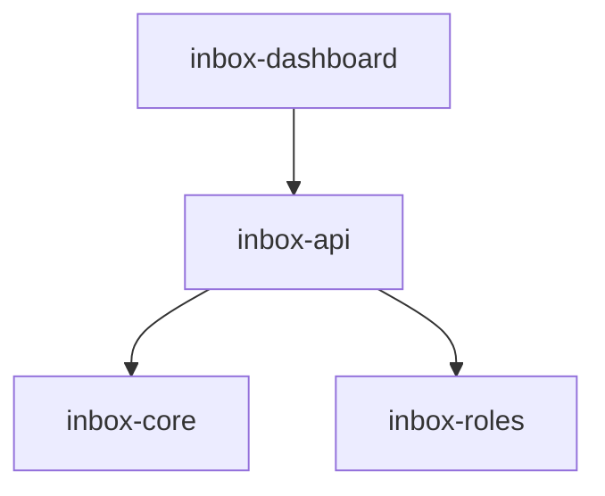

# Module: inbox-api

> Parent scope: [`../../agent-inbox.spec.md`](../../agent-inbox.spec.md)

<!--SECTION:MODULE_VISION-->

## 1. Module Vision

HTTP-сервер serve-режима на `node:http` (zero-dep). REST API для дашборда,
раздача статики React SPA. Тонкая прослойка между inbox-dashboard и
inbox-core / inbox-roles.

<!--/SECTION:MODULE_VISION-->

<!--SECTION:MODULE_USAGE_EXAMPLE-->

## 2. Module Usage Example

```ts
import { HttpServer } from '@/inbox-api';

const server = new HttpServer({
  port: 4174,
  staticDir: 'dist/inbox-serve',
  deps: { stateStore, roleScheduler },
});

await server.start();
// → Dashboard: http://localhost:4174
// → API:       http://localhost:4174/api/board
```

<!--/SECTION:MODULE_USAGE_EXAMPLE-->

<!--SECTION:ENTITY_INVENTORY-->

## 3. Entity Inventory (Closed-World)

| Name          | Type    | Purpose                                                                |
| ------------- | ------- | ---------------------------------------------------------------------- |
| `HttpServer`  | Service | `node:http` сервер: порт, роутинг, CORS, статика, graceful shutdown.   |
| `BoardRouter` | Service | `GET /api/board` — агрегирует состояние от RoleScheduler + StateStore. |
| `MrRouter`    | Service | `POST /api/mr/:id/assign`, `POST /api/mr/:id/action`.                  |
| `AuditRouter` | Service | `GET /api/mr/:id/audit` — читает AuditLog.                             |
| `StaticFiles` | Service | Раздача React SPA из `dist/inbox-serve/`. SPA fallback.                |

<!--/SECTION:ENTITY_INVENTORY-->

<!--SECTION:ENTITY_SURFACES-->

## 4. Entity Surfaces

### `HttpServer`

- **Type:** Service
- **Purpose:** `node:http` сервер. Роутинг, CORS, graceful shutdown.
- **Public Operations:**
  - `start()` — слушает порт, регистрирует роуты
  - `stop()` — graceful shutdown (завершить активные запросы, закрыть сокет)
- **Lifecycle:** Создаётся при старте `gennady inbox serve`, живёт до SIGTERM.
- **Errors & Degradation:** Порт занят → ошибка старта.
- **Consumers:** `gennady inbox serve`.

### `BoardRouter`

- **Type:** Service
- **Purpose:** `GET /api/board` → агрегированное состояние доски.
- **Response:** `{ roles: RoleView[], unassigned: MrCard[] }`
- **Consumers:** `inbox-dashboard` (ApiClient), будущий бот.

### `MrRouter`

- **Type:** Service
- **Purpose:** Действия над MR.
- **Endpoints:**
  - `POST /api/mr/:id/assign { role, rights? }` → `{ ok: true }`
  - `POST /api/mr/:id/action { action: 'post' | 'reject' | 'skip' }` → `{ ok: true }`
- **Consumers:** `inbox-dashboard`.

### `AuditRouter`

- **Type:** Service
- **Purpose:** `GET /api/mr/:id/audit` → история событий по MR.
- **Response:** `{ events: AuditEntry[] }`
- **Consumers:** `MrDetailModal`.

### `StaticFiles`

- **Type:** Service
- **Purpose:** Раздача React SPA. SPA fallback (все не-API пути → index.html).
- **Consumers:** Браузер.
<!--/SECTION:ENTITY_SURFACES-->

<!--SECTION:MODULE_CONTRACTS-->

## 5. Module Contracts (DbC)

Бизнес-логика минимальна. Ключевые инварианты:

- **Invariants:**
  - Все ответы — JSON с полем `ok: boolean`
  - CORS: `localhost:*` (для Vite dev-server) + текущий origin
  - 404 на несуществующие API-пути, остальное → SPA fallback
  - Graceful shutdown: не принимать новые запросы, завершить активные
  <!--/SECTION:MODULE_CONTRACTS-->

<!--SECTION:FILE_STRUCTURE-->

## 7. File Structure

```
services/agent-inbox/modules/inbox-api/
├── http-server.ts            # HttpServer: start, stop, роутинг
├── routers/
│   ├── board.router.ts       # BoardRouter
│   ├── mr.router.ts          # MrRouter
│   └── audit.router.ts       # AuditRouter
├── static-files.ts           # StaticFiles
├── errors.ts                 # ApiError
├── __tests__/
│   ├── http-server.test.ts
│   ├── board.router.test.ts
│   └── mr.router.test.ts
```

**File Mapping:**

- `http-server.ts` — `HttpServer`
- `routers/board.router.ts` — `BoardRouter`
- `routers/mr.router.ts` — `MrRouter`
- `routers/audit.router.ts` — `AuditRouter`
- `static-files.ts` — `StaticFiles`
- `errors.ts` — `ApiError`
<!--/SECTION:FILE_STRUCTURE-->

<!--SECTION:INTER_MODULE_DEPENDENCIES-->

## 9. Inter-Module Dependencies

- **Depends on:** `inbox-core`, `inbox-roles`
- **Provides to:** `inbox-dashboard`, будущий бот



<!--/SECTION:INTER_MODULE_DEPENDENCIES-->

<!--SECTION:HANDOFF-->

## 10. Handoff to task-scaffolding

- **Implementation files to be created:** 5 файлов
- **Test files to be created:** 3 файла
- **Stack dependencies:**
  - Language: TypeScript
  - Runtime: Node.js 22+ (`node:http`, zero external deps)
  - Test framework: node:test (resolves to `ai/directives/testing/node-test.xml`)
- **Module Rules Additions:** None
<!--/SECTION:HANDOFF-->
