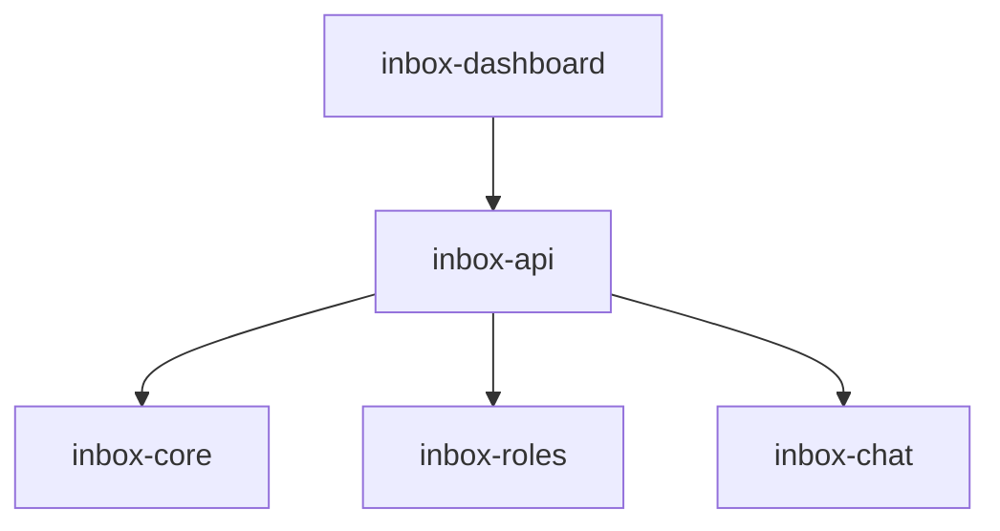

# Module: inbox-api

> Parent scope: [`../agent-inbox.spec.md`](../agent-inbox.spec.md)

<!--SECTION:MODULE_VISION-->

## 1. Module Vision

HTTP-сервер serve-режима на `node:http` (zero-dep). REST API для дашборда,
раздача статики React SPA. Тонкая прослойка между inbox-dashboard и
inbox-core / inbox-roles / inbox-chat.

**Review Chat (refine — D-87…D-106):** роутинг чата поверх `inbox-chat` — SSE-стрим хода
(`ChatRouter`) и revision-CAS применение мутаций (`MutateRouter`). SSE-канал вещает
stream-токены ИНИЦИАТОРУ и mutation/refresh-события ВСЕМ клиентам этого MR (D-100) —
без модуля-роутинга не могла бы существовать multi-tab согласованность (CH-03).

<!--/SECTION:MODULE_VISION-->

<!--SECTION:MODULE_USAGE_EXAMPLE-->

## 2. Module Usage Example

```ts
import { HttpServer, BoardProviderMock } from '@/inbox-api';

// dev/e2e: мок
const boardProvider = new BoardProviderMock();
boardProvider.seed({ roles: [...], unassigned: [...] });

// production: BoardProviderReal (подключает TSK-113)
// const boardProvider = new BoardProviderReal({ roleScheduler, stateStore, auditLog });

const server = new HttpServer({ port: 4174, boardProvider });
await server.start();

// Review Chat — SSE-стрим хода + revision-CAS мутация (refine, D-87…D-106)
// клиент подписывается на события этого MR (стрим токенов + mutation/refresh для ВСЕХ вкладок — D-100)
const es = new EventSource('/api/mr/510/chat/stream');
es.onmessage = (e) => {
  /* { type: 'token' | 'turn_done' | 'mutation' | 'refresh', ...payload } */
};

await fetch('/api/mr/510/chat', {
  method: 'POST',
  body: JSON.stringify({ text: 'Почему C-3 понижен?', chips: [{ kind: 'selection', quote: '...' }] }),
});
// → 202 { ok: true } — ответ приходит через SSE, не в теле POST

await fetch('/api/mr/510/mutate', {
  method: 'POST',
  body: JSON.stringify({ proposal: { op: 'set-severity', target: 'C-3', after: 'minor' }, revision: 7 }),
});
// → 200 { ok: true, snapshot: '...' } либо 409 { ok: false, error: 'STALE_REVISION' }
```

<!--/SECTION:MODULE_USAGE_EXAMPLE-->

<!--SECTION:ENTITY_INVENTORY-->

## 3. Entity Inventory (Closed-World)

| Name                | Type    | Purpose                                                                                                                                    |
| ------------------- | ------- | ------------------------------------------------------------------------------------------------------------------------------------------ |
| `HttpServer`        | Service | `node:http` сервер: порт, роутинг, CORS, статика, graceful shutdown.                                                                       |
| `BoardProviderPort` | Port    | Абстракция состояния доски: `getBoard()`, `assignMr()`, `executeAction()`, `getReport()`. Владеет типами `RoleView`, `MrCard`, `MrDetail`. |
| `BoardProviderMock` | Adapter | Мок-реализация `BoardProviderPort` для TSK-106 (in-memory, без RoleEngine).                                                                |
| `BoardProviderReal` | Adapter | Реализация через `RoleScheduler` + `StateStore` (TSK-113 подключает).                                                                      |
| `BoardRouter`       | Service | `GET /api/board` — агрегирует состояние от BoardProviderPort.                                                                              |
| `MrRouter`          | Service | `POST /api/mr/:id/assign`, `POST /api/mr/:id/action`, `GET /api/mr/:id/report`.                                                            |
| `ArtifactRouter`    | Service | `GET /api/mr/:id/artifacts` (список), `GET /api/mr/:id/artifact?path=` (содержимое одного) — для браузера артефактов на `#/mr/:id`.        |
| `AuditRouter`       | Service | `GET /api/mr/:id/audit` — читает AuditLog.                                                                                                 |
| `StaticFiles`       | Service | Раздача React SPA из `dist/inbox-serve/`. SPA fallback.                                                                                    |
| `ChatRouter`        | Service | `POST /api/mr/:id/chat`, `GET /api/mr/:id/chat/stream` (SSE), `POST /api/mr/:id/chat/undo` — делегирует `inbox-chat.ChatSession`.          |
| `MutateRouter`      | Service | `POST /api/mr/:id/mutate` — revision-CAS применение мутации, делегирует `inbox-chat.MutationApplier`.                                      |
| `SseHub`            | Service | Реестр SSE-подписчиков по MR; broadcast stream-токенов + mutation/refresh ВСЕМ клиентам этого MR (D-100), не только инициатору.            |

<!--/SECTION:ENTITY_INVENTORY-->

<!--SECTION:ENTITY_SURFACES-->

## 4. Entity Surfaces

### `HttpServer`

- **Type:** Service
- **Purpose:** `node:http` сервер. Роутинг, CORS, graceful shutdown.
- **Public Operations:**
  - `start()` — слушает порт, регистрирует роуты
  - `stop()` — graceful shutdown (завершить активные запросы, закрыть сокет)
- **Lifecycle:** Создаётся при старте `gennady inbox serve`, живёт до SIGTERM.
- **Errors & Degradation:** Порт занят → ошибка старта.
- **Consumers:** `gennady inbox serve`.

### `BoardProviderPort`

- **Type:** Port
- **Purpose:** Абстракция состояния доски. Позволяет TSK-106 работать с моком, TSK-113 — с real RoleScheduler.
- **Public Operations:**
  - `getBoard()` → `{ roles: RoleView[], unassigned: MrCard[] }`
  - `assignMr(mrId, role, rights?)` → `{ ok: boolean }`
  - `executeAction(mrId, action)` → `{ ok: boolean }` — generic ответ на OperatorQuestion; движок (`EffectExecutor`) исполняет
  - `getReport(mrId)` → `MrDetail` — сводный отчёт (REPORT.md + вердикт)
  - `listArtifacts(mrId)` → `ArtifactRef[]` — все артефакты `reports/<mr>/` (REPORT, PLAN, дорожки, HISTORY, coverage/tool-log)
  - `readArtifact(mrId, path)` → `{ content, kind }` — содержимое одного артефакта (md/mermaid) для рендера; путь валидируется как поддерево `reports/<mr>/` (no traversal)
- **Consumers:** `BoardRouter`, `MrRouter`, `ArtifactRouter`.

### `BoardProviderMock`

- **Type:** Adapter | **Implements:** `BoardProviderPort`
- **Purpose:** In-memory мок для TSK-106. Хранит состояние в памяти. `getReport()` возвращает seeded данные.
- **Consumers:** DI-контейнер (dev/e2e).

### `BoardProviderReal`

- **Type:** Adapter | **Implements:** `BoardProviderPort`
- **Purpose:** Реализация через `RoleScheduler` + `StateStore` + `AuditLog`. Подключается в TSK-113/115.
- **Consumers:** Production-окружение.

### `BoardRouter`

- **Type:** Service
- **Purpose:** `GET /api/board` → агрегированное состояние доски.
- **Response:** `{ roles: RoleView[], unassigned: MrCard[] }`
- **Consumers:** `inbox-dashboard` (ApiClient), будущий бот.

### `MrRouter`

- **Type:** Service
- **Purpose:** Действия над MR + отчёт агента + ответ на OperatorQuestion.
- **Endpoints:**
  - `POST /api/mr/:id/assign { role, rights? }` → `{ ok: true }`
  - `POST /api/mr/:id/action { questionId, choice, payload? }` → `{ ok: true }` — generic ответ на OperatorQuestion. `choice ∈ {post, approve, redispatch, skip}`; `payload` — выбранные кандидаты + отредактированный текст (post) / фокус раунда (redispatch «дослать»). Движок `EffectExecutor` исполняет.
  - `GET /api/mr/:id/report` → `MrDetail` — сводный отчёт для экрана `#/mr/:id`
- **Consumers:** `inbox-dashboard`.

### `ArtifactRouter`

- **Type:** Service
- **Purpose:** Браузер артефактов на `#/mr/:id`.
- **Endpoints:**
  - `GET /api/mr/:id/artifacts` → `{ artifacts: ArtifactRef[] }` — навигация (REPORT/PLAN/дорожки/HISTORY/coverage/tool-log)
  - `GET /api/mr/:id/artifact?path=<rel>` → `{ content, kind }` — содержимое одного; `path` валидируется как поддерево `reports/<mr>/` (защита от traversal)
- **Consumers:** `inbox-dashboard` (ApiClient).

### `AuditRouter`

- **Type:** Service
- **Purpose:** `GET /api/mr/:id/audit` → история событий по MR.
- **Response:** `{ events: AuditEntry[] }`
- **Consumers:** `MrDetailPage` (экран `#/mr/:id`).

### `ChatRouter`

- **Type:** Service
- **Purpose:** HTTP-граница Review Chat. Не содержит бизнес-логики — целиком делегирует
  `inbox-chat.ChatSession` (`../inbox-chat/inbox-chat.spec.md#chatsession`); превращает
  события хода (`onToken`/`onMutationProposed`) в SSE-кадры через `SseHub`.
- **Endpoints:**
  - `POST /api/mr/:id/chat { text, chips: ContextChip[] }` → `202 { ok: true }` — ставит ход в
    `ChatSession.ask()`; ответ приходит асинхронно через SSE, не в теле POST. Ход уже in-flight
    на этот `sid` → `409 { ok: false, error: 'TURN_IN_FLIGHT' }` (D-104).
  - `GET /api/mr/:id/chat/stream` (SSE, `text/event-stream`) → подписка на канал MR: кадры
    `{ type: 'token', text }` (по мере генерации, D-89), `{ type: 'turn_done', turn: ChatTurn }`,
    `{ type: 'mutation', proposal: MutationProposal }` (после Apply, ВСЕМ подписчикам MR —
    D-100), `{ type: 'refresh' }` (review.json изменился в фоне — сигнал перечитать), `{ type: 'error', code }`.
  - `POST /api/mr/:id/chat/undo { snapshotId }` → `200 { ok: true }` — делегирует
    `MutationApplier.undo()`; broadcast `refresh` всем подписчикам MR через `SseHub`.
  - `POST /api/mr/:id/chat/stop` → `200 { ok: true }` — делегирует `ChatSession.stop()`
    (ack < 200мс, CH-11).
- **Consumers:** `inbox-dashboard` (`ChatPanel`/`ChatApiClient`,
  `../inbox-dashboard/inbox-dashboard.spec.md#chatpanel`).

### `MutateRouter`

- **Type:** Service
- **Purpose:** HTTP-граница применения структурных мутаций. Делегирует
  `inbox-chat.MutationApplier` (`../inbox-chat/inbox-chat.spec.md#mutationapplier`).
- **Endpoints:**
  - `POST /api/mr/:id/mutate { proposal: MutationProposal, revision: number }` →
    `200 { ok: true, snapshot: string }` при успешном CAS; `409 { ok: false, error: 'STALE_REVISION' }`
    при устаревшей ревизии (D-99) — `review.json` НЕ модифицируется. После успеха — broadcast
    `{ type: 'mutation' }` + `{ type: 'refresh' }` через `SseHub` всем клиентам MR (D-100).
- **Consumers:** `inbox-dashboard` (`ChatPanel`/`MutationProposalCard`).

### `SseHub`

- **Type:** Service
- **Purpose:** Реестр активных SSE-подключений по MR (`Map<mrRef, Set<ServerResponse>>`).
  Единый broadcast-механизм для `ChatRouter` (stream-токены) и `MutateRouter` (mutation/refresh) —
  тот же канал, что переносит и то, и другое (переиспользуется, не два транспорта, D-89/D-100).
- **Public Operations:**
  - `subscribe(mrRef, res)` — регистрирует SSE-соединение, отправляет `retry`/heartbeat.
  - `unsubscribe(mrRef, res)` — снимает подписку (на закрытие соединения клиентом).
  - `broadcast(mrRef, frame)` — пишет SSE-кадр ВСЕМ подписчикам этого MR, не только
    инициатору действия (D-100).
- **Lifecycle:** Синглтон на процесс сервера; подписки живут, пока открыт HTTP-response.
- **Errors & Degradation:** Разрыв соединения клиентом → `unsubscribe` по событию `close`;
  запись в закрытый сокет — no-op (не бросает).
- **Consumers:** Internal — `ChatRouter`, `MutateRouter`.

### `StaticFiles`

- **Type:** Service
- **Purpose:** Раздача React SPA. SPA fallback (все не-API пути → index.html).
- **Consumers:** Браузер.
<!--/SECTION:ENTITY_SURFACES-->

<!--SECTION:MODULE_CONTRACTS-->

## 5. Module Contracts (DbC)

Бизнес-логика минимальна. Ключевые инварианты:

- **Invariants:**
  - Все ответы — JSON с полем `ok: boolean`
  - CORS: `localhost:*` (для Vite dev-server) + текущий origin
  - 404 на несуществующие API-пути, остальное → SPA fallback
  - Graceful shutdown: не принимать новые запросы, завершить активные

### Service: `ChatRouter` / `MutateRouter` / `SseHub`

- **Runtime Backing:** `real-runtime` (через `inbox-chat`)
- **Verification Levels:** `contract`, `unit`, `integration`
- **Deferred Runtime Scope:** None

**Contract (DbC):**

- Preconditions:
  - `POST /api/mr/:id/chat` — `text` непустая строка; `chips` — валидный массив `ContextChip`
    (см. `../inbox-chat/inbox-chat.spec.md#contextchip`).
  - `POST /api/mr/:id/mutate` — `proposal.op` ∈ `{edit, remove, set-severity}`; `revision` —
    число, снятое клиентом с последнего известного `review.json`.
- Postconditions:
  - `POST /api/mr/:id/chat` не блокирует ответ ожиданием хода — `202` немедленно, ход и
    результат идут через SSE (D-89).
  - `POST /api/mr/:id/mutate`: успешный CAS → broadcast `mutation`+`refresh` ВСЕМ подписчикам
    SSE-канала этого MR через `SseHub`, не только вызывающему клиенту (D-100); CAS-конфликт →
    `review.json` не тронут, инициатор получает `409`, ВСЕ подписчики получают `refresh`
    (узнают, что MR обновился в фоне).
  - `SseHub.broadcast` — доставка best-effort; разрыв одного подписчика не влияет на прочих.
- Invariants:
  - Один SSE-канал на MR обслуживает и стрим хода, и mutation/refresh-события — не два
    отдельных транспорта (переиспользование, не дублирование).
  - Роутеры сами не принимают решений о мутации/ходе — вся логика в `inbox-chat`
  (`ChatSession`/`MutationApplier`); роутер только маршрутизирует HTTP↔SSE.
  <!--/SECTION:MODULE_CONTRACTS-->

<!--SECTION:FILE_STRUCTURE-->

## 7. File Structure

```
services/agent-inbox/modules/inbox-api/
├── http-server.ts            # HttpServer: start, stop, роутинг
├── board-provider.port.ts    # BoardProviderPort: абстракция
├── board-provider.mock.ts    # BoardProviderMock: in-memory мок
├── board-provider.real.ts    # BoardProviderReal: делегат к RoleScheduler
├── routers/
│   ├── board.router.ts       # BoardRouter
│   ├── mr.router.ts          # MrRouter
│   ├── artifact.router.ts    # ArtifactRouter
│   ├── audit.router.ts       # AuditRouter
│   ├── chat.router.ts        # ChatRouter (chat/stream/undo/stop)
│   └── mutate.router.ts      # MutateRouter (mutate, revision-CAS)
├── sse-hub.ts                 # SseHub (subscribe/unsubscribe/broadcast)
├── static-files.ts           # StaticFiles
├── errors.ts                 # ApiError
├── __tests__/
│   ├── http-server.test.ts
│   ├── board.router.test.ts
│   ├── mr.router.test.ts
│   ├── artifact.router.test.ts
│   ├── chat.router.test.ts
│   ├── mutate.router.test.ts
│   └── sse-hub.test.ts
```

**File Mapping:**

- `http-server.ts` — `HttpServer`
- `routers/board.router.ts` — `BoardRouter`
- `routers/mr.router.ts` — `MrRouter`
- `routers/artifact.router.ts` — `ArtifactRouter`
- `routers/audit.router.ts` — `AuditRouter`
- `routers/chat.router.ts` — `ChatRouter`
- `routers/mutate.router.ts` — `MutateRouter`
- `sse-hub.ts` — `SseHub`
- `static-files.ts` — `StaticFiles`
- `errors.ts` — `ApiError`
<!--/SECTION:FILE_STRUCTURE-->

<!--SECTION:MODULE_DECISION_LOG-->

## 8. Module Decision Log

- Static file serving uses `path.resolve()` + `startsWith(_distDir)` to block path traversal — paths outside dist dir result in 404
- `parseBody` has 1MB limit, destroys socket on overflow — prevents memory exhaustion from malicious requests
- `sendError` returns generic 'Internal server error' — no internal details leaked to client
- `HttpServer.stop()`: 5s timeout destroys tracked sockets for graceful shutdown — active connections get a chance to finish, then force-closed
- `HttpServer.start()`: tracks sockets via 'connection' event — enables socket cleanup at shutdown

### D-110 — Один SSE-канал на MR для стрима хода И mutation/refresh-broadcast

- **Status:** active
- **Recorded:** session ModuleDecomposition, agent-inbox
- **Why:** Родительская спека (D-89/D-100) требует и токен-за-токеном стрим, и вещание
  mutation/refresh всем клиентам MR. Один `GET /api/mr/:id/chat/stream` вместо двух
  SSE-эндпоинтов — переиспользование транспорта (`SseHub`), меньше соединений на клиента,
  проще инвалидация подписки при закрытии вкладки.
- **Risk accepted:** None.
- **Rejected alternatives:** Отдельный `GET /api/mr/:id/events` под mutation/refresh — два
  SSE-соединения на вкладку без выигрыша в изоляции (оба про один MR).

### D-111 — `ChatRouter`/`MutateRouter` — тонкий HTTP↔SSE мост, без бизнес-логики

- **Status:** active
- **Recorded:** session ModuleDecomposition, agent-inbox
- **Why:** Паритет с существующим правилом модуля («тонкая прослойка между inbox-dashboard и
  inbox-core/inbox-roles») — вся семантика хода/мутации (снапшот, CAS, provenance,
  tool-scoping) уже специфицирована в `inbox-chat` (D-91). Дублирование здесь развело бы
  контракт по двум спекам.
- **Risk accepted:** None.
- **Rejected alternatives:** Инлайнить логику CAS/снапшота в `MutateRouter` — God-роутер,
  нарушает `AX_MODULARITY_LIMITS` и декомпозицию по подсистемам (D-76/D-91).

### D-112 — `getReport` disk-fallback нормализует ключ в `project!iid` до чтения диска

- **Status:** active
- **Recorded:** 2026-07-23, live-verification (`INBOX_DRY_RUN=1`)
- **Why:** `getReport(mrId)` при живом инстансе резолвит и webUrl, и `project!iid` (через
  `_resolveInstance`'s dual-key). Но ветка disk-fallback (когда инстанс завершился и удалён из
  памяти после auto-approve→done) передавала сырой `mrId` прямо в `_readDiskReview`/`mrReportsDir`,
  а те ключуются ТОЛЬКО по `project!iid`. Живой баг: `getReport(webUrl)` возвращал 200 с вердиктом,
  пока инстанс `!630` был в работе, и начинал отдавать 404 на том же webUrl после `done`+cleanup,
  хотя `review.json` лежал на диске. Фикс: нормализовать `mrId` через `parseVcsUrl` в начале
  fallback (тот же приём, что уже в `_resolveInstance`), затем единый `ref` и в путь диска, и в
  поля карточки `project`/`iid`.
- **Risk accepted:** None — оба формата ключа теперь работают на обеих ветках (live + disk).
- **Rejected alternatives:** Требовать от всех вызывающих только `project!iid` — молчаливо ломает
  любой вызов с webUrl после cleanup (именно так баг и проявился); нормализация в одной точке
  дешевле и симметрична live-ветке.

### D-113 — `GET /api/diagnostics` + серверный ring-buffer логов для кнопки 🐞

- **Status:** active
- **Recorded:** 2026-07-23, live-verification (`INBOX_DRY_RUN=1`)
- **Why:** Кнопка-жук на дашборде собирала ТОЛЬКО фронтовый ring-buffer (`debug-log.ts`) — но сбои
  флоу ревью (линза/синтез/эффект, `execution_error`, `action_failed`) происходят на СЕРВЕРЕ и в
  этот лог не попадают, так что оператор, нажав жука при «что-то пошло не так», приносил бы лог без
  причины. Добавлены: (1) bounded ring-buffer в `services/logger/logger.ts` (`snapshotServerLog`) —
  захватывает КАЖДЫЙ вызов независимо от console-уровня (подавленный debug остаётся доступен
  постфактум); (2) `GET /api/diagnostics` (`DiagnosticsRouter`) отдаёт хвост серверных строк;
  (3) `DebugLogButton` тянет `fetchServerLog()` и склеивает `BROWSER LOG` + `SERVER LOG` в один блоб
  клипборда, никогда не блокируя копирование при недоступном сервере.
- **Risk accepted:** Логи держатся только в памяти процесса (не персистятся) — при рестарте serve
  хвост теряется; это осознанно (приватность + ограниченность), для post-hoc разбора активной
  сессии достаточно.
- **Rejected alternatives:** Тянуть серверный лог из файла/`tail` руками (нарушает
  «продукт-владеет-рантаймом», нет у дашборда доступа к stdout процесса); слать каждую строку по SSE
  (шум + связывает диагностику с живым сокетом, тогда как жук нужен именно когда что-то сломалось).

<!--/SECTION:MODULE_DECISION_LOG-->

<!--SECTION:INTER_MODULE_DEPENDENCIES-->

## 9. Inter-Module Dependencies

- **Depends on:** `inbox-core`, `inbox-roles`, `inbox-chat` (`../inbox-chat/inbox-chat.spec.md`)
- **Provides to:** `inbox-dashboard`, будущий бот



<!--/SECTION:INTER_MODULE_DEPENDENCIES-->

<!--SECTION:HANDOFF-->

## 10. Handoff to task-scaffolding

- **Implementation files to be created:** 7 файлов (было 5 + `routers/chat.router.ts` +
  `routers/mutate.router.ts` + `sse-hub.ts`)
- **Test files to be created:** 6 файлов (было 3 + `chat.router.test.ts` +
  `mutate.router.test.ts` + `sse-hub.test.ts`)
- **Stack dependencies:**
  - Language: TypeScript
  - Runtime: Node.js 22+ (`node:http`, zero external deps — SSE тоже поверх `node:http`, без
    новой библиотеки)
  - Test framework: node:test (resolves to `ai/directives/testing/node-test.xml`)
- **Module Rules Additions:** None
- **Open risks & validation needs:** SSE-подписки при рестарте сервера — клиент обязан
переподключиться и получить `refresh` (не новый риск: `ChatSession.rehydrate()` в
`inbox-chat` уже покрывает состояние; здесь — только транспорт).
<!--/SECTION:HANDOFF-->
