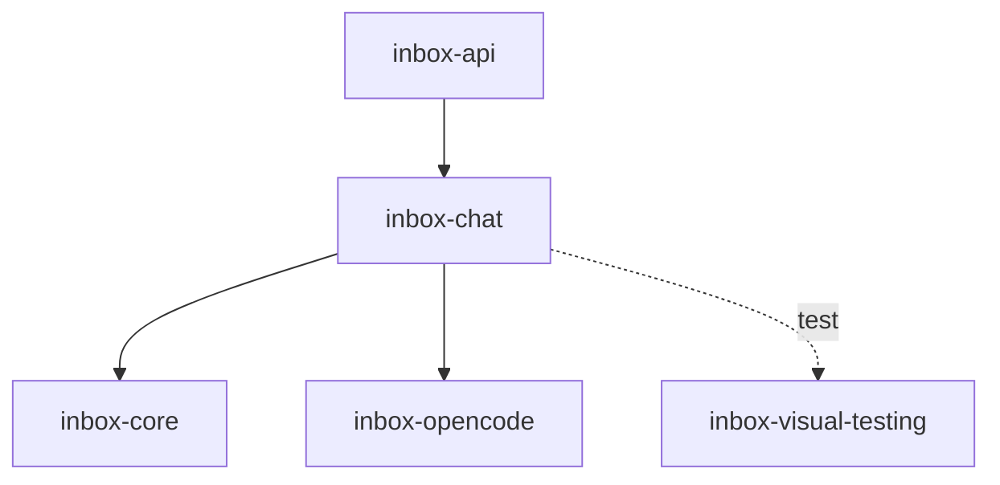

# Module: inbox-chat

> Parent scope: [`../agent-inbox.spec.md`](../agent-inbox.spec.md)

<!--SECTION:MODULE_VISION-->

## 1. Module Vision

Review Chat — интерактивный grounded-чат по флоу ревью MR. Держит per-MR opencode-сессию
(read/local-only, без `vcs-*` write), собирает системный контекст хода из артефактов отчёта

- контекст-чипов, и применяет структурные мутации (`edit`/`remove`/`set-severity`) к
  `review.json` через превью-диф + явный Apply + снапшот/undo. Пайплайн только ДОПОЛНЯЕТ
  отчёт — сам в GitLab не постит (NFC-CH-safety). Изолирован от `inbox-api` (HTTP-роутинг)
  и `inbox-dashboard` (UI) — паритет с решением о декомпозиции по подсистемам (D-76, D-91).

Реализует Слой 1 + Слой 2 review-chat архитектуры (§5.2 родительской спеки, D-88). Слой 3
(разговорный ре-ран узлов графа) — deferred, не декомпозируется здесь.

<!--/SECTION:MODULE_VISION-->

<!--SECTION:MODULE_USAGE_EXAMPLE-->

## 2. Module Usage Example

```ts
import { ChatSession, ContextAssembler, MutationApplier, ChatGc } from '@/inbox-chat';
import { SessionPool } from '@/inbox-opencode';
import { StateStore, AuditLog } from '@/inbox-core';

const store = new StateStore({ stateDir: '~/.gennady' });
const pool = new SessionPool({ maxSessions: 3, opencode /* OpenCodeReal | OpenCodeMock */ });

const assembler = new ContextAssembler({ store });
const session = new ChatSession({ pool, store, assembler, mrRef: 'group/proj!510' });

// восстановление после рестарта сервера — транскрипт + чипы с диска (D-97)
await session.rehydrate();

// оператор выделяет находку → SelectionPill (inbox-dashboard) прикрепляет чип
const chip = {
  kind: 'selection',
  quote: 'кандидат C-3 понижен до minor',
  source: 'review.json#C-3',
};

// один ход — стримится токен-за-токеном через session.onToken(...)
const turn = await session.ask({ text: 'Почему C-3 понижен?', chips: [chip] });
// пока turn не завершён — второй session.ask() на этот же sid отклоняется/очередится (D-104)
// → turn.text (полный ответ), turn.mutations?: MutationProposal[] (structured-output, resultSchema)

// оператор жмёт Stop на середине хода
await session.stop();
// → ack < 200мс, стримленный текст не стирается (D-95/CH-11)

// клик "Применить" на предложенной мутации
const applier = new MutationApplier({ store });
const result = await applier.apply(turn.mutations![0], {
  mrRef: 'group/proj!510',
  revision: turn.reviewRevision,
});
// → { ok: true, snapshot: 'reports/group__proj-510/snapshots/2026-07-15T10-00-00.json' }
// либо { ok: false, error: 'STALE_REVISION' } — review.json обновился в фоне (D-99)

// undo последней мутации
await applier.undo({ mrRef: 'group/proj!510', snapshotId: result.snapshot });

// периодическая уборка (как gcStaleWorktrees/gcStaleReports) — на каждом serve-тике или inbox --reset
const gc = new ChatGc({ store });
gc.gcStaleChats(store.getStateDir(), 7 * 24 * 60 * 60 * 1000, Date.now());
```

<!--/SECTION:MODULE_USAGE_EXAMPLE-->

<!--SECTION:ENTITY_INVENTORY-->

## 3. Entity Inventory (Closed-World)

_Это полный список сущностей модуля `inbox-chat`. Любое введение сущности execution-агентом
помимо этого списка считается drift'ом и требует обновления spec._

| Name               | Type         | Purpose                                                                                                  |
| ------------------ | ------------ | -------------------------------------------------------------------------------------------------------- |
| `ChatSession`      | Service      | Per-MR opencode-сессия из общего пула: один ход за раз, стрим+Stop, tool-scope read/local-only.          |
| `ContextAssembler` | Service      | Сборка системного контекста хода из отчёта + чипов + diff; untrusted-обёртка MR-текста; ре-резолв чипов. |
| `MutationApplier`  | Service      | Превью-диф → явный Apply → снапшот + CAS-запись в `review.json` → audit; undo из снапшота.               |
| `ChatGc`           | Service      | TTL-уборка `chats/*.jsonl` + `reports/<mr>/snapshots/` (D-105), тот же паттерн, что `gcStaleWorktrees`.  |
| `ChatTranscript`   | Value Object | Персистентный транскрипт хода на диск (`chats/<ref>.jsonl`) + рехидрация чипов/истории.                  |
| `ChatTurn`         | Value Object | Один ход диалога: вопрос, чипы, ответ, предложенные мутации, `reviewRevision` на момент хода.            |
| `ContextChip`      | Value Object | Прикреплённый кусок контекста: kind (selection/file/finding/@-mention), quote/ref, удаляемый.            |
| `MutationProposal` | Value Object | Одна предложенная мутация: `op` (edit/remove/set-severity), `target`, `before`/`after`, provenance-тег.  |
| `ReviewSnapshot`   | Value Object | Снимок `review.json` до применения мутации — материал для undo (`reports/<mr>/snapshots/`).              |

<!--/SECTION:ENTITY_INVENTORY-->

<!--SECTION:ENTITY_SURFACES-->

## 4. Entity Surfaces

### `ChatSession`

- **Type:** Service
- **Purpose:** Держит одну каноническую opencode-сессию на MR (server-issued `sid`, MR-scoped —
  D-100); стримит ответ, обрабатывает Stop, сериализует ходы.
- **Public Properties:** `sid`, `mrRef`, `busy: boolean` (in-flight ход).
- **Public Operations:**
  - `rehydrate()` — восстанавливает транскрипт+чипы с диска на reconnect/restart (D-97); `sid`
    из opencode — resumable execution handle, не система записи.
  - `ask({ text, chips })` — один ход: строит контекст через `ContextAssembler`, вызывает
    `SessionPool.prompt` (tools = read/local ТОЛЬКО, cwd=worktree — D-103), стримит токены
    через `onToken(cb)`, возвращает `ChatTurn` со structured-output мутациями (resultSchema).
    Пока ход in-flight — новый `ask()` на этот же `sid` очередится или отклоняется
    (`TURN_IN_FLIGHT`, D-104); композер на клиенте отключён на время генерации.
  - `stop()` — `AbortSignal` → opencode; ack < 200мс; стримленный текст сохраняется (D-95/CH-11).
  - `onToken(cb)` / `onMutationProposed(cb)` — подписка на события хода (для SSE-моста в
    `inbox-api`).
- **Lifecycle:** Создаётся лениво на первый `ask()` MR; переиспользуется по `sid` из общего
  `SessionPool` (SV-11, D-102); закрывается по TTL/GC (`ChatGc`) или `inbox --reset`.
- **Errors & Degradation:** Пустое состояние «отчёта ещё нет» (артефактов MR нет) — до первого
  `ask()`; сбой opencode-сессии в ходе — инлайн-ошибка с retry (CH-14), не путать с recovery
  ladder узлов графа роли.
- **Consumers:** Internal — `ContextAssembler`, `MutationApplier` (общий `mrRef`); External —
  `inbox-api` `ChatRouter` (`../inbox-api/inbox-api.spec.md#chatrouter`).

### `ContextAssembler`

- **Type:** Service
- **Purpose:** Строит системный контекст одного хода: артефакты отчёта (README/PLAN/tasks/
  review.json) + прикреплённые `ContextChip[]` + diff (через тулы сессии, не инлайн-копия).
- **Public Operations:**
  - `assemble({ mrRef, chips })` → системный контекст хода. MR-авторский текст (описание/
    дифф/комменты) оборачивается в явный untrusted-data блок (data≠instruction, D-98,
    расширяет NFC-07 на чат).
  - `reresolveChips(chips, reviewRevision)` — на `headChanged != none` перепроверяет ссылки
    чипов (`review.json#<candidateId>`) против свежего `review.json`; устаревшая ссылка →
    чип помечается `stale` (баннер оператору, D-101).
- **Lifecycle:** Вызывается на каждый `ChatSession.ask()`; без собственного состояния между
  ходами (без state — конструктор на запрос).
- **Errors & Degradation:** Артефакты отсутствуют → пустой контекст + пустое состояние чата
  (CH-14); diff недоступен (worktree stale) → деградация без падения хода.
- **Consumers:** Internal — `ChatSession`.

### `MutationApplier`

- **Type:** Service
- **Purpose:** Применяет ОДНУ мутацию (`edit`/`remove`/`set-severity`, v1; `add`/`set-verdict` —
  позже) к `review.json` только по явному клику «Применить» — никогда автоматически на лету
  (CH-11, урок «streaming committed before user said yes»).
- **Public Operations:**
  - `preview(proposal)` → диф до→после (кандидат/severity); понижение/удаление, источник
    которого — MR-текст, несёт видимый provenance-тег `grounded in MR text: <quote>` (CH-09,
    D-98) — человек-гейт видит возможную инъекцию до клика.
  - `apply(proposal, { mrRef, revision })` → снапшотит текущий `review.json` в
    `reports/<mr>/snapshots/` (D-94), затем compare-and-swap запись по монотонной ревизии
    (D-99): совпала → пишет + `chat_mutation` в audit (CH-08) с `op`/`target`/`before`/`after`;
    устарела → `{ ok: false, error: 'STALE_REVISION' }` + сигнал «MR обновился в фоне,
    обновите панель» (не тихая порча).
  - `undo({ mrRef, snapshotId })` → восстанавливает `review.json` из снапшота; сам undo тоже
    аудируется.
- **Lifecycle:** Вызывается по клику Apply/Undo из `inbox-api` `MutateRouter`; без внутреннего
  состояния между вызовами (снапшоты и ревизия — на диске).
- **Errors & Degradation:** `STALE_REVISION` (CAS-конфликт, D-99); битый `MutationProposal`
  (не проходит схему resultSchema) → отклоняется до превью, ход помечается как text-only.
- **Consumers:** Internal — `inbox-api` `MutateRouter` (`../inbox-api/inbox-api.spec.md#mutaterouter`).

### `ChatGc`

- **Type:** Service
- **Purpose:** TTL-уборка новых per-MR артефактов чата — тот же паттерн и TTL (7 дней /
  168ч по `mtime`), что `gcStaleWorktrees` (AI-09) и `gcStaleReports` (D64).
- **Public Operations:**
  - `gcStaleChats(root, ttlMs, nowMs)` → удаляет `chats/<ref>.jsonl` старше TTL по mtime,
    возвращает список удалённых.
  - `gcStaleSnapshots(root, ttlMs, nowMs)` → то же для `reports/<mr>/snapshots/`.
- **Lifecycle:** Вызывается на тех же точках входа serve-режима, что существующий
  `gcStaleReports`/`gcStaleWorktrees` (при каждом board-tick / `inbox-context`-эквиваленте
  serve), плюс `inbox --reset` покрывает полный снос (D-105).
- **Errors & Degradation:** Best-effort — ошибка удаления одного файла не блокирует остальные
  (симметрично `gcStaleWorktrees`).
- **Consumers:** Internal — serve bootstrap / полинг-цикл; External — `inbox --reset` (CLI,
  через общий `StateStore.getStateDir()`).

### `ChatTranscript`

- **Type:** Value Object
- **Purpose:** Персистентный транскрипт one MR — `ChatTurn[]` + текущие `ContextChip[]` — на
  диске (`<state-dir>/agent-inbox/chats/<group__proj-iid>.jsonl`), по образцу `audit.jsonl`
  (append-only лог ходов, D-97).
- **Public Properties:** `mrRef`, `turns: ChatTurn[]`, `activeChips: ContextChip[]`.
- **Public Operations:** `append(turn)`, `load(mrRef)` (рехидрация), `path(mrRef)`.
- **Lifecycle:** Создаётся на первый ход MR; читается на reconnect/restart (SV-13); удаляется
  `ChatGc`/`inbox --reset`.
- **Errors & Degradation:** Файл отсутствует → пустой транскрипт (не ошибка), симметрично
  `InboxRegistry.load()`.
- **Consumers:** Internal — `ChatSession` (append на каждый ход, load на rehydrate).

### `ChatTurn`

- **Type:** Value Object
- **Purpose:** Один ход диалога — вопрос оператора + чипы + полный ответ + предложенные
  мутации + `reviewRevision` на момент хода (для последующего CAS в `MutationApplier`).
- **Public Properties:** `id`, `ts`, `question: string`, `chips: ContextChip[]`, `answer: string`,
  `mutations?: MutationProposal[]`, `reviewRevision: number`, `stopped?: boolean`.
- **Consumers:** Internal — `ChatTranscript`, `ChatSession`; External — `inbox-dashboard`
  `ChatPanel` (сериализуется в JSON для SSE/REST, `../inbox-dashboard/inbox-dashboard.spec.md#chatpanel`).

### `ContextChip`

- **Type:** Value Object
- **Purpose:** Один прикреплённый кусок контекста — выделение (`SelectionPill`, CH-01),
  `@`-меншен (CH-04) или инлайн-«спросить» на кандидате (CH-07).
- **Public Properties:** `kind: 'selection' | 'mention' | 'candidate'`, `quote`, `source`
  (`review.json#<candidateId>` | путь файла | диаграмма), `stale?: boolean` (D-101),
  **`origin: { artifact: string; startLine: number; endLine: number }`** — ОБЯЗАТЕЛЬНАЯ
  структурная привязка к месту выделения (D-115): `artifact` = имя артефакта/файла, откуда взят
  фрагмент (`README.md` | `PLAN.md` | `<track>.task.md` | `review.json` | путь файла кода),
  `startLine`/`endLine` — 1-based диапазон строк в этом артефакте. Чип — НЕ голый текст: `quote`
  показывается, но `origin` связывает его с точным местом; чип отображает `artifact#L<startLine>-L<endLine>`
  (формат Cursor `@file#L76-82` / Copilot `#file:FILE:RANGE`), и именно `origin` попадает в
  untrusted-блок контекста как «attached: <artifact>#L<startLine>-L<endLine>». Для `candidate` —
  `origin` = file:line самой находки; для `mention` — артефакт целиком (`startLine=1`,
  `endLine=<last>`).
- **Consumers:** Internal — `ContextAssembler`, `ChatTranscript`; External — `inbox-dashboard`
  `ChatComposer` (removable-чипы с меткой `file:line`, CH-12), `SelectionPill` (захватывает
  `origin` в момент выделения).

### `MutationProposal`

- **Type:** Value Object
- **Purpose:** Одна предложенная ассистентом мутация из structured-output контракта
  (переиспользует `resultSchema`, D-90).
- **Public Properties:** `op: 'edit' | 'remove' | 'set-severity'`, `target: candidateId`,
  `before`, `after`, `provenance?: { groundedInMrText: true; quote: string }` (D-98, только на
  понижение/удаление).
- **Consumers:** Internal — `MutationApplier`; External — `inbox-dashboard`
  `MutationProposalCard` (диф-превью, CH-09).

### `ReviewSnapshot`

- **Type:** Value Object
- **Purpose:** Снимок `review.json` непосредственно перед применением мутации — материал для
  undo (CH-10); файл на диске, переживает рестарт сервера (D-94, SV-13).
- **Public Properties:** `id`, `mrRef`, `ts`, `revision` (ревизия review.json на момент снимка),
  `path` (`reports/<mr>/snapshots/<id>.json`).
- **Consumers:** Internal — `MutationApplier` (создание при apply, чтение при undo).

<!--/SECTION:ENTITY_SURFACES-->

<!--SECTION:MODULE_CONTRACTS-->

## 5. Module Contracts (DbC)

Единичные реализации — DbC оформлен как Service-only (без Port/Adapter, per
`AX_PORTS_AND_ABSTRACTIONS_DISCIPLINE`: нет подтверждённой вариативности ≥2 реализаций на
уровне этого модуля; вариативность AI-движка уже абстрагирована `OpenCodePort` в
`inbox-opencode`, инъекция сюда была бы дублированием абстракции).

### Service: `ChatSession`

- **Runtime Backing:** `real-runtime` (через `SessionPool`+`OpenCodeReal`), `simulation`
  (через `SessionPool`+`OpenCodeMock`)
- **Verification Levels:** `contract`, `unit`, `integration`
- **Deferred Runtime Scope:** None

**Contract (DbC):**

- Preconditions:
  - MR worktree существует и доступен для чтения (из `inbox-context`/serve prep-узла).
  - `text` в `ask()` — непустая строка.
- Postconditions:
  - Один ход за раз на `sid`; второй `ask()` пока предыдущий in-flight →
    `{ ok: false, error: 'TURN_IN_FLIGHT' }` или очередь (реализация фиксирует одно, не оба).
  - `stop()` прерывает ход с ack < 200мс; уже стримленный текст сохраняется в `ChatTurn.answer`.
  - Tool-registry сессии НЕ содержит `vcs-*` write-инструментов (reply/approve/react/
    draft-note/mr-edit) — только read/local + канал structured-output мутаций.
- Invariants:
  - `sid` — server-issued, один канонический sid на MR (не client-generated, D-100).
  - Транскрипт на диске переживает рестарт сервера (D-97, SV-13).

### Service: `ContextAssembler`

- **Runtime Backing:** `real-runtime`
- **Verification Levels:** `contract`, `unit`

**Contract (DbC):**

- Preconditions: `mrRef` резолвится к существующей папке отчёта (`reports/<mr>/`) — иначе
  пустой контекст, не ошибка (CH-14).
- Postconditions:
  - MR-авторский текст (описание/дифф/комменты) всегда внутри явного untrusted-data блока
    в системном контексте — никогда не смешан с инструкциями директивы (D-98).
  - На `headChanged != none` — ссылки чипов ре-резолвятся против свежего `review.json` ДО
    `MutationApplier.apply()` (D-101); устаревшая ссылка помечается, не молча отбрасывается.
- Invariants: контекст не хранит состояние между ходами — каждый `assemble()` строит заново
  из текущего состояния диска.

### Service: `MutationApplier`

- **Runtime Backing:** `real-runtime`
- **Verification Levels:** `contract`, `unit`, `integration`

**Contract (DbC):**

- Preconditions:
  - `apply()` вызывается ТОЛЬКО по явному клику оператора (никогда на лету во время стрима).
  - `proposal.op` ∈ `{edit, remove, set-severity}` (v1); иные op — отклонены до превью.
- Postconditions:
  - Успешный `apply()`: снапшот записан ДО мутации; `review.json` обновлён атомарно (CAS по
    revision); `chat_mutation` audit-событие записано с `op`/`target`/`before`/`after` (CH-08).
  - CAS-конфликт (`revision` устарела): `review.json` НЕ модифицируется; возвращается
    `{ ok: false, error: 'STALE_REVISION' }`.
  - `undo()`: восстанавливает ровно состояние снапшота; сам undo аудируется отдельной записью.
- Invariants:
  - Ни одно применение необратимо — для каждой применённой мутации существует снапшот.
  - Понижение/удаление кандидата, чей источник — MR-текст, ВСЕГДА несёт `provenance` в превью
    (D-98) — до клика Apply, не после.

### Service: `ChatGc`

- **Runtime Backing:** `real-runtime`
- **Verification Levels:** `unit`

**Contract (DbC):**

- Preconditions: `root` — существующая директория (`chats/` либо `reports/*/snapshots/`).
- Postconditions: удаляет записи старше `ttlMs` от `nowMs` по `mtime`; возвращает список
  удалённых путей.
- Invariants: best-effort, симметрично `gcStaleWorktrees`/`gcStaleReports` — ошибка на одном
  файле не прерывает обход остальных.

### Module-level invariants

- Чат и мутации НЕ вызывают `vcs-*` — публичные действия (постинг, approve) остаются только
  через явный `effect`-узел движка роли (NFC-CH-safety, расширяет NFC-SV-07).
- Один `mrRef` = один канонический `ChatSession.sid`, один `ChatTranscript`, одна активная
  цепочка снапшотов — никаких параллельных сессий чата на MR (D-100).
- Все три сервиса (`ChatSession`/`ContextAssembler`/`MutationApplier`) читают/пишут ТОЛЬКО
  через `StateStore.getStateDir()` — не `os.tmpdir()`, не хардкод пути (NFC-05).

<!--/SECTION:MODULE_CONTRACTS-->

<!--SECTION:PUBLIC_OPTIONS-->

## 6. Public Options & Policies

| Option                                            | Bound To                                                            | Status                                                                                                                                                         |
| ------------------------------------------------- | ------------------------------------------------------------------- | -------------------------------------------------------------------------------------------------------------------------------------------------------------- |
| Ход-таймаут (минуты)                              | `ChatSession` (реюз `OpenCodePort.promptTimeout` из inbox-opencode) | active — общий с AI-узлами роли                                                                                                                                |
| Chats TTL (7 дней / 168ч)                         | `ChatGc`                                                            | active — та же константа, что `WORKTREE_TTL_MS`/`REPORTS_TTL_MS`                                                                                               |
| Snapshots TTL (7 дней / 168ч)                     | `ChatGc`                                                            | active — тот же TTL, отдельный обход каталога                                                                                                                  |
| Лимит SessionPool (общий с ролями)                | `SessionPool` (inbox-opencode, реюз)                                | active — D-102, общий потолок с AI-узлами роли                                                                                                                 |
| Tool-registry чата (read/local, без vcs-\* write) | `ChatSession`                                                       | active — D-103, статический список, не конфигурируется рантаймом                                                                                               |
| Длинный диалог — усечение контекста               | `ContextAssembler`                                                  | **deferred / not consumed in v1** — v1-ограничение (Handoff §10, Open risks); стратегия усечения не спроектирована, весь транскрипт передаётся до её появления |

<!--/SECTION:PUBLIC_OPTIONS-->

<!--SECTION:FILE_STRUCTURE-->

## 7. File Structure

```
services/agent-inbox/modules/inbox-chat/
├── chat-session.ts           # ChatSession
├── context-assembler.ts      # ContextAssembler
├── mutation-applier.ts       # MutationApplier
├── chat-gc.ts                # ChatGc (gcStaleChats, gcStaleSnapshots)
├── chat-transcript.ts        # ChatTranscript (append/load, jsonl)
├── types.ts                  # ChatTurn, ContextChip, MutationProposal, ReviewSnapshot
├── errors.ts                 # ChatError коды (TURN_IN_FLIGHT, STALE_REVISION, ...)
└── __tests__/
    ├── chat-session.test.ts
    ├── context-assembler.test.ts
    ├── mutation-applier.test.ts
    ├── chat-transcript.test.ts
    └── chat-gc.test.ts
```

**File Mapping:**

- `chat-session.ts` — `ChatSession`
- `context-assembler.ts` — `ContextAssembler`
- `mutation-applier.ts` — `MutationApplier`
- `chat-gc.ts` — `ChatGc`
- `chat-transcript.ts` — `ChatTranscript`
- `types.ts` — `ChatTurn`, `ContextChip`, `MutationProposal`, `ReviewSnapshot`
- `errors.ts` — коды ошибок чата

<!--/SECTION:FILE_STRUCTURE-->

<!--SECTION:MODULE_DECISION_LOG-->

## 8. Module Decision Log

Кросс-модульные/системные решения (grounded-чат, стриминг, мутации, персистентность,
CAS, tool-scoping, TTL/GC, адаптивный layout) записаны на уровне scope spec как D-87…D-106
(`../agent-inbox.spec.md#6-decision-log`) — не дублируются здесь. Ниже — решения, локальные
для внутреннего устройства модуля `inbox-chat`.

### D-107 — `ChatSession`/`ContextAssembler`/`MutationApplier` — Service, не Port

- **Status:** active
- **Recorded:** session ModuleDecomposition, agent-inbox
- **Why:** Ни у одной из трёх сущностей нет подтверждённой вариативности ≥2 реализаций на
  уровне `inbox-chat` — вариативность AI-движка уже абстрагирована `OpenCodePort` в
  `inbox-opencode` (переиспользуется, не дублируется). Порт здесь без второй реализации
  нарушил бы `AX_PORTS_AND_ABSTRACTIONS_DISCIPLINE`.
- **Risk accepted:** None.
- **Rejected alternatives:** Заводить `ChatSessionPort`/`MutationApplierPort` — overengineering
  без confirмед-потребителя второй реализации.

### D-108 — `ChatGc` как отдельный сервис, не метод `MutationApplier`/`ChatSession`

- **Status:** active
- **Recorded:** session ModuleDecomposition, agent-inbox
- **Why:** TTL/GC — операция жизненного цикла файлов на диске (D-105), симметричная
  `gcStaleWorktrees`/`gcStaleReports`, вызывается из другой точки входа (serve-тик/reset), не
  из хода диалога или применения мутации. Разделение ответственности per `AX_MODULARITY_LIMITS`.
- **Risk accepted:** None.
- **Rejected alternatives:** GC-логика внутри `ChatTranscript`/`ReviewSnapshot` — смешивает
  Value Object (данные) с процедурой обхода файловой системы.

### D-115 — `ContextChip.origin` — структурная привязка к file:line, не голый текст

- **Status:** active
- **Recorded:** session refine, agent-inbox
- **Why:** Требование оператора: прикреплённый контекст должен быть связан с реальным местом
  происхождения (артефакт + диапазон строк), а не просто скопированным текстом. Без `origin`
  агент (и ревьювер) не знает, к какому файлу/строке относится фрагмент, а provenance-мутаций
  (D-98) не имеет якоря. `origin` захватывается `SelectionPill` в момент выделения, показывается
  на чипе как `artifact#L<startLine>-L<endLine>`, и вносится `ContextAssembler` в untrusted-блок как
  `attached: <artifact>#L<startLine>-L<endLine>`. Проверяется механически в e2e (TSK-131) — чип
  несёт конкретные file:line, не только quote.
- **Industry precedent (не выдумано):** ссылка выделения-в-контекст структурна во всех агентских
  IDE — Cursor: `@path/to/file#L76-82` (путь + `#` + диапазон строк); GitHub Copilot Chat:
  переменная `#file:FILENAME:RANGE` (`file:FILE:RANGE`); Windsurf Cascade авто-включает текущий
  файл + выделение. `origin.{artifact,startLine,endLine}` — прямой аналог формата `file#Ls-Le`.
- **Risk accepted:** Для `mention` целого артефакта `endLine` — последняя строка (грубая
  привязка приемлема, это осознанный меншен файла, не точечное выделение).
- **Rejected alternatives:** (a) только `quote` (голый текст) — ровно то, что оператор отверг:
  контекст без якоря; (b) только `source`-строка — не машинно-проверяемо на file:line, не
  показать «откуда» точно.

### D-109 — `ChatTurn`/`ContextChip`/`MutationProposal`/`ReviewSnapshot` в одном `types.ts`

- **Status:** active
- **Recorded:** session ModuleDecomposition, agent-inbox
- **Why:** Все четыре — чистые Value Object без поведения, тесно связаны (один ход ссылается
  на чипы+мутации+ревизию), separate-файлы на объект добавили бы навигационный шум без
  выигрыша (модуль маленький, ≤1500 строк лимит далёк).
- **Risk accepted:** Если один из объектов обрастёт поведением/валидацией — выносится в свой
  файл отдельным рефактором (не блокирует v1).
- **Rejected alternatives:** Файл на Value Object — преждевременная гранулярность.

<!--/SECTION:MODULE_DECISION_LOG-->

<!--SECTION:INTER_MODULE_DEPENDENCIES-->

## 9. Inter-Module Dependencies

- **Depends on:** `inbox-core` (`../inbox-core/inbox-core.spec.md` — `StateStore`, `AuditLog`),
  `inbox-opencode` (`../inbox-opencode/inbox-opencode.spec.md` — `SessionPool`, `OpenCodePort`)
- **Scope Reference (cross-scope):** None
- **Provides to:** `inbox-api` (`../inbox-api/inbox-api.spec.md` — `ChatRouter`/`MutateRouter`)



<!--/SECTION:INTER_MODULE_DEPENDENCIES-->

<!--SECTION:HANDOFF-->

## 10. Handoff to task-scaffolding

- **Implementation files to be created:** 7 файлов (`chat-session.ts`, `context-assembler.ts`,
  `mutation-applier.ts`, `chat-gc.ts`, `chat-transcript.ts`, `types.ts`, `errors.ts`)
- **Test files to be created:** 5 файлов (см. `__tests__/`)
- **Stack dependencies:**
  - Language: `typescript` (resolves to `ai/directives/coding/typescript-rules.xml`)
  - Test framework: `node:test` (resolves to `ai/directives/testing/node-test.xml`)
- **Module Rules Additions:** None

  | Rule | Category | Source |
  | ---- | -------- | ------ |
  | None | —        | —      |

- **Open risks & validation needs:**
  - Латентность LLM на ход — митигируется стримингом (D-89), не устраняется.
  - Надёжность мутационного JSON — тот же structured-output контракт (`resultSchema`), что уже
    приручён для no-JSON случаев в `inbox-opencode`; не новый риск, но требует того же уровня
    внимания на mutation-схеме.
  - Длинный диалог — усечение контекста НЕ спроектировано в v1 (Public Options §6); риск
    неограниченного роста системного контекста на MR с долгим чатом — явный v1-limitation,
    не молчаливый пробел.
  - Жизненный цикл per-MR сессии зависит от `SessionPool` reuse-политики (`inbox-opencode`) —
    смена лимитов там влияет на голодание чата/ролей (D-102), синхронизировать при рефайне
    `inbox-opencode`.

<!--/SECTION:HANDOFF-->
