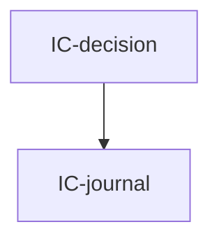

# inbox-core — Tasks

## Tracker Index

| Task-ID     | Title                                                     | Dependencies | Status   | Reopens |
| ----------- | --------------------------------------------------------- | ------------ | -------- | ------- |
| IC-journal  | Bootstrap: журнал событий + per-MR layout                 | —            | [ ] TODO | —       |
| IC-decision | inbox-core: датасет решений + барьер готовности + dry-run | IC-journal   | [ ] TODO | —       |
| IC-state    | Canonical review state and accumulated change batches     | AI-roots     | [ ] TODO | —       |

## Slug Registry

<!-- один ID на строку; уникальность держится этим списком — одинаковый ID в двух ветках сталкивается здесь при merge. Только добавление. -->

- IC-journal
- IC-decision
- IC-state

## Intra-Module DAG

<!-- ребро A → B = «A зависит от B». Кросс-модульные рёбра живут уровнем выше. -->

## Decision Log (module-task level)

<!-- решения декомпозиции/планирования; локальные решения исполнения — в Decision Log самих тикетов. -->

## Conventions

Проектные конвенции объявлены в `specs/3-tasks.md` и наследуются — здесь не повторяются.
