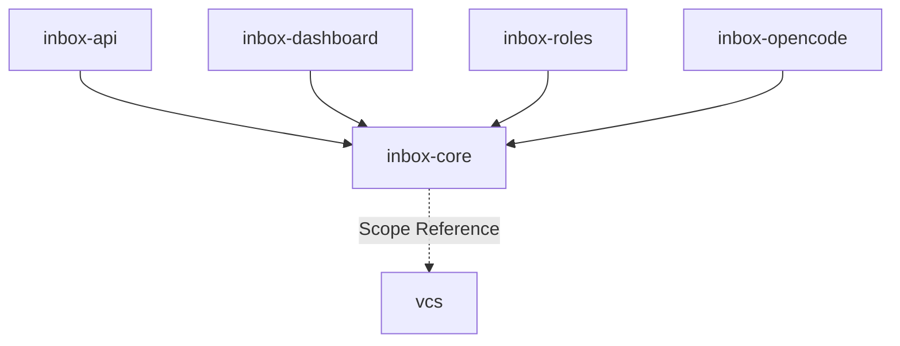

# Module: inbox-core

> Parent scope: [`../agent-inbox.spec.md`](../agent-inbox.spec.md)

<!--SECTION:MODULE_VISION-->

## 1. Module Vision

Фундамент agent-inbox. Общее состояние (config, registry, audit) и VCS-интеграция.
Переиспользуется и CLI, и serve-режимом. Все остальные модули зависят от inbox-core.

<!--/SECTION:MODULE_VISION-->

<!--SECTION:MODULE_USAGE_EXAMPLE-->

## 2. Module Usage Example

```ts
import { StateStore, VcsInboxMock, VcsInboxReal } from '@/inbox-core';

const store = new StateStore({ stateDir: '~/.gennady' });

// dev/e2e: мок-данные
const vcs = new VcsInboxMock();
vcs.seed({ mrs: [...], contexts: {...} });

// production: реальный VCS
// const vcs = new VcsInboxReal({ config, token });

const mrs = await vcs.getActionable();

// дельта
const registry = await store.loadRegistry();
registry.updateDelta(mrs);
await store.saveRegistry(registry);

// ошибки структурированы
// NETWORK → retry, AUTH → проверить токен, NOT_FOUND → MR удалён
```

<!--/SECTION:MODULE_USAGE_EXAMPLE-->

<!--SECTION:ENTITY_INVENTORY-->

## 3. Entity Inventory (Closed-World)

_Это полный список сущностей модуля. Любое введение сущности execution-агентом помимо этого списка считается drift'ом и требует обновления spec._

| Name            | Type         | Purpose                                                                  |
| --------------- | ------------ | ------------------------------------------------------------------------ |
| `InboxConfig`   | Value Object | Конфиг: reposBase, vcsHost. Structured signal `configured: false`.       |
| `InboxRegistry` | Value Object | Реестр MR: дельта (NEW/↑/idle), candidateHeadSha, lastReviewedHeadSha.   |
| `AuditLog`      | Value Object | JSON Lines лог событий serve-режима. Append-only.                        |
| `StateStore`    | Service      | Единая точка доступа к файлам состояния. Атомарность, миграции.          |
| `VcsInboxPort`  | Port         | Абстракция VCS: `getActionable()`, `getMrContext()`, `getDiscussions()`. |
| `VcsInboxMock`  | Adapter      | Реализация `VcsInboxPort` на мок-данных (для разработки и e2e).          |
| `VcsInboxReal`  | Adapter      | Реализация `VcsInboxPort` через vcs-client (GitLab/GitHub).              |

<!--/SECTION:ENTITY_INVENTORY-->

<!--SECTION:ENTITY_SURFACES-->

## 4. Entity Surfaces

### `InboxConfig`

- **Type:** Value Object
- **Purpose:** Конфиг agent-inbox: reposBase, vcsHost. Структурированный сигнал при отсутствии.
- **Public Properties:** `reposBase: string`, `vcsHost: string`, `configured: boolean`
- **Public Operations:**
  - `load()` — читает `config.json`, валидирует структуру, возвращает InboxConfig или `{ configured: false, missing: [...] }`
  - `save(partial)` — атомарно обновляет ключи
  - `unset(key)` — удаляет ключ
- **Lifecycle:** Создаётся StateStore при старте, перечитывается при изменении.
- **Errors & Degradation:** Повреждённый JSON → `configured: false` (не ошибка). Нечитаемый файл → `CONFIG` error (AI-22).
- **Consumers:** Internal — `StateStore`, `inbox-api`; External — CLI `inbox config`.

### `InboxRegistry`

- **Type:** Value Object
- **Purpose:** Реестр MR: дельта, stage, headSha для отслеживания изменений.
- **Public Properties:** `entries: Record<webUrl, { project, iid, role, stage, lastSeenUpdatedAt, firstSeenAt, lastClassifiedAt, lastReviewedHeadSha?, lastApprovedHeadSha? }>`
- **Public Operations:**
  - `load()` — читает `inbox-registry.json`
  - `updateDelta(mrs)` — вычисляет дельту: NEW / ↑ / idle
  - `promoteReviewedHeadSha(webUrl)` — финализация разбора
  - `save()` — атомарная запись
- **Lifecycle:** Загружается при старте. Обновляется при каждом getActionable.
- **Errors & Degradation:** Файл отсутствует → пустой реестр (не ошибка).
- **Consumers:** Internal — `VcsInbox`, `inbox-roles`; External — CLI `inbox --json`.

### `AuditLog`

- **Type:** Value Object
- **Purpose:** JSON Lines лог событий serve-режима. Только serve, не CLI.
- **Public Properties:** Записи: `{ ts, mr, role, event, detail }`
- **Public Operations:**
  - `append(event)` — дописывает строку в `audit.jsonl`
  - `query(mr)` — читает все события по MR
  - `rotate()` — ротация при превышении размера
- **Lifecycle:** Создаётся при первом событии serve. Append-only.
- **Errors & Degradation:** Ошибка записи → логгируется, не блокирует.
- **Consumers:** Internal — `inbox-api`; External — none.

### `StateStore`

- **Type:** Service
- **Purpose:** Единая точка доступа к файловому состоянию `~/.gennady/agent-inbox/`.
- **Public Operations:**
  - `getStateDir()` → `string` — корень состояния (`~/.gennady` по умолчанию, `--state-dir` переопределяет). Единственный источник пути для всего, что пишется на диск (NFC-05): рабочие/сессионные директории узлов, worktrees, отчёты строятся от него, не от `os.tmpdir()`.
  - `loadConfig()` → `InboxConfig`
  - `saveConfig(partial)` → void
  - `loadRegistry()` → `InboxRegistry`
  - `saveRegistry(registry)` → void
  - `loadAuditLog()` → `AuditLog`
  - `appendAudit(event)` → void
  - `queryAudit(mr)` → `AuditEntry[]`
- **Lifecycle:** Singleton, инициализируется при старте.
- **Errors & Degradation:** Ошибка записи → error code (AI-22).
- **Consumers:** Internal — все модули agent-inbox; External — CLI-команды.

### `VcsInboxPort`

- **Type:** Port
- **Purpose:** Абстракция доступа к VCS (GitLab/GitHub). Позволяет подменить real → mock для тестов.
- **Public Operations:**
  - `getActionable()` → `ActionableMr[]`
  - `getMrContext(webUrl)` → `MrContext`
  - `getDiscussions(webUrl, opts)` → `Discussion[]`
- **Consumers:** Internal — `inbox-roles`, `inbox-api`, CLI-команды.

### `VcsInboxMock`

- **Type:** Adapter
- **Implements:** `VcsInboxPort`
- **Purpose:** Мок-реализация VCS для разработки дашборда и e2e-тестов. Возвращает предзагруженные данные.
- **Public Operations:**
  - `seed(mrs, contexts)` — загрузить мок-данные
  - `getActionable()` — возвращает seeded MR
- **Lifecycle:** Создаётся с начальными данными. Используется только в dev/e2e-окружении.
- **Consumers:** DI-контейнер (внедряется вместо VcsInboxReal).

### `VcsInboxReal`

- **Type:** Adapter
- **Implements:** `VcsInboxPort`
- **Purpose:** Реальная VCS-интеграция через существующий `vcs-client`. Provider-agnostic. Без кэша.
- **Public Operations:**
  - `getActionable()` → `ActionableMr[]`
  - `getMrContext(webUrl)` → `MrContext`
  - `getDiscussions(webUrl, opts)` → `Discussion[]`
- **Lifecycle:** Зависит от InboxConfig и токена.
- **Errors & Degradation:** `NETWORK` / `AUTH` / `RATE_LIMIT` / `NOT_FOUND` (AI-22).
- **Consumers:** Internal — `inbox-roles`, `inbox-api`; External — CLI `inbox`, `inbox-context`.
<!--/SECTION:ENTITY_SURFACES-->

<!--SECTION:MODULE_CONTRACTS-->

## 5. Module Contracts (DbC)

### Port: `VcsInboxPort`

- **Runtime Backing:** `real-runtime` (VcsInboxReal), `simulation` (VcsInboxMock)
- **Verification Levels:** `contract`, `unit`, `integration`
- **Deferred Runtime Scope:** None

**Contract (DbC):**

- **Preconditions:** `InboxConfig.configured === true` (только для VcsInboxReal)
- **Postconditions:**
  - `getActionable()` → `ActionableMr[]` (может быть пустым)
  - `getMrContext(webUrl)` → `MrContext`
  - `getDiscussions(webUrl)` → `Discussion[]`
- **Invariants:**
  - VcsInboxMock: возвращает seeded данные, детерминирован
  - VcsInboxReal: без кэша, каждый вызов = запрос к API

### Adapter: `VcsInboxMock`

- **Implements:** `VcsInboxPort`
- **Runtime Backing:** `simulation`
- **Verification Levels:** `unit`
- **Side Effects:** None (чистые данные из памяти)

### Adapter: `VcsInboxReal`

- **Implements:** `VcsInboxPort`
- **Runtime Backing:** `real-runtime`
- **Verification Levels:** `integration`
- **Side Effects:** HTTPS-запросы к GitLab/GitHub API. Нормализация ответов.
- **Errors:** `NETWORK` / `AUTH` / `RATE_LIMIT` / `NOT_FOUND` (AI-22).

### Service: `StateStore`

- **Runtime Backing:** `real-runtime`
- **Verification Levels:** `contract`, `unit`, `integration`
- **Deferred Runtime Scope:** None

**Contract (DbC):**

- **Preconditions:**
  - `stateDir` — абсолютный путь, существует или будет создан
  - Вызов `save*` только после успешного `load*`
- **Postconditions:**
  - После `saveConfig` — `config.json` записан атомарно (tmp + rename)
  - После `saveRegistry` — `inbox-registry.json` записан атомарно
  - После `appendAudit` — одна строка дописана в `audit.jsonl`
  - `loadConfig` при отсутствии файла → `{ configured: false, missing: [...] }`
  - `loadRegistry` при отсутствии файла → пустой реестр
- **Invariants:**
  - config.json, registry.json, audit.jsonl — валидный JSON после атомарной записи
  - Повреждённый config.json → `{ configured: false }`, исходный файл не модифицируется
  - Несовместимый version → `CONFIG` error

### Service: `InboxRegistry`

- **Runtime Backing:** `real-runtime`
- **Verification Levels:** `contract`, `unit`
- **Deferred Runtime Scope:** None

**Contract (DbC):**

- **Preconditions:**
  - `updateDelta(mrs)` — mrs из `VcsInbox.getActionable()`
  - `promoteReviewedHeadSha(webUrl)` — запись существует
- **Postconditions:**
  - MR нет в реестре → `NEW`
  - `lastSeenUpdatedAt` изменился → `↑`
  - `lastSeenUpdatedAt` не изменился → `idle`
  - `promoteReviewedHeadSha` → обновляет `lastReviewedHeadSha`
- **Invariants:**
  - Один webUrl = одна запись
  - `lastReviewedHeadSha` не может быть новее `lastSeenUpdatedAt`
  <!--/SECTION:MODULE_CONTRACTS-->

<!--SECTION:PUBLIC_OPTIONS-->

## 6. Public Options & Policies

| Option      | Bound To                 | Status                                                    |
| ----------- | ------------------------ | --------------------------------------------------------- |
| `stateDir`  | `StateStore` constructor | active — `~/.gennady` default, override via `--state-dir` |
| `reposBase` | `InboxConfig`            | active — из config.json или `--repos-base` флага          |
| `vcsHost`   | `InboxConfig`            | active — из config.json или `--vcs-host` флага            |

<!--/SECTION:PUBLIC_OPTIONS-->

<!--SECTION:FILE_STRUCTURE-->

## 7. File Structure

```
services/agent-inbox/modules/inbox-core/
├── inbox-config.ts          # InboxConfig: load, save, validate
├── inbox-registry.ts        # InboxRegistry: load, delta, promote, save
├── audit-log.ts             # AuditLog: append, query, rotate
├── state-store.ts           # StateStore: единая точка доступа
├── vcs-inbox.port.ts        # VcsInboxPort: абстракция
├── vcs-inbox.mock.ts        # VcsInboxMock: мок-реализация
├── vcs-inbox.real.ts        # VcsInboxReal: vcs-client интеграция
├── errors.ts                # Коды ошибок (AI-22)
├── __tests__/
│   ├── inbox-config.test.ts
│   ├── inbox-registry.test.ts
│   ├── audit-log.test.ts
│   ├── state-store.test.ts
│   ├── vcs-inbox.mock.test.ts
│   └── vcs-inbox.port.test.ts
```

**File Mapping:**

- `inbox-config.ts` — `InboxConfig`
- `inbox-registry.ts` — `InboxRegistry`
- `audit-log.ts` — `AuditLog`
- `state-store.ts` — `StateStore`
- `vcs-inbox.port.ts` — `VcsInboxPort`
- `vcs-inbox.mock.ts` — `VcsInboxMock`
- `vcs-inbox.real.ts` — `VcsInboxReal`
- `errors.ts` — Error codes
<!--/SECTION:FILE_STRUCTURE-->

<!--SECTION:MODULE_DECISION_LOG-->

## 8. Module Decision Log

- `InboxRegistry.updateDelta()` mutates in-memory registry: sets `lastSeenUpdatedAt` / `firstSeenAt` for NEW entries, updates `lastSeenUpdatedAt` for ↑ entries — avoids rebuild of entire registry on every tick
- `VcsInboxReal._resolveInboxClient()` — provider-aware client factory that resolves the correct vcs-client implementation at call time; throws for unsupported providers (e.g. GitHub)
- All `VcsInboxReal` methods (`getActionable`, `getMrContext`, `getDiscussions`) use `_resolveInboxClient()` for identity lookups — single resolution point per operation
- `AuditLog`: serial lock via Promise chain prevents TOCTOU rotation race — consecutive appends queued sequentially, avoiding interleaved writes during rotation
- `AuditLog.query()`: sort by `Date.getTime()` (numeric comparison), not lexicographic `localeCompare` — ensures correct chronological order regardless of timezone format

<!--/SECTION:MODULE_DECISION_LOG-->

<!--SECTION:INTER_MODULE_DEPENDENCIES-->

## 9. Inter-Module Dependencies

- **Depends on:** none (фундамент)
- **Scope Reference (cross-scope):** `vcs` (`../../vcs/vcs.spec.md`) — VcsClient inbox/discussions/identity
- **Provides to:** `inbox-api`, `inbox-roles`, `inbox-dashboard`, `inbox-opencode`



<!--/SECTION:INTER_MODULE_DEPENDENCIES-->

<!--SECTION:HANDOFF-->

## 10. Handoff to task-scaffolding

- **Implementation files to be created:** 6 файлов (см. File Structure)
- **Test files to be created:** 5 файлов (см. `__tests__/`)
- **Stack dependencies:**
  - Language: TypeScript (resolves to `ai/directives/coding/typescript-rules.xml`)
  - Test framework: node:test (resolves to `ai/directives/testing/node-test.xml`)
- **Module Rules Additions:** None
- **Open risks:** None
<!--/SECTION:HANDOFF-->
