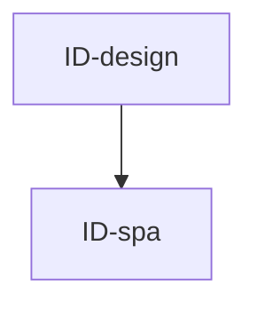

# inbox-dashboard — Tasks

## Tracker Index

| Task-ID    | Title                                                                      | Dependencies                              | Status   | Reopens |
| ---------- | -------------------------------------------------------------------------- | ----------------------------------------- | -------- | ------- |
| ID-spa     | inbox-dashboard: загрузка / доска / лента / чат-колонка                    | IA-rest-sse, AI-seed                      | [ ] TODO | —       |
| ID-design  | inbox-dashboard: приведение UI к Carbon & Steel (design-system compliance) | ID-spa                                    | [x] DONE | —       |
| ID-cockpit | Carbon & Steel operator dashboard and MR workspace                         | IC-handoff, IA-proj, IM-cases, AI-cutover | [ ] TODO | —       |

## Slug Registry

<!-- один ID на строку; уникальность держится этим списком — одинаковый ID в двух ветках сталкивается здесь при merge. Только добавление. -->

- ID-spa
- ID-design
- ID-cockpit

## Intra-Module DAG

<!-- ребро A → B = «A зависит от B». Кросс-модульные рёбра живут уровнем выше. -->

## Decision Log (module-task level)

<!-- решения декомпозиции/планирования; локальные решения исполнения — в Decision Log самих тикетов. -->

## Conventions

Проектные конвенции объявлены в `specs/3-tasks.md` и наследуются — здесь не повторяются.
