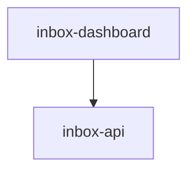

# Module: inbox-dashboard

> Parent scope: [`../agent-inbox.spec.md`](../agent-inbox.spec.md)

<!--SECTION:MODULE_VISION-->

## 1. Module Vision

React SPA дашборд serve-режима: очередь «Ждут меня» + Kanban-обзор по ролям (read-only, D-80).
shadcn/ui (Tailwind v4), тёмная тема, компактный дизайн, hash-роутер. Общается с inbox-api через REST.
Собирается Vite, раздаётся как статика.

**Review Chat (refine — D-87…D-106):** экран `#/mr/:id` получает постоянный вертикальный
сплит справа — «Кандидаты» (существующий `ActionPanel`, сверху) + «Чат» (новый `ChatPanel`,
снизу), ничего не спрятано за вкладкой (D-87, NFC-CH-visible). Плавающая пилюля выделения
(`SelectionPill`) работает над любой панелью экрана. На узком viewport сплит складывается в
одну панель с ВСЕГДА-видимым сегментным переключателем (`ViewSwitch`, D-106).

<!--/SECTION:MODULE_VISION-->

<!--SECTION:MODULE_USAGE_EXAMPLE-->

## 2. Module Usage Example

```tsx
// App — hash-роутер (#/ и #/mr/:id)
function App() {
  return (
    <BoardStore>
      <HashRouter>
        <Route path="/" component={BoardPage} />
        <Route path="/mr/:id" component={MrDetailPage} />
      </HashRouter>
    </BoardStore>
  );
}

// BoardPage — запрашивает /api/board, рендерит очередь + блоки ролей
function BoardPage() {
  const { board } = useBoard();
  return (
    <div className="p-4">
      <Header />
      <AwaitingQueue />
      {board.roles.map((role) => (
        <RoleBlock key={role.name} role={role} />
      ))}
      <UnassignedBlock mrs={board.unassigned} />
    </div>
  );
}

// MrDetailPage right column — permanent split (D-87) или single-pane switch на узком viewport (D-106)
function MrDetailRightColumn({ mrId }: { mrId: string }) {
  const narrow = useNarrowViewport();
  if (!narrow) {
    return (
      <div className="flex flex-col h-full">
        <ActionPanel mrId={mrId} /> {/* «Кандидаты», сверху, D-87 */}
        <ChatPanel mrId={mrId} /> {/* «Чат», снизу, D-87 */}
      </div>
    );
  }
  const [view, setView] = useState<'candidates' | 'chat'>('candidates');
  return (
    <div className="flex flex-col h-full">
      <ViewSwitch value={view} onChange={setView} /> {/* сегментный переключатель, ВСЕГДА виден */}
      {view === 'candidates' ? <ActionPanel mrId={mrId} /> : <ChatPanel mrId={mrId} />}
    </div>
  );
}

// SelectionPill — над любой панелью экрана, прикрепляет выделение как ContextChip в композер
// клик «Спросить · В контекст» → фокусирует ChatComposer с прикреплённым чипом (CH-01)
```

<!--/SECTION:MODULE_USAGE_EXAMPLE-->

<!--SECTION:ENTITY_INVENTORY-->

## 3. Entity Inventory (Closed-World)

| Name                   | Type      | Purpose                                                                                                                                                             |
| ---------------------- | --------- | ------------------------------------------------------------------------------------------------------------------------------------------------------------------- |
| `BoardPage`            | Component | Корневая страница: шапка, блоки ролей, polling API каждые 30s.                                                                                                      |
| `Header`               | Component | Шапка дашборда: заголовок «agent-inbox», статус OpenCode (🟢/⚠), интервал polling.                                                                                  |
| `UnassignedBlock`      | Component | Блок «БЕЗ РОЛИ»: список карточек MR без назначенной роли, кнопка «Назначить ▼».                                                                                     |
| `RoleBlock`            | Component | Блок роли: заголовок, Kanban-дорожки. Сворачиваемый.                                                                                                                |
| `AwaitingQueue`        | Component | Очередь «Ждут меня»: закреплена сверху, все MR в AWAITING ME со всех ролей, ведёт на `#/mr/:id`.                                                                    |
| `KanbanLane`           | Component | Дорожка (INBOX/PROGRESS/AWAITING/DONE), read-only обзор (D-80). Принимает карточки.                                                                                 |
| `MrCard`               | Component | Карточка MR: проект, номер, время ожидания, статус-узел графа + прогресс дорожек. Клик — переход на `#/mr/:id`.                                                     |
| `MrDetailPage`         | Component | Экран `#/mr/:id`: браузер артефактов слева; справа постоянный сплит `ActionPanel`↑/`ChatPanel`↓ (D-87) либо `ViewSwitch` + одна панель на узком viewport (D-106).   |
| `ArtifactBrowser`      | Component | Навигация по артефактам (REPORT/PLAN/дорожки/HISTORY/coverage/tool-log) + рендер выбранного через `ArtifactView`.                                                   |
| `ArtifactView`         | Component | Рендер одного артефакта: markdown + mermaid через рендерер (переиспользуется `ai/inspector/web`). Дорожка → находки/кандидаты/вердикт.                              |
| `ActionPanel`          | Component | Пакет действий: кандидаты чекбоксами + inline-правка текста; кнопки `[✓ Постить выбранное] [✓ Approve (гейт)] [↺ Дослать] [✕ Skip]`.                                |
| `ChatPanel`            | Component | Панель Review Chat: `ChatThread` + `ChatComposer`, постоянно видна снизу «Кандидат» (D-87). Живой refresh при mutation/SSE.                                         |
| `ChatThread`           | Component | Скроллбэк ходов диалога; активный стрим — в `aria-live`-регионе (NFC-CH-a11y, CH-02/CH-03).                                                                         |
| `ChatComposer`         | Component | Ввод вопроса + removable контекст-чипы (CH-12) + индикатор бюджета токенов + кнопка Send↔Stop (CH-11); отключена на время генерации.                                |
| `MutationProposalCard` | Component | Диф-превью одной предложенной мутации (до→после, provenance-тег при инъекции из MR-текста) + `[Применить] [Отклонить]` + `[↺ Undo]` после применения (CH-09/CH-10). |
| `SelectionPill`        | Component | Плавающая пилюля «Спросить · В контекст» под выделением в любой панели экрана; debounced post-mouseup + клавиатурный триггер (CH-01, NFC-CH-a11y).                  |
| `ViewSwitch`           | Component | Сегментный переключатель Кандидаты\|Чат на узком viewport экрана `#/mr/:id`, всегда виден (не скрытое меню, D-106).                                                 |
| `ApiClient`            | Service   | HTTP-клиент: board / assign / action / report / **artifacts / artifact** / audit.                                                                                   |
| `BoardStore`           | Service   | React Context: состояние доски, polling, optimistic updates.                                                                                                        |
| `ChatApiClient`        | Service   | HTTP+SSE-клиент Review Chat: `postTurn`/`stop`/`mutate`/`undo` + подписка на SSE-канал MR (токены + mutation/refresh, D-100).                                       |

<!--/SECTION:ENTITY_INVENTORY-->

<!--SECTION:ENTITY_SURFACES-->

## 4. Entity Surfaces

### `BoardPage`

- **Type:** Component
- **Purpose:** Корневая страница (`#/`). Header + AwaitingQueue + список RoleBlock + UnassignedBlock.
- **State:** `roles: RoleView[]`, `unassigned: MrCard[]`, `awaiting: MrCard[]`, `loading`, `error`
- **Lifecycle:** Монтируется → polling каждые 30s → размонтируется.
- **Consumers:** Entry point React app.

### `RoleBlock`

- **Type:** Component
- **Purpose:** Блок одной роли с Kanban-дорожками.
- **Props:** `role: RoleView` (name, active, lanes: { inbox, progress, awaiting, done })
- **State:** свёрнут/развёрнут
- **Consumers:** `BoardPage`.

### `AwaitingQueue`

- **Type:** Component
- **Purpose:** Рабочая очередь оператора: все MR в AWAITING ME со всех ролей одним списком, закреплена над доской. Карточка ведёт на `#/mr/:id`.
- **Props:** `cards: MrCard[]` (агрегируется из lanes.awaitingMe всех ролей)
- **Consumers:** `BoardPage`.

### `KanbanLane`

- **Type:** Component
- **Purpose:** Одна колонка Kanban, read-only обзор (колонки переводит движок по графу роли — D-80).
- **Props:** `title`, `cards: MrCard[]`, `accentClass?`
- **Consumers:** `RoleBlock`.

### `MrCard`

- **Type:** Component
- **Purpose:** Карточка MR с ключевой информацией.
- **Props:** `mr: { project, iid, title, timeWaiting, state, prevState, actions[] }`
- **Consumers:** `KanbanLane`, `UnassignedBlock`.

### `MrDetailPage`

- **Type:** Component
- **Purpose:** Экран `#/mr/:id`: слева `ArtifactBrowser` (навигация + рендер); справа
  постоянный вертикальный сплит `ActionPanel` («Кандидаты», сверху) + `ChatPanel` («Чат»,
  снизу) — ничего не спрятано за вкладкой (D-87). На узком viewport сплит складывается в
  одну панель, переключаемую ВСЕГДА-видимым `ViewSwitch` (D-106, параллель NFC-SV-03). URL —
  deep-link для нотификаций.
- **Props:** `mrId` из маршрута
- **State:** `detail`, `artifacts`, выбранный артефакт, выбор кандидатов, `loading`/`error`;
  дополнительно — `narrowViewport: boolean` (управляет сплит vs single-pane), `activeView:
'candidates' | 'chat'` (только на узком viewport). Подписывается на SSE-канал MR (через
  `ChatApiClient`) — событие `refresh` перечитывает `detail`/`artifacts` (живой refresh при
  мутации из чата, §5.2 родительской спеки).
- **Consumers:** Роутер (`#/mr/:id`); переход с `MrCard`/`AwaitingQueue`.

### `ArtifactBrowser`

- **Type:** Component
- **Purpose:** Список артефактов из `GET /api/mr/:id/artifacts` (REPORT по умолчанию, PLAN, дорожки, HISTORY, coverage/tool-log); клик → `ArtifactView`.
- **Props:** `mrId`, `artifacts: ArtifactRef[]`
- **Consumers:** `MrDetailPage`.

### `ArtifactView`

- **Type:** Component
- **Purpose:** Рендер одного артефакта: markdown + mermaid через рендерер (переиспользуется из `ai/inspector/web`, не пишем с нуля). Для дорожки — находки (file:line), кандидаты, вердикт, coverage ledger, tool-call лог.
- **Props:** `content`, `kind`
- **Consumers:** `ArtifactBrowser`.

### `ActionPanel`

- **Type:** Component
- **Purpose:** Финальный пакет. Reviewer: `[✓ Постить выбранное] [✓ Approve MR] [↺ Дослать] [✕ Skip]`, Approve активна только без блокирующих находок (гейт, AI-13). Author (свой MR): `[✓ Опубликовать черновики] [✓ 👍-реакции] [📋 Копировать задание (FIX_TASK.md)] [✎ Обновить описание MR] [↺ Дослать] [✕ Skip]` — без Approve. Кандидаты чекбоксами + inline-правка; «Дослать» открывает поле фокуса раунда.
- **Props:** `question: OperatorQuestion`, `candidates`
- **Consumers:** `MrDetailPage`; отправляет `POST /api/mr/:id/action`.

### `ChatPanel`

- **Type:** Component
- **Purpose:** Постоянная нижняя часть сплита `MrDetailPage` (D-87). Композиция `ChatThread`
  (скроллбэк) + `ChatComposer` (ввод). Подписывается на SSE-канал MR через `ChatApiClient` —
  токены хода, завершённый ход, предложенные мутации.
- **Props:** `mrId`
- **State:** `turns: ChatTurn[]` (рехидратируется с сервера при монтировании — D-97),
  `activeChips: ContextChip[]`, `streaming: boolean`, `pendingMutations: MutationProposal[]`.
- **Consumers:** `MrDetailPage`, `ViewSwitch` (single-pane view).

### `ChatThread`

- **Type:** Component
- **Purpose:** Список завершённых `ChatTurn` + активный стримящийся ход. Активный ход — в
  `aria-live="polite"`-регионе, чтобы скринридер озвучивал токены по мере поступления
  (NFC-CH-a11y). Каждый ход с `mutations` рендерит `MutationProposalCard` под ответом.
- **Props:** `turns: ChatTurn[]`, `streamingText?: string`
- **Consumers:** `ChatPanel`.

### `ChatComposer`

- **Type:** Component
- **Purpose:** Поле ввода вопроса + ряд `ContextChip` (удаляемых по hover→✕, CH-12) +
  индикатор бюджета токенов + кнопка `Send`, переключающаяся в `Stop` во время генерации
  (CH-11). Композер отключён на время хода — новый вопрос не уходит параллельно (D-104).
- **Props:** `chips: ContextChip[]`, `disabled: boolean` (во время стрима), `tokenBudget: { used, limit }`
- **Consumers:** `ChatPanel`; отправляет `POST /api/mr/:id/chat` / `POST /api/mr/:id/chat/stop`
  через `ChatApiClient`.

### `MutationProposalCard`

- **Type:** Component
- **Purpose:** Диф-превью одной предложенной мутации (кандидат до→после, либо удаление
  подсвечено) с provenance-тегом «grounded in MR text: `<quote>`», если понижение/удаление
  выведено из недоверенного MR-текста (CH-09, D-98) — человек-гейт видит возможную инъекцию
  ДО клика. Кнопки `[Применить] [Отклонить]`; после применения — `[↺ Undo]` (CH-10).
- **Props:** `proposal: MutationProposal`, `status: 'pending' | 'applied' | 'rejected'`
- **Consumers:** `ChatThread`; отправляет `POST /api/mr/:id/mutate` / `POST /api/mr/:id/chat/undo`
  через `ChatApiClient`.

### `SelectionPill`

- **Type:** Component
- **Purpose:** Плавающая пилюля «Спросить · В контекст», всплывает под выделением текста в
  ЛЮБОЙ панели экрана `#/mr/:id` (центральный артефакт, боковой список, строка кандидата) —
  паттерн Notion/Google Docs/ChatGPT «attach selection» (CH-01). Триггер: debounced
  post-mouseup при непустом выделении (не мешает нативному копированию); клавиатурный
  триггер — для тех, кто не выделяет мышью (NFC-CH-a11y).
- **Props:** `selection: { text, source }`, `onAttach: (chip: ContextChip) => void`
- **Consumers:** `ArtifactView`, `ArtifactBrowser`, `ActionPanel` (любая панель с выделяемым
  текстом); клик прикрепляет чип в `ChatComposer` и фокусирует ввод.

### `ViewSwitch`

- **Type:** Component
- **Purpose:** Сегментный переключатель «Кандидаты | Чат» на узком viewport экрана
  `#/mr/:id` — ВСЕГДА виден (не скрытое меню, дух NFC-CH-visible сохранён на мобильном,
  D-106). Параллель складыванию Kanban-колонок (NFC-SV-03).
- **Props:** `value: 'candidates' | 'chat'`, `onChange`
- **Consumers:** `MrDetailPage` (только когда `narrowViewport === true`).

### `ApiClient`

- **Type:** Service
- **Purpose:** HTTP-клиент к inbox-api.
- **Public Operations:** `getBoard()`, `assignMr(mrId, role, rights?)`, `actionMr(mrId, action)`, `getReport(mrId)`, `listArtifacts(mrId)`, `readArtifact(mrId, path)`, `getAudit(mrId)`
- **Consumers:** `BoardStore`, `MrDetailPage`.

### `BoardStore`

- **Type:** Service
- **Purpose:** React Context + useReducer. Хранит состояние доски, управляет polling.
- **Public Operations:** `refresh()`, `assignMr(...)`, `executeAction(...)`
- **Consumers:** Все компоненты через контекст.

### `ChatApiClient`

- **Type:** Service
- **Purpose:** HTTP+SSE-клиент Review Chat. Открывает один SSE-канал на MR
  (`GET /api/mr/:id/chat/stream`) — токены хода, завершённый ход, mutation/refresh-события
  вещаются ВСЕМ клиентам этого MR, не только инициатору действия (D-100, multi-tab
  consistency).
- **Public Operations:**
  - `postTurn(mrId, { text, chips })` → ставит ход (ответ приходит через SSE, не в теле)
  - `stop(mrId)` → прерывает текущий ход (CH-11)
  - `mutate(mrId, proposal, revision)` → `{ ok, snapshot } | { ok: false, error: 'STALE_REVISION' }`
  - `undo(mrId, snapshotId)` → откат к снапшоту
  - `subscribe(mrId, handlers)` → подписка на SSE-кадры (`token`/`turn_done`/`mutation`/`refresh`/`error`)
- **Lifecycle:** Создаётся при монтировании `MrDetailPage`/`ChatPanel`; закрывает SSE-соединение
  при размонтировании.
- **Errors & Degradation:** Разрыв SSE → переподключение с backoff; `STALE_REVISION` на
  мутации → баннер «MR обновился в фоне, обновите панель» (D-99/D-101), не тихий сбой.
- **Consumers:** `ChatPanel`, `MrDetailPage`.
<!--/SECTION:ENTITY_SURFACES-->

<!--SECTION:MODULE_CONTRACTS-->

## 5. Module Contracts (DbC)

Бизнес-логика дашборда минимальна — компоненты отображают данные, полученные от API.
Контракты на уровне компонентов и визуальной структуры:

- **Invariants:**
  - Карточка всегда показывает `prevState → state` переход
  - Каждые 30s polling — при неизменном JSON (same-данные) → без перерисовки
  - Оптимистичные обновления: действие → сразу UI + rollback при ошибке

- **Визуальная структура (ARIA-снапшоты):**
  - Дашборд содержит `banner` с заголовком «agent-inbox» и статусом OpenCode/polling
  - Каждая роль обёрнута в `region` с `heading` (название роли) и меткой «активна»/«не активна»
  - Внутри роли — 4 `region` (INBOX → IN PROGRESS → AWAITING ME → DONE) с `list` карточек
  - Карточка MR: `listitem` с текстом `{project} !{iid} · {time}`, кнопкой «Смотреть»
  - Роль «БЕЗ РОЛИ» — отдельный `region` для неназначенных MR

- **Экран `#/mr/:id` (браузер артефактов):**
  - Слева навигация артефактов (`ArtifactBrowser`), справа рендер (`ArtifactView`) + `ActionPanel`
  - Все md/mermaid рендерятся (не сырой текст); mermaid валиден (гейт на записи гарантирует)
  - Дорожка раскрывается в находки (file:line) / кандидаты / вердикт / coverage / tool-call лог
  - `ActionPanel`: кандидаты чекбоксами + inline-правка; Approve с гейтом; «Дослать» = раунд

- **Пространственные отношения (layout):**
  - Колонки внутри роли слева направо: INBOX, PROGRESS, AWAITING, DONE
  - Блоки ролей друг под другом, порядок: активные → неактивные → «БЕЗ РОЛИ»
  - Карточки MR равной ширины внутри колонки
  - Статус карточки = текущий узел графа + прогресс дорожек (напр. «security ✓, logic ⏳ 3/6»)

### Review Chat — визуальные и поведенческие инварианты (D-87…D-106)

- **Invariants:**
  - Правая колонка `#/mr/:id` — ВСЕГДА `ActionPanel` (сверху) + `ChatPanel` (снизу) на
    широком viewport; никогда за вкладкой/скрытым меню (D-87, NFC-CH-visible).
  - На узком viewport — одна панель + `ViewSwitch`, сегментный переключатель ВСЕГДА виден
    (не скрыт за overflow-меню, D-106).
  - `ChatComposer` заблокирован (Send→Stop), пока ход in-flight — второй вопрос не уходит
    параллельно (D-104, CH-11).
  - Мутация применяется ТОЛЬКО явным кликом «Применить» на `MutationProposalCard` — никогда
    автоматически по мере стрима (CH-11, урок streaming-committed-before-yes).
  - Понижение/удаление кандидата с provenance «grounded in MR text» показывается в превью ДО
    клика Apply, не после (CH-09/D-98).
  - `STALE_REVISION` от `POST /api/mr/:id/mutate` → баннер «MR обновился в фоне», не тихий
    retry и не silent-drop (D-99).

- **Визуальная структура (ARIA-снапшоты):**
  - `ChatThread` — активный стримящийся ход внутри `aria-live="polite"` региона
    (NFC-CH-a11y); переиспользует ARIA/layout-хелперы того же теста-инструментария, что
    board-снапшоты выше (module `inbox-visual-testing`, Module Map #8 родительской спеки).
  - `SelectionPill` — доступна через клавиатурный триггер, не только mouse-selection
    (NFC-CH-a11y).
  - `ChatComposer` — `ContextChip` с ролью `listitem` внутри `list` чипов, удаление — кнопка
  с доступным именем «Убрать контекст».
  <!--/SECTION:MODULE_CONTRACTS-->

<!--SECTION:FILE_STRUCTURE-->

## 7. File Structure

```
services/agent-inbox/modules/inbox-dashboard/
├── App.tsx                   # Entry point + hash-роутер
├── dashboard-entry.tsx       # ReactDOM.createRoot
├── index.html                # SPA shell
├── vite.config.ts            # Vite + Tailwind v4 + inboxServePlugin
├── components/
│   ├── Header.tsx            # Шапка (заголовок + статус + ошибка)
│   ├── BoardPage.tsx         # Корневая страница (очередь + роли + unassigned)
│   ├── AwaitingQueue.tsx     # Очередь «Ждут меня» (агрегация AWAITING ME по ролям)
│   ├── RoleBlock.tsx         # Блок роли (заголовок + 4 колонки)
│   ├── KanbanLane.tsx        # Колонка Kanban (read-only, D-80)
│   ├── MrCard.tsx            # Карточка MR (кликабельна, «Смотреть» → #/mr/:id)
│   ├── UnassignedBlock.tsx   # Блок «БЕЗ РОЛИ» (неназначенные MR)
│   ├── MrDetailPage.tsx      # Страница #/mr/:id: браузер + постоянный сплит/single-pane
│   ├── ArtifactBrowser.tsx   # Навигация по артефактам
│   ├── ArtifactView.tsx      # Рендер md+mermaid (рендерер из ai/inspector/web)
│   ├── ActionPanel.tsx       # Пакет действий (кандидаты, approve-гейт, дослать)
│   ├── ChatPanel.tsx         # Панель Review Chat (ChatThread + ChatComposer)
│   ├── ChatThread.tsx        # Скроллбэк ходов + aria-live активный стрим
│   ├── ChatComposer.tsx      # Ввод + чипы + token-gauge + Send↔Stop
│   ├── MutationProposalCard.tsx # Диф-превью мутации + Apply/Reject/Undo
│   ├── SelectionPill.tsx     # Плавающая пилюля «Спросить · В контекст»
│   └── ViewSwitch.tsx        # Сегментный переключатель Кандидаты|Чат (узкий viewport)
├── services/
│   ├── api-client.ts         # ApiClient (fetch-обёртка)
│   ├── board-store.tsx       # BoardStore (React Context + polling 30s)
│   └── chat-api-client.ts    # ChatApiClient (fetch + SSE-подписка на канал MR)
├── styles/
│   └── index.css             # Tailwind v4 entry + тёмная тема
├── lib/
│   └── utils.ts              # clsx/twMerge helpers
└── __tests__/
    ├── BoardPage.test.tsx
    ├── AwaitingQueue.test.tsx
    ├── RoleBlock.test.tsx
    ├── MrCard.test.tsx
    ├── ChatPanel.test.tsx
    └── SelectionPill.test.tsx
```

**File Mapping:**

- `components/*.tsx` — компоненты
- `services/api-client.ts` — `ApiClient`
- `services/board-store.ts` — `BoardStore`
- `services/chat-api-client.ts` — `ChatApiClient`
<!--/SECTION:FILE_STRUCTURE-->

<!--SECTION:MODULE_DECISION_LOG-->

## 8. Module Decision Log

- **D-80: Kanban read-only** — колонки отображают состояние без drag-and-drop. Назначение ролей — через dropdown на карточке, действия оператора — через страницу `#/mr/:id` с OperatorQuestion. `@dnd-kit/*` удалён из зависимостей.
- **Dark theme** — тёмная тема в стиле Linear/Grafana: глубокий слейт `oklch(0.145)`, карточки чуть светлее фона, приглушённые границы, цветные акценты через полупрозрачность. `color-scheme: dark`.
- **Compact design** — шапка py-2 (15px заголовок), карточки p-2.5 (13px title, 11px meta), заголовки колонок 11px uppercase, сетка p-4/gap-2. Информации на экран больше, читаемость сохранена.
- **Visual hierarchy** — очередь «Ждут меня» с янтарной рамкой; счётчики колонок цветные (INBOX синий, AWAITING янтарный, DONE зелёный); кнопки в отчёте: зелёная солидная (Approve), остальные контурные.
- **Responsive** — колонки 4→2 на узком экране (`lg:grid-cols-4`), сетки карточек в очереди и «БЕЗ РОЛИ» — grid вместо flex-wrap.
- Poll countdown decrements correctly: `setPollCountdown(prev => prev <= 1 ? 30 : prev - 1)`
- Single-command dev startup: Vite plugin (`inboxServePlugin`) starts API server as sidecar
- Shared mock seed factory (`dev-seed.ts`) — единый источник мок-данных
- Playwright config: single `webServer` (Vite), API started by sidecar plugin

### D-112 — `ChatPanel` — постоянная нижняя половина сплита, не модалка/попап

- **Status:** active
- **Recorded:** session ModuleDecomposition, agent-inbox
- **Why:** Прямая реализация D-87 на уровне компонента: чат должен быть виден одновременно
  с «Кандидаты», не открываться поверх. Композиция в `MrDetailPage`, не отдельный роут —
  сохраняет один `#/mr/:id` deep-link (D-80).
- **Risk accepted:** None.
- **Rejected alternatives:** Модалка/drawer для чата — прячет диалог за действием, теряется
  одновременный обзор (ровно то, что отвергает D-87).

### D-113 — `SelectionPill` — общий компонент над всеми панелями, не per-panel копия

- **Status:** active
- **Recorded:** session ModuleDecomposition, agent-inbox
- **Why:** CH-01 требует одного паттерна выделения во ВСЕХ панелях (`ArtifactView`,
  `ArtifactBrowser`, `ActionPanel`). Один компонент, подписывающийся на `selectionchange`
  корня экрана, — не N копий с риском рассинхрона поведения/стиля.
- **Risk accepted:** None.
- **Rejected alternatives:** Своя пилюля в каждом компоненте — дублирование debounce/keyboard
  логики, риск несогласованного вида.

### D-114 — `ChatApiClient` отдельно от `ApiClient`, общий SSE-транспорт с `SseHub`

- **Status:** active
- **Recorded:** session ModuleDecomposition, agent-inbox
- **Why:** `ApiClient` — request/response REST к board/action/report; чат добавляет SSE
  (стриминг+broadcast) и другую форму ошибок (`STALE_REVISION`, `TURN_IN_FLIGHT`) — разная
  форма контракта оправдывает отдельный сервис (паритет с декомпозицией `inbox-api` на
  `ChatRouter`/`MutateRouter` отдельно от `BoardRouter`/`MrRouter`, D-91/D-111).
- **Risk accepted:** None.
- **Rejected alternatives:** Метод `chat()` на существующем `ApiClient` — смешивает
  fetch-only и SSE-жизненный цикл в одном сервисе.

<!--/SECTION:MODULE_DECISION_LOG-->

<!--SECTION:INTER_MODULE_DEPENDENCIES-->

## 9. Inter-Module Dependencies

- **Depends on:** `inbox-api` (REST)
- **Scope Reference (cross-scope):** None
- **Provides to:** None (конечный потребитель)



<!--/SECTION:INTER_MODULE_DEPENDENCIES-->

<!--SECTION:HANDOFF-->

## 10. Handoff to task-scaffolding

- **Implementation files to be created:** 26+ файлов (React SPA, API client, store, e2e harness;
  Review Chat добавляет 6 компонентов + `ChatApiClient`)
- **Test files to be created:** 6 unit (было 4 + `ChatPanel.test.tsx` + `SelectionPill.test.tsx`) + 21+ e2e (Playwright, чат-сценарии — расширение существующего набора)
- **Stack dependencies:**
  - Language: TypeScript + React 19 + JSX
  - UI: shadcn/ui (Tailwind v4), lucide-react (no dnd-kit — D-80)
  - Theme: dark (oklch), compact, responsive
  - Bundler: Vite + @tailwindcss/vite + @vitejs/plugin-react
  - Testing: @playwright/test
  - Formatter: Prettier
- **Module Rules Additions:** None

  | Rule | Category | Source |
  | ---- | -------- | ------ |
  | None | —        | —      |

- **Open risks & validation needs:**
  - `narrowViewport`-детект (D-106) должен использовать тот же брейкпоинт-подход, что
    существующий responsive Kanban (NFC-SV-03) — не изобретать второй.
  - `aria-live`-стрим (NFC-CH-a11y) — переиспользовать хелперы `inbox-visual-testing`
  (см. Module Map #8 родительской спеки); нет отдельного spec-файла модуля на момент этого
  рефайна — координировать при его материализации.
  <!--/SECTION:HANDOFF-->
