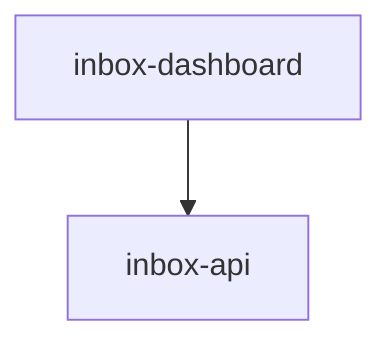

# Module: inbox-dashboard

> Parent scope: [`../agent-inbox.spec.md`](../agent-inbox.spec.md)

<!--SECTION:MODULE_VISION-->

## 1. Module Vision

React SPA дашборд serve-режима: очередь «Ждут меня» + Kanban-обзор по ролям (read-only, D-80).
shadcn/ui (Tailwind v4), тёмная тема, компактный дизайн, hash-роутер. Общается с inbox-api через REST.
Собирается Vite, раздаётся как статика.

<!--/SECTION:MODULE_VISION-->

<!--SECTION:MODULE_USAGE_EXAMPLE-->

## 2. Module Usage Example

```tsx
// App — hash-роутер (#/ и #/mr/:id)
function App() {
  return (
    <BoardStore>
      <HashRouter>
        <Route path="/" component={BoardPage} />
        <Route path="/mr/:id" component={MrDetailPage} />
      </HashRouter>
    </BoardStore>
  );
}

// BoardPage — запрашивает /api/board, рендерит очередь + блоки ролей
function BoardPage() {
  const { board } = useBoard();
  return (
    <div className="p-4">
      <Header />
      <AwaitingQueue />
      {board.roles.map((role) => (
        <RoleBlock key={role.name} role={role} />
      ))}
      <UnassignedBlock mrs={board.unassigned} />
    </div>
  );
}
```

<!--/SECTION:MODULE_USAGE_EXAMPLE-->

<!--SECTION:ENTITY_INVENTORY-->

## 3. Entity Inventory (Closed-World)

| Name              | Type      | Purpose                                                                                                                                   |
| ----------------- | --------- | ----------------------------------------------------------------------------------------------------------------------------------------- |
| `BoardPage`       | Component | Корневая страница: шапка, блоки ролей, polling API каждые 30s.                                                                            |
| `Header`          | Component | Шапка дашборда: заголовок «agent-inbox», статус OpenCode (🟢/⚠), интервал polling.                                                        |
| `UnassignedBlock` | Component | Блок «БЕЗ РОЛИ»: список карточек MR без назначенной роли, кнопка «Назначить ▼».                                                           |
| `RoleBlock`       | Component | Блок роли: заголовок, Kanban-дорожки. Сворачиваемый.                                                                                      |
| `KanbanLane`      | Component | Дорожка (INBOX/PROGRESS/AWAITING/DONE) с dnd-kit. Принимает карточки.                                                                     |
| `MrCard`          | Component | Карточка MR: проект, номер, время ожидания, статус, кнопка «смотреть».                                                                    |
| `MrDetailModal`   | Component | Модалка: рендер отчёта (данные из `GET /api/mr/:id/report`), `OperatorQuestion` от ask-узла (варианты выбора), кнопки ответа на question. |
| `ApiClient`       | Service   | HTTP-клиент: `GET /api/board`, `POST /api/mr/:id/assign`, `POST /api/mr/:id/action`, `GET /api/mr/:id/report`.                            |
| `BoardStore`      | Service   | React Context: состояние доски, polling, optimistic updates.                                                                              |

<!--/SECTION:ENTITY_INVENTORY-->

<!--SECTION:ENTITY_SURFACES-->

## 4. Entity Surfaces

### `BoardPage`

- **Type:** Component
- **Purpose:** Корневая страница. Header + список RoleBlock + UnassignedBlock.
- **State:** `roles: RoleView[]`, `unassigned: MrCard[]`, `loading`, `error`
- **Lifecycle:** Монтируется → polling каждые 30s → размонтируется.
- **Consumers:** Entry point React app.

### `RoleBlock`

- **Type:** Component
- **Purpose:** Блок одной роли с Kanban-дорожками.
- **Props:** `role: RoleView` (name, active, lanes: { inbox, progress, awaiting, done })
- **State:** свёрнут/развёрнут
- **Consumers:** `BoardPage`.

### `KanbanLane`

- **Type:** Component
- **Purpose:** Одна колонка Kanban. Принимает MrCard через dnd-kit.
- **Props:** `title`, `cards: MrCard[]`, `onDrop(card, lane)`
- **Consumers:** `RoleBlock`.

### `MrCard`

- **Type:** Component
- **Purpose:** Карточка MR с ключевой информацией.
- **Props:** `mr: { project, iid, title, timeWaiting, state, prevState, actions[] }`
- **Consumers:** `KanbanLane`, `UnassignedBlock`.

### `MrDetailModal`

- **Type:** Component
- **Purpose:** Модальное окно: рендер отчёта из `GET /api/mr/:id/report`, `OperatorQuestion` (ask-узел = источник), варианты выбора, кнопки ответа.
- **Props:** `mr: MrDetail`
- **State:** открыта/закрыта, выбранное действие
- **Consumers:** `MrCard` (по клику «смотреть»).

### `ApiClient`

- **Type:** Service
- **Purpose:** HTTP-клиент к inbox-api.
- **Public Operations:** `getBoard()`, `assignMr(mrId, role, rights?)`, `actionMr(mrId, action)`, `getAudit(mrId)`
- **Consumers:** `BoardStore`.

### `BoardStore`

- **Type:** Service
- **Purpose:** React Context + useReducer. Хранит состояние доски, управляет polling.
- **Public Operations:** `refresh()`, `assignMr(...)`, `executeAction(...)`
- **Consumers:** Все компоненты через контекст.
<!--/SECTION:ENTITY_SURFACES-->

<!--SECTION:MODULE_CONTRACTS-->

## 5. Module Contracts (DbC)

Бизнес-логика дашборда минимальна — компоненты отображают данные, полученные от API.
Контракты на уровне компонентов и визуальной структуры:

- **Invariants:**
  - Карточка всегда показывает `prevState → state` переход
  - Каждые 30s polling — при неизменном JSON (same-данные) → без перерисовки
  - Оптимистичные обновления: действие → сразу UI + rollback при ошибке

- **Визуальная структура (ARIA-снапшоты):**
  - Дашборд содержит `banner` с заголовком «agent-inbox» и статусом OpenCode/polling
  - Каждая роль обёрнута в `region` с `heading` (название роли) и меткой «активна»/«не активна»
  - Внутри роли — 4 `region` (INBOX → IN PROGRESS → AWAITING ME → DONE) с `list` карточек
  - Карточка MR: `listitem` с текстом `{project} !{iid} · {time}`, кнопкой «Смотреть»
  - Роль «БЕЗ РОЛИ» — отдельный `region` для неназначенных MR

- **Пространственные отношения (layout):**
  - Колонки внутри роли слева направо: INBOX, PROGRESS, AWAITING, DONE
  - Блоки ролей друг под другом, порядок: активные → неактивные → «БЕЗ РОЛИ»
  - Модалка отчёта центрирована, перекрывает доску
  - Карточки MR равной ширины внутри колонки
  <!--/SECTION:MODULE_CONTRACTS-->

<!--SECTION:FILE_STRUCTURE-->

## 7. File Structure

```
services/agent-inbox/modules/inbox-dashboard/
├── App.tsx                   # Entry point + hash-роутер
├── dashboard-entry.tsx       # ReactDOM.createRoot
├── index.html                # SPA shell
├── vite.config.ts            # Vite + Tailwind v4 + inboxServePlugin
├── components/
│   ├── Header.tsx            # Шапка (заголовок + статус + ошибка)
│   ├── BoardPage.tsx         # Корневая страница (очередь + роли + unassigned)
│   ├── AwaitingQueue.tsx     # Очередь «Ждут меня» (агрегация AWAITING ME по ролям)
│   ├── RoleBlock.tsx         # Блок роли (заголовок + 4 колонки)
│   ├── KanbanLane.tsx        # Колонка Kanban (read-only, D-80)
│   ├── MrCard.tsx            # Карточка MR (кликабельна, «Смотреть» → #/mr/:id)
│   ├── UnassignedBlock.tsx   # Блок «БЕЗ РОЛИ» (неназначенные MR)
│   └── MrDetailPage.tsx      # Страница #/mr/:id: отчёт + OperatorQuestion
├── services/
│   ├── api-client.ts         # ApiClient (fetch-обёртка)
│   └── board-store.tsx       # BoardStore (React Context + polling 30s)
├── styles/
│   └── index.css             # Tailwind v4 entry + тёмная тема
├── lib/
│   └── utils.ts              # clsx/twMerge helpers
└── __tests__/
    ├── BoardPage.test.tsx
    ├── AwaitingQueue.test.tsx
    ├── RoleBlock.test.tsx
    └── MrCard.test.tsx
```

**File Mapping:**

- `components/*.tsx` — компоненты
- `services/api-client.ts` — `ApiClient`
- `services/board-store.ts` — `BoardStore`
<!--/SECTION:FILE_STRUCTURE-->

<!--SECTION:MODULE_DECISION_LOG-->

## 8. Module Decision Log

- **D-80: Kanban read-only** — колонки отображают состояние без drag-and-drop. Назначение ролей — через dropdown на карточке, действия оператора — через страницу `#/mr/:id` с OperatorQuestion. `@dnd-kit/*` удалён из зависимостей.
- **Dark theme** — тёмная тема в стиле Linear/Grafana: глубокий слейт `oklch(0.145)`, карточки чуть светлее фона, приглушённые границы, цветные акценты через полупрозрачность. `color-scheme: dark`.
- **Compact design** — шапка py-2 (15px заголовок), карточки p-2.5 (13px title, 11px meta), заголовки колонок 11px uppercase, сетка p-4/gap-2. Информации на экран больше, читаемость сохранена.
- **Visual hierarchy** — очередь «Ждут меня» с янтарной рамкой; счётчики колонок цветные (INBOX синий, AWAITING янтарный, DONE зелёный); кнопки в отчёте: зелёная солидная (Approve), остальные контурные.
- **Responsive** — колонки 4→2 на узком экране (`lg:grid-cols-4`), сетки карточек в очереди и «БЕЗ РОЛИ» — grid вместо flex-wrap.
- Poll countdown decrements correctly: `setPollCountdown(prev => prev <= 1 ? 30 : prev - 1)`
- Single-command dev startup: Vite plugin (`inboxServePlugin`) starts API server as sidecar
- Shared mock seed factory (`dev-seed.ts`) — единый источник мок-данных
- Playwright config: single `webServer` (Vite), API started by sidecar plugin

<!--/SECTION:MODULE_DECISION_LOG-->

<!--SECTION:INTER_MODULE_DEPENDENCIES-->

## 9. Inter-Module Dependencies

- **Depends on:** `inbox-api` (REST)
- **Scope Reference (cross-scope):** None
- **Provides to:** None (конечный потребитель)



<!--/SECTION:INTER_MODULE_DEPENDENCIES-->

<!--SECTION:HANDOFF-->

## 10. Handoff to task-scaffolding

- **Implementation files to be created:** 20+ файлов (React SPA, API client, store, e2e harness)
- **Test files to be created:** 4 unit + 21 e2e (Playwright)
- **Stack dependencies:**
  - Language: TypeScript + React 19 + JSX
  - UI: shadcn/ui (Tailwind v4), lucide-react (no dnd-kit — D-80)
  - Theme: dark (oklch), compact, responsive
  - Bundler: Vite + @tailwindcss/vite + @vitejs/plugin-react
  - Testing: @playwright/test
  - Formatter: Prettier
- **Module Rules Additions:** None
<!--/SECTION:HANDOFF-->
