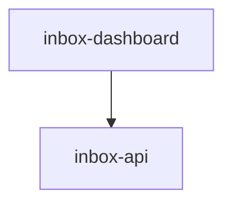

# Module: inbox-dashboard

> Parent scope: [`../../agent-inbox.spec.md`](../../agent-inbox.spec.md)

<!--SECTION:MODULE_VISION-->

## 1. Module Vision

React SPA дашборд serve-режима: Kanban-доска, сгруппированная по ролям.
shadcn/ui (Radix + Tailwind v4) + dnd-kit. Общается с inbox-api через REST.
Собирается Vite, раздаётся как статика.

<!--/SECTION:MODULE_VISION-->

<!--SECTION:MODULE_USAGE_EXAMPLE-->

## 2. Module Usage Example

```tsx
// корневой компонент
function App() {
  return (
    <BoardStore.Provider>
      <BoardPage />
    </BoardStore.Provider>
  );
}

// BoardPage — запрашивает /api/board, рендерит блоки ролей
function BoardPage() {
  const { roles, unassigned } = useBoard();

  return (
    <div className="p-4">
      <Header />
      {roles.map((role) => (
        <RoleBlock key={role.name} role={role} />
      ))}
      <UnassignedBlock mrs={unassigned} />
    </div>
  );
}
```

<!--/SECTION:MODULE_USAGE_EXAMPLE-->

<!--SECTION:ENTITY_INVENTORY-->

## 3. Entity Inventory (Closed-World)

| Name            | Type      | Purpose                                                                              |
| --------------- | --------- | ------------------------------------------------------------------------------------ |
| `BoardPage` | Component | Корневая страница: шапка, блоки ролей, polling API каждые 30s. |
| `Header` | Component | Шапка дашборда: заголовок «agent-inbox», статус OpenCode (🟢/⚠), интервал polling. |
| `UnassignedBlock` | Component | Блок «БЕЗ РОЛИ»: список карточек MR без назначенной роли, кнопка «Назначить ▼». |
| `RoleBlock` | Component | Блок роли: заголовок, Kanban-дорожки. Сворачиваемый. |
| `KanbanLane`    | Component | Дорожка (INBOX/PROGRESS/AWAITING/DONE) с dnd-kit. Принимает карточки.                |
| `MrCard`        | Component | Карточка MR: проект, номер, время ожидания, статус, кнопка «смотреть».               |
| `MrDetailModal` | Component | Модалка: отчёт агента, кнопки [Постить] [Отклонить] [Пропустить].                    |
| `ApiClient`     | Service   | HTTP-клиент: `GET /api/board`, `POST /api/mr/:id/assign`, `POST /api/mr/:id/action`. |
| `BoardStore`    | Service   | React Context: состояние доски, polling, optimistic updates.                         |

<!--/SECTION:ENTITY_INVENTORY-->

<!--SECTION:ENTITY_SURFACES-->

## 4. Entity Surfaces

### `BoardPage`

- **Type:** Component
- **Purpose:** Корневая страница. Header + список RoleBlock + UnassignedBlock.
- **State:** `roles: RoleView[]`, `unassigned: MrCard[]`, `loading`, `error`
- **Lifecycle:** Монтируется → polling каждые 30s → размонтируется.
- **Consumers:** Entry point React app.

### `RoleBlock`

- **Type:** Component
- **Purpose:** Блок одной роли с Kanban-дорожками.
- **Props:** `role: RoleView` (name, active, lanes: { inbox, progress, awaiting, done })
- **State:** свёрнут/развёрнут
- **Consumers:** `BoardPage`.

### `KanbanLane`

- **Type:** Component
- **Purpose:** Одна колонка Kanban. Принимает MrCard через dnd-kit.
- **Props:** `title`, `cards: MrCard[]`, `onDrop(card, lane)`
- **Consumers:** `RoleBlock`.

### `MrCard`

- **Type:** Component
- **Purpose:** Карточка MR с ключевой информацией.
- **Props:** `mr: { project, iid, title, timeWaiting, state, prevState, actions[] }`
- **Consumers:** `KanbanLane`, `UnassignedBlock`.

### `MrDetailModal`

- **Type:** Component
- **Purpose:** Модальное окно с отчётом агента: находки, треды, действия.
- **Props:** `mr: MrDetail`
- **State:** открыта/закрыта, выбранное действие
- **Consumers:** `MrCard` (по клику «смотреть»).

### `ApiClient`

- **Type:** Service
- **Purpose:** HTTP-клиент к inbox-api.
- **Public Operations:** `getBoard()`, `assignMr(mrId, role, rights?)`, `actionMr(mrId, action)`, `getAudit(mrId)`
- **Consumers:** `BoardStore`.

### `BoardStore`

- **Type:** Service
- **Purpose:** React Context + useReducer. Хранит состояние доски, управляет polling.
- **Public Operations:** `refresh()`, `assignMr(...)`, `executeAction(...)`
- **Consumers:** Все компоненты через контекст.
<!--/SECTION:ENTITY_SURFACES-->

<!--SECTION:MODULE_CONTRACTS-->

## 5. Module Contracts (DbC)

Бизнес-логика дашборда минимальна — компоненты отображают данные, полученные от API.
Контракты на уровне компонентов и визуальной структуры:

- **Invariants:**
  - Карточка всегда показывает `prevState → state` переход
  - Каждые 30s polling — при неизменном JSON (same-данные) → без перерисовки
  - Оптимистичные обновления: действие → сразу UI + rollback при ошибке

- **Визуальная структура (ARIA-снапшоты):**
  - Дашборд содержит `banner` с заголовком «agent-inbox» и статусом OpenCode/polling
  - Каждая роль обёрнута в `region` с `heading` (название роли) и меткой «активна»/«не активна»
  - Внутри роли — 4 `region` (INBOX → IN PROGRESS → AWAITING ME → DONE) с `list` карточек
  - Карточка MR: `listitem` с текстом `{project} !{iid} · {time}`, кнопкой «Смотреть»
  - Роль «БЕЗ РОЛИ» — отдельный `region` для неназначенных MR

- **Пространственные отношения (layout):**
  - Колонки внутри роли слева направо: INBOX, PROGRESS, AWAITING, DONE
  - Блоки ролей друг под другом, порядок: активные → неактивные → «БЕЗ РОЛИ»
  - Модалка отчёта центрирована, перекрывает доску
  - Карточки MR равной ширины внутри колонки
  <!--/SECTION:MODULE_CONTRACTS-->

<!--SECTION:FILE_STRUCTURE-->

## 7. File Structure

```
services/agent-inbox/modules/inbox-dashboard/
├── App.tsx                   # Entry point, BoardStore.Provider
├── components/
│   ├── BoardPage.tsx         # Корневая страница
│   ├── RoleBlock.tsx         # Блок роли
│   ├── KanbanLane.tsx        # Дорожка Kanban (dnd-kit)
│   ├── MrCard.tsx            # Карточка MR
│   ├── MrDetailModal.tsx     # Модалка отчёта
│   └── Header.tsx            # Шапка
├── services/
│   ├── api-client.ts         # ApiClient
│   └── board-store.ts        # BoardStore (React Context)
├── styles/
│   └── index.css             # Tailwind入口 + shadcn/ui тема
├── __tests__/
│   ├── BoardPage.test.tsx
│   ├── RoleBlock.test.tsx
│   └── MrCard.test.tsx
```

**File Mapping:**

- `components/*.tsx` — компоненты
- `services/api-client.ts` — `ApiClient`
- `services/board-store.ts` — `BoardStore`
<!--/SECTION:FILE_STRUCTURE-->

<!--SECTION:INTER_MODULE_DEPENDENCIES-->

## 9. Inter-Module Dependencies

- **Depends on:** `inbox-api` (REST)
- **Scope Reference (cross-scope):** None
- **Provides to:** None (конечный потребитель)



<!--/SECTION:INTER_MODULE_DEPENDENCIES-->

<!--SECTION:HANDOFF-->

## 10. Handoff to task-scaffolding

- **Implementation files to be created:** 9 файлов
- **Test files to be created:** 3 файла
- **Stack dependencies:**
  - Language: TypeScript + React 19 + JSX
  - UI: shadcn/ui (Radix + Tailwind v4), dnd-kit, lucide-react
  - Bundler: Vite
  - Formatter: Prettier
- **Module Rules Additions:** None
<!--/SECTION:HANDOFF-->
