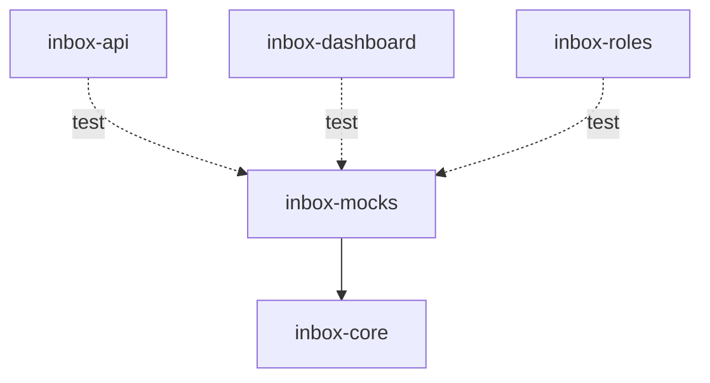

# Module: inbox-mocks

> Parent scope: [`../agent-inbox.spec.md`](../agent-inbox.spec.md)

<!--SECTION:MODULE_VISION-->

## 1. Module Vision

Фабрики мок-данных для разработки и e2e-тестов agent-inbox serve.
Позволяют запустить и протестировать дашборд и пайплайны без real VCS и OpenCode.
Используется ТОЛЬКО в dev/e2e-окружении. В production не подключается.

<!--/SECTION:MODULE_VISION-->

<!--SECTION:MODULE_USAGE_EXAMPLE-->

## 2. Module Usage Example

```ts
import { mockActionableMr, mockMrContext, mockBoard, mockOpenCodeResponse } from '@/inbox-mocks';

// настройка мок-данных для e2e-теста дашборда
const mrs = [
  mockActionableMr({ project: 'group/proj', iid: 510, stage: 'review_needed' }),
  mockActionableMr({ project: 'group/ui', iid: 511, stage: 'review_needed' }),
];

const board = mockBoard({
  roles: [
    { name: 'reviewer', active: true, mrs: mrs },
    { name: 'author', active: false, mrs: [] },
  ],
  unassigned: [mockActionableMr({ iid: 512 })],
});

// мок-ответ OpenCode (structured output)
const reviewResponse = mockOpenCodeResponse('review', {
  findings: [{ severity: 'blocking', file: 'src/auth.ts', line: 42, message: '...' }],
  verdict: 'request_changes',
});
```

<!--/SECTION:MODULE_USAGE_EXAMPLE-->

<!--SECTION:ENTITY_INVENTORY-->

## 3. Entity Inventory (Closed-World)

| Name                   | Type    | Purpose                                                                      |
| ---------------------- | ------- | ---------------------------------------------------------------------------- |
| `mockActionableMr`     | Factory | Создать мок-ActionableMr с переопределяемыми полями.                         |
| `mockMrContext`        | Factory | Создать мок-MrContext (worktree, changeset, stage, threads).                 |
| `mockBoard`            | Factory | Создать мок-состояние доски (роли + MR + колонки).                           |
| `mockOpenCodeResponse` | Factory | Создать мок structured output ответа AI-узла.                                |
| `layoutHelper`         | Utility | Вычисление относительных позиций: boundingBox → проценты, порядок элементов. |
| `ariaSnapshotHelper`   | Utility | Захват ARIA-снапшота страницы, сравнение с эталоном, авто-генерация.         |

<!--/SECTION:ENTITY_INVENTORY-->

<!--SECTION:FILE_STRUCTURE-->

## 7. File Structure

```
services/agent-inbox/modules/inbox-core/
├── __tests__/ (существующие)
│   └── ... (моки импортируются из inbox-mocks)

services/agent-inbox/modules/inbox-mocks/
├── mr.mock.ts               # mockActionableMr, mockMrContext
├── board.mock.ts            # mockBoard
├── opencode.mock.ts         # mockOpenCodeResponse
├── index.ts                 # re-export

e2e/inbox-serve/
├── helpers/
│   ├── aria-snapshot.helper.ts   # ARIA-снапшоты: захват, сравнение, авто-генерация
│   └── layout.helper.ts          # layout: boundingBox → проценты, проверка порядка
```

**File Mapping:**

- `mr.mock.ts` — `mockActionableMr`, `mockMrContext`
- `board.mock.ts` — `mockBoard`
- `opencode.mock.ts` — `mockOpenCodeResponse`
- `e2e/inbox-serve/helpers/aria-snapshot.helper.ts` — `ariaSnapshotHelper`
- `e2e/inbox-serve/helpers/layout.helper.ts` — `layoutHelper`
<!--/SECTION:FILE_STRUCTURE-->

<!--SECTION:INTER_MODULE_DEPENDENCIES-->

## 9. Inter-Module Dependencies

- **Depends on:** `inbox-core` (типы ActionableMr, MrContext)
- **Scope Reference (cross-scope):** None
- **Provides to:** `inbox-api` (тесты), `inbox-dashboard` (e2e), `inbox-roles` (тесты), `inbox-opencode` (тесты)



<!--/SECTION:INTER_MODULE_DEPENDENCIES-->

<!--SECTION:HANDOFF-->

## 10. Handoff to task-scaffolding

- **Implementation files to be created:** 3 файла
- **Test files to be created:** Фабрики самодостаточны (тестируются через использование в других модулях)
- **Stack dependencies:**
  - Language: TypeScript
  - Test framework: node:test (потребители)
- **Module Rules Additions:** None
<!--/SECTION:HANDOFF-->
