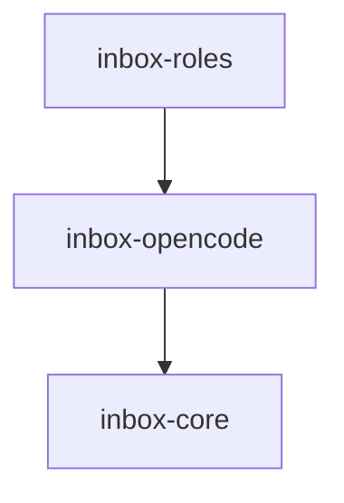

# Module: inbox-opencode

> Parent scope: [`../../agent-inbox.spec.md`](../../agent-inbox.spec.md)

<!--SECTION:MODULE_VISION-->

## 1. Module Vision

Обёртка над OpenCode server API для agent-inbox. Управление сессиями: создание,
отправка промптов со structured output (JSON Schema), пул сессий, retry.
Использует официальный SDK `@opencode-ai/sdk` (client-only режим).

<!--/SECTION:MODULE_VISION-->

<!--SECTION:MODULE_USAGE_EXAMPLE-->

## 2. Module Usage Example

```ts
import { OpenCodeMock, SessionPool, SchemaRegistry } from '@/inbox-opencode';

// dev/e2e: мок
const opencode = new OpenCodeMock();
opencode.seed(schemas.get('review'), {
  findings: [{ severity: 'blocking', file: 'src/auth.ts', ... }],
  verdict: 'request_changes',
});

// production: SDK
// const opencode = new OpenCodeReal({ baseUrl: 'http://localhost:4096' });

const pool = new SessionPool({ maxSessions: 3, opencode });
const schemas = new SchemaRegistry();

const sessionId = await pool.create('review: group/proj!510');
const result = await pool.prompt(sessionId, {
  system: 'Ты — ревьюер...',
  text: 'Сделай ревью MR...',
  schema: schemas.get('review'),
});
// → result.output: validated JSON

// если StructuredOutputError → retry
if (result.error?.name === 'StructuredOutputError') {
  await session.prompt({
    system: 'Исправь формат ответа согласно схеме...',
    text: result.error.message,
    schema: schemas.get('review'),
  });
}

// завершили — чистим
await pool.release(session.id);
```

<!--/SECTION:MODULE_USAGE_EXAMPLE-->

<!--SECTION:ENTITY_INVENTORY-->

## 3. Entity Inventory (Closed-World)

_Это полный список сущностей модуля. Любое введение сущности execution-агентом помимо этого списка считается drift'ом и требует обновления spec._

| Name             | Type         | Purpose                                                                     |
| ---------------- | ------------ | --------------------------------------------------------------------------- |
| `OpenCodePort`   | Port         | Абстракция: создать сессию, отправить промпт со structured output, закрыть. |
| `OpenCodeMock`   | Adapter      | Мок-реализация для разработки и e2e: возвращает преконфигуренные ответы.    |
| `OpenCodeReal`   | Adapter      | Реализация через `@opencode-ai/sdk` (client-only, HTTP API).                |
| `SessionPool`    | Service      | Пул активных сессий: создание, reuse, лимиты, cleanup.                      |
| `SchemaRegistry` | Value Object | Реестр JSON-схем ответа для ролей. Каждая роль → своя схема.                |

<!--/SECTION:ENTITY_INVENTORY-->

<!--SECTION:ENTITY_SURFACES-->

## 4. Entity Surfaces

### `OpenCodePort`

- **Type:** Port
- **Purpose:** Абстракция AI-движка: создание сессий, отправка промптов со structured output. Позволяет подменить real → mock для тестов.
- **Public Operations:**
  - `createSession(title)` → `SessionHandle`
  - `prompt(sessionId, { system, text, schema })` → `PromptResult`
  - `abort(sessionId)` → void
  - `close(sessionId)` → void
- **Consumers:** Internal — `inbox-roles` (RoleInstance), `SessionPool`.

### `OpenCodeMock`

- **Type:** Adapter
- **Implements:** `OpenCodePort`
- **Purpose:** Мок для разработки дашборда и e2e-тестов. Возвращает преконфигуренные ответы без real OpenCode.
- **Public Operations:**
  - `seed(schema, response)` — настроить ответ для конкретной схемы
  - `seedError(schema, error)` — настроить ошибку (StructuredOutputError)
- **Lifecycle:** Создаётся с начальными данными. Только в dev/e2e-окружении.
- **Consumers:** DI-контейнер.

### `OpenCodeReal`

- **Type:** Adapter
- **Implements:** `OpenCodePort`
- **Purpose:** Реальная интеграция через `@opencode-ai/sdk`. Подключается к `opencode serve`.
- **Public Operations:** (те же, что у Port)
- **Lifecycle:** Инициализируется с `baseUrl` `http://localhost:4096`.
- **Errors:** `OpenCodeError('UNAVAILABLE')`, `StructuredOutputError`.
- **Consumers:** Production-окружение.

### `SessionPool`

- **Type:** Service
- **Purpose:** Управление пулом сессий OpenCode. Лимиты параллельности, повторное использование, cleanup.
- **Public Operations:**
  - `create({ title })` → `OpenCodeSession` — создать новую сессию (ждёт, если лимит исчерпан)
  - `release(id)` → завершить и удалить сессию
  - `activeCount()` → `number` — сколько сессий активно
  - `cleanup()` → удалить все idle-сессии старше TTL
- **Lifecycle:** Singleton, инициализируется при старте serve с `baseUrl` и `maxSessions`.
- **Errors & Degradation:** Лимит исчерпан → ожидание (не ошибка). Cleanup — best-effort.
- **Consumers:** Internal — `inbox-roles` (RoleScheduler управляет пулом).

### `SchemaRegistry`

- **Type:** Value Object
- **Purpose:** Реестр JSON-схем structured output для ролей. Каждая схема — контракт формата ответа AI.
- **Public Properties:** `schemas: Map<RoleName, JsonSchema>`
- **Public Operations:**
  - `get(role)` → `JsonSchema` — схема для роли
  - `register(role, schema)` → зарегистрировать новую схему
- **Lifecycle:** Инициализируется при старте. Схемы загружаются из `ai/directives/agent-inbox/schemas/`.
- **Consumers:** Internal — `inbox-roles` (AikitCompiler использует схему при формировании промпта).
<!--/SECTION:ENTITY_SURFACES-->

<!--SECTION:MODULE_CONTRACTS-->

## 5. Module Contracts (DbC)

### Port: `OpenCodePort`

- **Runtime Backing:** `real-runtime` (OpenCodeReal), `simulation` (OpenCodeMock)
- **Verification Levels:** `contract`, `unit`
- **Deferred Runtime Scope:** None

**Contract (DbC):**

- **Preconditions:** `system` — непустая строка; `schema` — валидный JSON Schema
- **Postconditions:** Успех → `{ output: validatedJson }`; Ошибка → `{ error: StructuredOutputError }`
- **Invariants:** Одна сессия = один AI-узел. После `close()` сессия недоступна.

### Adapter: `OpenCodeMock`

- **Implements:** `OpenCodePort`
- **Runtime Backing:** `simulation`
- **Verification Levels:** `unit`
- **Side Effects:** None. Возвращает seeded-данные.

### Adapter: `OpenCodeReal`

- **Implements:** `OpenCodePort`
- **Runtime Backing:** `real-runtime`
- **Verification Levels:** `integration`
- **Side Effects:** HTTP-запросы к `opencode serve` через `@opencode-ai/sdk`. Создание/удаление сессий на сервере.
- **Errors:** `OpenCodeError('UNAVAILABLE')` при недоступности.

### Service: `SessionPool`

- **Runtime Backing:** `real-runtime`
- **Verification Levels:** `contract`, `unit`
- **Deferred Runtime Scope:** None

**Contract (DbC):**

- **Preconditions:**
  - `baseUrl` указывает на запущенный `opencode serve`
  - `maxSessions` > 0
- **Postconditions:**
  - `create()` при свободном слоте → новая сессия
  - `create()` при исчерпанном лимите → ожидание до освобождения
  - `release(id)` → сессия закрыта, слот освобождён
- **Invariants:**
  - `activeCount()` ≤ `maxSessions` всегда
  - Устаревшие idle-сессии удаляются при `cleanup()`
  <!--/SECTION:MODULE_CONTRACTS-->

<!--SECTION:PUBLIC_OPTIONS-->

## 6. Public Options & Policies

| Option          | Bound To                   | Status                                   |
| --------------- | -------------------------- | ---------------------------------------- |
| `baseUrl`       | `SessionPool` constructor  | active — `http://localhost:4096` default |
| `maxSessions`   | `SessionPool` constructor  | active — `3` default (per SV-11)         |
| `sessionTtl`    | `SessionPool.cleanup()`    | active — idle-сессии удаляются через TTL |
| `promptTimeout` | `OpenCodeSession.prompt()` | active — таймаут ожидания ответа AI      |

<!--/SECTION:PUBLIC_OPTIONS-->

<!--SECTION:FILE_STRUCTURE-->

## 7. File Structure

```
services/agent-inbox/modules/inbox-opencode/
├── opencode.port.ts         # OpenCodePort: абстракция
├── opencode.mock.ts         # OpenCodeMock: мок-реализация
├── opencode.real.ts         # OpenCodeReal: SDK-интеграция
├── session-pool.ts          # SessionPool: создание, reuse, лимиты, cleanup
├── schema-registry.ts       # SchemaRegistry: JSON-схемы для ролей
├── errors.ts                # OpenCodeError
├── __tests__/
│   ├── opencode.mock.test.ts
│   ├── session-pool.test.ts
│   └── schema-registry.test.ts
```

**File Mapping:**

- `opencode.port.ts` — `OpenCodePort`
- `opencode.mock.ts` — `OpenCodeMock`
- `opencode.real.ts` — `OpenCodeReal`
- `session-pool.ts` — `SessionPool`
- `schema-registry.ts` — `SchemaRegistry`
- `errors.ts` — `OpenCodeError`
<!--/SECTION:FILE_STRUCTURE-->

<!--SECTION:MODULE_DECISION_LOG-->

## 8. Module Decision Log

### D-78 — OpenCode SDK + Port/Adapter для DI

- **Status:** active
- **Recorded:** session ModuleDecomposition, agent-inbox
- **Why:** Исследование `opencode.ai/docs/server` подтвердило: OpenCode имеет HTTP API (`opencode serve`) и SDK (`@opencode-ai/sdk`). Port/Adapter сохранён для DI (OpenCodeMock → тесты, OpenCodeReal → production). SDK используется только внутри OpenCodeReal. Ранее D-78 утверждал обратное (Port не нужен) — пересмотрено при scaffold: мок-архитектура требует Port для подмены.
- **Risk accepted:** Зависимость от `@opencode-ai/sdk` — внешний пакет.
- **Rejected alternatives:** (a) spawn + парсинг stdout — хрупко; (b) без Port/Adapter — нельзя мок-тестировать дашборд
<!--/SECTION:MODULE_DECISION_LOG-->

<!--SECTION:INTER_MODULE_DEPENDENCIES-->

## 9. Inter-Module Dependencies

- **Depends on:** `inbox-core`
- **Scope Reference (cross-scope):** None
- **Provides to:** `inbox-roles`



<!--/SECTION:INTER_MODULE_DEPENDENCIES-->

<!--SECTION:HANDOFF-->

## 10. Handoff to task-scaffolding

- **Implementation files to be created:** 4 файла (см. File Structure)
- **Test files to be created:** 3 файла (см. `__tests__/`)
- **Stack dependencies:**
  - Language: TypeScript (resolves to `ai/directives/coding/typescript-rules.xml`)
  - Test framework: node:test (resolves to `ai/directives/testing/node-test.xml`)
  - External package: `@opencode-ai/sdk` (npm)
- **Module Rules Additions:** None
- **Open risks:** Зависимость от внешнего SDK — нужен мониторинг breaking changes. Structured output retry (по умолчанию 2) — может не хватить для сложных схем.
<!--/SECTION:HANDOFF-->
