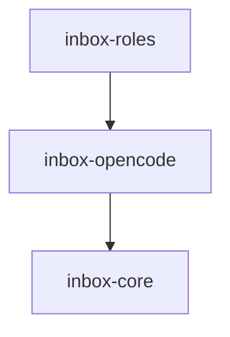

# Module: inbox-opencode

> Parent scope: [`../agent-inbox.spec.md`](../agent-inbox.spec.md)

<!--SECTION:MODULE_VISION-->

## 1. Module Vision

Обёртка над OpenCode server API для agent-inbox. Управление сессиями, structured
output через `format: json_schema`, классификация исходов AI-узлов. Использует
официальный SDK `@opencode-ai/sdk` (client-only режим).

<!--/SECTION:MODULE_VISION-->

<!--SECTION:MODULE_USAGE_EXAMPLE-->

## 2. Module Usage Example

```ts
import { OpenCodeMock, SessionPool, SchemaRegistry } from '@/inbox-opencode';

const opencode = new OpenCodeMock();
opencode.seed('node_scaffold', structuredOutput);

const pool = new SessionPool({ maxSessions: 3, opencode });
const schemas = new SchemaRegistry();
schemas.register('node_scaffold', scaffoldSchema);

const sid = await pool.create({ title: 'review: !510', directory: '/tmp/wt' });
const result = await pool.prompt(sid, {
  system: 'Ты — ревьюер...',
  text: 'Сделай scaffold...',
  format: { type: 'json_schema', schema: schemas.get('node_scaffold') },
});
// → { output: {...} } или { error: { class: 'SCHEMA_MISMATCH', signal: '...' } }
```

<!--/SECTION:MODULE_USAGE_EXAMPLE-->

<!--SECTION:ENTITY_INVENTORY-->

## 3. Entity Inventory (Closed-World)

| Name             | Type         | Purpose                                                                                            |
| ---------------- | ------------ | -------------------------------------------------------------------------------------------------- |
| `OpenCodePort`   | Port         | Абстракция: createSession, prompt (format), status, continueSignal, abort, close.                  |
| `OpenCodeMock`   | Adapter      | Мок: симулирует все классы исходов (OK, зависание, Terminated, битый JSON, недоделанный артефакт). |
| `OpenCodeReal`   | Adapter      | Реализация через `@opencode-ai/sdk` (client-only).                                                 |
| `SessionPool`    | Service      | Пул сессий: создание, reuse, лимиты, cleanup.                                                      |
| `SchemaRegistry` | Value Object | Реестр JSON-схем: узел → схема (не роль → схема).                                                  |

<!--/SECTION:ENTITY_INVENTORY-->

<!--SECTION:ENTITY_SURFACES-->

## 4. Entity Surfaces

### `OpenCodePort`

- **Type:** Port
- **Purpose:** Абстракция AI-движка. Режим — **агентная многоходовая сессия** (не one-shot): агент сам ходит по коду тулами в cwd; `prompt` возвращается по завершении хода агента.
- **Public Operations:**
  - `createSession({ title, directory, tools })` → `SessionHandle` (`directory` = cwd = worktree MR, обязателен; `tools: on` — read/grep/git в cwd; write агента — только в свой артефакт-путь)
  - `prompt(sid, { system?, text, format?, timeout })` → сырой результат. `timeout` — на агентную сессию, в **минутах** (агентный ход многошаговый). `system` — директива (per-node из ai-kit); схема НЕ инъектируется в текст промпта (F10 — вешало модель), хранится для валидации результата.
  - `status(sid)` → текущий статус сессии (busy/idle/terminated) — для детекта зависания
  - `toolCalls(sid)` → `ToolCall[]` — какие файлы агент открывал/грепал (телеметрия для `ArtifactValidator` tool-call сверки; факт, не self-report)
  - `continueSignal(sid, { system?, text, format? })` — семантически выделенный prompt для recovery
  - `abort(sid)`, `close(sid)`
- **Consumers:** `SessionPool`, `inbox-roles`.

### `OpenCodeMock`

- **Type:** Adapter | **Implements:** `OpenCodePort`
- **Purpose:** Мок для dev/e2e. Обязан симулировать все классы исходов для тестирования recovery ladder.
- **Public Operations:**
  - `seed(nodeId, response)` — OK-ответ
  - `seedError(nodeId, errorClass)` — NO_RESULT / PARSE_ERROR / SCHEMA_MISMATCH / SESSION_ERROR / TIMEOUT
  - `seedIncomplete(nodeId, details)` — INCOMPLETE_ARTIFACT
- **Consumers:** DI-контейнер (dev/e2e).

### `OpenCodeReal`

- **Type:** Adapter | **Implements:** `OpenCodePort`
- **Purpose:** Реальная интеграция через `@opencode-ai/sdk`. `format: { type: 'json_schema', schema }` — native. При недоступности format — fallback: JSON-блок в сообщении + парсинг.
- **Consumers:** Production.

### `SessionPool`

- **Type:** Service
- **Purpose:** Пул сессий. Лимит per-role × число ролей может превышать maxSessions → ожидание в порядке очереди (без дедлока).
- **Public Operations:** `create(opts)`, `prompt(sid, ...)`, `release(sid)`, `activeCount()`, `cleanup()`
- **Consumers:** `inbox-roles`.

### `SchemaRegistry`

- **Type:** Value Object
- **Purpose:** Реестр JSON-схем: узел → схема.
- **Public Operations:** `get(nodeId)`, `register(nodeId, schema)`
- **Consumers:** `inbox-roles` (RoleInstance.step() для session-узлов).
<!--/SECTION:ENTITY_SURFACES-->

<!--SECTION:MODULE_CONTRACTS-->

## 5. Module Contracts (DbC)

### Port: `OpenCodePort`

- **Runtime Backing:** `real-runtime` (OpenCodeReal), `simulation` (OpenCodeMock)
- **Verification Levels:** `contract`, `unit`

**Contract (DbC):**

- **Preconditions:** `system`/`text` — непустая строка; `directory` — существующий путь
- **Postconditions:** Успех → `{ output: validatedJson }`; Ошибка → `{ error: OutcomeClass }`
- **Invariants:** Одна сессия = один AI-узел. После `close()` сессия недоступна.

### Adapter: `OpenCodeMock`

- **Implements:** `OpenCodePort`
- **Runtime Backing:** `simulation`
- **Verification Levels:** `unit`
- **Side Effects:** None. Возвращает seeded-данные или симулирует ошибку.
- **Обязан симулировать:** OK (structured output), NO_RESULT (пустой ответ), PARSE_ERROR (битый JSON), SCHEMA_MISMATCH (несовпадение полей), SESSION_ERROR (Terminated/abort), TIMEOUT (зависание), INCOMPLETE_ARTIFACT (отсутствие маркера).

### Adapter: `OpenCodeReal`

- **Implements:** `OpenCodePort`
- **Runtime Backing:** `real-runtime`
- **Verification Levels:** `integration`
- **Side Effects:** HTTP-запросы к `opencode serve` через `@opencode-ai/sdk`.
- **format-контракт:** `format: { type: 'json_schema', schema }` → native structured output. Fallback: JSON-блок в сообщении + парсинг движком.

### Service: `SessionPool`

- **Runtime Backing:** `real-runtime` (OpenCodeReal), `simulation` (OpenCodeMock)
- **Verification Levels:** `unit`
- **Invariants:** Лимит per-role × роли > maxSessions → ожидание в очереди (без дедлока).
<!--/SECTION:MODULE_CONTRACTS-->

<!--SECTION:PUBLIC_OPTIONS-->

## 6. Public Options & Policies

| Option          | Bound To       | Status                           |
| --------------- | -------------- | -------------------------------- |
| `baseUrl`       | `SessionPool`  | active — `http://localhost:4096` |
| `maxSessions`   | `SessionPool`  | active — `3` default             |
| `sessionTtl`    | `SessionPool`  | active — idle cleanup            |
| `promptTimeout` | `OpenCodePort` | active — per-prompt timeout      |

<!--/SECTION:PUBLIC_OPTIONS-->

<!--SECTION:FILE_STRUCTURE-->

## 7. File Structure

```
services/agent-inbox/modules/inbox-opencode/
├── opencode.port.ts         # OpenCodePort
├── opencode.mock.ts         # OpenCodeMock (симулирует все классы)
├── opencode.real.ts         # OpenCodeReal (SDK + format)
├── session-pool.ts          # SessionPool
├── schema-registry.ts       # SchemaRegistry (узел→схема)
├── errors.ts                # OpenCodeError
└── __tests__/
    ├── opencode.mock.test.ts
    ├── opencode.real.test.ts
    ├── session-pool.test.ts
    └── schema-registry.test.ts
```

<!--/SECTION:FILE_STRUCTURE-->

<!--SECTION:MODULE_DECISION_LOG-->

## 8. Module Decision Log

### D-78 — OpenCode SDK + Port/Adapter для DI

- **Status:** active
- **Recorded:** session ModuleDecomposition, agent-inbox
- **Why:** SDK `@opencode-ai/sdk` поддерживает `format: json_schema` (native structured output), SSE-события, abort, directory-байндинг сессии. Port/Adapter для DI (Mock→test, Real→prod). Контракт порта не зависит от format (fallback: JSON-блок + парсинг).
- **Risk accepted:** Зависимость от внешнего SDK. format-параметр может быть недоступен в некоторых версиях → fallback.
<!--/SECTION:MODULE_DECISION_LOG-->

<!--SECTION:INTER_MODULE_DEPENDENCIES-->

## 9. Inter-Module Dependencies

- **Depends on:** `inbox-core`
- **Provides to:** `inbox-roles`



<!--/SECTION:INTER_MODULE_DEPENDENCIES-->

<!--SECTION:HANDOFF-->

## 10. Handoff to task-scaffolding

- **Implementation files to be created:** 6 файлов
- **Test files to be created:** 4 файла
- **Stack dependencies:** TypeScript, node:test, `@opencode-ai/sdk`
- **Module Rules Additions:** None
<!--/SECTION:HANDOFF-->
