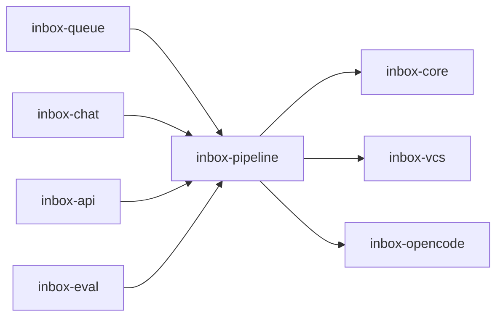

# Module: inbox-pipeline

<!--SECTION:MODULE_VISION-->

## 1. Module Vision

`inbox-pipeline` владеет полным role-invariant review и детерминированным control
plane над недоверенным agent runtime: immutable input manifest, versioned Review
Contract, структурная проверка evidence, адресный bounded repair, freshness gate и
только затем semantic synthesis. Участие оператора влияет на права и presentation,
но не сокращает review depth.

Parent: [agent-inbox](../agent-inbox.spec.md), прежде всего FR-006–009, FR-044–054,
NFR-005 и NFR-010–013. Семантическое review/cross-review остаётся интеллектуальной
работой агента; deterministic validator доказывает полноту и provenance, но не
объявляет содержание истинным.

Composition flow: [Approved UX Flow Example](../agent-inbox.spec.md#3-approved-ux-flow-example).

<!--/SECTION:MODULE_VISION-->

<!--SECTION:MODULE_USAGE_EXAMPLE-->

## 2. Module Usage Example

```ts
const manifest = await manifestBuilder.captureAndSeal(reviewIntent);
if (manifest.status === 'BLOCKED') return manifest;

const contract = await contractCompiler.compileAtomically(manifest, reviewIntent);
if (contract.status === 'BLOCKED') return contract;
const round = await orchestrator.execute(contract);

let verdict = await freshnessGate.guard('VERDICT', manifest.key, () =>
  structuralValidator.validate(round)
);
while (verdict.status === 'REPAIRABLE') {
  const repair = repairCoordinator.plan(contract, verdict);
  await orchestrator.executeRepair(repair);
  verdict = await freshnessGate.guard('VERDICT', manifest.key, () =>
    structuralValidator.validate(round)
  );
}

if (verdict.status !== 'PASS') return verdict; // persisted BLOCKED/STALE result
const recommendation = await freshnessGate.guard('SYNTHESIS_PUBLICATION', manifest.key, () =>
  synthesis.prepareRecommendationInput(round)
);
if (recommendation.status === 'STALE') return recommendation;

return freshnessGate.guard('QUEUE_HANDOFF', manifest.key, (guarded) => {
  const handoff = ReviewPublicationHandoff.construct({
    handoffId: guarded.id,
    manifestKey: manifest.key,
    manifestRef: manifest.ref,
    contractRef: contract.ref,
    verdictRef: verdict.ref,
    guardedTransitionId: guarded.id,
    acceptedObservedRevision: guarded.observedRevision,
    capabilitySnapshot: guarded.actionCapabilities,
    capabilityVersion: guarded.capabilityVersion,
    dispatchPolicy: guarded.dispatchPolicy,
    recommendationDigest: recommendation.digest,
    provenance: round.provenance,
    deliveryStatus: 'ACCEPTED',
  });
  return queue.acceptRecommendationHandoff(handoff); // returns the exact same record
});
```

Если последний locally observed head SHA или event cursor меняется до verdict,
synthesis publication либо queue handoff, freshness gate в core-owned journal
transaction переводит round в `STALE`; старый результат не передаётся queue, а очередь
получает новую delta. Внешний GitLab не входит в эту атомарность. Если исчерпан repair
budget, round становится наблюдаемым `BLOCKED`.

<!--/SECTION:MODULE_USAGE_EXAMPLE-->

<!--SECTION:ENTITY_INVENTORY-->

## 3. Entity Inventory (Closed-World)

_Это полный список сущностей модуля `inbox-pipeline`. Любая новая pipeline-сущность
execution-агента вне этого списка считается drift и требует обновления spec._

| Name                                     | Type         | Purpose                                                                      |
| ---------------------------------------- | ------------ | ---------------------------------------------------------------------------- |
| `ReviewIntent`                           | Value Object | Full, delta, thread, cross-review или manual verification request.           |
| `ReviewInputManifest`                    | Entity       | Immutable versioned inventory/classification снимок одного review round.     |
| `ReviewInputClassification`              | Value Object | Детерминированная классификация manifest input и change shape.               |
| `ReviewInputManifestBuilder`             | Service      | Capture, classification, validation и sealing полного input inventory.       |
| `ReviewPlan`                             | Entity       | Наблюдаемый execution plan, скомпилированный из contract slots.              |
| `ReviewContract`                         | Entity       | Versioned machine-readable обязательства review round.                       |
| `ReviewContractSlot`                     | Value Object | Адресуемая обязанность с schema, anchors, cardinality и reuse policy.        |
| `ReviewContractInputMapping`             | Value Object | Total mapping manifest input в slots либо compiler-owned NA decision.        |
| `ReviewSlotSchemaCatalog`                | Entity       | Versioned closed catalog schemas, change-shape и NA code tables.             |
| `ReviewEvidence`                         | Value Object | Версионированное наблюдение, привязанное к slot и manifest source.           |
| `ReviewFinding`                          | Entity       | Проверенная проблема с severity, blocking semantics и provenance.            |
| `ReviewArtifact`                         | Entity       | Durable revision анализа с адресуемыми fragment anchors.                     |
| `ReviewRuntimeReceipt`                   | Value Object | Control-plane proof фактически выполненной tool operation.                   |
| `ReviewRuntimeReceiptStorePort`          | Port         | Append-only независимое хранение receipt sequence.                           |
| `LocalReviewRuntimeReceiptStoreAdapter`  | Adapter      | Local production backing receipt и consumption logs.                         |
| `MemoryReviewRuntimeReceiptStoreAdapter` | Adapter      | Isolated deterministic test backing receipt и consumption logs.              |
| `ReviewRuntimeReceiptRecorder`           | Service      | Создание и durable-запись trusted receipts до зачёта tool outcome.           |
| `ReviewReceiptConsumption`               | Entity       | Durable append-only mapping receipt к slot/evidence.                         |
| `ReviewCoverage`                         | Value Object | Проекция slot/source/lens/diagram coverage и точных gaps.                    |
| `ReviewCompletenessVerdict`              | Value Object | `PASS`, `REPAIRABLE`, `BLOCKED` или `STALE` с причинами и slot IDs.          |
| `ReviewContractCompiler`                 | Service      | Детерминированная компиляция manifest/change shape в slots.                  |
| `ReviewStructuralValidator`              | Service      | Механическая проверка artifacts, schemas, anchors и trusted receipts.        |
| `ReviewRepairTask`                       | Entity       | Узкое задание только на missing/invalid slots одной contract version.        |
| `ReviewRepairCoordinator`                | Service      | Durable bounded цикл validate → repair → validate.                           |
| `ReviewFreshnessGate`                    | Service      | Local per-MR gate перед verdict, publication и queue handoff.                |
| `ReviewOrchestrator`                     | Service      | Исполнение общего review DAG и repair work без обхода control plane.         |
| `ReviewDeltaVerifier`                    | Service      | Проверка накопленного change batch против manifest/evidence baseline.        |
| `ReviewCrossReviewer`                    | Service      | Независимая семантическая перепроверка чужих claims и discussions.           |
| `ReviewSynthesis`                        | Entity       | Свежие semantic facts и recommendation inputs после `PASS`.                  |
| `ReviewPublicationHandoff`               | Value Object | Immutable freshness/capability record, принимаемый queue без преобразования. |

<!--/SECTION:ENTITY_INVENTORY-->

<!--SECTION:ENTITY_SURFACES-->

## 4. Entity Surfaces

### `ReviewIntent`

- **Type:** Value Object
- **Purpose:** Фиксирует вид review и baseline без ролевого уменьшения глубины.
- **Public Properties:** kind; MR identity; requested revision/batch; baseline; trigger; requester.
- **Public Operations:** validate supported intent; derive full-review fallback при отсутствии baseline.
- **Lifecycle:** immutable; создаётся queue/manual command и живёт один round.
- **Events Emitted:** N/A.
- **Errors & Degradation:** incomplete identity или delta без доступного baseline превращается в full intent либо явный `BLOCKED`.
- **Consumers:** Internal — `ReviewOrchestrator`, `ReviewContractCompiler`, `ReviewDeltaVerifier`; External — queue commands.

### `ReviewInputManifest`

- **Type:** Entity
- **Purpose:** Закрывает полный versioned inventory и classifications до contract compilation.
- **Public Properties:** manifest ID/version; MR; head SHA; observed event cursor; changed files; entities; discussions; required sources; canonical identity plus digest/version/captured bytes; classifications; change shape; seal/block status; provenance.
- **Public Operations:** expose immutable inventory/classifications; verify seal identity; return persisted BLOCKED reasons.
- **Lifecycle:** строится один раз на round, после sealing не редактируется; новый event создаёт новый manifest.
- **Events Emitted:** `ReviewInputManifestSealed`, `ReviewInputManifestBlocked`.
- **Errors & Degradation:** неполный inventory, unknown classification или mutable source сохраняет наблюдаемый `BLOCKED`; manifest не создаёт slots, mappings, fallback или NA decisions.
- **Consumers:** Internal — `ReviewContractCompiler`, `ReviewStructuralValidator`, `ReviewFreshnessGate`, `ReviewOrchestrator`; External — eval diagnostics.

### `ReviewInputClassification`

- **Type:** Value Object
- **Purpose:** Фиксирует compiler-independent классификацию одного input и вклад в normalized change shape.
- **Public Properties:** input identity; versioned classification code; change-shape flags; classification rationale; classifier version.
- **Public Operations:** validate code against closed table; contribute normalized change-shape dimensions.
- **Lifecycle:** immutable часть sealed manifest.
- **Events Emitted:** N/A.
- **Errors & Degradation:** отсутствующий/неизвестный code блокирует sealing; известный `UNKNOWN_FILE_CLASSIFICATION` сохраняется как classification и только contract compiler превращает его в required file fallback.
- **Consumers:** Internal — `ReviewInputManifestBuilder`, `ReviewContractCompiler`; External — eval diagnostics.

### `ReviewInputManifestBuilder`

- **Type:** Service
- **Purpose:** Capture и seal полного inventory без преждевременного владения contract policy.
- **Public Properties:** manifest format version; classifier version/code table; capture provenance.
- **Public Operations:** capture immutable sources; classify every input; derive change shape; validate inventory cardinality; persist `SEALED` или `BLOCKED` result.
- **Lifecycle:** stateless versioned service поверх VCS/core stores; один persisted result на round attempt.
- **Events Emitted:** `ReviewInputManifestSealed`, `ReviewInputManifestBlocked`.
- **Errors & Degradation:** read/version/missing-classification gap сохраняется как BLOCKED result с input IDs и причиной; валидный `UNKNOWN_FILE_CLASSIFICATION` допускает sealing; исключение не является public outcome.
- **Consumers:** Internal — `ReviewOrchestrator`, `ReviewContractCompiler`; External — queue and eval.

### `ReviewPlan`

- **Type:** Entity
- **Purpose:** Показывает оператору и executor порядок исполнения всех required slots.
- **Public Properties:** contract reference; lanes; slot dependencies; progress; active task; terminal state.
- **Public Operations:** schedule ready slots; mark observed progress; supersede pending work; enumerate blocked dependencies.
- **Lifecycle:** проекция одной contract version; восстанавливается после crash.
- **Events Emitted:** `ReviewPlanProgressed`, `ReviewPlanSuperseded`.
- **Errors & Degradation:** lane failure видим и retryable; slot нельзя молча удалить.
- **Consumers:** Internal — `ReviewOrchestrator`; External — queue and API/dashboard projections.

### `ReviewContract`

- **Type:** Entity
- **Purpose:** Является canonical machine-readable планом полноты review round.
- **Public Properties:** contract ID/version; manifest key; intent; normalized change shape; ordered slots; total input mappings; schema catalog version/digest; compiler version; deterministic digest.
- **Public Operations:** enumerate required/not-applicable slots and input mappings; resolve dependencies; verify immutable identity; expose completeness target.
- **Lifecycle:** immutable после компиляции; repair сохраняет ту же version, новый input требует новый contract.
- **Events Emitted:** `ReviewContractCompiled`.
- **Errors & Degradation:** duplicate slot ID, unmapped manifest input или необоснованный omission дают `BLOCKED` до agent execution.
- **Consumers:** Internal — `ReviewPlan`, `ReviewOrchestrator`, `ReviewStructuralValidator`, `ReviewRepairCoordinator`; External — API/eval.

### `ReviewContractSlot`

- **Type:** Value Object
- **Purpose:** Описывает одну детерминированно проверяемую обязанность.
- **Public Properties:** stable slot ID; schema catalog/version; kind; required/not-applicable code; output schema; source anchors; min/max cardinality; dependencies; compiler-selected evidence reuse policy; placeholder rules; entity fields; typed diagram obligation.
- **Public Operations:** validate definition; decide whether explicit evidence reuse is allowed; expose exact acceptance constraints.
- **Lifecycle:** immutable часть одной contract version.
- **Events Emitted:** N/A.
- **Errors & Degradation:** неполная schema или неаргументированный `not-applicable` делает contract invalid.
- **Consumers:** Internal — `ReviewContractCompiler`, `ReviewOrchestrator`, `ReviewStructuralValidator`, `ReviewRepairCoordinator`; External — N/A.

`kind` является закрытым v0-каталогом: `goal`, `architecture`, `specification`,
`tests`, `security`, `optimality`, `file`, `entity`, `discussion`, `review-lens`,
`artifact-section`, `diagram`. Entity-slot требует `identity`,
`responsibility/behavior`, `dependencies`, `risks`, `test impact`. Diagram-slot имеет
ровно один тип: `entity-dependency`, `before-after` или `runtime-event-flow`.

### `ReviewContractInputMapping`

- **Type:** Value Object
- **Purpose:** Доказывает total mapping одного manifest input в slots или justified NA.
- **Public Properties:** manifest input ID/version; contract ID/version; target slot IDs; mapping code либо NA code; compiler version; rationale digest.
- **Public Operations:** validate exactly one terminal mapping form; reject empty target without permitted NA code.
- **Lifecycle:** immutable часть атомарно созданного contract; не хранится в manifest.
- **Events Emitted:** N/A.
- **Errors & Degradation:** mapping gap или неизвестный code отклоняет весь contract до agent launch.
- **Consumers:** Internal — `ReviewContractCompiler`, `ReviewStructuralValidator`; External — eval diagnostics.

### `ReviewSlotSchemaCatalog`

- **Type:** Entity
- **Purpose:** Версионирует закрытые structural contracts всех slot kinds и change-shape decisions.
- **Public Properties:** catalog version/digest; schema per slot kind; classification→change-shape table; change-shape→required/NA code table; reuse policies; exact diagram schemas.
- **Public Operations:** resolve schema by kind/version; derive required/NA code; validate compiler output; reject unknown kind/code.
- **Lifecycle:** immutable released version; contract сохраняет exact catalog version/digest.
- **Events Emitted:** `ReviewSlotSchemaCatalogActivated`.
- **Errors & Degradation:** отсутствующая schema/table entry блокирует compilation; runtime extension без spec/version migration запрещён.
- **Consumers:** Internal — `ReviewContractCompiler`, `ReviewStructuralValidator`; External — eval contract tests.

Diagram schemas не взаимозаменяемы: `entity-dependency` требует typed nodes и
dependency edges; `before-after` — paired states и явные changed relations;
`runtime-event-flow` — ordered actors/events, branches и terminal outcomes. Generic
Mermaid source без этих структур не закрывает соответствующий slot.

Closed slot-schema catalog v0:

| Slot kind          | Required structural fields                                                              |
| ------------------ | --------------------------------------------------------------------------------------- |
| `goal`             | objective; acceptance; out-of-scope; source anchors                                     |
| `architecture`     | components; dependencies; invariants; decisions/trade-offs; source anchors              |
| `specification`    | requirement IDs; behavior/constraints; observed drift; source anchors                   |
| `tests`            | changed behavior; positive/negative scenarios; coverage gaps; source anchors            |
| `security`         | trust boundaries; data/assets; threats; mitigations; source anchors                     |
| `optimality`       | complexity/resources; bottlenecks; alternatives/trade-offs; source anchors              |
| `file`             | canonical identity/version; purpose; observed changes; dependencies; risks; test impact |
| `entity`           | identity; responsibility/behavior; dependencies; risks; test impact                     |
| `discussion`       | thread/version; claims; code context; independent assessment; recommendation input      |
| `review-lens`      | lens ID/version; observations; evidence refs; lens conclusion                           |
| `artifact-section` | section ID/schema; non-placeholder fragments; anchors; evidence refs                    |
| `diagram`          | diagram type; typed nodes/states/actors; required edges/transitions; source anchors     |

Closed change-shape codes v0: `GOAL_CHANGED`, `ARCHITECTURE_CHANGED`,
`SPECIFICATION_TOUCHED`, `BEHAVIOR_CHANGED`, `TEST_SURFACE_CHANGED`,
`SECURITY_SURFACE_CHANGED`, `OPTIMALITY_RELEVANT`, `ENTITY_SET_CHANGED`,
`RUNTIME_FLOW_CHANGED`, `DISCUSSION_CHANGED`, `UNKNOWN_FILE_CLASSIFICATION`.
Каждая review dimension всегда получает `REQUIRED:<shape-code>` либо один из closed
NA codes: `NA_NO_ARCHITECTURE_CHANGE`, `NA_NO_SPECIFICATION_SURFACE`,
`NA_NO_SECURITY_SURFACE`, `NA_NO_RUNTIME_FLOW`, `NA_NO_OPTIMALITY_SIGNAL`.
Goal, tests, changed files и discovered entities не имеют silent NA. Новые codes
требуют новой catalog version и spec migration.

### `ReviewEvidence`

- **Type:** Value Object
- **Purpose:** Связывает наблюдение агента с неизменным источником и slot, не объявляя наблюдение семантически истинным.
- **Public Properties:** evidence ID; slot ID; source identity/version/digest; artifact fragment; producer/session/model; timestamp; reuse mappings.
- **Public Operations:** attach provenance; supersede by newer revision; map explicitly to each compiler-permitted slot; expose semantic verification status отдельно от structural validity.
- **Lifecycle:** immutable; новые выводы создают новую revision.
- **Events Emitted:** N/A.
- **Errors & Degradation:** stale, unversioned или не сопоставленное со slot evidence не поддерживает verdict.
- **Consumers:** Internal — `ReviewFinding`, `ReviewCoverage`, `ReviewStructuralValidator`, `ReviewCrossReviewer`, `ReviewSynthesis`; External — N/A.

### `ReviewFinding`

- **Type:** Entity
- **Purpose:** Хранит проверенную actionable проблему отдельно от structural completeness.
- **Public Properties:** finding ID; evidence refs; location; severity; blocking flag; provenance; status; resolution history.
- **Public Operations:** classify; challenge; supersede; record verified resolution.
- **Lifecycle:** принадлежит manifest revision, но сохраняет историю между delta rounds.
- **Events Emitted:** `ReviewFindingRaised`, `ReviewFindingSuperseded`, `ReviewFindingVerifiedResolved`.
- **Errors & Degradation:** finding без current evidence не может блокировать или поддерживать действие.
- **Consumers:** Internal — `ReviewCrossReviewer`, `ReviewSynthesis`; External — queue packages, feed and handoff.

### `ReviewArtifact`

- **Type:** Entity
- **Purpose:** Хранит адресуемый анализ агента, не смешивая его с trusted tool receipts.
- **Public Properties:** artifact ID/revision; manifest/contract; typed sections; fragment anchors; producer/session/model; timestamps.
- **Public Operations:** append revision; expose fragments by slot; preserve supersession chain.
- **Lifecycle:** durable immutable revisions; editable presentation создаёт новую revision.
- **Events Emitted:** `ReviewArtifactRevisionStored`.
- **Errors & Degradation:** empty heading, placeholder, broken anchor или overwritten provenance оставляет slot invalid.
- **Consumers:** Internal — `ReviewStructuralValidator`, `ReviewSynthesis`; External — chat, dashboard and handoff.

### `ReviewRuntimeReceipt`

- **Type:** Value Object
- **Purpose:** Доказывает tool operation независимо от текста агента и artifact storage.
- **Public Properties:** receipt ID; contract ID/version; manifest key; session/task; canonical source identity/version/digest; canonical target identity; operation kind; normalized arguments; byte/line range; semantic anchor; observed content digest; outcome/status digest; monotonic sequence; recorded time.
- **Public Operations:** verify immutable identity, target, observed content and ordering.
- **Lifecycle:** immutable append-only record.
- **Events Emitted:** N/A.
- **Errors & Degradation:** forged, replayed, out-of-order или foreign-contract receipt не закрывает slot.
- **Consumers:** Internal — `ReviewRuntimeReceiptRecorder`, `ReviewRuntimeReceiptStorePort`, `ReviewStructuralValidator`; External — eval.

### `ReviewRuntimeReceiptStorePort`

- **Type:** Port
- **Purpose:** Отделяет durable production log от in-memory deterministic test seam.
- **Public Properties:** N/A.
- **Public Operations:** append receipt or consumption conditionally on next monotonic sequence; read both immutable logs by manifest/contract; verify durable acknowledgment; replay same ID+digest idempotently.
- **Lifecycle:** process-scoped adapter, данные round живут дольше процесса.
- **Events Emitted:** N/A.
- **Errors & Degradation:** append failure означает, что tool outcome нельзя зачесть; store не разрешает update/delete receipts.
- **Consumers:** Internal — `ReviewRuntimeReceiptRecorder`, `ReviewStructuralValidator`; External — inbox-eval contract tests.

Это module-owned имя архитектурной границы `RuntimeReceiptStorePort` из root spec;
префикс `Review` сохраняет единый namespace review core.

### `LocalReviewRuntimeReceiptStoreAdapter`

- **Type:** Adapter
- **Purpose:** Даёт production append-only receipt и consumption logs в выбранном local runtime profile.
- **Public Properties:** profile-scoped root; format version; last durable sequence.
- **Public Operations:** implement atomic append/idempotent replay/read for receipts and consumption mappings; fsync/rename before acknowledgment.
- **Lifecycle:** process-scoped adapter; durable data живёт до explicit profile lifecycle cleanup.
- **Events Emitted:** N/A.
- **Errors & Degradation:** torn/corrupt tail обнаруживается и блокирует eligibility; adapter не чинит sequence молча.
- **Consumers:** Internal — `ReviewRuntimeReceiptRecorder`, `ReviewStructuralValidator`; External — production composition root.

### `MemoryReviewRuntimeReceiptStoreAdapter`

- **Type:** Adapter
- **Purpose:** Изолированный deterministic contract-test backing без production state access.
- **Public Properties:** test run-id namespace; in-memory receipt/consumption sequences; injected failure schedule.
- **Public Operations:** implement тот же append/replay/read contract; simulate crash boundary, duplicate append и corruption deterministically.
- **Lifecycle:** один test run; reset принимает только собственный run-id.
- **Events Emitted:** N/A.
- **Errors & Degradation:** namespace mismatch fail-closed; никогда не читает production profile.
- **Consumers:** Internal — port contract kit; External — inbox-mocks and inbox-eval.

### `ReviewRuntimeReceiptRecorder`

- **Type:** Service
- **Purpose:** Превращает наблюдённую control-plane tool operation в trusted durable receipt.
- **Public Properties:** current contract/manifest/session context; next sequence.
- **Public Operations:** execute a control-plane-owned tool callback with canonical source/target/args/range/anchor context; digest observed content/outcome; append receipt; wait durable acknowledgment; only then return an evidence-eligible outcome.
- **Lifecycle:** session/task-scoped, sequence принадлежит round.
- **Events Emitted:** `ReviewRuntimeReceiptRecorded`.
- **Errors & Degradation:** storage failure сохраняет slot incomplete и делает проблему наблюдаемой; agent-authored substitute игнорируется.
- **Consumers:** Internal — `ReviewStructuralValidator`; External — agent-runtime integration.

### `ReviewReceiptConsumption`

- **Type:** Entity
- **Purpose:** Неизменно фиксирует, какой receipt закрыл какой slot/evidence mapping.
- **Public Properties:** consumption ID; receipt ID; contract/manifest; slot ID; evidence ID; compiler-owned reuse policy/code; consumption sequence; recorded time.
- **Public Operations:** append idempotently; verify one-time use or explicitly permitted separate mapping; replay current consumption set.
- **Lifecycle:** independent append-only log; receipt остаётся immutable и не получает consumed flag.
- **Events Emitted:** `ReviewReceiptConsumed`.
- **Errors & Degradation:** duplicate/foreign/disallowed reuse остаётся invalid mapping и не меняет исходный receipt.
- **Consumers:** Internal — `ReviewStructuralValidator`, `ReviewRuntimeReceiptStorePort`; External — eval diagnostics.

### `ReviewCoverage`

- **Type:** Value Object
- **Purpose:** Даёт explainable проекцию выполненных и незакрытых obligations.
- **Public Properties:** required/complete/missing/invalid/not-applicable slot IDs; source, lens, entity, file and diagram coverage; receipt mappings.
- **Public Operations:** compare contract target with validated evidence; enumerate exact gaps without semantic guess.
- **Lifecycle:** immutable snapshot каждого validation pass.
- **Events Emitted:** N/A.
- **Errors & Degradation:** отсутствие trusted receipt эквивалентно недоказанному чтению/использованию.
- **Consumers:** Internal — `ReviewCompletenessVerdict`, `ReviewPlan`; External — dashboard and eval.

### `ReviewCompletenessVerdict`

- **Type:** Value Object
- **Purpose:** Явно открывает или закрывает downstream gates.
- **Public Properties:** status; contract/manifest; coverage; missing/invalid slot IDs; reasons; repair attempt/budget; validator version; timestamp.
- **Public Operations:** assert fresh PASS; enumerate repair scope; explain terminal BLOCKED/STALE.
- **Lifecycle:** immutable result validation attempt; journal хранит всю последовательность.
- **Events Emitted:** N/A.
- **Errors & Degradation:** любой неизвестный/неполный результат fail-closed и не равен `PASS`.
- **Consumers:** Internal — `ReviewRepairCoordinator`, `ReviewFreshnessGate`, `ReviewSynthesis`; External — queue/effects and API/dashboard.

### `ReviewContractCompiler`

- **Type:** Service
- **Purpose:** Детерминированно выводит complete contract из intent, manifest и change shape.
- **Public Properties:** compiler version; exact `ReviewSlotSchemaCatalog` version/digest; normalization rules.
- **Public Operations:** atomically create contract, slots and total `ReviewContractInputMapping`; emit stable IDs; require or justify every dimension using closed code tables; add file fallback; derive exact typed diagram schemas; select reuse policy.
- **Lifecycle:** stateless versioned service.
- **Events Emitted:** `ReviewContractCompiled`, `ReviewContractCompilationBlocked`.
- **Errors & Degradation:** одинаковые normalized inputs обязаны дать тот же digest; collision/mapping gap останавливает round.
- **Consumers:** Internal — `ReviewOrchestrator`; External — eval deterministic tests.

### `ReviewStructuralValidator`

- **Type:** Service
- **Purpose:** Без LLM-суждения проверяет structural completeness и provenance.
- **Public Properties:** validator version; schema/parser/placeholder rules; receipt consumption state.
- **Public Operations:** validate schema/anchors/cardinality; reject placeholders/generic duplication; prove source use by receipts; validate reuse mappings; build coverage/verdict.
- **Lifecycle:** stateless logic поверх durable artifacts/receipts; verdict сохраняется journal-first.
- **Events Emitted:** `ReviewCompletenessEvaluated`.
- **Errors & Degradation:** unreadable artifact/store или ambiguous evidence даёт precise invalid slot, не optimistic PASS.
- **Consumers:** Internal — `ReviewOrchestrator`, `ReviewRepairCoordinator`, `ReviewSynthesis`; External — eval.

### `ReviewRepairTask`

- **Type:** Entity
- **Purpose:** Адресует только остаток конкретного failed validation pass.
- **Public Properties:** repair task ID; contract/version; manifest key; exact missing/invalid slot IDs; expected evidence types; source anchors; attempt number; provenance; state.
- **Public Operations:** start once; record outcomes; reject expansion beyond listed slots; resume idempotently.
- **Lifecycle:** durable одна попытка; terminal success/failure не перезаписывается.
- **Events Emitted:** `ReviewRepairTaskPlanned`, `ReviewRepairTaskCompleted`, `ReviewRepairTaskFailed`.
- **Errors & Degradation:** foreign/stale contract или attempt beyond budget запрещает dispatch.
- **Consumers:** Internal — `ReviewRepairCoordinator`, `ReviewOrchestrator`; External — agent runtime and dashboard.

### `ReviewRepairCoordinator`

- **Type:** Service
- **Purpose:** Управляет bounded crash-resumable repair loop без повтора complete slots.
- **Public Properties:** monotonic attempt counter; max budget; current verdict/task.
- **Public Operations:** plan targeted task; persist attempt before dispatch; resume unfinished task; revalidate; transition to PASS/BLOCKED/STALE.
- **Lifecycle:** один coordinator state на round, восстановимый из journal.
- **Events Emitted:** `ReviewRepairScheduled`, `ReviewRepairBudgetExhausted`.
- **Errors & Degradation:** crash/retry не сбрасывает counter; четвёртая попытка при default 3 не стартует.
- **Consumers:** Internal — `ReviewOrchestrator`; External — queue and API/dashboard.

### `ReviewFreshnessGate`

- **Type:** Service
- **Purpose:** Не допускает локальный verdict, synthesis/publication handoff или queue handoff для устаревшего manifest, не обещая lock внешнего GitLab.
- **Public Properties:** MR serialization key; expected manifest key; typed purpose `VERDICT | SYNTHESIS_PUBLICATION | QUEUE_HANDOFF`; observed cursor/head; VCS conditional capability.
- **Public Operations:** одна typed `guard(purpose, manifestKey, callback)` operation: внутри core-owned per-MR journal transaction сравнить expected key с последним observed cursor/head и атомарно записать protected local transition/handoff либо STALE+delta; для будущего effect передать queue conditional-SHA requirement или mandatory post-effect reconciliation policy.
- **Lifecycle:** короткая core-owned per-MR journal transaction на каждой из трёх границ; разные MR независимы.
- **Events Emitted:** `ReviewRoundMarkedStale`, `ReviewDeltaRequested`.
- **Errors & Degradation:** local compare/read/persist ambiguity fail-closed; внешний GitLab может измениться после local handoff, поэтому VCS conditional SHA используется где поддержан, иначе effect остаётся unconfirmed до обязательной reconciliation.
- **Consumers:** Internal — `ReviewStructuralValidator`, `ReviewPublicationHandoff`; External — queue handoff.

### `ReviewOrchestrator`

- **Type:** Service
- **Purpose:** Исполняет общий full/delta/cross-review DAG, подчинённый contract slots.
- **Public Properties:** round/task identity; current plan; contract; runtime context.
- **Public Operations:** capture manifest; compile/execute plan; dispatch slot work; execute targeted repair; request fresh validation; expose progress.
- **Lifecycle:** task-scoped; durable state позволяет resume; producer context переиспользуется только по session policy.
- **Events Emitted:** `ReviewRoundStarted`, `ReviewRoundProgressed`, `ReviewRoundCompleted`, `ReviewRoundBlocked`.
- **Errors & Degradation:** lane failure не исчезает из plan; synthesis не вызывается без fresh `PASS`.
- **Consumers:** Internal — N/A; External — queue, chat and API.

### `ReviewDeltaVerifier`

- **Type:** Service
- **Purpose:** Проверяет accumulated change batch и связанные findings/threads от сохранённого baseline.
- **Public Properties:** prior manifest/evidence baseline; current batch; affected slots.
- **Public Operations:** derive delta intent; detect missing baseline; carry forward only revalidated evidence; request full fallback.
- **Lifecycle:** task-scoped на один batch.
- **Events Emitted:** `ReviewDeltaPrepared`.
- **Errors & Degradation:** missing/ambiguous baseline запускает full review, а не неполную delta.
- **Consumers:** Internal — `ReviewOrchestrator`; External — queue triggers and chat manual verification.

### `ReviewCrossReviewer`

- **Type:** Service
- **Purpose:** Семантически перепроверяет чужие reviews и discussions как дополнительный вход.
- **Public Properties:** claim/thread inputs; reviewer provenance; related code/evidence.
- **Public Operations:** agree; deepen; object; ask; emit an allowed-resolve recommendation input while retaining independent rationale.
- **Lifecycle:** lane одного review round; выводы сохраняются evidence/findings.
- **Events Emitted:** N/A.
- **Errors & Degradation:** чужой approval/claim не заменяет собственную проверку и не закрывает structural slot автоматически.
- **Consumers:** Internal — `ReviewOrchestrator`, `ReviewSynthesis`; External — N/A.

### `ReviewSynthesis`

- **Type:** Entity
- **Purpose:** Собирает semantic facts, risks и recommendation inputs после полного свежего review без владения queue proposals/actions.
- **Public Properties:** synthesis ID/revision; manifest/contract/verdict refs; facts; risks; threads; semantic assessment; recommendation inputs; provenance.
- **Public Operations:** prepare recommendation input from validated round; surface conflicts; invalidate on new event.
- **Lifecycle:** создаётся только после fresh `PASS`; immutable revision; становится stale на любом новом MR event.
- **Events Emitted:** `ReviewSynthesisPrepared`, `ReviewSynthesisInvalidated`.
- **Errors & Degradation:** conflicting semantic evidence показывается оператору; structural PASS не превращается в автоматическую уверенность в истинности.
- **Consumers:** Internal — `ReviewPublicationHandoff`; External — API/dashboard, operator and handoff.

### `ReviewPublicationHandoff`

- **Type:** Value Object
- **Purpose:** Является единственным immutable record передачи свежего recommendation input в queue без proposal ownership.
- **Public Properties:** `handoffId`; exact `manifestKey { mr, headSHA, eventCursor }`; fresh-PASS `manifestRef`, `contractRef`, `verdictRef`; `guardedTransitionId`; `acceptedObservedRevision`; action-specific `capabilitySnapshot` и `capabilityVersion`; `dispatchPolicy`; `recommendationDigest`; `provenance`; `deliveryStatus`.
- **Public Operations:** construct only from successful `QUEUE_HANDOFF` guarded transition; validate exact fresh-PASS refs/capability version/digest; compare identity/digest on idempotent acceptance.
- **Lifecycle:** одна immutable accepted revision; retry передаёт тот же record и не меняет delivery status in-place.
- **Events Emitted:** N/A; core/queue journal записывает acceptance event, ссылающийся на `handoffId` и digest.
- **Errors & Degradation:** incomplete/stale refs, mismatched observed revision, generic capability snapshot или unsupported dispatch policy запрещают construction; queue не получает partial record.
- **Consumers:** Internal — `ReviewFreshnessGate`; External — inbox-queue exact acceptance and API projections.

`deliveryStatus` в v0 закрыт значением `ACCEPTED`: неуспешная local transaction
возвращает отдельный persisted `STALE | BLOCKED` result и не создаёт handoff. Последующие
queue/effect outcomes являются отдельными immutable records в queue, а не мутациями
pipeline handoff.

<!--/SECTION:ENTITY_SURFACES-->

<!--SECTION:MODULE_CONTRACTS-->

## 5. Module Contracts (DbC)

### Module-level invariants

- Full review обязателен независимо от author/reviewer/assignee/mention participation.
- Manifest владеет только полным inventory, classifications и change shape. Только атомарно создаваемый contract владеет total input mapping, file fallback и justified NA; mapping gap отклоняет contract до agent launch.
- Каждый required slot имеет ровно один terminal structural state: `complete`, `missing` или `invalid`; `not-applicable` допустим только с compiler-owned rationale.
- Structural validator не оценивает семантическую истинность. Cross-review не может изменить contract, удалить slot или подделать structural PASS.
- До свежего `PASS` запрещены synthesis/publication и effects, потребляющие round artifacts/findings/proposals. Независимая operator command проходит собственные gates без ложной зависимости от round.
- Runtime receipt создаёт только control plane и durable сохраняет раньше, чем tool outcome может закрыть slot; immutable receipt не мутирует при consumption.
- Каждый slot mapping к receipt сохраняется отдельной append-only `ReviewReceiptConsumption`; reuse policy выбирает compiler из versioned catalog, а не агент или validator.
- Artifact revision не изменяет и не удаляет receipt sequence.
- Repair task содержит только missing/invalid slots текущего verdict; complete slots не исполняются повторно.
- Core-owned journal transaction атомарно защищает только локальный verdict/publication/queue handoff. Внешний GitLab защищается conditional SHA где возможно и обязательной reconciliation иначе; внешняя атомарность не заявляется.
- Successful `QUEUE_HANDOFF` создаёт один immutable `ReviewPublicationHandoff`; queue принимает тот же record/digest, не пересобирает capability snapshot и не подменяет manifest key.
- Non-blocking threads могут сосуществовать с approve; positive semantic verdict требует отсутствия blocking findings.

### Service: `ReviewInputManifestBuilder`

- **Runtime Backing:** `real-runtime`
- **Verification Levels:** `unit`, `contract`, `integration`
- **Deferred Runtime Scope:** None.

**Contract (DbC):**

- Preconditions: MR identity, observed head/cursor and version-readable inputs available through core/VCS; classifier/catalog version fixed.
- Postconditions: exactly one durable immutable `SEALED` manifest or observable persisted `BLOCKED` result; every inventory item has canonical version and valid classification/change-shape contribution; no slot/mapping/fallback/NA field exists in manifest.
- Invariants: same captured bytes/versions and classifier version produce the same inventory/classifications/change shape; public failures are data, not an unpersisted exception.

### Service: `ReviewContractCompiler`

- **Runtime Backing:** `real-runtime`
- **Verification Levels:** `unit`, `contract`, `integration`
- **Deferred Runtime Scope:** None.

**Contract (DbC):**

- Preconditions: manifest sealed and versioned; intent valid; exact schema catalog and deterministic mapping/change-shape/NA code tables available.
- Postconditions: one atomic durable contract aggregate contains stable contract/slot IDs, total input mappings, file fallbacks and NA decisions; mapping gap persists BLOCKED and publishes no partial contract; every review dimension and exact diagram schema is required or justified by known code.
- Invariants: same manifest/intent/compiler/catalog versions produce byte-equivalent semantic contract; agent output never influences slots, mappings, reuse or NA.

### Entity: `ReviewSlotSchemaCatalog`

- **Runtime Backing:** `real-runtime`
- **Verification Levels:** `unit`, `contract`, `integration`
- **Deferred Runtime Scope:** None.

**Contract (DbC):**

- Preconditions: version/digest fixed; all 12 v0 slot kinds, three diagram schemas, change-shape codes, NA codes and reuse policies present.
- Postconditions: every compiler/validator lookup has exactly one versioned schema/rule; unknown kind/code fails closed.
- Invariants: catalog version immutable; rules cannot be enriched by agent output; schema/code change requires a new version and migration.

### Port: `ReviewRuntimeReceiptStorePort`

- **Purpose:** Production/test variability и независимая trust boundary receipt log.
- **Consumers:** `ReviewRuntimeReceiptRecorder`, `ReviewStructuralValidator`, inbox-eval.
- **Supporting Artifacts:** local append-only production adapter; isolated in-memory test adapter.
- **Runtime Backing:** `real-runtime`
- **Verification Levels:** `contract`, `integration`, `e2e`
- **Deferred Runtime Scope:** None.

**Contract (DbC):**

- Preconditions: receipt or consumption identity complete; sequence is exactly next for its log; runtime profile selected.
- Postconditions: acknowledged receipt/consumption durable and readable before eligibility; same ID+digest replay is idempotent, conflicting replay rejected.
- Invariants: no update/delete/reorder; receipt and consumption logs are independent append-only sequences; production/test/mock namespaces never intersect.

### Adapters: `LocalReviewRuntimeReceiptStoreAdapter`, `MemoryReviewRuntimeReceiptStoreAdapter`

- **Implements:** `ReviewRuntimeReceiptStorePort`
- **Runtime Backing:** `real-runtime` for local production; `simulation` for isolated memory tests.
- **Verification Levels:** `contract`, `integration`; local adapter additionally `e2e`.
- **Deferred Runtime Scope:** None.

**Side Effects and DbC:**

- Local adapter пишет только profile-scoped append-only files и подтверждает append после durable boundary; memory adapter пишет только run-id namespace и поддерживает deterministic failure injection.
- Оба проходят один contract kit для monotonic ordering, idempotent replay, conflicting replay rejection, independent receipt/consumption logs и namespace isolation.
- Corruption/torn append fail-closed; ни один adapter не синтезирует missing receipt или consumption.

### Service: `ReviewRuntimeReceiptRecorder`

- **Runtime Backing:** `real-runtime`
- **Verification Levels:** `unit`, `contract`, `integration`, `e2e`
- **Deferred Runtime Scope:** None.

**Contract (DbC):**

- Preconditions: control plane owns callback and exact contract/manifest/session/source/target/operation context; source version/digest matches manifest.
- Postconditions: callback outcome and observed content are normalized/digested into full typed receipt; store durable acknowledgment occurs before an evidence-eligible outcome is returned; retry with same receipt identity is idempotent.
- Invariants: agent cannot submit receipt text; canonical target, args, range/anchor, content digest and outcome never derive solely from agent report.

### Entity: `ReviewReceiptConsumption`

- **Runtime Backing:** `real-runtime`
- **Verification Levels:** `unit`, `contract`, `integration`
- **Deferred Runtime Scope:** None.

**Contract (DbC):**

- Preconditions: referenced receipt exists and matches contract/manifest; slot exists; compiler-owned reuse policy authorizes this mapping; next consumption sequence known.
- Postconditions: mapping is durably appended before slot completion; same ID+digest replay is idempotent; each permitted reused slot receives its own record.
- Invariants: receipt remains immutable; conflicting replay/disallowed reuse never alters either log and leaves slot invalid.

### Service: `ReviewStructuralValidator`

- **Runtime Backing:** `real-runtime`
- **Verification Levels:** `unit`, `contract`, `integration`, `e2e`
- **Deferred Runtime Scope:** None.

**Contract (DbC):**

- Preconditions: immutable manifest/contract/catalog, readable artifact revisions, receipt sequence and durable consumption mappings; `VERDICT` freshness operation guards final transition.
- Postconditions: exact missing/invalid slot IDs and reasons; PASS iff every required slot satisfies schema, anchors, cardinality, placeholder and compiler-owned reuse rules with idempotently persisted receipt consumption.
- Invariants: self-report, empty headings, placeholder Mermaid, generic copied fragment, forged/replayed/foreign receipt never close a slot; deterministic rules do not call an LLM.

### Service: `ReviewRepairCoordinator`

- **Runtime Backing:** `real-runtime`
- **Verification Levels:** `unit`, `integration`, `e2e`
- **Deferred Runtime Scope:** None.

**Contract (DbC):**

- Preconditions: current verdict is `REPAIRABLE`, contract fresh, attempt below configured budget.
- Postconditions: attempt durably incremented before dispatch; task targets exactly verdict gaps; revalidation produces the next immutable verdict.
- Invariants: default budget is 3; crash/retry/resume does not reset counter; exhausted budget produces recoverable `BLOCKED` with provenance.

### Service: `ReviewFreshnessGate`

- **Runtime Backing:** `real-runtime`
- **Verification Levels:** `unit`, `contract`, `integration`, `e2e`
- **Deferred Runtime Scope:** внешняя GitLab атомарность не заявляется; VCS conditional capability/reconciliation реализуются downstream queue/VCS.

**Contract (DbC):**

- Preconditions: typed purpose is `VERDICT`, `SYNTHESIS_PUBLICATION` or `QUEUE_HANDOFF`; expected manifest key and core-owned last observed head/cursor exist; callback is idempotent.
- Postconditions: core per-MR journal transaction atomically records matching local transition/handoff, or records `STALE` plus delta request without callback; successful queue guard supplies transition ID, accepted observed revision, action-specific capability snapshot/version and conditional-SHA/reconciliation dispatch policy required to construct exact handoff.
- Invariants: one `guard` operation serves all three boundaries; no promise spans local transaction and external GitLab mutation; unsupported conditional SHA requires mandatory post-effect reconciliation and unconfirmed state until it completes.

### Service: `ReviewOrchestrator`

- **Runtime Backing:** `real-runtime`
- **Verification Levels:** `unit`, `integration`, `e2e`
- **Deferred Runtime Scope:** None.

**Contract (DbC):**

- Preconditions: task identity, runtime profile and current MR facts available.
- Postconditions: every planned slot reaches a visible state; complete evidence retains manifest/contract/session provenance; synthesis only after fresh PASS.
- Invariants: mechanical, event-triggered and intelligent semantic layers remain observable parts of one DAG; lane failure cannot be omitted from plan or synthesis.

### Service: `ReviewDeltaVerifier`

- **Runtime Backing:** `real-runtime`
- **Verification Levels:** `unit`, `integration`, `e2e`
- **Deferred Runtime Scope:** None.

**Contract (DbC):**

- Preconditions: accumulated event batch and prior sealed manifest/evidence baseline are version-addressable.
- Postconditions: delta intent covers every event/input after baseline; carried evidence is explicitly revalidated against new manifest; missing/ambiguous baseline yields persisted full-review fallback.
- Invariants: delta never silently narrows changed files, discussions, entities or required sources.

### Service: `ReviewCrossReviewer`

- **Runtime Backing:** `real-runtime`
- **Verification Levels:** `unit`, `integration`, `real-MR e2e`
- **Deferred Runtime Scope:** None.

**Contract (DbC):**

- Preconditions: foreign claim/discussion and its current versioned code/context are contract inputs.
- Postconditions: semantic agreement/deepening/objection/question retains reviewer and independent evidence provenance as recommendation input only.
- Invariants: foreign review is never trusted by identity; semantic conclusion cannot complete structural slots without normal artifacts/receipts and cannot construct queue proposal/effect.

### Entity: `ReviewSynthesis`

- **Runtime Backing:** `real-runtime`
- **Verification Levels:** `unit`, `integration`, `e2e`
- **Deferred Runtime Scope:** None.

**Contract (DbC):**

- Preconditions: current round has fresh structural PASS and all referenced evidence belongs to manifest/contract.
- Postconditions: emits immutable semantic facts, risks, conflicts and typed recommendation inputs with provenance; contains no queue proposal/package/effect identity.
- Invariants: structural PASS is not semantic truth; conflicting evidence remains visible; new event invalidates synthesis revision.

### Value Object: `ReviewPublicationHandoff`

- **Runtime Backing:** `real-runtime`
- **Verification Levels:** `unit`, `contract`, `integration`, `e2e`
- **Deferred Runtime Scope:** None.

**Contract (DbC):**

- Preconditions: synthesis contract holds; `SYNTHESIS_PUBLICATION` and successful `QUEUE_HANDOFF` use the same exact manifest key; verdict ref is fresh PASS; guarded transition supplies accepted observed revision, action-specific capability snapshot/version and dispatch policy.
- Postconditions: constructed immutable record contains every required property and its recommendation digest; core journal and queue acceptance reference the same `handoffId`/record digest; queue returns or persists this exact record without DTO translation, field defaulting or capability recomputation.
- Invariants: `manifestKey.mr/headSHA/eventCursor` equals all manifest/contract/verdict refs; `guardedTransitionId` and accepted observed revision belong to the successful local transaction; capability snapshot is action-specific and versioned; delivery status is `ACCEPTED`; retry replays byte-equivalent record; queue alone owns proposal/package/effect construction; no external GitLab atomicity is implied.

<!--/SECTION:MODULE_CONTRACTS-->

<!--SECTION:PUBLIC_OPTIONS-->

## 6. Public Options & Policies

| Option / policy         | v0 contract binding                                                                                                  |
| ----------------------- | -------------------------------------------------------------------------------------------------------------------- |
| Review lenses           | Declarative additive catalog consumed by `ReviewContractCompiler`; removed lens requires spec migration.             |
| Review kinds            | `full`, `delta`, `thread`, `cross-review`, `manual`; all preserve mandatory dimensions.                              |
| Slot schema catalog     | Closed versioned catalog; every kind and diagram type has exact schema, unknown kind/code blocks compilation.        |
| Change-shape / NA codes | Closed versioned deterministic tables; compiler is sole owner of mapping/fallback/NA decisions.                      |
| `maxRepairAttempts`     | Configurable positive integer, default `3`; applies to monotonic per-round counter.                                  |
| Evidence reuse          | Deny by default; compiler selects catalog policy, validator durably appends separate consumption mapping per slot.   |
| Diagram obligations     | `entity-dependency`; conditional `before-after`; conditional `runtime-event-flow`; each has independent slot/result. |
| Placeholder policy      | Deterministic parser/schema/regex-like rejection; no LLM judgment.                                                   |
| Model count             | Default one; multi-model attribution supported without changing contract completeness.                               |
| Event invalidation      | Pipeline marks synthesis stale on every MR event; queue independently invalidates its unapplied package.             |
| Missing delta baseline  | Deterministic fallback to full review.                                                                               |
| Freshness purpose       | Closed `VERDICT \| SYNTHESIS_PUBLICATION \| QUEUE_HANDOFF`; local journal atomicity only.                            |
| Handoff schema          | Immutable exact record; capability snapshot is action-specific/versioned; queue accepts without transformation.      |

<!--/SECTION:PUBLIC_OPTIONS-->

<!--SECTION:FILE_STRUCTURE-->

## 7. File Structure

```text
inbox-pipeline/
├── types/
│   ├── review-intent.type.ts
│   ├── review-input-classification.type.ts
│   ├── review-contract-slot.type.ts
│   ├── review-contract-input-mapping.type.ts
│   ├── review-evidence.type.ts
│   ├── review-runtime-receipt.type.ts
│   ├── review-coverage.type.ts
│   ├── review-completeness-verdict.type.ts
│   └── review-publication-handoff.type.ts
├── model/
│   ├── review-input-manifest.ts
│   ├── review-plan.ts
│   ├── review-contract.ts
│   ├── review-slot-schema-catalog.ts
│   ├── review-finding.ts
│   ├── review-artifact.ts
│   ├── review-receipt-consumption.ts
│   ├── review-repair-task.ts
│   └── review-synthesis.ts
├── ports/
│   └── review-runtime-receipt-store.port.ts
├── adapters/
│   ├── local-review-runtime-receipt-store.adapter.ts
│   └── memory-review-runtime-receipt-store.adapter.ts
├── planning/
│   ├── review-input-manifest-builder.ts
│   └── review-contract-compiler.ts
├── receipts/
│   └── review-runtime-receipt-recorder.ts
├── review/
│   ├── review-orchestrator.ts
│   └── review-cross-reviewer.ts
├── verification/
│   ├── review-delta-verifier.ts
│   └── review-freshness-gate.ts
└── coverage/
    ├── review-structural-validator.ts
    └── review-repair-coordinator.ts
```

**File Mapping:** Value Objects живут только отдельными `*.type.ts`; stateful
Entities — в `model/`; Services, Port и Adapters физически разделены по назначению.
Каждая inventory entity имеет ровно один файл выше. Общий contract-test kit для обоих
`ReviewRuntimeReceiptStorePort` adapters и focused unit/integration tests зеркалят
директории под `test/agent-inbox/inbox-pipeline/`. Агрегирующий `types.ts` запрещён;
каждый файл обязан оставаться ≤1500 строк.

<!--/SECTION:FILE_STRUCTURE-->

<!--SECTION:MODULE_DECISION_LOG-->

## 8. Module Decision Log

### D-PIPE-01 — Role-invariant review depth

- **Status:** active
- **Recorded:** session ModuleDecomposition, agent-inbox/inbox-pipeline
- **Why:** participation определяет permissions и presentation, но ответственный оператор всегда нуждается в одинаково полном review.
- **Risk accepted:** больше работы на каждый MR.
- **Rejected alternatives:** author/reviewer-specific review tails.

### D-PIPE-02 — Trusted coverage from control-plane evidence

- **Status:** superseded
- **Recorded:** session ModuleDecomposition, agent-inbox/inbox-pipeline
- **Why:** tool trace, а не agent self-report, должен доказывать coverage.
- **Risk accepted:** старая формулировка не отделяла runtime receipt от редактируемого artifact.
- **Rejected alternatives:** доверять текстовому отчёту агента.

### D-PIPE-03 — Manifest-contract-validator-repair control plane

- **Status:** active
- **Recorded:** session ModuleDecomposition, agent-inbox/inbox-pipeline, refine
- **Why:** агент является недоверенным semantic worker; полнотой, freshness и repair budget владеет детерминированный control plane с независимыми receipts.
- **Risk accepted:** structural PASS доказывает contract completeness, но semantic ошибки по-прежнему требуют cross-review.
- **Rejected alternatives:** prompt-only checklist; LLM completeness judge; общий generic diagram; бесконечный repair; artifact-owned tool trace.
- **Supersedes:** D-PIPE-02.

### D-PIPE-04 — Honest local freshness and queue ownership boundary

- **Status:** active
- **Recorded:** session ModuleDecomposition, agent-inbox/inbox-pipeline, critic refine
- **Why:** локальный journal может атомарно защитить verdict/publication/handoff, но не внешний GitLab; pipeline публикует exact immutable freshness/capability record с semantic recommendation digest, а proposal/package/effect принадлежат queue.
- **Risk accepted:** при отсутствии VCS conditional SHA внешний effect остаётся unconfirmed до обязательной reconciliation.
- **Rejected alternatives:** обещать distributed atomicity; строить proposals/effects внутри synthesis; считать pre-effect read достаточным подтверждением freshness.

<!--/SECTION:MODULE_DECISION_LOG-->

<!--SECTION:INTER_MODULE_DEPENDENCIES-->

## 9. Inter-Module Dependencies

- **Depends on:**
  - [core](../inbox-core/inbox-core.spec.md) — journal, artifact store, MR serialization и versioned event state;
  - [VCS](../inbox-vcs/inbox-vcs.spec.md) — immutable MR facts и live head/cursor reads;
  - [opencode](../inbox-opencode/inbox-opencode.spec.md) — agent execution и control-plane-observed tool operations.
- **Scope Reference (cross-scope):** None.
- **Provides to:** [queue](../inbox-queue/inbox-queue.spec.md), [chat](../inbox-chat/inbox-chat.spec.md), [API](../inbox-api/inbox-api.spec.md), [eval](../inbox-eval/inbox-eval.spec.md).



<!--/SECTION:INTER_MODULE_DEPENDENCIES-->

<!--SECTION:HANDOFF-->

## 10. Handoff to task-scaffolding

- **Implementation files to be modified:** existing `PipelineRuntime`, coverage,
  session continuation, artifacts and legacy role-independent review paths.
- **Implementation files to be created:** files from §7 that have no existing runtime
  backing; scaffolder must inventory before assigning `NEW` versus `MODIFY`.
- **Test files to be created/modified:** mirrored contract/unit/integration tests under
  `test/agent-inbox/inbox-pipeline/`; real-MR e2e freshness and receipt provenance
  scenarios owned with inbox-eval.
- **Stack dependencies:**
  - Language: `TypeScript` (`ai/directives/coding/typescript-rules.xml`)
  - Test framework: `node:test` (`ai/directives/testing/common.xml`, `ai/directives/testing/node-test.xml`)
- **Module Rules Additions:** None.
- **Open risks & validation needs:** доказать core-owned journal atomicity на
  `VERDICT`, `SYNTHESIS_PUBLICATION`, `QUEUE_HANDOFF`; подтвердить VCS conditional-SHA
  capability и mandatory reconciliation fallback без заявления внешней атомарности;
  мигрировать существующий trace в independent receipt+consumption logs без потери
  provenance; проверить точные repair slots для incomplete/placeholder/generic output.

### Scaffolding coverage obligations

1. Manifest BDD: полный versioned inventory/classifications/change shape без slots,
   mappings, fallback или NA; unknown classification и mutable source дают persisted BLOCKED.
2. Compiler BDD: atomic total mapping каждого manifest input, exact mandatory goal/
   architecture/specification/tests/security/optimality, files, entities, lenses,
   sections, deterministic fallback/NA codes и exact typed diagram schemas; mapping gap
   не публикует partial contract; same inputs+catalog → same contract.
3. Validator BDD: empty headings, placeholder diagrams, copied generic fragments,
   wrong cardinality/anchor/schema и agent self-report rejected with exact slot IDs.
4. Receipt BDD: callback captures canonical target/args/range/anchor/content/outcome;
   forged, conflicting replay, out-of-order, foreign contract/manifest и artifact
   overwrite cannot satisfy a slot; durable receipt acknowledgment и append-only
   idempotent consumption mapping precede slot completion. Оба adapters проходят kit.
5. Repair BDD: task contains only current gaps; crash/retry preserves counter; attempt
   4 with default budget 3 is not dispatched and returns recoverable `BLOCKED`.
6. Gate BDD: одна typed operation защищает локальные verdict, synthesis publication и
   queue handoff в core journal; mismatch даёт `STALE`+delta. VCS conditional SHA
   проверяется где поддержан, иначе outcome unconfirmed до mandatory reconciliation.
7. Semantic/ownership BDD: structural PASS не auto-agree с reviewer и не производит
   positive semantic verdict. Pipeline создаёт immutable handoff со всеми exact
   MR/headSHA/eventCursor, fresh-PASS refs, transition/observed revision, action-specific
   capability version/snapshot, dispatch policy, recommendation digest, provenance и
   `ACCEPTED` delivery status;
   queue принимает byte-equivalent record, а proposal/package/effect создаёт сама.

<!--/SECTION:HANDOFF-->
