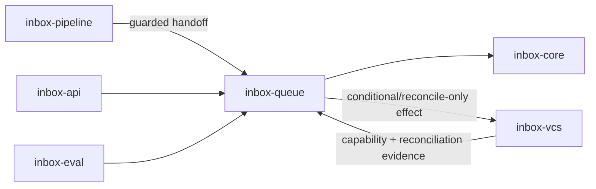

# Module: inbox-queue

<!--SECTION:MODULE_VISION-->

## 1. Module Vision

`inbox-queue` владеет per-MR task/effect execution, `ReviewProposal`, гибридным
`ReviewActionPackage`, решениями оператора и intent-preserving automation. Queue
принимает от pipeline только freshness-guarded handoff для exact immutable manifest
key, сохраняет guard во всех производных intents и не считает внешний GitLab effect
подтверждённым без provider precondition либо reconciliation.

Parent: [agent-inbox](../agent-inbox.spec.md), прежде всего FR-016–027, FR-048,
FR-052 и NFR-004–006. Pipeline владеет Review Contract, completeness verdict и
semantic recommendation input; queue владеет proposal/package/decision/effect/outcome.

<!--/SECTION:MODULE_VISION-->

<!--SECTION:MODULE_USAGE_EXAMPLE-->

## 2. Module Usage Example

```ts
const handoff = await coordinator.acceptGuardedHandoff(pipelineHandoff);
if (handoff.deliveryStatus !== 'ACCEPTED') return handoff;

const packageView = ReviewActionPackage.from(handoff);
const decision = packageView.recordDecision(operatorSelection);
const queued = await effectQueue.enqueue(decision.toGuardedEffects());
const outcomes = await coordinator.dispatchAndReconcile(queued);

const directOutcome = await coordinator.executeIndependentOperatorCommand({
  command: operatorCommand,
}); // classifier derives zero ref set; own gates; no proposal
```

`acceptGuardedHandoff` сохраняет exact `ReviewPublicationHandoff` record и его digest
byte-equivalent, без DTO translation, derived defaults или переименования полей.
Provider capability/revision всё равно перечитывается непосредственно перед каждым
dispatch: изменение snapshot инвалидирует либо reclassify только `queued` effects и
никогда не переписывает уже принятый handoff.

Перед каждым effect coordinator заново сверяет newest observed MR state и provider
capability. При поддерживаемой conditional precondition GitLab сам отклоняет stale
mutation. `reconcile-only` effect после единственного write остаётся `unconfirmed` до
обязательного read-after-effect с исходом `applied | not-applied | ambiguous`;
`unsupported` не создаёт effect/request, а `ambiguous` никогда не ретраится вслепую.
Новое observed состояние инвалидирует только `queued` intents, для которых внешний
write ещё не начинался, сохраняет пакет видимым и инициирует новую delta через
core/pipeline. Уже `dispatching | unconfirmed` effect остаётся связан со старым guard
и обязательно завершается reconciliation как `applied | not-applied | ambiguous`;
только последующий ещё не отправленный остаток инвалидируется.

Прямая operator-команда может не ждать Review Completeness `PASS` только как
`operator-independent`: deterministic classifier доказывает нулевой набор прямых и
скрытых current-round artifact/finding/proposal refs. Любая такая ссылка переводит
команду в `round-derived`, где обязателен normal guarded handoff. Independent path не
создаёт proposal и никогда не используется automatic policy.

<!--/SECTION:MODULE_USAGE_EXAMPLE-->

<!--SECTION:ENTITY_INVENTORY-->

## 3. Entity Inventory (Closed-World)

| Name                      | Type         | Purpose                                                            |
| ------------------------- | ------------ | ------------------------------------------------------------------ |
| `ReviewTask`              | Entity       | Typed per-MR unit of work.                                         |
| `ReviewTaskRegistry`      | Service      | Catalog dependencies, exclusions, dedup and session policy.        |
| `ReviewActionCatalog`     | Service      | Canonical action kinds, gates, permissions and execution binding.  |
| `TaskExecutorPort`        | Port         | Execute tasks with per-MR ordering and cross-MR parallelism.       |
| `LocalTaskExecutor`       | Adapter      | Single-process production executor.                                |
| `ReviewProposal`          | Entity       | One candidate operator or automatic action.                        |
| `ReviewDecision`          | Entity       | Operator selection/edit/rejection or justified automatic decision. |
| `ReviewActionPackage`     | Entity       | Coherent set of independent and alternative actions.               |
| `ReviewGuardedIntent`     | Value Object | Fresh pipeline handoff identity и immutable dispatch guard.        |
| `ReviewEffect`            | Value Object | Idempotent mutation intent с guarded либо direct-target identity.  |
| `ReviewEffectQueue`       | Entity       | Durable ordered state каждого effect до подтверждённого outcome.   |
| `ReviewOutcome`           | Entity       | Reconciled `applied`, `not-applied` или `ambiguous` с evidence.    |
| `ReviewAutomationPolicy`  | Service      | Resolve fixed allowed threads and restore prior approve.           |
| `ReviewEffectCoordinator` | Service      | Execute dependency-aware effects and reconcile outcomes.           |

<!--/SECTION:ENTITY_INVENTORY-->

<!--SECTION:ENTITY_SURFACES-->

## 4. Entity Surfaces

### `ReviewTask`

- **Type:** Entity
- **Purpose:** Typed per-MR unit orchestration work, не внешний effect intent.
- **Public Properties:** task ID/kind; MR; priority; dependencies; supersede key; status; provenance.
- **Public Operations:** enqueue; supersede pending work; mark progress/terminal state; recover.
- **Lifecycle:** durable; sequential внутри MR, разные MR исполняются параллельно.
- **Events Emitted:** `ReviewTaskQueued`, `ReviewTaskSuperseded`, `ReviewTaskCompleted`.
- **Errors & Degradation:** task failure локален и видим; acknowledged task не дублируется при recovery.
- **Consumers:** Internal — `ReviewTaskRegistry`, `TaskExecutorPort`; External — pipeline, API, sync triggers.

### `ReviewTaskRegistry`

- **Type:** Service
- **Purpose:** Закрытый каталог зависимостей, exclusions, dedup, supersede и session policy.
- **Public Properties:** registry version; task definitions.
- **Public Operations:** resolve task definition; validate DAG; derive dedup/supersede identity.
- **Lifecycle:** immutable catalog loaded at boot.
- **Events Emitted:** N/A.
- **Errors & Degradation:** unknown kind или cycle отклоняется до enqueue.
- **Consumers:** Internal — `TaskExecutorPort`, `ReviewEffectCoordinator`; External — eval.

### `TaskExecutorPort`

- **Type:** Port
- **Purpose:** Test seam для per-MR ordering, recovery и cross-MR parallelism.
- **Public Properties:** N/A.
- **Public Operations:** enqueue; claim; checkpoint; recover; expose progress.
- **Lifecycle:** process adapter поверх durable journal.
- **Events Emitted:** N/A.
- **Errors & Degradation:** ambiguous claim fail-closed; recovery не повторяет acknowledged terminal task.
- **Consumers:** Internal — `ReviewTaskRegistry`, `ReviewEffectCoordinator`; External — deterministic test adapter.

### `LocalTaskExecutor`

- **Type:** Adapter
- **Purpose:** Single-process production implementation `TaskExecutorPort`.
- **Public Properties:** active MR lanes; journal checkpoint.
- **Public Operations:** implement enqueue/claim/checkpoint/recover/progress.
- **Lifecycle:** process-scoped; state восстанавливается из journal.
- **Events Emitted:** N/A.
- **Errors & Degradation:** lane failure не останавливает другие MR.
- **Consumers:** Internal — composition root; External — N/A.

### `ReviewActionCatalog`

- **Type:** Service
- **Purpose:** Единственный closed catalog action kinds и их safety policy.
- **Public Properties:** catalog version; action definitions; closed `VcsEffectKind` capability/policy table; per-kind direct-target permission/allowlist/freshness policy.
- **Public Operations:** register typed action kind with manual/automatic mode, gates, permission policy, dependencies and effect binding; total-map every closed `VcsEffectKind` to exactly `conditional-precondition`, `reconcile-only` or `unsupported`; deterministically classify effect origin; enumerate package candidates and unavailable-action evidence.
- **Lifecycle:** closed catalog loaded at boot; extensions require spec/task update.
- **Events Emitted:** N/A.
- **Errors & Degradation:** unknown action kind/capability is rejected before proposal or execution; `unsupported` produces an unavailable proposal with evidence and zero effect/request.
- **Consumers:** Internal — package builder, `ReviewAutomationPolicy`, `ReviewEffectCoordinator`; External — eval.

### `ReviewProposal`

- **Type:** Entity
- **Purpose:** Queue-owned candidate manual/automatic action derived from one accepted guarded handoff.
- **Public Properties:** proposal ID; guarded intent; action kind/payload; dependencies; alternative group; default selection; rationale; availability plus unavailable evidence; provenance; status.
- **Public Operations:** edit allowed payload; select/deselect; invalidate; derive guarded effect after decision.
- **Lifecycle:** immutable revisions; stale guarded intent prevents effect derivation but remains observable.
- **Events Emitted:** `ReviewProposalPrepared`, `ReviewProposalInvalidated`.
- **Errors & Degradation:** missing guard, unknown action или incomplete provenance отклоняет proposal; known `unsupported` capability сохраняет proposal как unavailable и запрещает effect derivation.
- **Consumers:** Internal — `ReviewActionPackage`, `ReviewDecision`; External — dashboard/API.

### `ReviewDecision`

- **Type:** Entity
- **Purpose:** Фиксирует operator selection/edit/rejection либо доказанное automatic restoration intent.
- **Public Properties:** decision ID; package/guard; selected proposal revisions; actor/mode; reason; time.
- **Public Operations:** accept/reject; validate alternatives/dependencies; derive effects.
- **Lifecycle:** immutable; один decision revision на apply attempt.
- **Events Emitted:** `ReviewDecisionRecorded`.
- **Errors & Degradation:** invalid selection не создаёт ни одного effect.
- **Consumers:** Internal — `ReviewEffectQueue`, `ReviewEffectCoordinator`; External — API/projections.

### `ReviewActionPackage`

- **Type:** Entity
- **Purpose:** Queue-owned coherent UI/state unit independent checkboxes, single-choice alternatives и ordered dependencies.
- **Public Properties:** package ID/revision; guarded intent; proposals; selection; stale/apply state; per-action outcomes.
- **Public Operations:** select defaults; change selection; validate; invalidate; attach visible effect/outcome state.
- **Lifecycle:** один package на accepted handoff/round; новое MR state делает queued/not-yet-written remainder stale, но не удаляет пакет и не отменяет reconciliation уже write-started effects.
- **Events Emitted:** `ReviewActionPackagePrepared`, `ReviewActionPackageInvalidated`, `ReviewActionPackageProgressed`.
- **Errors & Degradation:** partial failure принадлежит конкретному action/effect; package остаётся доступен для чтения.
- **Consumers:** Internal — `ReviewDecision`, `ReviewEffectQueue`; External — dashboard/API.

### `ReviewGuardedIntent`

- **Type:** Value Object
- **Purpose:** Переносит freshness proof pipeline handoff без переноса proposal ownership в pipeline.
- **Public Properties:** exact immutable `ReviewPublicationHandoff` schema, без добавлений: `handoffId`; `manifestKey`; `manifestRef`; `contractRef`; `verdictRef`; `guardedTransitionId`; `acceptedObservedRevision`; action-specific `capabilitySnapshot`; `capabilityVersion`; `dispatchPolicy`; `recommendationDigest`; `provenance`; `deliveryStatus`.
- **Public Operations:** verify exact schema and digest; persist/replay the byte-equivalent record without DTO translation, field rename or defaulting; derive stable proposal/effect guard by reference; compare manifest key with newest observed state while preserving accepted bytes.
- **Lifecycle:** immutable; queue принимает только successful `ReviewPublicationHandoff`, сохраняет exact record/digest idempotently и копирует его identity по reference во все downstream intents. Live capability recheck создаёт отдельное dispatch observation и не мутирует handoff.
- **Events Emitted:** N/A.
- **Errors & Degradation:** missing/extra/renamed/defaulted field, digest mismatch, conflicting replay, non-PASS `verdictRef`, mismatched manifest key или unsuccessful `deliveryStatus` fail-closed.
- **Consumers:** Internal — `ReviewProposal`, `ReviewActionPackage`, `ReviewDecision`, `ReviewEffect`, `ReviewEffectCoordinator`; External — API/eval diagnostics.

### `ReviewEffect`

- **Type:** Value Object
- **Purpose:** Идемпотентное внешнее mutation intent с точной guard/precondition policy.
- **Public Properties:** effect ID; closed origin `round-derived | operator-independent`; action kind/payload digest; dependency IDs; idempotency key; provider conditional revision when supported; dispatch policy; attempt identity; actor; provenance/audit. `round-derived` additionally requires decision/proposal revision and guarded intent identity. `operator-independent` requires explicit operator command ID, direct target identity/version, empty current-round artifact/finding/proposal ref set and own permission/allowlist decision evidence.
- **Public Operations:** deterministically classify origin from canonical payload/dependencies/provenance; enumerate direct and transitive round refs; route any nonzero/hidden round ref to guarded `round-derived`; derive stable ID; verify guard or independent-command gates; bind current provider precondition; preserve same identity on reconciliation/retry decision.
- **Lifecycle:** immutable; новый payload/origin/guard-or-direct-target создаёт новый effect; один effect имеет последовательность dispatch/reconciliation states.
- **Events Emitted:** N/A.
- **Errors & Degradation:** round-derived effect без fresh guard или требуемой conditional revision не dispatch-ится; independent effect с unknown/hidden/nonzero round refs fail-closed как guarded-required; failed direct permission/allowlist/target freshness creates no effect/request; `ambiguous` не порождает blind retry.
- **Consumers:** Internal — `ReviewEffectQueue`, `ReviewEffectCoordinator`; External — VCS effect port.

### `ReviewEffectQueue`

- **Type:** Entity
- **Purpose:** Durable EffectQueue boundary для dependency-aware dispatch и confirmation state каждого effect.
- **Public Properties:** origin; for round-derived — package/decision/guard refs; for operator-independent — operator command audit/direct target refs; ordered effect entries; entry state `queued | dispatching | unconfirmed | reconciled | invalidated`; dependencies; attempts; reconciliation evidence refs.
- **Public Operations:** enqueue idempotently; claim ready effect; durably mark external-write-started before dispatch; mark unconfirmed; attach outcome; invalidate only queued/not-yet-written remainder; recover dispatching/unconfirmed via reconciliation; expose package projection.
- **Lifecycle:** один queue aggregate на guarded decision либо один explicit independent operator command; сохраняется раньше dispatch и переживает crash.
- **Events Emitted:** `ReviewEffectQueued`, `ReviewEffectUnconfirmed`, `ReviewEffectReconciled`, `ReviewEffectInvalidated`.
- **Errors & Degradation:** event/crash during dispatch/readback не инвалидирует уже written effect и не запускает повторный write: он остаётся old-guard `dispatching | unconfirmed` до reconciliation; corruption/identity conflict блокирует только aggregate.
- **Consumers:** Internal — `ReviewEffectCoordinator`; External — journal, API/dashboard, eval.

### `ReviewOutcome`

- **Type:** Entity
- **Purpose:** Подтверждённая reconciliation classification одного effect.
- **Public Properties:** outcome ID; effect/origin and guard-or-direct-target refs; status `applied | not-applied | ambiguous`; provider response; read-after-effect observation identity/revision; evidence; attempts; time; provenance.
- **Public Operations:** classify from provider conditional response/readback; supersede an intermediate unconfirmed state; expose retry eligibility.
- **Lifecycle:** immutable revisions; каждый external-write-started effect обязан получить `applied | not-applied | ambiguous`, даже если manifest уже stale; `ambiguous` требует operator/new observation, а не automatic retry.
- **Events Emitted:** `ReviewOutcomeRecorded`.
- **Errors & Degradation:** transport success без provider/readback evidence не равен `applied`; impossible classification остаётся `ambiguous`.
- **Consumers:** Internal — `ReviewEffectQueue`, `ReviewActionPackage`; External — journal, API/dashboard, eval.

### `ReviewAutomationPolicy`

- **Type:** Service
- **Purpose:** Разрешает только восстановление уже доказанного operator intent.
- **Public Properties:** allowlisted thread owners; prior approval evidence; required coverage/blocking gates.
- **Public Operations:** prove auto-resolve/restore-approve preconditions; return proposal/manual fallback on failed gate.
- **Lifecycle:** stateless; evaluated against newest state before effect creation и dispatch.
- **Events Emitted:** N/A.
- **Errors & Degradation:** missing evidence даёт proposal/no action, никогда unsafe automation.
- **Consumers:** Internal — `ReviewActionCatalog`, `ReviewEffectCoordinator`; External — scheduler triggers.

### `ReviewEffectCoordinator`

- **Type:** Service
- **Purpose:** Единственный manual/automatic dispatcher и reconciler dependency-aware effects.
- **Public Properties:** current provider capability version; newest observed MR key; reconciliation policy.
- **Public Operations:** accept/persist exact immutable pipeline handoff record/digest; total-map current `VcsEffectKind` capability; emit unavailable proposal and zero effect for unsupported; enqueue guarded decision effects; execute an explicitly operator-independent command directly without proposal only after zero-round-ref classification and its own permission/allowlist/direct-target freshness gates; recheck manifest/head/cursor or independent direct-target revision plus provider capability/revision immediately before each not-yet-written dispatch; invalidate or reclassify queued effects when live capability differs from accepted snapshot without rewriting handoff; bind conditional precondition or one-write reconcile-only policy; dispatch; mandatory reconcile written effects; invalidate queued remainder; continue independent actions.
- **Lifecycle:** process service поверх durable queue; recovery начинает с provider read/reconciliation, не повторного write.
- **Events Emitted:** `ReviewGuardedHandoffAccepted`, `ReviewEffectDispatchRequested`, `ReviewDeltaRequested`.
- **Errors & Degradation:** reconcile-only держит one-write effect `unconfirmed` до readback; unsupported не создаёт VCS request; stale newest state инвалидирует queued remainder, но dispatching/unconfirmed old-guard effects продолжают reconciliation; independent-command classification/gate ambiguity creates no effect; independent branches continue.
- **Consumers:** Internal — scheduler/API commands; External — VCS effect/reconciliation ports.
<!--/SECTION:ENTITY_SURFACES-->

<!--SECTION:MODULE_CONTRACTS-->

## 5. Module Contracts (DbC)

### Module-level invariants

- Queue принимает recommendation input только через idempotent guarded handoff с
  fresh `PASS` и exact immutable `ReviewPublicationHandoff` schema. Queue сохраняет
  record/digest byte-equivalent без translation/defaulting.
- Исключение FR-048 является только положительным manual runtime path: effect с closed
  origin `operator-independent` может быть создан без current Review Completeness
  `PASS` iff canonical payload, dependencies и provenance содержат zero direct/
  transitive current-round artifact, finding и proposal refs. Любой nonzero/hidden/
  unknown ref детерминированно маршрутизирует команду как `round-derived` и требует
  fresh guarded handoff; manual label сам по себе gate не обходит.
- `operator-independent` всегда имеет explicit operator actor/command audit, не
  создаёт proposal и не доступен automation policy. Он всё равно проходит permission,
  allowlist, provider capability и freshness/version gate своей direct target.
- `ReviewProposal`, `ReviewActionPackage`, decision, effect и outcome сохраняют один
  guarded intent identity; смена manifest key запрещает derivation/dispatch remainder.
- Recommended actions selected by default; mutually exclusive choices не могут быть
  выполнены вместе; dependencies explicit.
- Новое observed MR state инвалидирует только `queued`/not-yet-written intents
  previous package. `dispatching | unconfirmed` effects остаются на старом guard до
  обязательного outcome; subsequent queued remainder инвалидируется. Package,
  selections, outcomes и причины остаются наблюдаемыми.
- Перед каждым effect dispatch coordinator повторно читает newest state и current
  provider capability/revision; изменение accepted snapshot инвалидирует/reclassify
  только queued effects и никогда не изменяет accepted handoff bytes/digest.
- Каждый closed `VcsEffectKind` имеет total capability mapping: `conditional` требует
  conditional dispatch; `reconcile-only` разрешает ровно один write, затем
  `unconfirmed` и mandatory readback; `unsupported` создаёт unavailable proposal с
  evidence и не создаёт effect/VCS request.
- Единственные reconciled outcomes: `applied | not-applied | ambiguous`; transport
  success, timeout и exception сами по себе не являются outcome.
- Crash, новое событие или stale detection во время write/readback не отменяет
  reconciliation уже начатого effect и не разрешает второй write.
- `ambiguous` никогда не ретраится вслепую. Retry допустим только после reconciliation,
  доказавшей `not-applied`, с тем же idempotency/guard identity и новым attempt record.
- Independent effects continue after sibling `not-applied`/`ambiguous`; dependent
  effects блокируются, а не маскируются общим package failure.
- Auto-resolve требует verified fix и разрешённого owner; auto-approve только
  восстанавливает ранее выраженный approve после fresh full coverage и отсутствия
  blocking finding.
- Manual и automatic actions используют один `ReviewActionCatalog`,
  `ReviewEffectQueue` и `ReviewEffectCoordinator`.

### Port: `TaskExecutorPort`

- **Runtime Backing:** `real-runtime`
- **Verification Levels:** `contract`, `unit`, `integration`, `e2e`
- **Deferred Runtime Scope:** None.

**Contract (DbC):**

- Preconditions: complete task identity, MR lane and journal available.
- Postconditions: task durably queued/claimed/checkpointed; acknowledged terminal task
  не выполняется повторно; different MR lanes progress independently.
- Invariants: one active task per MR lane; supersede affects pending work only.

### Service: `ReviewEffectCoordinator`

- **Runtime Backing:** `real-runtime`
- **Verification Levels:** `unit`, `contract`, `integration`, `e2e`
- **Deferred Runtime Scope:** provider capability matrix зависит от inbox-vcs и
  fail-closed через reconcile-only policy.

**Contract (DbC):**

**Preconditions:**

- Для `round-derived`: byte-equivalent accepted `ReviewPublicationHandoff`
  record/digest содержит exact canonical fields.
- Для `operator-independent`: explicit operator command identity/actor, canonical
  payload/dependency/provenance graph с доказанным empty current-round ref set и
  положительные permission/allowlist/direct-target freshness gates; completeness
  verdict текущего round не является precondition.
- Complete effect plus guarded decision or independent operator-command audit persisted
  in `ReviewEffectQueue`.
- Newest observed manifest key and current provider capability/revision читаются
  непосредственно перед каждым dispatch.

**Postconditions:**

- Stale mismatch before write invalidates queued remainder and requests new delta.
- Capability snapshot mismatch invalidates/reclassifies queued effects; accepted
  handoff остаётся unchanged.
- Every closed `VcsEffectKind` maps exactly once. Conditional operation carries exact
  provider precondition; reconcile-only performs at most one write and remains
  `unconfirmed` until mandatory read-after-effect; unsupported produces unavailable
  proposal evidence and zero effect/VCS request.
- Every write-started effect eventually has visible reconciled outcome or visible
  unresolved reconciliation failure even when newer event arrives during readback.
- Independent command создаёт ровно один audited effect без proposal только после own
  gates; failed classification/gate создаёт zero effect/VCS request. Any discovered
  round ref routes through guarded path before enqueue.

**Invariants:**

- No blind retry; same effect ID/payload/guard-or-direct-target across attempts.
- External GitLab mutation is never claimed atomic with local journal; package state
  remains queryable throughout partial execution/recovery.
- Queue never translates, defaults or rewrites accepted handoff fields.
- Origin classification closed and deterministic; automation cannot construct
  `operator-independent`; provenance сохраняет classifier version, examined ref set,
  permission/allowlist/freshness decisions, operator command и resulting effect/outcome.
- Classifier never synthesizes a proposal: guarded reroute consumes an existing
  proposal/package revision or fails closed, so no proposal duplication is possible.

<!--/SECTION:MODULE_CONTRACTS-->

<!--SECTION:PUBLIC_OPTIONS-->

## 6. Public Options & Policies

| Option / policy     | v0 contract binding                                                                                                                                                        |
| ------------------- | -------------------------------------------------------------------------------------------------------------------------------------------------------------------------- |
| Priority            | operator action > human/GitLab trigger > quiet-time background work.                                                                                                       |
| Guard identity      | Exact `MR + head SHA + event cursor`, handoff and local guarded transition; immutable downstream.                                                                          |
| Effect origin       | Closed `round-derived \| operator-independent`; independent requires zero current-round artifact/finding/proposal refs and explicit operator actor.                        |
| Provider capability | Versioned total matrix for every closed `VcsEffectKind`: `conditional-precondition`, `reconcile-only` or `unsupported`; unknown fails closed.                              |
| Confirmation        | `queued → dispatching → unconfirmed → reconciled`; no optimistic applied.                                                                                                  |
| Outcome             | Closed `applied \| not-applied \| ambiguous`.                                                                                                                              |
| Retry               | Only after reconciled `not-applied`; same effect/idempotency/guard identity; never blind after ambiguous.                                                                  |
| Invalidation        | Manifest-key mismatch invalidates queued/not-yet-written remainder; dispatching/unconfirmed old-guard effects still reconcile, then no subsequent stale intent dispatches. |
| Automation          | Explicit restore-intent policies only; generic accept-rate promotion absent in v0.                                                                                         |
| Provenance          | Proposal/decision/effect/outcome retain MR, manifest, task, session/model, time and source refs.                                                                           |

<!--/SECTION:PUBLIC_OPTIONS-->

<!--SECTION:FILE_STRUCTURE-->

## 7. File Structure

```text
inbox-queue/
├── types/
│   ├── review-guarded-intent.type.ts
│   └── review-effect.type.ts
├── model/
│   ├── review-task.ts
│   ├── review-proposal.ts
│   ├── review-decision.ts
│   ├── review-action-package.ts
│   ├── review-effect-queue.ts
│   └── review-outcome.ts
├── ports/
│   └── task-executor.port.ts
├── adapters/
│   └── local-task-executor.adapter.ts
├── registry/
│   ├── review-task-registry.ts
│   └── review-action-catalog.ts
├── automation/
│   └── review-automation-policy.ts
└── effects/
    └── review-effect-coordinator.ts
```

**File Mapping:** Value Objects живут отдельными `*.type.ts`; durable Entities — в
`model/`; Port и Adapter физически разделены. `ReviewEffectQueue` — единственный
durable queue aggregate внешних effects, `ReviewEffectCoordinator` — единственный
dispatcher/reconciler. Tests зеркалят структуру в
`test/agent-inbox/inbox-queue/`; каждый файл ≤1500 строк.
`types/review-guarded-intent.type.ts` reuse/persists canonical
`ReviewPublicationHandoff` schema byte-equivalent; локальный DTO или defaulting layer
для этого handoff запрещён.
`types/review-effect.type.ts` владеет closed origin discriminant и exhaustive ref-set
classification; отдельная independent-command proposal/entity не создаётся.

<!--/SECTION:FILE_STRUCTURE-->

<!--SECTION:MODULE_DECISION_LOG-->

## 8. Module Decision Log

### D-QUEUE-01 — Package decision, per-effect confirmation

- **Status:** active
- **Recorded:** session ModuleDecomposition, agent-inbox/inbox-queue
- **Why:** оператор принимает связный пакет, но частичный внешний результат можно
  честно подтвердить только отдельно для каждого effect.
- **Risk accepted:** package projection должна агрегировать несколько confirmation states.
- **Rejected alternatives:** один общий package outcome; optimistic applied по HTTP success.

### D-QUEUE-02 — Intent-preserving automation only

- **Status:** active
- **Recorded:** session ModuleDecomposition, agent-inbox/inbox-queue
- **Why:** v0 автоматически восстанавливает только уже доказанное намерение оператора.
- **Risk accepted:** неоднозначные ответы автора всегда возвращаются оператору.
- **Rejected alternatives:** broad autonomy/accept-rate promotion.

### D-QUEUE-03 — Guarded intents and reconciliation-first effects

- **Status:** active
- **Recorded:** session ModuleDecomposition, agent-inbox/inbox-queue, freshness refine
- **Why:** локальный fresh handoff не гарантирует, что GitLab не изменится перед
  mutation; guard должен жить во всём package/effect lifecycle, а факт применения
  обязан подтверждаться provider precondition или read-after-effect.
- **Risk accepted:** `reconcile-only` operations оставляют наблюдаемое `unconfirmed`
  окно и могут завершиться `ambiguous` без automatic retry; `unsupported` capabilities
  уменьшают доступный action catalog вместо попытки best-effort write.
- **Rejected alternatives:** pre-effect read как достаточная гарантия; blind retry;
удаление stale package из UI.
<!--/SECTION:MODULE_DECISION_LOG-->

<!--SECTION:INTER_MODULE_DEPENDENCIES-->

## 9. Inter-Module Dependencies

- **Depends on:**
  - [core](../inbox-core/inbox-core.spec.md) — newest observed manifest key,
    per-MR journal transaction, durable task/effect state и delta request;
  - [pipeline](../inbox-pipeline/inbox-pipeline.spec.md) — idempotent guarded
    `ReviewPublicationHandoff` с fresh PASS и semantic recommendation inputs;
  - [VCS](../inbox-vcs/inbox-vcs.spec.md) — current provider capability,
    conditional effect dispatch и read-after-effect reconciliation.
- **Provides directly to:** [API](../inbox-api/inbox-api.spec.md),
  [eval](../inbox-eval/inbox-eval.spec.md). Dashboard consumes observable package,
  queue, confirmation and outcome state transitively through API.



<!--/SECTION:INTER_MODULE_DEPENDENCIES-->

<!--SECTION:HANDOFF-->

## 10. Handoff to task-scaffolding

- **Implementation files to be created/modified:** files from §7 after scaffolder
  inventories existing registry/queue/executor; consolidate duplicate effect executors
  behind `ReviewEffectCoordinator`, do not create a second automation executor.
- **Test files to be created/modified:** mirrored contract/unit/integration tests under
  `test/agent-inbox/inbox-queue/`; real-effect scenarios coordinated with inbox-eval.
- **Stack dependencies:**
  - Language: `TypeScript` (`ai/directives/coding/typescript-rules.xml`)
  - Test framework: `node:test` (`ai/directives/testing/common.xml`, `ai/directives/testing/node-test.xml`)
- **Module Rules Additions:** None.
- **Open risks & validation needs:** actual GitLab conditional-precondition support is
  action-specific; capability mismatch must fail closed. Legacy effect attempts need
  migration into explicit `unconfirmed/reconciled` state without inventing applied.

### Scaffolding coverage obligations

1. Handoff BDD: queue accepts only exact immutable fields `handoffId`, `manifestKey`,
   `manifestRef`, `contractRef`, `verdictRef`, `guardedTransitionId`,
   `acceptedObservedRevision`, action-specific `capabilitySnapshot`,
   `capabilityVersion`, `dispatchPolicy`, `recommendationDigest`, `provenance`,
   `deliveryStatus`; persists record/digest byte-equivalent; non-PASS, stale/mismatched
   key, missing/extra/renamed/defaulted field или conflicting digest replay rejected;
   same record+digest replay idempotent.
2. Ownership BDD: queue, not pipeline, creates `ReviewProposal`, package, decision and
   effect; exact guard identity survives every derivative unchanged.
   Explicit operator-independent command bypasses proposal creation, not queue effect/
   permission ownership.
3. Capability-totality BDD: every closed `VcsEffectKind` maps exactly once;
   conditional kind carries provider revision; reconcile-only kind permits one write;
   unsupported kind yields unavailable proposal evidence and creates zero effect/VCS request.
   A live capability/revision change immediately before dispatch invalidates/reclassifies
   only queued effects and leaves accepted handoff bytes/digest unchanged.
4. Conditional/reconcile-only BDD: conditional rejection produces `not-applied`;
   reconcile-only enters `unconfirmed` after its one write; read-after-effect produces
   exact `applied | not-applied | ambiguous`; transport success alone is not applied.
5. Ambiguity/recovery BDD: crash/timeout resumes with provider read, not duplicate
   mutation; ambiguous remains visible and cannot automatic retry.
6. Freshness BDD: a newly observed head SHA/event cursor invalidates only queued/
   not-yet-written remainder and requests delta. A concurrent event after write starts,
   including during readback, leaves dispatching/unconfirmed effect on the old guard
   until exact reconciliation outcome, then prevents subsequent stale intent dispatch;
   package/selections/outcomes remain visible.
7. Partial execution BDD: independent effects continue, dependent effects block, each
   outcome is attached to its action while package stays queryable.
8. Automation BDD: verified allowed-thread resolve and prior-approve restoration use
   the same guarded EffectQueue/coordinator path as manual actions.
9. Crash/readback BDD:
   - crash before durable write-started marker may safely resume/dispatch once;
   - crash or event after write-started marker resumes with readback only, never a
     second write, and finishes `applied | not-applied | ambiguous` before invalidated
     remainder closes.
10. FR-048 independent-command BDD: with no current-round PASS, explicit operator
    command whose canonical payload/dependencies/provenance have zero current-round
    artifact/finding/proposal refs passes its own permission, allowlist and direct-target
    freshness gates, creates exactly one audited effect and no proposal, then uses the
    normal EffectQueue/coordinator/reconciliation path.
11. FR-048 bypass rejection BDD: any direct, transitive, hidden or unclassifiable
    current-round ref changes origin to `round-derived`; without fresh PASS/handoff it
    creates zero effect/request. Automation cannot select the independent origin, and
    failed independent permission/allowlist/target freshness also creates zero effect.

<!--/SECTION:HANDOFF-->
