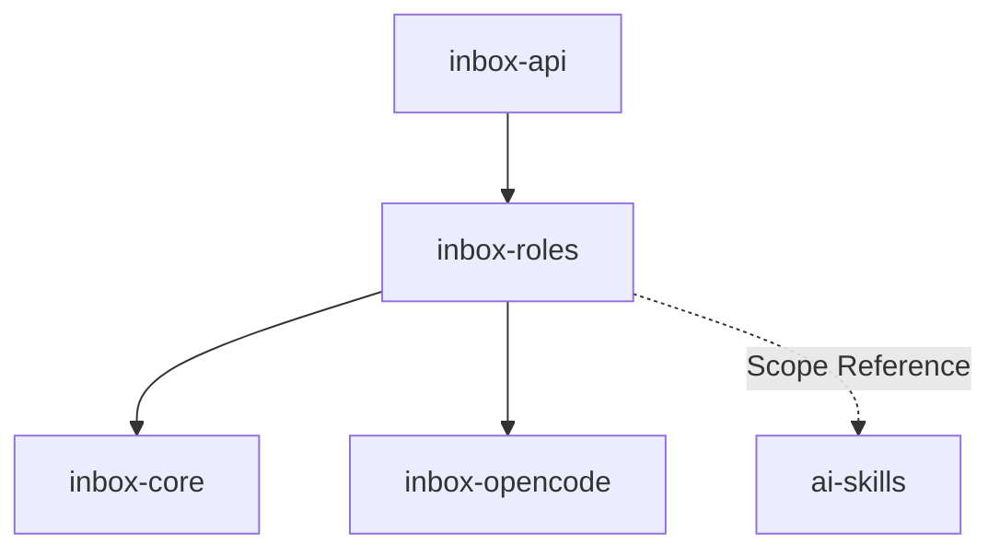

# Module: inbox-roles

> Parent scope: [`../agent-inbox.spec.md`](../agent-inbox.spec.md)

<!--SECTION:MODULE_VISION-->

## 1. Module Vision

Сердце serve-режима. Загружает роли (TypeScript-модули с графом узлов), планирует
обработку MR, выполняет узлы, классифицирует исходы, восстанавливает по лесенке.
Получает данные от inbox-core, гоняет агентные сессии через inbox-opencode.

**Принцип разделения труда (NFC-SV-07):** агентная сессия только
читает код в worktree и пишет артефакт (находки + предлагаемые действия + готовый текст).
Все `vcs-*` вызовы (чтение обсуждений, реакции, ответы, approve, резолв) делает движок
детерминированно — агент их не видит. Это снимает наблюдаемую боль: агент криво дёргает
инструменты и портит ответы.

**Reviewer-роль — паритет с CLI-конвейером (D57/D70).** Роль обязана выражать весь
жизненный цикл MR тремя ветками одного графа, не хуже, чем сейчас делает скилл:

- `review_needed` — первое ревью: полная батарея (worktree → дорожки → агентные сессии →
  синтез → отчёт).
- `reply_needed` — обработка тредов: код уже отревьюен, идёт диалог; проверить заявленные
  фиксы против диффа, среагировать (👍/resolve/reply), без повторной полной батареи.
- `update-review` — дельта: автор допушил коммиты (fast_forward), смотрим только изменение
  с прошлого ревью, не весь MR заново.

Если этот жизненный цикл не ложится в граф узлов — контракт неверен.

<!--/SECTION:MODULE_VISION-->

<!--SECTION:MODULE_USAGE_EXAMPLE-->

## 2. Module Usage Example

```ts
import { RoleEngine, RoleScheduler } from '@/inbox-roles';

const engine = new RoleEngine();
await engine.loadAll(); // → reviewer.role.ts, author.role.ts
engine.activate('reviewer');

const scheduler = new RoleScheduler({ engine, store, vcs, opencode });

// tick: polling → delta → assign → step() активных → escalate
await scheduler.tick();

// Ручное назначение с дашборда (работает и для неактивной роли — SV-08)
await scheduler.assignManual(mrUrl, 'reviewer', { canPost: false });
```

<!--/SECTION:MODULE_USAGE_EXAMPLE-->

<!--SECTION:ENTITY_INVENTORY-->

## 3. Entity Inventory (Closed-World)

_Полный список сущностей модуля. Любое введение сущности execution-агентом помимо этого списка — drift._

| Name                | Type         | Purpose                                                                                                                                 |
| ------------------- | ------------ | --------------------------------------------------------------------------------------------------------------------------------------- |
| `RoleEngine`        | Service      | Загрузка `.role.ts` модулей, регистрация, активация.                                                                                    |
| `RoleScheduler`     | Service      | Tick: polling → delta → assign → step → escalate. Ручное назначение.                                                                    |
| `RoleInstance`      | Entity       | Экземпляр роли на MR: текущий узел + счётчики continue/restart + права. Владеет переходами `status` артефактов.                         |
| `RoleNode`          | Value Object | Узел графа: `prep` / `session` / `gate` / `ask` / `effect`.                                                                             |
| `OutcomeClassifier` | Service      | Классификация исхода AI-узла: OK / NO_RESULT / PARSE_ERROR / SCHEMA_MISMATCH / SESSION_ERROR / TIMEOUT / INCOMPLETE_ARTIFACT + сигнал.  |
| `ArtifactValidator` | Service      | Механическая валидация task-файлов: секции, схема, mermaid-валидность, coverage ledger, tool-call сверка. Вызывает `inbox-review-plan`. |
| `EffectExecutor`    | Service      | Движок-исполнитель VCS-действий: reconcile-дедуп + `vcs-react`/`vcs-reply`/`vcs-approve`/резолв по артефакту сессии. Идемпотентность.   |
| `RightsEscalator`   | Service      | Нотификации оператору: сразу при готовности результата + напоминание при простое. Права не эскалирует (v1).                             |
| `ReviewerRole`      | Entity       | Роль ревьювера: граф с тремя ветками (review_needed / reply_needed / update-review).                                                    |
| `AuthorRole`        | Entity       | Роль автора: разбор замечаний ревьюеров → сводка + задание + черновики (вариация reviewer-графа).                                       |

<!--/SECTION:ENTITY_INVENTORY-->

<!--SECTION:ENTITY_SURFACES-->

## 4. Entity Surfaces

### `RoleEngine`

- **Type:** Service
- **Purpose:** Загрузка `.role.ts` модулей, регистрация, активация.
- **Public Operations:** `loadAll()`, `activate(name)`, `deactivate(name)`, `list() → RegisteredRole[]`
- **Lifecycle:** Роли загружаются `active: false`; активация — явная (авто-назначение) или ручное назначение работает и без неё (SV-08).
- **Consumers:** `RoleScheduler`, `inbox-api`.

### `RoleScheduler`

- **Type:** Service
- **Purpose:** Оркестрация: tick (polling → шумовой фильтр AI-02 → delta → assign → step → escalate), ручное назначение.
- **Public Operations:** `tick()`, `assignManual(mrUrl, role, rights?)`, `activeCount()`, `listInstances()`, `listUnassigned()`, `getPolledMr(url)`, `findInstance(url)`
- **Lifecycle:** Запускается по таймеру serve. Tick взаимоисключающий.
- **Consumers:** Таймер serve, `inbox-api` (через BoardProviderReal).

### `RoleInstance`

- **Type:** Entity
- **Purpose:** Один MR под управлением одной роли. Стейт-машина графа.
- **Public Properties:** `id`, `role`, `mr`, `currentNode`, `continueCount`, `restartCount`, `rights`, `createdAt`
- **Public Operations:**
  - `step()` — выполнить текущий узел, классифицировать исход, перейти по edge
  - `onContextUpdate(mrContext)` — при изменении MR (headChanged/approvalReset) переоткрыть затронутые узлы
  - `getBoardView()` — данные для дашборда (текущий узел + прогресс дорожек)
- **Lifecycle:** Создаётся Scheduler'ом; при рестарте serve восстанавливается от артефактов (SV-13).
- **Consumers:** `RoleScheduler`, `RightsEscalator`, `inbox-api`.

### `RoleNode`

- **Type:** Value Object
- **Purpose:** Типизированный узел графа роли.
- **Variants:**
  - `{ kind: 'prep', run(ctx): PrepResult }` — **детерминированный код, без LLM**. Готовит worktree/контекст/план, читает обсуждения через `vcs-*`, выбирает ветку по `stage`/`headChanged`. Пишет на диск, но не в VCS.
  - `{ kind: 'session', buildTaskText(ctx, artifacts): string, dir(ctx): string, resultSchema?: JsonSchema, policy: SessionPolicy }` — **агентная opencode-сессия** (cwd + тулы). Директива-система собирается движком через `services/ai-kit` по `nodeId` (агент не хардкодит промпт). Сессия читает код и пишет артефакт; **VCS не трогает**.
  - `{ kind: 'gate', verify(artifacts): GateResult }` — детерминированная проверка артефактов (`ArtifactValidator`).
  - `{ kind: 'ask', question(artifacts): OperatorQuestion }` — формирует пакет действий оператору, ждёт ответ.
  - `{ kind: 'effect', run(ctx, artifacts): Promise<void> }` — публичное действие, исполняет `EffectExecutor` (движок), не агент.
- **`dir(ctx)` контракт (NFC-05):** путь ОБЯЗАН быть поддеревом `ctx.workspace`
  (движок укореняет его под state dir через `StateStore.getStateDir()`). Абсолютные пути / `/tmp` / `os.tmpdir()` — drift.
- **`policy` (session):** `{ promptTimeout, continueMax, restartMax }`; `promptTimeout` — на агентную сессию, в **минутах** (3–10), не секундах (агентный ход многошаговый).
- **Consumers:** `RoleInstance.step()`.

### `OutcomeClassifier`

- **Type:** Service
- **Purpose:** Классификация сырого результата агентной сессии.
- **Classes:** `OK`, `NO_RESULT`, `PARSE_ERROR`, `SCHEMA_MISMATCH(details)`, `SESSION_ERROR`, `TIMEOUT`, `INCOMPLETE_ARTIFACT(details)`
- **Output:** `{ class, remediationSignal }` — сигнал с конкретикой («находки не записаны в файл — используй write», «пустая секция Findings в security»), для continue/restart.
- **Consumers:** `RoleInstance.step()`.

### `ArtifactValidator`

- **Type:** Service
- **Purpose:** Механически проверить, что агент сделал работу по плану. Не качество текста — структуру.
- **Проверки:**
  - структура: секции task-файла заполнены, `status` корректен, схема таблицы кандидатов, словари токенов (Ось/Вид), стоп-слова (`shared/prompt-lint`);
  - mermaid: диаграммы синтаксически валидны (через библиотеку-парсер, не regexp);
  - **coverage ledger:** каждый файл из `## Область` → либо находки, либо явное «no findings + почему»; находки только с `file:line` из changeset;
  - **tool-call сверка:** какие файлы агент реально открывал (телеметрия сессии из inbox-opencode) против `## Область` — факт, не self-report;
  - self-checklist: шаги директивы отмечены (слабая проверка, но даёт видимый ход + точный remediation).
- **Public Operations:** `validate(dir, stage) → { ok, errors[] }` (обёртка над `inbox-review-plan --validate` + tool-call/coverage).
- **Consumers:** `RoleInstance` (gate-узлы).

### `EffectExecutor`

- **Type:** Service
- **Purpose:** Единственный исполнитель публичных VCS-действий (NFC-SV-07, NFC-SV-07). Берёт предложенные действия из артефакта сессии и выполняет их детерминированно после согласия оператора.
- **Действия:** `vcs-react` (👍 и др.), `vcs-reply` (reply/line/suggestion/edit/delete), `vcs-approve [--revoke]`, резолв тредов, `vcs-draft-note --delete-all`.
- **Дедуп/reconcile:** перед постингом сверяет кандидатов с актуальными тредами (`vcs-discussions --all`), дропает уже покрытое (`AX_POSTING_NO_DUPLICATES`); применяет ThreadModel/ReactionMatrix (posting-rules): 👍+тихий resolve на мой фикс, 👍 без resolve на согласие с пиром, reply на несогласие, `waiting-author` → без действия.
- **Идемпотентность:** маркер `effect_applied` в audit — не постит дважды при restart.
- **Public Operations:** `execute(instance, approvedActions) → EffectResult`
- **Consumers:** `RoleInstance` (effect-узлы), `inbox-api` (после ответа оператора).

### `RightsEscalator`

- **Type:** Service
- **Purpose:** Нотификации оператору. Права НЕ эскалирует (v1, D74).
- **Public Operations:** `notifyReady(instance)` — сразу при переходе в AWAITING_OPERATOR; `remindIdle(instance)` — напоминание при простое (не сбрасывает автономию).
- **Механизм таймера:** `EffectExecutor`/`inbox-api` пишут `operator_action` в audit; Escalator читает последний по MR.
- **Consumers:** `RoleScheduler`.

### `ReviewerRole`

- **Type:** Entity
- **Purpose:** Граф ревьювера — три ветки от `prepare`. См. §4.1.
- **Consumers:** `RoleEngine`, `RoleScheduler`.

### `AuthorRole`

- **Type:** Entity
- **Purpose:** Своя MR (`myRole=author`, D68): разбор замечаний ревьюеров + своя проверка. Вариация reviewer-графа. Граф — §4.2.
- **Активация:** авто (роль активна) — каждый мой MR проходит inbox один раз для self-review сводки (AI-14).
- **Отличия от reviewer:** в треды своего MR находки НЕ пишет; свой MR НЕ апрувит. Выход — три артефакта: `REPORT.md` (Сводка), `FIX_TASK.md` (копируемое задание разработчику), черновики ответов. effect = `vcs-react` (👍 по согласию) + `vcs-reply` (ответы на несогласие/вопрос) + опц. `vcs-mr-edit --description` (архитектурный обзор в тело MR).
- **Consumers:** `RoleEngine`, `RoleScheduler`.

## 4.1 Reviewer graph (три ветки)

`prepare` (prep) читает `stage` + `headChanged` и выбирает ветку:

```
prepare (prep, детерминированный):
  inbox-context → worktree, changeset, stage, headChanged
  vcs-discussions --my --with-drafts → my_drafts (вектор), my_threads (дедуп)
  inbox-review-plan --scaffold → дорожки (security — линза по всему диффу, NFC-SV-09)
  fast-LLM классификатор (слой 2) → Vectors в PLAN.md (intent, костыли); недоступен → skip
  ── выбор ветки ──
  │
  ├─ review_needed → enrich → gate(enriched) → review-fanout
  ├─ reply_needed  → thread-triage
  └─ update-review → delta-review

review-fanout:
  session×N (по дорожке + security-линза + code-review base..HEAD) → gate(filled)
  → synthesize(session) → gate(synthesis) → ask → effect → done

enrich:
  session (одна LLM-сессия с полным набором инструментов: read, grep, write, websearch)
  → читает все .task.md + MR description + worktree → обогащает ## Контекст каждого
  трека (сущности, границы, цель MR, обсуждения, системные риски, web-исследование)
  → gate(enriched): validateReviewReports(dir, 'enriched')

thread-triage:
  session (аннотировать треды: owner/goal/nextActor/status; проверить фиксы против
           диффа; предложить действия + текст) → gate → ask → effect → done
  (полная батарея НЕ запускается)

delta-review:
  session (только дельта base=lastReviewedHeadSha..HEAD: закрыты ли замечания,
           не сломал ли новый код) → gate → synthesize(delta) → ask → effect → done
```

- **Fan-out** — движок инстанцирует N сессий пачками ≤ `maxInstances` (SV-11).
- **Статус узлов/артефактов** переводит движок (NFC-SV-08), не агент.
- **Раунды** — секции `## Round N` в task-файлах; deep-dive/«дослать» = новый раунд с фокусом оператора; агент читает предыдущие раунды из файла (не зацикливается).
- **ask-пакет** (финализация, обязателен даже на чистый approve): `approve` (гейт: нет блокирующих) · N неблокирующих замечаний (каждое — чекбокс с текстом, inline-правка) · 👍 пирам · reply/не согласиться · моя реплика · skip · «дослать» (раунд).

## 4.2 Author graph

```
prepare (prep): inbox-context → worktree; vcs-discussions --all → замечания ревьюеров
                (главный вход); review-plan --scaffold → дорожки (батарея над своим диффом)
  → session: self-review (батарея по своему диффу)
  → session: разбор замечаний ревьюеров (каждое сверить с кодом →
             🔧 нужна правка / 💬 нужен ответ / 👍 согласен)
  → gate (validate: находки + классификация замечаний заполнены)
  → synthesize (session): REPORT.md (Сводка) + FIX_TASK.md (задание разработчику) + черновики ответов
  → gate (validate synthesis)
  → ask: ☑ опубликовать черновики (reply) · ☑ 👍-реакции · ☑ обновить описание MR ·
         ☑ забрать Задание (копировать FIX_TASK.md) · ✕ skip   (approve своего MR НЕТ)
  → effect (движок): vcs-react + vcs-reply + опц. vcs-mr-edit --description
  → done
```

- Артефакт `FIX_TASK.md` — плоский копируемый блок (файл:строка / что не так / почему / правка / кто сказал); на дашборде — в браузере артефактов + кнопка «Копировать задание».
- Находки в треды своего MR не постятся (D68). Раунды/дедуп/принцип «агент предлагает — движок исполняет» (NFC-SV-07) — те же, что у reviewer.
<!--/SECTION:ENTITY_SURFACES-->

<!--SECTION:MODULE_CONTRACTS-->

## 5. Module Contracts (DbC)

### Service: `RoleScheduler`

- **Runtime Backing:** `not-implemented`
- **Verification Levels:** `contract`, `unit`

**Contract (DbC):**

- **Postconditions:** `tick()` — новые MR назначены активным ролям или в «БЕЗ РОЛИ» (`listUnassigned`); существующие с изменениями обновлены; активные продвинуты `step()`; нотификации проверены.
- **Invariants:** Один MR = не более одного активного RoleInstance. Tick взаимоисключающий. Шумовой фильтр AI-02 применён к поллингу (иначе доска тонет в неактуальном).

### Entity: `RoleInstance`

- **Runtime Backing:** `not-implemented`
- **Verification Levels:** `contract`, `unit`

**Contract (DbC):**

- **Postconditions:** `step()` — узел выполнен, исход классифицирован, переход по edge; `status` артефактов переведён движком.
- **Invariants:**
  - `prep`/`gate` детерминированы (без LLM). `session` не делает VCS-вызовов (NFC-SV-07).
  - `effect` выполняется не более одного раза на успешный проход (`effect_applied` в audit).
  - `continueCount ≤ policy.continueMax`; `restartCount ≤ policy.restartMax`; исчерпано → `AWAITING_OPERATOR` с диагностикой (SV-05).
  - `ctx.workspace` под state dir (NFC-05).
  - Рестарт serve → восстановление от заполненных task-файлов (SV-13): готовые дорожки не переисполняются.

### Service: `OutcomeClassifier`

- **Runtime Backing:** `not-implemented`
- **Verification Levels:** `contract`, `unit`

**Contract (DbC):**

- **Postconditions:** Каждый исход → класс + предметный remediation-сигнал.
- **Invariants:** `OK` только при валидном результате. `TIMEOUT`/`SESSION_ERROR` → restart. `SCHEMA_MISMATCH`/`PARSE_ERROR`/`NO_RESULT` → continue.

### Service: `ArtifactValidator`

- **Runtime Backing:** `not-implemented`
- **Verification Levels:** `contract`, `unit`

**Contract (DbC):**

- **Postconditions:** `{ ok, errors[] }`; каждый error привязан к файлу (`errors[].file`) для точечного retry.
- **Invariants:** Проверяет структуру, не качество. Coverage ledger: непокрытый Scope-файл → `{ok:false}`. Tool-call сверка: файл Scope не открывался агентом → предупреждение в errors. Mermaid — валидность парсером.

### Service: `EffectExecutor`

- **Runtime Backing:** `not-implemented`
- **Verification Levels:** `contract`, `unit`

**Contract (DbC):**

- **Preconditions:** есть согласие оператора (approvedActions из ask); токен доступен.
- **Postconditions:** действия выполнены; `posted`/`approved` в audit; дубли дропнуты.
- **Invariants:** Единственный владелец VCS-мутаций. Идемпотентность через `effect_applied`. Approve только без блокирующих находок (AI-13). Резолв — только свои треды (ThreadModel), исключение — свой MR.

### Service: `RightsEscalator`

- **Runtime Backing:** `not-implemented`
- **Verification Levels:** `contract`, `unit`

**Contract (DbC):**

- **Postconditions:** `notifyReady` при AWAITING_OPERATOR — сразу; `remindIdle` — напоминание при простое. Права не меняются.
- **Invariants:** Действие оператора → `operator_action` в audit → таймер напоминаний сброшен.
<!--/SECTION:MODULE_CONTRACTS-->

<!--SECTION:PUBLIC_OPTIONS-->

## 6. Public Options & Policies

| Option             | Bound To          | Status                                          |
| ------------------ | ----------------- | ----------------------------------------------- |
| `pollingInterval`  | `RoleScheduler`   | active — `5` мин default                        |
| `maxInstances`     | `RoleScheduler`   | active — `3` default per SV-11                  |
| `promptTimeout`    | `RoleNode.policy` | active — на сессию, минуты (3–10), per-node     |
| `continueMax`      | `RoleNode.policy` | active — per-node                               |
| `restartMax`       | `RoleNode.policy` | active — per-node                               |
| `classifierModel`  | `prep` (слой 2)   | active — fast-LLM ключ в конфиге; skip если нет |
| `reminderInterval` | `RightsEscalator` | active — напоминание при простое                |

<!--/SECTION:PUBLIC_OPTIONS-->

<!--SECTION:FILE_STRUCTURE-->

## 7. File Structure

```
services/agent-inbox/modules/inbox-roles/
├── role-engine.ts            # RoleEngine
├── role-scheduler.ts         # RoleScheduler
├── role-instance.ts          # RoleInstance: step(), counters, восстановление
├── role-node.ts              # RoleNode: prep/session/gate/ask/effect
├── outcome-classifier.ts     # OutcomeClassifier
├── artifact-validator.ts     # ArtifactValidator: validate + coverage + tool-call
├── effect-executor.ts        # EffectExecutor: reconcile + vcs-* + идемпотентность
├── rights-escalator.ts       # RightsEscalator: нотификации
├── reviewer.role.ts          # ReviewerRole: три ветки
├── author.role.ts            # AuthorRole
├── errors.ts                 # RoleError
└── __tests__/
    ├── role-engine.test.ts
    ├── role-scheduler.test.ts
    ├── role-instance.test.ts
    ├── outcome-classifier.test.ts
    ├── artifact-validator.test.ts
    ├── effect-executor.test.ts
    ├── rights-escalator.test.ts
    ├── reviewer.role.test.ts
    └── author.role.test.ts
```

<!--/SECTION:FILE_STRUCTURE-->

<!--SECTION:MODULE_DECISION_LOG-->

## 8. Module Decision Log

None — архитектурные решения на уровне scope spec (D-78, D-79, D-81…D-86).

<!--/SECTION:MODULE_DECISION_LOG-->

<!--SECTION:INTER_MODULE_DEPENDENCIES-->

## 9. Inter-Module Dependencies

- **Depends on:** `inbox-core` (StateStore, VcsInboxPort), `inbox-opencode` (агентные сессии + tool-call лог)
- **Scope Reference (cross-scope):** `ai-skills` — директивы (`arch-interrogation`, `code-interrogation`, `security-interrogation`, `change-interrogation`, `posting-rules` ThreadModel/ReactionMatrix), `cli` (`inbox-review-plan`, `vcs-*` как функции — SV-12)
- **Provides to:** `inbox-api` (через BoardProviderReal)



<!--/SECTION:INTER_MODULE_DEPENDENCIES-->

<!--SECTION:HANDOFF-->

## 10. Handoff to task-scaffolding

- **Implementation files to be created:** 11 файлов
- **Test files to be created:** 9 файлов
- **Stack dependencies:** TypeScript, node:test
- **Module Rules Additions:** None
- **Open risks:** Reviewer-граф — тест выразительности (три ветки должны выражать D57/D70 не хуже CLI); реальный прогон (TSK-117) — единственная финальная проверка.
<!--/SECTION:HANDOFF-->
