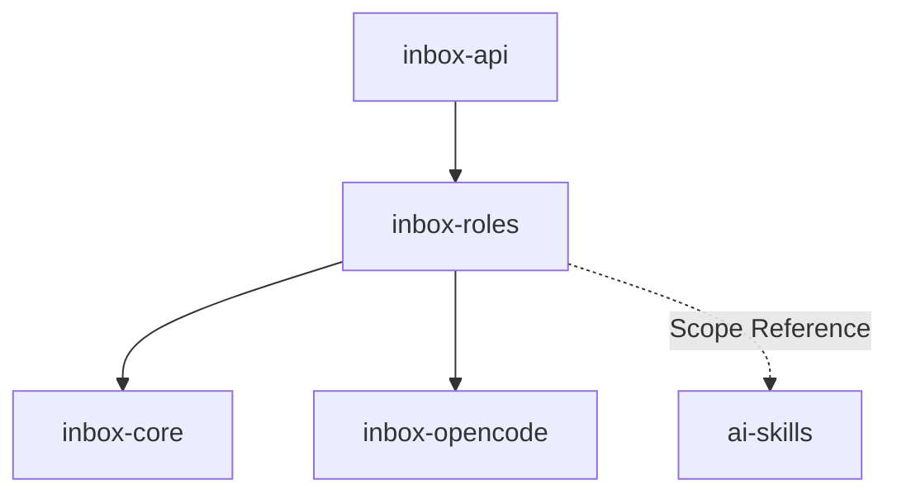

# Module: inbox-roles

> Parent scope: [`../../agent-inbox.spec.md`](../../agent-inbox.spec.md)

<!--SECTION:MODULE_VISION-->

## 1. Module Vision

Сердце serve-режима. Загружает роли (TypeScript-модули с графом узлов), планирует
обработку MR, выполняет узлы (session/gate/ask/effect), классифицирует исходы,
восстанавливает по лесенке. Получает данные от inbox-core, использует inbox-opencode
для AI-узлов.

Роль v1 (reviewer) обязана выражать существующий документный конвейер
(scaffold → gate → enrich → gate → track-sessions → gate → synthesize →
ask → effect → done). Это тест выразительности контракта: если конвейер
не ложится в граф узлов — контракт неверен.

<!--/SECTION:MODULE_VISION-->

<!--SECTION:MODULE_USAGE_EXAMPLE-->

## 2. Module Usage Example

```ts
import { RoleEngine, RoleScheduler } from '@/inbox-roles';

const engine = new RoleEngine();
await engine.loadAll(); // → загружены reviewer.role.ts, author.role.ts
engine.activate('reviewer');

const scheduler = new RoleScheduler({ engine, store });

// tick: polling → delta → assign → step() для активных → escalate
await scheduler.tick();

// Ручное назначение
await scheduler.assignManual(mrUrl, 'reviewer', { canPost: false });
```

<!--/SECTION:MODULE_USAGE_EXAMPLE-->

<!--SECTION:ENTITY_INVENTORY-->

## 3. Entity Inventory (Closed-World)

| Name                | Type         | Purpose                                                                                                                                |
| ------------------- | ------------ | -------------------------------------------------------------------------------------------------------------------------------------- |
| `RoleEngine`        | Service      | Загрузка `.role.ts` модулей, регистрация, активация.                                                                                   |
| `RoleScheduler`     | Service      | Tick: новые MR + изменения существующих. Назначение/обновление RoleInstance.                                                           |
| `RoleInstance`      | Entity       | Экземпляр роли на MR: текущий узел + счётчики continue/restart + контекст + права.                                                     |
| `RoleNode`          | Value Object | Тип узла: `session` (AI-промпт + схема + политика ретраев), `gate` (код), `ask` (вопрос), `effect` (действие).                         |
| `OutcomeClassifier` | Service      | Классификация исхода AI-узла: OK / NO_RESULT / PARSE_ERROR / SCHEMA_MISMATCH / SESSION_ERROR / TIMEOUT. Генерирует remediation-сигнал. |
| `RightsEscalator` | Service | Эскалация нотификаций по времени бездействия оператора. |
| `ReviewerRole`      | Entity       | Роль ревьювера: граф v1 = scaffold→gate→enrich→gate→sessions→gate→synthesize→ask→effect→done.                                          |
| `AuthorRole`        | Entity       | Роль автора: разбор замечаний → сводка+задание+черновики → ask → effect react/reply.                                                   |

<!--/SECTION:ENTITY_INVENTORY-->

<!--SECTION:ENTITY_SURFACES-->

## 4. Entity Surfaces

### `RoleEngine`

- **Type:** Service
- **Purpose:** Загрузка `.role.ts` модулей, регистрация, активация.
- **Public Operations:** `loadAll()`, `activate(name)`, `deactivate(name)`, `list() → RegisteredRole[]`
- **Consumers:** `RoleScheduler`, `inbox-api`.

### `RoleScheduler`

- **Type:** Service
- **Purpose:** Оркестрация: tick (polling → delta → assign → step → escalate), assignManual.
- **Public Operations:** `tick()`, `assignManual(mrUrl, role, rights?)`, `activeCount()`
- **Consumers:** Таймер serve, `inbox-api`.

### `RoleInstance`

- **Type:** Entity
- **Purpose:** Один MR под управлением одной роли. Состояние = текущий узел + счётчики.
- **Public Properties:** `id`, `role`, `mr`, `currentNode`, `continueCount`, `restartCount`, `rights`, `createdAt`
- **Public Operations:**
  - `step()` — выполнить текущий узел, классифицировать исход, перейти по edge
  - `onContextUpdate(mrContext)` — обновить контекст при изменении MR
  - `getBoardView()` — данные для дашборда
- **Consumers:** `RoleScheduler`, `RightsEscalator`, `inbox-api`.

### `RoleNode`

- **Type:** Value Object
- **Purpose:** Типизированный узел графа роли.
- **Variants:**
  - `{ kind: 'session', prompt(ctx, artifacts): { system, text }, dir(ctx): string, resultSchema?: JsonSchema, policy: { promptTimeout, continueMax, restartMax } }`
  - `{ kind: 'gate', verify(artifacts): GateResult }` — детерминированный код
  - `{ kind: 'ask', question(artifacts): OperatorQuestion }` — ждёт оператора
  - `{ kind: 'effect', run(ctx, artifacts): Promise<void> }` — публичное действие (vcs-reply/approve)
- **Consumers:** `RoleInstance.step()`.

### `OutcomeClassifier`

- **Type:** Service
- **Purpose:** Классификация сырого результата AI-узла.
- **Classes:** `OK`, `NO_RESULT`, `PARSE_ERROR`, `SCHEMA_MISMATCH(details)`, `SESSION_ERROR`, `TIMEOUT`, `INCOMPLETE_ARTIFACT(details)`
- **Output:** `{ class, remediationSignal: string }` — сигнал с конкретикой для continue/restart
- **Consumers:** `RoleInstance.step()` (после session-узла).

### Service: `RightsEscalator`

- **Type:** Service
- **Purpose:** Эскалация нотификаций по времени. Механизм: MrRouter пишет `operator_action` в audit при POST; Escalator читает последний `operator_action` по MR.
- **Public Operations:** `evaluate(instance)` — 24h бездействия → нотификация (VK Teams-пинг), `schedule(instance)`
- **Consumers:** `RoleScheduler`.

### `ReviewerRole`

- **Type:** Entity
- **Purpose:** Граф v1 = существующий документный конвейер.
- **Граф:** `scaffold(session) → gate(validate scaffolded) → enrich(session) → gate(validate enriched) → track-sessions(session, fan-out N дорожек) → gate(filled) → synthesize(session) → ask(согласование) → effect(post) → done`. Fan-out: движок инстанцирует N сессий параллельно (лимит SV-11).
- **Consumers:** `RoleEngine`, `RoleScheduler`.

### `AuthorRole`

- **Type:** Entity
- **Purpose:** Разбор замечаний ревьюеров на своём MR.
- **Граф:** `fetch-discussions(session) → classify(gate) → summary+task+drafts(session) → ask(согласование) → effect(react/reply) → done`.
- **Consumers:** `RoleEngine`, `RoleScheduler`.
<!--/SECTION:ENTITY_SURFACES-->

<!--SECTION:MODULE_CONTRACTS-->

## 5. Module Contracts (DbC)

### Service: `RoleScheduler`

- **Runtime Backing:** `not-implemented`
- **Verification Levels:** `contract`, `unit`

**Contract (DbC):**

- **Postconditions:** `tick()` — все новые MR назначены; существующие с изменениями обновлены; активные продвинуты через `step()`; эскалация проверена.
- **Invariants:** Один MR = не более одного активного RoleInstance. Tick не пересекается с предыдущим.

### Entity: `RoleInstance`

- **Runtime Backing:** `not-implemented`
- **Verification Levels:** `contract`, `unit`

**Contract (DbC):**

- **Postconditions:** `step()` — узел выполнен, исход классифицирован, переход по edge.
- **Invariants:** Gate-узлы детерминированы (без LLM). Effect-узлы выполняются не более одного раза на успешный проход (маркер `effect_applied` в audit log, проверяется перед выполнением). `continueCount ≤ policy.continueMax`; `restartCount ≤ policy.restartMax`. При рестарте serve: состояние восстанавливается от артефактов-чекпоинтов (`AX_ARTIFACTS_ARE_CHECKPOINTS`).

### Service: `OutcomeClassifier`

- **Runtime Backing:** `not-implemented`
- **Verification Levels:** `contract`, `unit`

**Contract (DbC):**

- **Postconditions:** Каждый исход → класс + remediation-сигнал с конкретикой.
- **Invariants:** `OK` только при валидном результате. `SESSION_ERROR` при Terminated/abort без structured output. `SCHEMA_MISMATCH` от SDK (native structured output) или от парсинга JSON-блока (fallback).

### Service: `RightsEscalator`

- **Runtime Backing:** `not-implemented`
- **Verification Levels:** `contract`, `unit`

**Contract (DbC):**

- **Preconditions:** `instance.currentNode.kind === 'ask'` (ждёт оператора).
- **Postconditions:** 24h без `operator_action` в audit → нотификация (VK Teams-пинг). Права — только явным действием оператора.
- **Invariants:** Действие оператора (`POST /api/mr/:id/*`) → запись в audit → таймер сброшен. Нотификация отправляется не чаще 24h.
<!--/SECTION:MODULE_CONTRACTS-->

<!--SECTION:PUBLIC_OPTIONS-->

## 6. Public Options & Policies

| Option              | Bound To          | Status                         |
| ------------------- | ----------------- | ------------------------------ |
| `pollingInterval`   | `RoleScheduler`   | active — `5` мин default       |
| `maxInstances`      | `RoleScheduler`   | active — `3` default per SV-11 |
| `escalation24h` | `RightsEscalator` | active — нотификация (VK Teams-пинг) |
| `retryMax`          | `RoleInstance`    | active — per-node policy       |

<!--/SECTION:PUBLIC_OPTIONS-->

<!--SECTION:FILE_STRUCTURE-->

## 7. File Structure

```
services/agent-inbox/modules/inbox-roles/
├── role-engine.ts            # RoleEngine
├── role-scheduler.ts         # RoleScheduler
├── role-instance.ts          # RoleInstance: step(), counters
├── role-node.ts              # RoleNode: типы узлов
├── outcome-classifier.ts     # OutcomeClassifier: классы + remediation-сигналы
├── rights-escalator.ts       # RightsEscalator
├── reviewer.role.ts          # ReviewerRole: граф v1 (9 узлов)
├── author.role.ts            # AuthorRole: граф v1 (5 узлов)
├── errors.ts                 # RoleError
└── __tests__/
    ├── role-engine.test.ts
    ├── role-scheduler.test.ts
    ├── role-instance.test.ts
    ├── outcome-classifier.test.ts
    ├── rights-escalator.test.ts
    ├── reviewer.role.test.ts
    └── author.role.test.ts
```

<!--/SECTION:FILE_STRUCTURE-->

<!--SECTION:MODULE_DECISION_LOG-->

## 8. Module Decision Log

None — архитектурные решения на уровне scope spec (D-78).

<!--/SECTION:MODULE_DECISION_LOG-->

<!--SECTION:INTER_MODULE_DEPENDENCIES-->

## 9. Inter-Module Dependencies

- **Depends on:** `inbox-core`, `inbox-opencode`
- **Scope Reference (cross-scope):** `ai-skills` — AIKit директивы
- **Provides to:** `inbox-api` (через BoardProviderReal)



<!--/SECTION:INTER_MODULE_DEPENDENCIES-->

<!--SECTION:HANDOFF-->

## 10. Handoff to task-scaffolding

- **Implementation files to be created:** 10 файлов
- **Test files to be created:** 7 файлов
- **Stack dependencies:** TypeScript, node:test
- **Module Rules Additions:** None
- **Open risks:** Reviewer-граф v1 — тест выразительности контракта (должен выражать D57/D70)
<!--/SECTION:HANDOFF-->
