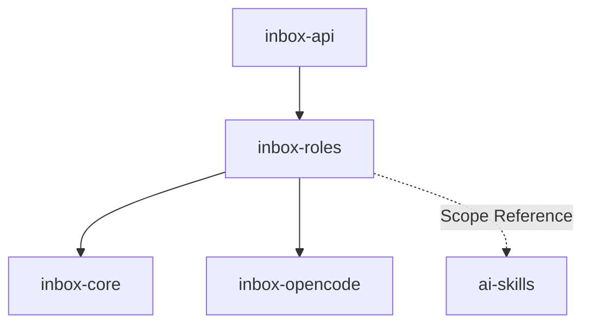

# Module: inbox-roles

> Parent scope: [`../../agent-inbox.spec.md`](../../agent-inbox.spec.md)

<!--SECTION:MODULE_VISION-->

## 1. Module Vision

Сердце serve-режима. Загружает роли (TypeScript-модули), планирует обработку MR,
управляет экземплярами ролей (стейт-машины), эскалирует права. Получает данные
от inbox-core, использует inbox-opencode для AI-узлов.

<!--/SECTION:MODULE_VISION-->

<!--SECTION:MODULE_USAGE_EXAMPLE-->

## 2. Module Usage Example

```ts
import { RoleEngine, RoleScheduler } from '@/inbox-roles';
import { StateStore } from '@/inbox-core';

const store = new StateStore({ stateDir: '~/.gennady' });

// загрузка ролей
const engine = new RoleEngine();
await engine.loadAll(); // → [reviewer, author]
engine.activate('reviewer'); // авто-назначение включено

// планировщик
const scheduler = new RoleScheduler({ engine, store });

// каждый tick (5 мин)
await scheduler.tick();
// 1. VcsInbox.getActionable() → список MR
// 2. Для новых MR → matching role → создать RoleInstance
// 3. Для существующих: headChanged? approvalReset? → обновить RoleInstance
// 4. Для активных RoleInstance → advance() (выполнить следующее состояние)
// 5. RightsEscalator → проверить эскалацию

// ручное назначение (с дашборда)
await scheduler.assignManual(mrUrl, 'reviewer', { canPost: false });
```

<!--/SECTION:MODULE_USAGE_EXAMPLE-->

<!--SECTION:ENTITY_INVENTORY-->

## 3. Entity Inventory (Closed-World)

| Name              | Type    | Purpose                                                                          |
| ----------------- | ------- | -------------------------------------------------------------------------------- |
| `RoleEngine`      | Service | Загрузка `.role.ts` модулей, регистрация, активация/деактивация.                 |
| `RoleScheduler`   | Service | Tick: новые MR + изменения существующих. Назначение/обновление RoleInstance.     |
| `RoleInstance`    | Entity  | Экземпляр роли на MR: state + prevState + контекст + права.                      |
| `RightsEscalator` | Service | Эскалация прав по времени бездействия оператора.                                 |
| `ReviewerRole`    | Entity  | Определение роли «ревьювер»: состояния, переходы, права по умолчанию, эскалация. |
| `AuthorRole`      | Entity  | Определение роли «автор»: разбор замечаний ревьюеров.                            |

<!--/SECTION:ENTITY_INVENTORY-->

<!--SECTION:ENTITY_SURFACES-->

## 4. Entity Surfaces

### `RoleEngine`

- **Type:** Service
- **Purpose:** Загрузка `.role.ts` модулей из `services/agent-inbox/roles/`, регистрация, активация.
- **Public Operations:**
  - `loadAll()` — сканирует `roles/`, загружает модули
  - `activate(name)` — активировать роль (авто-назначение на новые MR)
  - `deactivate(name)` — деактивировать (только ручное назначение)
  - `list()` → `RegisteredRole[]` — список ролей со статусом
- **Lifecycle:** Singleton при старте serve.
- **Consumers:** `RoleScheduler`, `inbox-api` (дашборд).

### `RoleScheduler`

- **Type:** Service
- **Purpose:** Оркестрация: получает MR, назначает ролям, запускает/обновляет RoleInstance.
- **Public Operations:**
  - `tick()` — полный цикл: запросить MR → дельта → назначение новых → обновление существующих → advance активных → эскалация
  - `assignManual(mrUrl, role, rights?)` — ручное назначение с дашборда
  - `activeCount()` → `number` — сколько RoleInstance в работе
- **Lifecycle:** Запускается по таймеру. Один tick синхронный, не пересекается с предыдущим.
- **Errors & Degradation:** Ошибка VCS в tick → MR не обработан, следующий tick подхватит.
- **Consumers:** Таймер serve, `inbox-api`.

### `RoleInstance`

- **Type:** Entity
- **Purpose:** Один MR под управлением одной роли. Стейт-машина, контекст, права.
- **Public Properties:** `id`, `role`, `mr`, `state`, `prevState`, `rights`, `context`, `createdAt`
- **Public Operations:**
  - `advance()` — выполнить переход в следующее состояние (если возможно)
  - `onContextUpdate(mrContext)` — обновить контекст при изменении MR (headChanged, approvalReset)
  - `updateRights(rights)` — оператор изменил права
  - `getBoardView()` — данные для дашборда: state, prevState, доступные действия
- **Lifecycle:** Создаётся Scheduler'ом. Уничтожается при DONE или MR closed.
- **Errors & Degradation:** AI-узел → StructuredOutputError → retry (max 2) → эскалация.
- **Consumers:** `RoleScheduler`, `RightsEscalator`, `inbox-api`.

### `RightsEscalator`

- **Type:** Service
- **Purpose:** Эскалация прав по времени. Учитывает addressed (ждёт оператора? ждёт автора?).
- **Public Operations:**
  - `evaluate(instance)` → `Rights` — вычислить текущие права
  - `schedule(instance)` — запланировать проверку
- **Lifecycle:** Вызывается Scheduler'ом в каждом tick.
- **Consumers:** `RoleScheduler`.

### `ReviewerRole`

- **Type:** Entity
- **Purpose:** Роль ревьювера: состояния, переходы, AI-узлы, права по умолчанию.
- **Public Properties:** `name: 'reviewer'`, `states`, `transitions`, `defaultRights`, `escalation`
- **Lifecycle:** Загружается RoleEngine при старте, не меняется.
- **Consumers:** `RoleEngine`, `RoleScheduler`.

### `AuthorRole`

- **Type:** Entity
- **Purpose:** Роль автора: разбор замечаний ревьюеров, сверка с кодом.
- **Public Properties:** `name: 'author'`, `states`, `transitions`, `defaultRights`, `escalation`
- **Lifecycle:** Загружается RoleEngine при старте, не меняется.
- **Consumers:** `RoleEngine`, `RoleScheduler`.
<!--/SECTION:ENTITY_SURFACES-->

<!--SECTION:MODULE_CONTRACTS-->

## 5. Module Contracts (DbC)

### Service: `RoleScheduler`

- **Runtime Backing:** `not-implemented`
- **Verification Levels:** `contract`, `unit`
- **Deferred Runtime Scope:** None

**Contract (DbC):**

- **Preconditions:**
  - `RoleEngine.loadAll()` выполнен, хотя бы одна роль загружена
  - `inbox-core` StateStore инициализирован
- **Postconditions:**
  - `tick()`: все новые MR назначены matching ролям или остались без роли
  - `tick()`: существующие RoleInstance с изменениями (headChanged, approvalReset) обновлены
  - `tick()`: активные RoleInstance продвинуты (advance)
  - `assignManual(mrUrl, role, rights)`: создан RoleInstance с переданными правами
- **Invariants:**
  - Один MR = не более одного активного RoleInstance
  - `activeCount() ≤ maxSessions` из inbox-opencode SessionPool
  - Tick не запускается, пока предыдущий не завершён

### Entity: `RoleInstance`

- **Runtime Backing:** `not-implemented`
- **Verification Levels:** `contract`, `unit`
- **Deferred Runtime Scope:** Детальный дизайн стейт-машины — module-decomposition

**Contract (DbC):**

- **Preconditions:**
  - `advance()`: текущее состояние имеет доступные переходы
  - `onContextUpdate()`: передан актуальный `MrContext`
- **Postconditions:**
  - `advance()`: state изменён согласно transitions роли
  - `onContextUpdate()`: при headChanged/approvalReset — prevState сохранён, state обновлён
  - `getBoardView()`: возвращает { state, prevState, actions[] }
- **Invariants:**
  - `prevState` всегда отражает предыдущее значение `state`
  - `rights` не могут быть шире, чем `defaultRights` роли (эскалация — исключение)

### Service: `RightsEscalator`

- **Runtime Backing:** `not-implemented`
- **Verification Levels:** `contract`, `unit`
- **Deferred Runtime Scope:** None

**Contract (DbC):**

- **Preconditions:**
  - `instance.state ∈ { AWAITING_OPERATOR }` (эскалация только когда ждёт оператора)
- **Postconditions:**
  - 24h без действия оператора → `rights.canPost = true`
  - 72h → `rights.canApprove = true` (упрощённая схема)
- **Invariants:**
  - Действие оператора сбрасывает таймер бездействия
  - Эскалированные права сохраняются до завершения RoleInstance
  <!--/SECTION:MODULE_CONTRACTS-->

<!--SECTION:PUBLIC_OPTIONS-->

## 6. Public Options & Policies

| Option            | Bound To          | Status                           |
| ----------------- | ----------------- | -------------------------------- |
| `pollingInterval` | `RoleScheduler`   | active — `5` мин default         |
| `maxInstances`    | `RoleScheduler`   | active — `3` default (per SV-11) |
| `escalation24h`   | `RightsEscalator` | active — `canPost: true`         |
| `escalation72h`   | `RightsEscalator` | active — `canApprove: true`      |
| `retryMax`        | `RoleInstance`    | active — `2` AI-узла retry       |

<!--/SECTION:PUBLIC_OPTIONS-->

<!--SECTION:FILE_STRUCTURE-->

## 7. File Structure

```
services/agent-inbox/modules/inbox-roles/
├── role-engine.ts            # RoleEngine: load, activate, deactivate
├── role-scheduler.ts         # RoleScheduler: tick, assignManual
├── role-instance.ts          # RoleInstance: state machine, advance, getBoardView
├── rights-escalator.ts       # RightsEscalator: evaluate, schedule
├── reviewer.role.ts          # ReviewerRole: states, transitions, defaultRights
├── author.role.ts            # AuthorRole: states, transitions, defaultRights
├── errors.ts                 # RoleError
├── __tests__/
│   ├── role-engine.test.ts
│   ├── role-scheduler.test.ts
│   ├── role-instance.test.ts
│   ├── rights-escalator.test.ts
│   ├── reviewer.role.test.ts
│   └── author.role.test.ts
```

**File Mapping:**

- `role-engine.ts` — `RoleEngine`
- `role-scheduler.ts` — `RoleScheduler`
- `role-instance.ts` — `RoleInstance`
- `rights-escalator.ts` — `RightsEscalator`
- `reviewer.role.ts` — `ReviewerRole`
- `author.role.ts` — `AuthorRole`
- `errors.ts` — `RoleError`
<!--/SECTION:FILE_STRUCTURE-->

<!--SECTION:MODULE_DECISION_LOG-->

## 8. Module Decision Log

None — все архитектурные решения на уровне scope spec (D-71–D-77).

<!--/SECTION:MODULE_DECISION_LOG-->

<!--SECTION:INTER_MODULE_DEPENDENCIES-->

## 9. Inter-Module Dependencies

- **Depends on:** `inbox-core`, `inbox-opencode`
- **Scope Reference (cross-scope):** `ai-skills` — AIKit директивы (`arch-interrogation`, `code-interrogation`)
- **Provides to:** `inbox-api`



<!--/SECTION:INTER_MODULE_DEPENDENCIES-->

<!--SECTION:HANDOFF-->

## 10. Handoff to task-scaffolding

- **Implementation files to be created:** 7 файлов (см. File Structure)
- **Test files to be created:** 5 файлов (см. `__tests__/`)
- **Stack dependencies:**
  - Language: TypeScript (resolves to `ai/directives/coding/typescript-rules.xml`)
  - Test framework: node:test (resolves to `ai/directives/testing/node-test.xml`)
- **Module Rules Additions:** None
- **Open risks:** Детальный дизайн `.role.ts` интерфейса (стейт-машины) требует отдельного module-decomposition. Сейчас зафиксированы только намерения.
<!--/SECTION:HANDOFF-->
