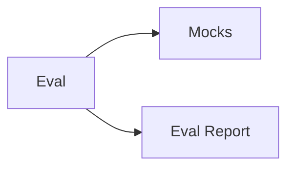

# Verification Specifications

Навигационный индекс; не добавляет отдельную runtime-подсистему.

1. [Deterministic mocks](../inbox-mocks/inbox-mocks.spec.md).
2. [Adaptive evaluation](../inbox-eval/inbox-eval.spec.md).

Dependency edge: `Eval --> Mocks`; report edge is output flow.
