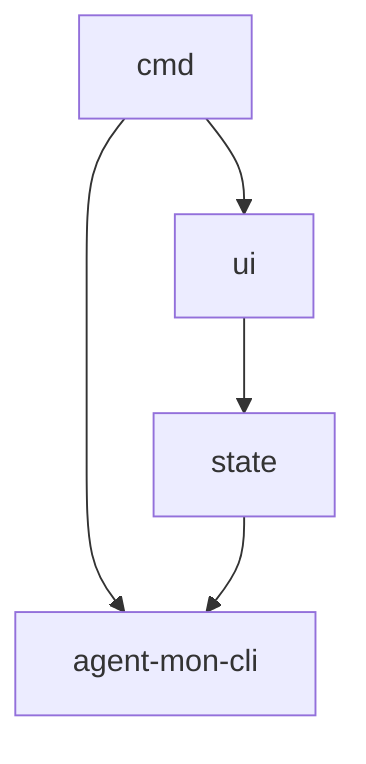

# Tasks: agent-mon-cli

## Scope Spec

- [Scope spec](./agent-mon-cli.spec.md)

## Cascade Table

<!-- ЗАПОЛНЯЕТ АГЕНТ: действующие правила scope из Scope Graph (транзитивное замыкание depends-on). -->

## Inter-Module DAG

## Tracker

| Task-ID      | Title                                   | Module | Dependencies            | Status   | Reopens |
| ------------ | --------------------------------------- | ------ | ----------------------- | -------- | ------- |
| AMC-tui-deps | Установка ink + react + @types/react    | —      | —                       | [ ] TODO | —       |
| CMD-entry    | CLI entry + gennady.ts integration      | cmd    | UI-dashui, AMC-tui-deps | [ ] TODO | —       |
| STA-manager  | State manager + ViewModel + waiting     | state  | AMC-tui-deps            | [ ] TODO | —       |
| UI-dashui    | Ink-компоненты: ColumnView, SessionCard | ui     | STA-manager             | [ ] TODO | —       |

## Decision Log (scope task level)

<!-- <ACR>-DL-N scope-уровневых решений декомпозиции/планирования. -->
