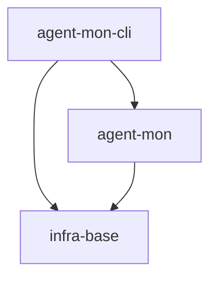
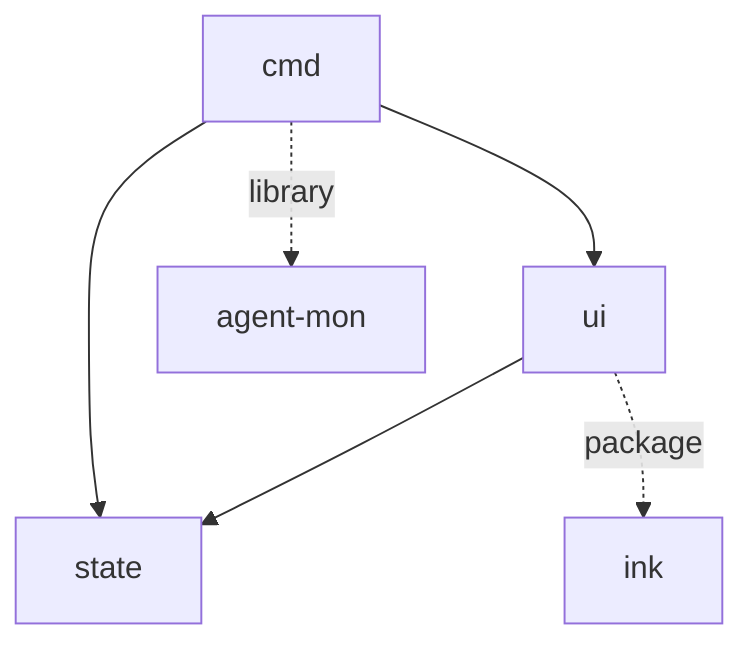

# agent-mon-cli: Scope Specification

## scope-type

product

## 1. Vision & Primary Goal

`gennady agent-mon` — интерактивный терминальный дашборд для пассивного мониторинга активных сессий AI-агентов. Запускается как CLI-команда, использует библиотеку `agent-mon` как data layer и `ink` (React for terminal) для UI. Расширяемый View-слой позволяет менять дизайн без переписывания логики.

## 2. Project Type

- **Type:** cli-utility
- **Why this type:** Терминальная команда без UI вне консоли; запускается через `gennady agent-mon`, работает пока открыт терминал

## 3. Approved Golden DX Example

```bash
# Live dashboard (default: 5s interval, all providers, column view)
$ gennady agent-mon

┌─ Agent Monitor ── 8 sessions ── ↑ 5s ──────────────────────────────┐
│                                                                     │
│  ╔═══ Claude (5) ═══════════════════╗ ╔═══ OpenCode (3) ════════╗ │
│  ║ 2 active · 1 waiting · 1 idle   ║ ║ 2 active · 1 idle       ║ │
│  ║                                  ║ ║                          ║ │
│  ║ 🔴 Fix IDB adapter bugs          ║ ║ 🔴 agent-mon: мониторинг ║ │
│  ║    sonnet-4-6  ↑ 33m            ║ ║    deepseek-v4  ↑ 12m    ║ │
│  ║    [doing] reopen TSK-20         ║ ║    tok: 45k in / 10k out ║ │
│  ║    tok: 128k/45k                 ║ ║                          ║ │
│  ║                                  ║ ║                          ║ │
│  ║ ⏳ Design local storage           ║ ║                          ║ │
│  ║    sonnet-4-6  waiting 2h       ║ ║                          ║ │
│  ║    ❓ last: "Choose variant?"    ║ ║                          ║ │
│  ╚══════════════════════════════════╝ ╚══════════════════════════╝ │
│                                                                     │
│  q=quit  ↑↓=scroll  Enter=expand card                              │
└─────────────────────────────────────────────────────────────────────┘

# One-shot snapshot (печать и выход)
$ gennady agent-mon --once
...таблица...
# exit 0

# Только Claude провайдер
$ gennady agent-mon --provider claude

# Кастомный интервал (2 секунды)
$ gennady agent-mon --interval 2000
```

## 4. Requirements & Constraints

### 4.1 Functional Requirements

| #   | Требование                                                                                                                 |
| --- | -------------------------------------------------------------------------------------------------------------------------- |
| F1  | `gennady agent-mon` — запуск live-дашборда через ink                                                                       |
| F2  | View-слой: интерфейс `AgentMonView.render(ViewModel) → ReactElement`; замена view — одна строка                            |
| F3  | View A (default): колонки по провайдерам, внутри — карточки, сгруппированные по статусу                                    |
| F4  | Статусы с визуальным выделением: 🔴 active, ⏳ waiting (ждёт оператора), 🟡 idle, ⬜ completed                             |
| F5  | Идентификация ожидания оператора: lastMessage содержит `?` или `choose`/`select` → `isWaitingForOperator: true`            |
| F6  | Карточка сессии: title, model, status, elapsed, lastMessage (1 строка), tokens (in/out), задачи (Claude), CPU/RAM (Claude) |
| F7  | Автообновление через `observe()` из agent-mon; флаг `--interval` (default 5000ms)                                          |
| F8  | Клавиатура: `q`/`Ctrl+C` — выход; `r` — форсировать refresh **(@deferred — V2)**                                           |
| F9  | Флаг `--provider` для фильтрации (claude, opencode, all)                                                                   |
| F10 | Режим `--once` — snapshot + выход                                                                                          |
| F11 | State manager: transform `AgentSession[]` → `ViewModel` (group by provider, detect waiting)                                |

### 4.2 Non-Functional Constraints

| #   | Ограничение                                                                           |
| --- | ------------------------------------------------------------------------------------- |
| N1  | Интеграция в CLI-команду gennady (`cli/cmd/agent-mon/`)                               |
| N2  | ink@^7 + react@^19 как единственные runtime-зависимости (помимо agent-mon)            |
| N3  | Отрисовка < 50ms при 50+ сессиях (ink diff rendering)                                 |
| N4  | Graceful: 0 сессий → "No active sessions."; провайдер недоступен → пропустить колонку |
| N5  | Код на TypeScript с JSX через tsx (уже в проекте)                                     |

### 4.3 Out-of-Scope

- Веб-интерфейс / дашборд
- Process management (kill/restart агентов)
- Графики / исторические данные
- Мобильные уведомления
- Сортировка / фильтрация через UI (только через CLI-флаги)
- Сворачивание/разворачивание карточек (V2)

### 4.4 Runtime Backing & Deferred Scope

Всё `real-runtime`:

- `agent-mon` библиотека — создание монитора, сканирование провайдеров
- `ink` — рендеринг в терминал
- `stdin` — клавиатурный ввод через `useInput`

### 4.5 Rules

| Rule             | Category | Source                 |
| ---------------- | -------- | ---------------------- |
| typescript-rules | coding   | inherited from project |
| node-test        | testing  | inherited from project |

## 5. High-Level Architecture

```
cli/cmd/agent-mon/
├── index.ts                    // dynamic import from gennady.ts
├── agent-mon.cmd.ts            // CLI: flags parsing, run(app)
├── agent-mon.types.ts          // ViewModel, ProviderColumn, SessionCard, AgentMonView
├── state.ts                    // State manager: SessionChanges → ViewModel
├── providers.ts                // createMonitor + register claude/opencode
├── view.ts                     // View contract
├── views/
│   ├── column-view.tsx         // View A: колонки по провайдерам
│   └── compact-view.tsx        // View B: компактная таблица **(@deferred — V2)**
└── ui/
    ├── app.tsx                  // Root ink component: useInput + observe loop
    ├── session-card.tsx         // Card: title, model, status, tokens, lastMsg
    ├── provider-column.tsx      // Column: header + grouped cards
    └── status-badge.tsx         // 🔴⏳🟡⬜ badge
```

### Data Flow

```
agent-mon library → observe(monitor, {interval}) → SessionChanges
    → state.ts: merge changes, detect waiting, build ViewModel
    → view.render(viewModel) → ReactElement
    → ink: re-render on state change
```

### Key Design Decisions

| Что                              | Почему                                                                                                       |
| -------------------------------- | ------------------------------------------------------------------------------------------------------------ |
| View как интерфейс               | Замена дизайна без переписывания core логики; `--view column` выбирает реализацию (compact **@deferred V2**) |
| State manager отдельно           | Трансформация AgentSession → ViewModel изолирована от UI; тестируется без ink                                |
| `isWaitingForOperator` heuristic | lastMessage содержит `?` или ключевые слова `choose`/`select`/`вариант` — программно, без AI                 |
| ink + React                      | 38.5k звёзд, используют Claude Code, Gemini CLI, Copilot CLI; Flexbox для колонок                            |

### 5.1 Rejected Alternatives

| Что                      | Почему rejected                                                 |
| ------------------------ | --------------------------------------------------------------- |
| blessed / neo-blessed    | Нет декларативного рендеринга, меньше adoption, нет компонентов |
| Vanilla stdout (без TUI) | Теряем интерактивность и live-обновление                        |
| Web UI                   | Другой product type, требует сервера, браузера                  |

## 6. Decision Log

### D-001 — ink + React as TUI framework

- **Status:** active
- **Recorded:** session Discovery, agent-mon-cli
- **Why:** 38.5k GitHub stars; used by Claude Code, Gemini CLI, GitHub Copilot CLI — production-proven in agent tooling. Flexbox layout for column-based dashboard. Declarative re-rendering on state change.
- **Risk accepted:** React ~15MB bundle (tree-shaken in Vite).
- **Rejected alternatives:** blessed (no types, imperative), vanilla stdout (no interactivity).

### D-002 — View as interface (AgentMonView)

- **Status:** active
- **Recorded:** session Discovery, agent-mon-cli
- **Why:** Позволяет создавать альтернативные дизайны без переписывания core. Флаг `--view` выбирает реализацию. V1: column-view, V2: compact-view.
- **Risk accepted:** Абстракция для одного implementation в V1. Но интерфейс минимален (1 метод `render`).
- **Rejected alternatives:** жёстко зашитый UI — нельзя менять дизайн.

### D-003 — Programmatic waiting detection (heuristic, not AI)

- **Status:** active
- **Recorded:** session Discovery, agent-mon-cli
- **Why:** isWaitingForOperator определяется через эвристики (lastMessage содержит `?`, `choose`, `select`, `вариант`). Достаточно для 90% случаев. Не требует подключения AI.
- **Risk accepted:** False negatives: агент пишет вопрос без `?`. False positives: сообщение содержит `?` в коде. Допустимо для V1.
- **Rejected alternatives:** AI-классификация сообщений — избыточно для CLI-монитора, тянет LLM-зависимость.

## 7. Scope Dependencies

- **Depends on:** infra-base (Node.js 22+, tsc, prettier, node:test, vite), agent-mon (library — createMonitor, observe, diff, providers)
- **Provides to:** None (terminal consumer)



## 8. Bootstrap Requirements

| Requirement                | Kind           | Owner                 | Resolution                                         |
| -------------------------- | -------------- | --------------------- | -------------------------------------------------- |
| ink@^7                     | package        | this-scope-task       | `npm install ink`                                  |
| react@^19                  | package        | this-scope-task       | `npm install react` (peer dep ink)                 |
| @types/react               | package        | this-scope-task       | `npm install -D @types/react`                      |
| agent-mon library          | workspace-link | external-prereq-scope | Already at `services/agent-mon/` (TSK-35..41 done) |
| cli/gennady.ts switch case | file           | this-scope-task       | Add `agent-mon` to switch + help                   |
| tsx                        | tool           | external-prereq-scope | Already in devDeps                                 |

## 9. Module Map

Modules not yet decomposed — run `module-decomposition agent-mon-cli`

## 10. Handoff to module-decomposition

- **Primary input:** `specs/agent-mon-cli/agent-mon-cli.spec.md`
- **Areas requiring decomposition:**
  - `cmd` — CLI wrapper (flags, entry point, gennady.ts integration)
  - `state` — State manager (SessionChanges → ViewModel transformation)
  - `view` — View interface + column-view implementation
  - `ui` — ink components (app, session-card, provider-column, status-badge)
- **Named abstractions:** `AgentMonView`, `ViewModel`, `ProviderColumn`, `SessionCard`, `AgentMonApp`
- **Bootstrap tickets ready for cascade:** see section 8
- **Open risks:**
  - `isWaitingForOperator` heuristic — False negatives possible; может потребоваться V2 c AI-классификацией
  - ink@^7 — отслеживать мажорные обновления
  - react@^19 — peer dependency, версия зафиксирована ink

## 9. Module Map (post-ModuleDecomposition)

### 9.1 Modules

- [`cmd`](./cmd/cmd.spec.md) — CLI entry: парсинг флагов, создание монитора, запуск ink-приложения
- [`state`](./state/state.spec.md) — State manager: SessionChanges → ViewModel, waiting heuristic, группировка
- [`ui`](./ui/ui.spec.md) — Ink-компоненты: AgentMonApp, ColumnView, ProviderColumn, SessionCard, StatusBadge

### 9.2 Inter-Module Dependency Map



### 9.3 Stack Dependencies

- Languages: TypeScript + JSX
- Test frameworks: node:test
- TUI: ink@^7 + react@^19

### 9.4 Handoff to task-scaffolding

- **Primary input:** `specs/agent-mon-cli/agent-mon-cli.spec.md`
- **Required directives:** `ai/directives/coding/typescript-rules.xml`, `ai/directives/testing/node-test.xml`
- **Open risks & validation needs:**
  - `isWaitingForUser` heuristic — false positives/negatives возможны
  - `ink-testing-library` — нужен для тестов ink-компонентов
  - `render()` ink должен вызываться после инициализации state manager
