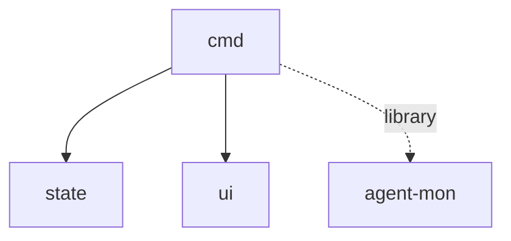

# Module: cmd

## 1. Module Vision

CLI entry point — парсинг флагов, создание монитора с провайдерами, запуск ink-приложения. Composition root: связывает `agent-mon` библиотеку с `state` и `ui`.

**Parent scope:** [`../../agent-mon-cli.spec.md`](../../agent-mon-cli.spec.md)

## 2. Entity Inventory (Closed-World)

| Name              | Type     | Purpose                                                                 |
| ----------------- | -------- | ----------------------------------------------------------------------- |
| `run`             | Function | CLI entry: парсинг флагов, создание монитора, `render(<AgentMonApp />)` |
| `createProviders` | Function | Создать `AgentMonitor` + зарегистрировать Claude/OpenCode провайдеры    |

## 3. Entity Surfaces

### `run`

- **Type:** Function
- **Purpose:** CLI entry point
- **Public Properties:** N/A
- **Public Operations:**
  - `(argv: string[]) → void`
  - Флаги: `--once` (snapshot + exit), `--interval <ms>` (default 5000), `--provider <claude|opencode|all>` (default all), `--view <column|compact>` (default column)
  - Создаёт `createProviders(opts)` → `AgentMonitor`
  - Создаёт `observe(monitor, { interval })` → `AsyncIterable<SessionChanges>`
  - Создаёт `createStateManager(changes)` → state manager
  - Вызывает `render(<AgentMonApp stateManager={sm} view={viewFlag} />)`
- **Lifecycle:** Вызывается из `cli/gennady.ts`, живёт до выхода (q / Ctrl+C / --once)
- **Events Emitted:** N/A
- **Errors & Degradation:** Неизвестный флаг → usage + exit 1
- **Consumers:** External — `cli/gennady.ts`

### `createProviders`

- **Type:** Function
- **Purpose:** Создать монитор с провайдерами
- **Public Properties:** N/A
- **Public Operations:**
  - `(opts?: { claude?: boolean; opencode?: boolean }) → AgentMonitor`
  - По умолчанию: оба провайдера активны
  - `--provider claude` → только Claude
- **Lifecycle:** Вызывается один раз в `run()`
- **Errors & Degradation:** N/A
- **Consumers:** Internal — `cli/cmd/agent-mon/cmd/run.ts`

## 4. Module Contracts (DbC)

### Function: `run`

- **Purpose:** CLI entry point — composition root
- **Runtime Backing:** `real-runtime`
- **Verification Levels:** `integration`
- **Deferred Runtime Scope:** None

**Contract (DbC):**

- Preconditions: `argv` содержит минимум `agent-mon` как команду
- Postconditions: `render()` вызван с валидным `AgentMonApp`; при `--once` — вывод и exit 0
- Invariants: Не падает при недоступности провайдера (graceful degradation)

### Function: `createProviders`

- **Purpose:** Фабрика монитора
- **Runtime Backing:** `real-runtime`
- **Verification Levels:** `unit`
- **Deferred Runtime Scope:** None

**Contract (DbC):**

- Preconditions: `agent-mon` библиотека доступна для импорта
- Postconditions: Возвращает `AgentMonitor` с ≥1 зарегистрированным провайдером
- Invariants: Stateless — каждый вызов создаёт новый монитор

## 5. Public Options & Policies

CLI flags: `--once`, `--interval`, `--provider`, `--view`. Defaults: interval=5000, provider=all, view=column.

## 6. File Structure

```
cmd/
├── run.ts                   // run(argv)
├── create-providers.ts      // createProviders(opts?)
└── index.ts                 // реэкспорт
```

**File Mapping:**

- `run.ts` — `run(argv) → void`
- `create-providers.ts` — `createProviders(opts?) → AgentMonitor`

## 7. Module Decision Log

None.

## 8. Inter-Module Dependencies

- **Depends on:** `agent-mon` (library), `state` (`../../state/state.spec.md`), `ui` (`../../ui/ui.spec.md`)
- **Provides to:** `cli/gennady.ts`



## 9. Handoff to task-scaffolding

- **Implementation files to be created:**
  - `cli/cmd/agent-mon/cmd/run.ts`
  - `cli/cmd/agent-mon/cmd/create-providers.ts`
  - `cli/cmd/agent-mon/cmd/index.ts`
- **Test files to be created:**
  - `cli/cmd/agent-mon/cmd/__tests__/run.test.ts`
  - `cli/cmd/agent-mon/cmd/__tests__/create-providers.test.ts`
- **Stack dependencies:**
  - Language: `TypeScript` → `ai/directives/coding/typescript-rules.xml`
  - Test framework: `node:test` → `ai/directives/testing/node-test.xml`
- **Module Rules Additions:** None
- **Open risks & validation needs:** `render()` от ink должен вызываться после инициализации state manager
