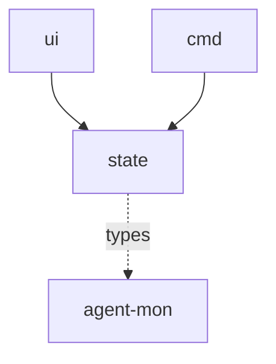

# Module: state

## 1. Module Vision

State manager — принимает `AsyncIterable<SessionChanges>`, мёрджит изменения, преобразует в `ViewModel` для UI. Не зависит от `agent-mon` напрямую — работает с абстрактным потоком изменений. Содержит эвристику `isWaitingForUser`.

**Parent scope:** [`../agent-mon-cli.spec.md`](../agent-mon-cli.spec.md)

## 2. Entity Inventory (Closed-World)

| Name                 | Type         | Purpose                                                                               |
| -------------------- | ------------ | ------------------------------------------------------------------------------------- |
| `createStateManager` | Factory      | Принимает `AsyncIterable<SessionChanges>`, управляет ViewModel, оповещает подписчиков |
| `ViewModel`          | Value Object | Полное состояние дашборда: `{ status, data?, error?, lastUpdated }`                   |
| `ProviderColumn`     | Value Object | Колонка провайдера: `{ provider, activeCount, waitingCount, idleCount, sessions }`    |
| `SessionCard`        | Value Object | Карточка сессии: все поля для рендеринга                                              |
| `isWaitingForUser`   | Function     | Эвристика: ждёт ли сессия оператора                                                   |
| `groupByProvider`    | Function     | Группировка `AgentSession[]` → `ProviderColumn[]`                                     |

## 3. Entity Surfaces

### `createStateManager`

- **Type:** Factory
- **Purpose:** Управление жизненным циклом ViewModel
- **Public Properties:** N/A
- **Public Operations:**
  - `(changes: AsyncIterable<SessionChanges>) → StateManager`
  - `StateManager.getViewModel(): ViewModel`
  - `StateManager.subscribe(fn: (vm: ViewModel) => void): () => void` (unsubscribe)
- **Lifecycle:** Создаётся в `run()`, цикл крутится пока жив `AgentMonApp`
- **Errors & Degradation:** Ошибка в итерации → `status: 'error'`, `error` заполняется, `data` — последние валидные данные
- **Consumers:** Internal — `ui/app.tsx`

### `ViewModel`

- **Type:** Value Object
- **Purpose:** Полный снапшот состояния дашборда
- **Public Properties:**
  - `status: 'loading' | 'ready' | 'error'`
  - `data?: { columns: ProviderColumn[]; summary: { total: number; byProvider: Record<string, number> } }`
  - `error?: Error`
  - `lastUpdated: number` — epoch ms
- **Lifecycle:** Пересоздаётся при каждом `SessionChanges`
- **Consumers:** Internal — `ui` (все компоненты)

### `ProviderColumn`

- **Type:** Value Object
- **Purpose:** Данные колонки одного провайдера
- **Public Properties:**
  - `provider: string`
  - `activeCount: number`, `waitingCount: number`, `idleCount: number`
  - `sessions: SessionCard[]` — отсортированы: active → waiting → idle → completed
- **Lifecycle:** Создаётся `groupByProvider()`
- **Consumers:** Internal — `ui/provider-column.tsx`

### `SessionCard`

- **Type:** Value Object
- **Purpose:** Данные для рендеринга одной карточки
- **Public Properties:**
  - `sessionId: string`, `title: string`, `model?: string`
  - `status: 'active' | 'waiting' | 'idle' | 'completed'`
  - `elapsed: string` — форматированное время
  - `lastMessage?: string` — последнее сообщение (1 строка)
  - `tokensIn?: number`, `tokensOut?: number`
  - `cpuPercent?: number`, `memoryMb?: number`
  - `tasks?: { id: string; status: string; subject: string }[]`
  - `isWaitingForOperator: boolean`
- **Lifecycle:** Создаётся при трансформации `AgentSession → SessionCard`
- **Consumers:** Internal — `ui/session-card.tsx`, `state/group-by-provider.ts`

### `isWaitingForUser`

- **Type:** Function
- **Purpose:** Определить, ждёт ли сессия оператора
- **Public Operations:**
  - `(session: AgentSession, patterns?: RegExp[]) → boolean`
  - Default patterns: `/[?]$/`, `/choose|select|pick|вариант|выбери/i`
  - Конфигурируется через `--wait-heuristic strict|off|regex=...`
- **Lifecycle:** Stateless — чистая функция
- **Errors & Degradation:** N/A
- **Consumers:** Internal — `state/create-state-manager.ts`

### `groupByProvider`

- **Type:** Function
- **Purpose:** Группировка и сортировка сессий
- **Public Operations:**
  - `(sessions: AgentSession[], opts?: { isWaitingFn: (s: AgentSession) => boolean }) → ProviderColumn[]`
  - Группирует по `provider`, считает counts, сортирует по статусу
- **Lifecycle:** Stateless — чистая функция
- **Errors & Degradation:** N/A
- **Consumers:** Internal — `state/create-state-manager.ts`

## 4. Module Contracts (DbC)

### Service: `StateManager`

- **Purpose:** Управление ViewModel жизненным циклом
- **Runtime Backing:** `real-runtime`
- **Verification Levels:** `unit`
- **Deferred Runtime Scope:** None

**Contract (DbC):**

- Preconditions: `changes` — валидный `AsyncIterable<SessionChanges>`
- Postconditions: `getViewModel()` возвращает актуальный ViewModel; `subscribe(fn)` вызывает fn при каждом обновлении
- Invariants:
  - Первый вызов `subscribe()` до первой итерации → `status: 'loading'`
  - Ошибка в итерации → `status: 'error'`, данные последнего успешного scan сохраняются
  - `status: 'ready'` только после первой успешной итерации

### Function: `isWaitingForUser`

- **Purpose:** Эвристика ожидания оператора
- **Runtime Backing:** `real-runtime`
- **Verification Levels:** `unit`
- **Deferred Runtime Scope:** None

**Contract (DbC):**

- Preconditions: `session.lastMessage` — непустая строка
- Postconditions: Возвращает `boolean`
- Invariants: Без `lastMessage` → `false`; чистая функция без сайд-эффектов

## 5. Public Options & Policies

`isWaitingForUser` patterns конфигурируемы через `--wait-heuristic`. Default patterns: `?`, `choose`, `select`, `pick`, `вариант`, `выбери`.

## 6. File Structure

```
state/
├── create-state-manager.ts   // createStateManager(changes) → StateManager
├── view-model.type.ts        // ViewModel, ProviderColumn, SessionCard
├── group-by-provider.ts      // groupByProvider(sessions, opts) → ProviderColumn[]
├── is-waiting.ts             // isWaitingForUser(session, patterns?) → boolean
└── index.ts                  // реэкспорт
```

**File Mapping:**

- `create-state-manager.ts` — `createStateManager`, `StateManager`
- `view-model.type.ts` — `ViewModel`, `ProviderColumn`, `SessionCard`
- `group-by-provider.ts` — `groupByProvider`
- `is-waiting.ts` — `isWaitingForUser`

## 7. Module Decision Log

### D-ST-001 — isWaitingForUser heuristic, not AI classification

- **Status:** active
- **Recorded:** session ModuleDecomposition, agent-mon-cli
- **Why:** Эвристика на основе паттернов в lastMessage покрывает 90% случаев без LLM-зависимости. Конфигурируема через `--wait-heuristic`.
- **Risk accepted:** False positives (вопрос в коде) и false negatives (ожидание без `?`). Приемлемо для V1.
- **Rejected alternatives:** AI-классификация — тянет LLM, избыточно для CLI-монитора.

## 8. Inter-Module Dependencies

- **Depends on:** `agent-mon` (types: `AgentSession`, `SessionChanges` — только типы, не runtime)
- **Provides to:** `ui`, `cmd`



## 9. Handoff to task-scaffolding

- **Implementation files to be created:**
  - `cli/cmd/agent-mon/state/create-state-manager.ts`
  - `cli/cmd/agent-mon/state/view-model.type.ts`
  - `cli/cmd/agent-mon/state/group-by-provider.ts`
  - `cli/cmd/agent-mon/state/is-waiting.ts`
  - `cli/cmd/agent-mon/state/index.ts`
- **Test files to be created:**
  - `cli/cmd/agent-mon/state/__tests__/create-state-manager.test.ts`
  - `cli/cmd/agent-mon/state/__tests__/group-by-provider.test.ts`
  - `cli/cmd/agent-mon/state/__tests__/is-waiting.test.ts`
- **Stack dependencies:**
  - Language: `TypeScript` → `ai/directives/coding/typescript-rules.xml`
  - Test framework: `node:test` → `ai/directives/testing/node-test.xml`
- **Module Rules Additions:** None
- **Open risks & validation needs:** `isWaitingForUser` требует периодического обновления паттернов
