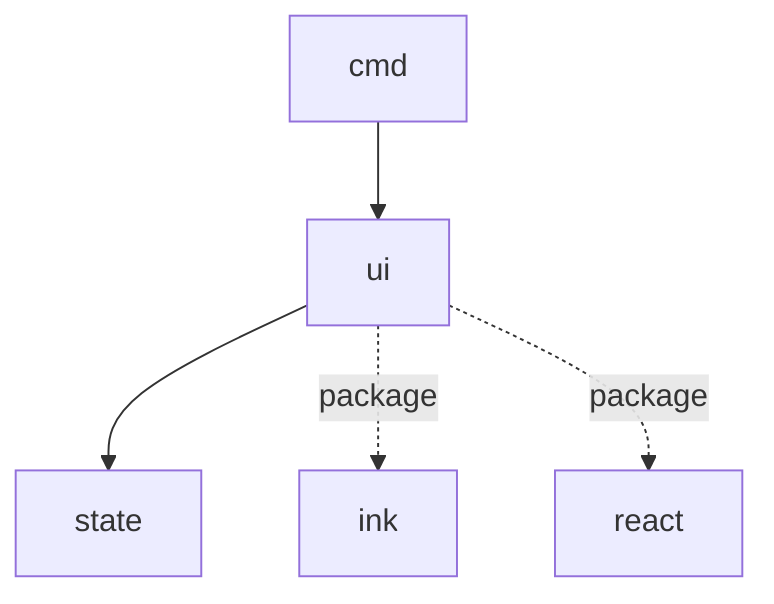

# Module: ui

## 1. Module Vision

Ink-компоненты для рендеринга дашборда. `AgentMonApp` — корень, подписывается на state manager. `ColumnView` — реализация SessionDashboard (колонки по провайдерам). Все компоненты чисто презентационные.

**Parent scope:** [`../agent-mon-cli.spec.md`](../agent-mon-cli.spec.md)

## 2. Entity Inventory (Closed-World)

| Name             | Type      | Purpose                                                               |
| ---------------- | --------- | --------------------------------------------------------------------- |
| `AgentMonApp`    | Component | Корень: `useInput`, подписка на state manager, выбор SessionDashboard |
| `ColumnView`     | Component | Колонки по провайдерам — implements SessionDashboard                  |
| `ProviderColumn` | Component | Колонка провайдера: заголовок + карточки                              |
| `SessionCard`    | Component | Карточка сессии                                                       |
| `StatusBadge`    | Component | 🔴⏳🟡⬜ индикатор статуса                                            |

## 3. Entity Surfaces

### `AgentMonApp`

- **Type:** Component (ink)
- **Purpose:** Корневой компонент — lifecycle, input, connect state → view
- **Public Properties:**
  - `stateManager: StateManager`
  - `view?: 'column' | 'compact'` (default `'column'`)
- **Public Operations:** N/A (React component)
- **Lifecycle:** Монтируется `render()`, unmount при выходе
- **Events Emitted:** N/A
- **Errors & Degradation:**
  - `status === 'loading'` → `<Text>Scanning for active sessions...</Text>`
  - `status === 'error'` → `<Text color="red">Error: {error.message}</Text>` + последние данные если есть
  - `data.columns.length === 0` → `<Text>No active sessions.</Text>`
- **Consumers:** External — `cmd/run.ts`

### `ColumnView`

- **Type:** Component (ink)
- **Purpose:** Дашборд с колонками по провайдерам
- **Public Properties:** `viewModel: ViewModel`
- **Public Operations:** N/A
- **Lifecycle:** Перерендеривается при изменении `viewModel`
- **Consumers:** Internal — `AgentMonApp`

### `ProviderColumn` (component)

- **Type:** Component (ink)
- **Purpose:** Одна колонка провайдера
- **Public Properties:** `column: ProviderColumn`
- **Public Operations:** N/A
- **Lifecycle:** Перерендеривается при изменении `column`
- **Consumers:** Internal — `ColumnView`

### `SessionCard` (component)

- **Type:** Component (ink)
- **Purpose:** Карточка одной сессии
- **Public Properties:** `card: SessionCard`
- **Public Operations:** N/A
- **Lifecycle:** Перерендеривается при изменении `card`
- **Errors & Degradation:** Отсутствующие поля (tokens, cpu) не рендерятся
- **Consumers:** Internal — `ProviderColumn`

### `StatusBadge`

- **Type:** Component (ink)
- **Purpose:** Визуальный индикатор статуса
- **Public Properties:** `status: 'active' | 'waiting' | 'idle' | 'completed'`
- **Public Operations:** N/A
- **Lifecycle:** Stateless
- **Consumers:** Internal — `SessionCard`

## 4. Module Contracts (DbC)

Все компоненты — презентационные, без бизнес-логики. DbC не требуется.

## 5. Public Options & Policies

SessionDashboard type: `React.ComponentType<{ viewModel: ViewModel }>`. `ColumnView` — единственная реализация в V1.

## 6. File Structure

```
ui/
├── app.tsx                   // AgentMonApp
├── column-view.tsx           // ColumnView
├── provider-column.tsx       // ProviderColumn
├── session-card.tsx          // SessionCard
├── status-badge.tsx          // StatusBadge
└── index.ts                  // реэкспорт
```

**File Mapping:**

- `app.tsx` — `AgentMonApp`
- `column-view.tsx` — `ColumnView`
- `provider-column.tsx` — `ProviderColumn`
- `session-card.tsx` — `SessionCard`
- `status-badge.tsx` — `StatusBadge`

## 7. Module Decision Log

None.

## 8. Inter-Module Dependencies

- **Depends on:** `state` (`../state/state.spec.md`), `ink`, `react`
- **Provides to:** `cmd`



## 9. Handoff to task-scaffolding

- **Implementation files to be created:**
  - `cli/cmd/agent-mon/ui/app.tsx`
  - `cli/cmd/agent-mon/ui/column-view.tsx`
  - `cli/cmd/agent-mon/ui/provider-column.tsx`
  - `cli/cmd/agent-mon/ui/session-card.tsx`
  - `cli/cmd/agent-mon/ui/status-badge.tsx`
  - `cli/cmd/agent-mon/ui/index.ts`
- **Test files to be created:**
  - `cli/cmd/agent-mon/ui/__tests__/app.test.tsx`
  - `cli/cmd/agent-mon/ui/__tests__/column-view.test.tsx`
  - `cli/cmd/agent-mon/ui/__tests__/session-card.test.tsx`
- **Stack dependencies:**
  - Language: `TypeScript` + `JSX` → `ai/directives/coding/typescript-rules.xml`
  - Test framework: `node:test` → `ai/directives/testing/node-test.xml`
  - TUI framework: `ink@^7` + `react@^19`
- **Module Rules Additions:** None
- **Open risks & validation needs:** `ink-testing-library` для тестов ink-компонентов (render в строку)
