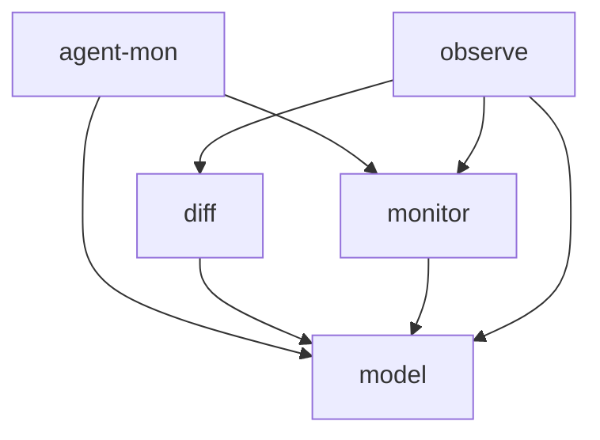

# Tasks: agent-mon

## Scope Spec

- [Scope spec](./agent-mon.spec.md)

## Cascade Table

<!-- ЗАПОЛНЯЕТ АГЕНТ: действующие правила scope из Scope Graph (транзитивное замыкание depends-on). -->

## Inter-Module DAG

## Tracker

| Task-ID     | Title                             | Module  | Dependencies                        | Status   | Reopens |
| ----------- | --------------------------------- | ------- | ----------------------------------- | -------- | ------- |
| AM-exports  | Корневой barrel + subpath-exports | —       | MON-service, AM-claude, AM-opencode | [ ] TODO | —       |
| AM-claude   | ClaudeProvider                    | —       | MOD-types                           | [ ] TODO | —       |
| AM-opencode | OpenCodeProvider                  | —       | MOD-types                           | [ ] TODO | —       |
| DIF-compare | diff: сравнение снапшотов         | diff    | MOD-types                           | [ ] TODO | —       |
| MOD-types   | Типы и контракты agent-mon        | model   | —                                   | [ ] TODO | —       |
| MON-service | AgentMonitor: ядро и фабрика      | monitor | MOD-types                           | [ ] TODO | —       |
| OBS-stream  | observe: async iterable           | observe | MOD-types, MON-service, DIF-compare | [ ] TODO | —       |

## Decision Log (scope task level)

<!-- <ACR>-DL-N scope-уровневых решений декомпозиции/планирования. -->
