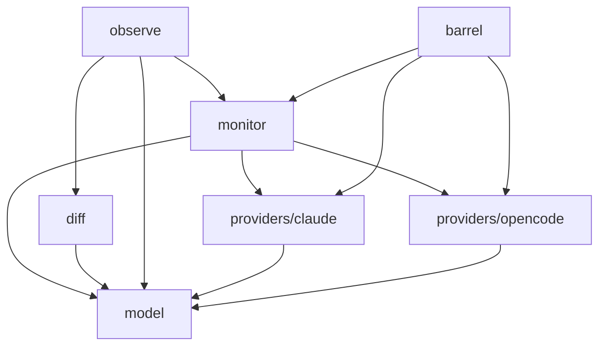

# agent-mon: Library Specification

## scope-type

library

## 1. Vision & Primary Goal

Пассивный мониторинг активных сессий AI-агентов через унифицированный провайдерный интерфейс. Каждый провайдер знает, как сканировать свою агентскую систему, и возвращает нормализованный `AgentSession[]`. Библиотека не имеет UI — pure data layer. CLI-потребитель будет отдельным product-скоупом.

## 2. Approved Golden DX Example

```ts
import { createMonitor, diff, observe } from 'agent-mon';
import { claudeProvider } from 'agent-mon/providers/claude';
import { opencodeProvider } from 'agent-mon/providers/opencode';

const mon = createMonitor();
mon.register('claude', claudeProvider);
mon.register('opencode', opencodeProvider);

// A) Snapshot + diff — потребитель сам решает, когда и как часто
const a = await mon.scanAll({ since: 'today' });
const b = await mon.scanAll({ since: 'today' });
const changes = diff(a, b);
// → { added: AgentSession[], removed: AgentSession[], updated: AgentSession[] }

// B) Observe — async iterable, библиотека крутит цикл сама
for await (const change of observe(mon, { interval: 5000 })) {
  // change = { added, removed, updated }
}

// Один провайдер
const claudeOnly = await mon.scanOne('claude');
```

## 3. Requirements & Constraints

### 3.1 Functional Requirements

| #   | Требование                                                                                                                                                                                                                                                                                                                  |
| --- | --------------------------------------------------------------------------------------------------------------------------------------------------------------------------------------------------------------------------------------------------------------------------------------------------------------------------- |
| F1  | Provider registry: `register(key, provider)`, `unregister(key)`; key — произвольная строка                                                                                                                                                                                                                                  |
| F2  | `scanAll(opts?)` — сбор сессий со всех зарегистрированных провайдеров; `opts.since` — timestamp или `'today'`                                                                                                                                                                                                               |
| F3  | `scanOne(key, opts?)` — сканирование одного провайдера                                                                                                                                                                                                                                                                      |
| F4  | Унифицированная модель `AgentSession` — единый формат для всех провайдеров                                                                                                                                                                                                                                                  |
| F5  | Статус сессии: `active` (процесс жив / не заархивирована), `idle` (нет активности > `idleThresholdMs`, по умолчанию 300000), `completed` (процесс мёртв / `time_archived != null`)                                                                                                                                          |
| F6  | `parentId` — связь родитель→сабагент (поле есть, провайдеры заполняют что могут; дерево — V2)                                                                                                                                                                                                                               |
| F7  | `diff(prev, curr)` — свободная функция сравнения двух snapshot-ов. Сравнивает семантические поля (status, title, lastActivityAt, elapsedSeconds, idleSeconds, toolCallCount, errorCount, lastMessage, tokensInput, tokensOutput). Не сравнивает noisy-поля (cpuPercent, memoryMb). Возвращает `{ added, removed, updated }` |
| F8  | `observe(monitor, opts)` — свободная функция, async iterable. `opts.interval` — период опроса, `opts.idleThresholdMs` опционален (default 300000). Отдаёт `SessionChanges` каждые N мс                                                                                                                                      |

### 3.2 Non-Functional Constraints

| #   | Ограничение                                                                                                      |
| --- | ---------------------------------------------------------------------------------------------------------------- |
| N1  | Zero runtime dependencies — только Node.js 22+ stdlib                                                            |
| N2  | Passive read-only — не спавнит процессы агентов, не пишет в их файлы/БД                                          |
| N3  | Graceful degradation — недоступный провайдер пропускается (логирует ошибку, возвращает `[]`), остальные работают |
| N4  | Скан < 1с при 50+ сессиях                                                                                        |
| N5  | Код на TypeScript, стиль и контракты по `ai/directives/coding/typescript-rules.xml`                              |

### 3.3 Out-of-Scope

- CLI UI / рендеринг (отдельный product-скоуп `agent-mon-cli`)
- Watch/refresh loop на уровне CLI (потребитель использует `observe()` или свой цикл)
- Process management (kill, restart агентов)
- Streaming вывода агента в реальном времени
- Историческая аналитика / хранение метрик
- Дерево сабагентов (V2)

### 3.4 Runtime Backing & Deferred Scope

Всё `real-runtime`:

- `node:fs` — чтение Claude session JSON-файлов
- `node:child_process` — `ps` для проверки PID
- `node:sqlite` — чтение OpenCode `opencode.db`
- `node:os`, `node:path` — построение путей

### 3.5 Rules

| Rule             | Category | Source                 |
| ---------------- | -------- | ---------------------- |
| typescript-rules | coding   | inherited from project |
| node-test        | testing  | inherited from project |

## 4. Public API Surface

```ts
// --- Core factory ---
function createMonitor(): AgentMonitor;

// --- Monitor ---
interface AgentMonitor {
  register(key: string, provider: AgentProvider): void;
  unregister(key: string): void;
  scanAll(opts?: ScanOpts): Promise<AgentSession[]>;
  scanOne(key: string, opts?: ScanOpts): Promise<AgentSession[]>;
}

// --- Standalone functions ---
function diff(prev: AgentSession[], curr: AgentSession[]): SessionChanges;
function observe(monitor: AgentMonitor, opts: ObserveOpts): AsyncIterable<SessionChanges>;

// --- Provider contract ---
interface AgentProvider {
  readonly key: string;
  scan(opts?: ScanOpts): Promise<AgentSession[]>;
}

// --- Session model ---
interface AgentSession {
  provider: string;
  pid: number | null;
  sessionId: string;
  parentId?: string;
  title: string;
  slug?: string;
  cwd: string;
  model?: string;
  agent?: string;
  status: 'active' | 'idle' | 'completed';
  startedAt: number;
  completedAt?: number;
  lastActivityAt?: number;
  elapsedSeconds: number;
  idleSeconds?: number;
  cpuPercent?: number;
  memoryMb?: number;
  toolCallCount?: number;
  errorCount?: number;
  lastMessage?: string;
  tokensInput?: number;
  tokensOutput?: number;
}

// --- Supporting types ---
interface ScanOpts {
  since?: number | 'today';
}

interface ObserveOpts {
  interval: number;
  idleThresholdMs?: number; // default 300000 (5 min)
}

interface SessionChanges {
  added: AgentSession[];
  removed: AgentSession[];
  updated: AgentSession[];
}

// --- Errors ---
class DuplicateProviderError extends Error {
  key: string;
}
class ProviderNotFoundError extends Error {
  key: string;
}
```

## 5. Architecture

### Файловая структура

```
services/agent-mon/
  index.ts              // createMonitor + реэкспорт типов
  types.ts              // AgentSession, SessionChanges, ScanOpts, ObserveOpts
  monitor.ts            // AgentMonitor impl (registry, scanAll, scanOne)
  diff.ts               // diff() — сравнение снапшотов
  observe.ts            // observe() — AsyncIterable
  providers/
    claude.ts           // ClaudeProvider (implements AgentProvider)
    opencode.ts         // OpenCodeProvider (implements AgentProvider)
  __tests__/
```

### Provider Knowledge (reverse-engineered facts)

#### Claude Provider

**Источник:** `~/.claude/sessions/<PID>.json`

```json
{
  "pid": 4506,
  "sessionId": "b3626b77-f27f-4065-b323-cd787cd85a3b",
  "cwd": "/Users/k.lebedev/Developer/vkt",
  "startedAt": 1779376395910,
  "procStart": "Thu May 21 15:13:15 2026",
  "version": "2.1.142",
  "peerProtocol": 1,
  "kind": "interactive",
  "entrypoint": "claude-desktop"
}
```

**Определение живости:** `ps -p <PID>` → процесс есть = `active`, нет = `completed`.

**Извлечение model:** `ps -p <PID> -o args=` → regex `--model\s+(\S+)`.

**Извлечение title:** `~/.claude/projects/<project-path>/<sessionId>.jsonl` → первая строка с `"type":"ai-title"` → поле `aiTitle`. Fallback: первое user-сообщение.

**Извлечение CPU/RAM:** `ps -p <PID> -o pcpu=,rss=`.

**Извлечение задач:** `~/.claude/tasks/<sessionId>/*.json` → `{ id, status, subject, activeForm }`.

**lastActivityAt:** `mtime` файла `<PID>.json` в `~/.claude/sessions/`.

#### OpenCode Provider

**Источник:** `~/.local/share/opencode/opencode.db` (SQLite), таблица `session`.

```sql
id              TEXT PRIMARY KEY,   -- session ID (e.g. ses_1b4d9bb21ffe...)
project_id      TEXT NOT NULL,      -- FK → project
parent_id       TEXT,               -- FK → session (сабагент)
slug            TEXT NOT NULL,      -- human-readable id (e.g. witty-star)
directory       TEXT NOT NULL,      -- cwd
title           TEXT NOT NULL,      -- название сессии
version         TEXT NOT NULL,
time_created    INTEGER NOT NULL,   -- epoch ms
time_updated    INTEGER NOT NULL,   -- epoch ms
time_archived   INTEGER,            -- NULL = активна
agent           TEXT,               -- тип агента (build, general, alt-opinion-kimi, ...)
model           TEXT,               -- JSON: {"id":"deepseek-v4-pro","providerID":"llm-proxy",...}
tokens_input    INTEGER,
tokens_output   INTEGER,
tokens_reasoning INTEGER,
cost            REAL,
workspace_id    TEXT,
path            TEXT
```

**Определение живости:** `time_archived IS NULL` → `active`.

**Извлечение model:** парсинг JSON из колонки `model` → поле `id`.

**lastActivityAt:** `time_updated` из таблицы `session`.

**lastMessage:** таблица `message`, запись с `time_updated = session.time_updated`, поле `data` (JSON).

**Вложенность:** `parent_id` → ID родительской сессии; доступно, но в V1 только заполняем поле.

### Rejected Alternatives

| Что                                | Почему rejected                                                                           |
| ---------------------------------- | ----------------------------------------------------------------------------------------- |
| EventEmitter / `onSession()`       | V1 без real-time стриминга; подписка на индивидуальные сессии избыточна                   |
| Кеширование внутри библиотеки      | Состояние гонки с внешним observe; потребитель сам управляет                              |
| RxJS / Observable                  | Тянет внешнюю зависимость, противоречит N1 (zero deps)                                    |
| Провайдеры как функции, не объекты | Объект (`AgentProvider`) позволяет хранить `key` и конфигурацию; функция менее расширяема |

## 6. Decision Log

### D-001 — Provider abstraction: interface over function

- **Status:** active
- **Recorded:** session Discovery, agent-mon
- **Why:** Объект `AgentProvider` с методом `scan()` и полем `key` удобнее чистой функции — провайдер может хранить внутреннее состояние (пути, конфигурацию) без глобальных переменных.
- **Risk accepted:** Низкий. Контракт минимален.
- **Rejected alternatives:** `(opts) => AgentSession[]` — функция не может иметь `key`, нужен отдельный map.

### D-002 — scanAll/scanOne + diff + observe

- **Status:** active
- **Recorded:** session Discovery, agent-mon
- **Why:** Комбинация snapshot + diff (потребитель сам управляет циклом) и observe (библиотека крутит цикл) покрывает оба сценария без противоречий.
- **Risk accepted:** Низкий. Два простых API вместо одного сложного.
- **Rejected alternatives:** только observe, только scanAll.

### D-003 — Async API (Promise<AgentSession[]>)

- **Status:** active
- **Recorded:** session Discovery, agent-mon
- **Why:** Хотя `node:sqlite` и `ps` синхронные, `Promise` позволяет в будущем добавить провайдеры с реальным async I/O без ломания контракта.
- **Risk accepted:** Минимальный оверхед от async/await.
- **Rejected alternatives:** синхронный `AgentSession[]`.

### D-004 — provider: string (открытый тип)

- **Status:** active
- **Recorded:** session Discovery, agent-mon
- **Why:** Строка как ключ провайдера позволяет расширять систему без изменения типов. Новые провайдеры регистрируются с любым строковым ключом.
- **Risk accepted:** Нет валидации на уровне типов, но `register()` проверяет дубликаты.
- **Rejected alternatives:** enum `'claude' | 'opencode'` — требует изменения enum при добавлении провайдера.

### D-005 — diff и observe как свободные функции, не методы AgentMonitor

- **Status:** active
- **Recorded:** session ModuleDecomposition, agent-mon, post-review fix
- **Why:** `AgentMonitor.diff()` и `AgentMonitor.observe()` как методы создавали циклическую зависимость в DAG: TSK-36 (monitor) не может реализовать observe без TSK-38, а TSK-38 зависит от TSK-36. Свободные функции `diff()` и `observe(monitor, opts)` разрешают цикл: TSK-38 → TSK-36, без обратного ребра.
- **Risk accepted:** Изменение Golden DX (было `mon.diff()`, стало `diff()`). Минимальное — consumer всё ещё может использовать оба API.
- **Rejected alternatives:** DI через `createMonitor({ diff, observe })` — усложняет фабрику без необходимости.

## 7. Scope Dependencies

- **Depends on:** infra-base (Node.js 22+, npm, tsc, prettier, node:test, vite)
- **Provides to:** agent-mon-cli (product scope, CLI UI поверх этой библиотеки)

## 8. Bootstrap Requirements

| Requirement                                     | Kind | Owner                 | Resolution                                                                                                          |
| ----------------------------------------------- | ---- | --------------------- | ------------------------------------------------------------------------------------------------------------------- |
| Node.js >= 22.5 (для node:sqlite)               | tool | external-prereq-scope | уже в infra-base; `node:sqlite` экспериментальный в 22.x (работает с ExperimentalWarning), стабилизирован в Node 24 |
| Claude sessions dir ~/.claude/sessions/         | file | operator-action       | создаётся Claude.app; формат задокументирован реверсом в секции 5                                                   |
| OpenCode DB ~/.local/share/opencode/opencode.db | file | operator-action       | создаётся OpenCode.app; схема задокументирована реверсом в секции 5                                                 |

## 9. Handoff to module-decomposition

- **Primary input:** `specs/agent-mon/agent-mon.spec.md`
- **Areas requiring decomposition:**
  - `AgentMonitor` core (registry, scanAll, scanOne)
  - `diff` utility
  - `observe` async iterable
  - `AgentProvider` interface + Claude provider impl
  - `AgentProvider` interface + OpenCode provider impl
  - `AgentSession` types + normalize helpers
- **Named abstractions:** `createMonitor`, `AgentMonitor`, `AgentProvider`, `AgentSession`, `SessionChanges`, `diff`, `observe`
- **Bootstrap tickets ready for cascade:** see section 8
- **Open risks:**
  - Формат `~/.claude/sessions/<PID>.json` может измениться при обновлении Claude (приведёт к падению Claude-провайдера в рамках N3)
  - `node:sqlite` experimental — нужно отслеживать стабилизацию в Node.js
  - Не все провайдеры смогут заполнить все поля `AgentSession` (например, toolCallCount для OpenCode требует парсинга message.data JSON)

## 10. Module Map (post-ModuleDecomposition)

Spec hierarchy is materialized at `specs/agent-mon/`. Module specs are at `specs/agent-mon/<module>/<module>.spec.md`.

### 10.1 Modules

- [`model`](./model/model.spec.md) — Чистые типы и контракты: AgentSession, SessionChanges, ScanOpts, ObserveOpts, AgentProvider (Port)
- [`monitor`](./monitor/monitor.spec.md) — Ядро: AgentMonitor (Service), createMonitor (Factory), реестр провайдеров
- [`diff`](./diff/diff.spec.md) — Чистая функция сравнения двух снапшотов сессий
- [`observe`](./observe/observe.spec.md) — Async iterable для непрерывного наблюдения за изменениями
- [`providers/claude`](./providers/claude/claude.spec.md) — ClaudeProvider (Adapter): сканирование ~/.claude/sessions/ + ps
- [`providers/opencode`](./providers/opencode/opencode.spec.md) — OpenCodeProvider (Adapter): запросы к opencode.db через node:sqlite
- Barrel (scope-level) — `services/agent-mon/index.ts`: реэкспорт createMonitor, diff, observe, типов, ошибок + package.json exports

### 10.2 Inter-Module Dependency Map



### 10.3 Stack Dependencies

- Languages: TypeScript
- Test frameworks: node:test

### 10.4 Handoff to task-scaffolding

- **Primary input:** `specs/agent-mon/agent-mon.spec.md`
- **Required directives:** `ai/directives/coding/typescript-rules.xml`, `ai/directives/testing/node-test.xml`
- **Open risks & validation needs:**
  - Формат `~/.claude/sessions/<PID>.json` может измениться при обновлении Claude
  - `node:sqlite` experimental — отслеживать стабилизацию
  - Кодирование пути `/` → `-` в Claude может измениться
