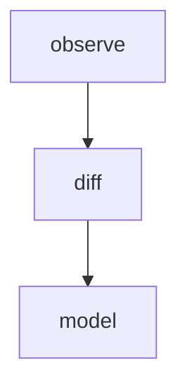

# Module: diff

## 1. Module Vision

Чистая функция сравнения двух снапшотов сессий. Без зависимостей от провайдеров или монитора.

**Parent scope:** [`../../agent-mon.spec.md`](../../agent-mon.spec.md)

## 2. Entity Inventory (Closed-World)

| Name   | Type     | Purpose                                                         |
| ------ | -------- | --------------------------------------------------------------- |
| `diff` | Function | `(prev: AgentSession[], curr: AgentSession[]) → SessionChanges` |

## 3. Entity Surfaces

### `diff`

- **Type:** Function
- **Purpose:** Сравнить два снапшота сессий → изменения
- **Public Properties:** N/A
- **Public Operations:**
  - `(prev: AgentSession[], curr: AgentSession[]) → SessionChanges`
  - Ключ сравнения: `sessionId`
  - `added`: сессии из `curr`, чей `sessionId` отсутствует в `prev`
  - `removed`: сессии из `prev`, чей `sessionId` отсутствует в `curr`
  - `updated`: сессии с одинаковым `sessionId`, но разными полями: `status`, `lastActivityAt`, `elapsedSeconds`, `idleSeconds`, `cpuPercent`, `memoryMb`, `toolCallCount`, `errorCount`, `lastMessage`, `tokensInput`, `tokensOutput`, `title`
- **Lifecycle:** Stateless — каждый вызов независим
- **Events Emitted:** N/A
- **Errors & Degradation:** N/A — работает только с памятью
- **Consumers:**
  - Internal: `services/agent-mon/observe/observe.ts`
  - External: CLI

## 4. Module Contracts (DbC)

### Function: `diff`

- **Purpose:** Сравнение двух снапшотов сессий
- **Runtime Backing:** `real-runtime`
- **Verification Levels:** `unit`
- **Deferred Runtime Scope:** None

**Contract (DbC):**

- Preconditions:
  - `prev` и `curr` — массивы `AgentSession[]` (могут быть пустыми)
  - Ключ сравнения: `sessionId` уникален в рамках одного массива
- Postconditions:
  - `added` = сессии из `curr`, чей `sessionId` отсутствует в `prev`
  - `removed` = сессии из `prev`, чей `sessionId` отсутствует в `curr`
  - `updated` = сессии с одинаковым `sessionId`, но изменились **семантические** поля: `status`, `title`, `lastActivityAt`, `elapsedSeconds`, `idleSeconds`, `toolCallCount`, `errorCount`, `lastMessage`, `tokensInput`, `tokensOutput`
  - **Не сравниваются** noisy-поля: `cpuPercent`, `memoryMb` (меняются каждый скан, не являются семантическим изменением)
  - Результат всегда `SessionChanges` (может быть пустым по всем трём массивам)
- Invariants:
  - Чистая функция, не мутирует аргументы
  - Не зависит от провайдеров / монитора / внешнего состояния

## 5. Public Options & Policies

None.

## 6. File Structure

```
diff/
├── diff.ts                  // diff()
└── index.ts                 // реэкспорт
```

**File Mapping:**

- `diff.ts` — `diff(prev, curr) → SessionChanges`

## 7. Module Decision Log

Нет модульных решений.

## 8. Inter-Module Dependencies

- **Depends on:** `model` (`../../model/model.spec.md`)
- **Provides to:** `observe`, CLI



## 9. Handoff to task-scaffolding

- **Implementation files to be created:**
  - `services/agent-mon/diff/diff.ts`
  - `services/agent-mon/diff/index.ts`
- **Test files to be created:**
  - `services/agent-mon/diff/__tests__/diff.test.ts`
- **Stack dependencies:**
  - Language: `TypeScript` → `ai/directives/coding/typescript-rules.xml`
  - Test framework: `node:test` → `ai/directives/testing/node-test.xml`
- **Module Rules Additions:** None
- **Open risks & validation needs:** None
