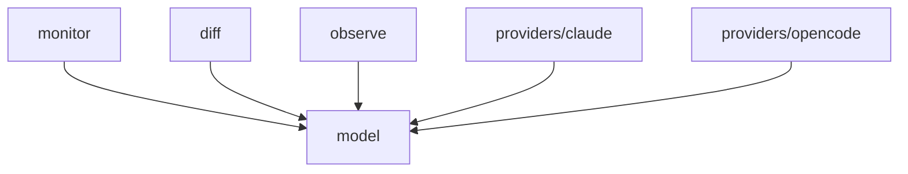

# Module: model

## 1. Module Vision

Чистые типы и контракты для всей библиотеки agent-mon. Никакой реализации — только Value Objects и Port `AgentProvider`. Все остальные модули импортируют типы отсюда.

**Parent scope:** [`../../agent-mon.spec.md`](../../agent-mon.spec.md)

## 2. Entity Inventory (Closed-World)

_Это полный список сущностей модуля. Любое введение сущности execution-агентом помимо этого списка считается drift'ом и требует обновления spec._

| Name                     | Type         | Purpose                                                                                       |
| ------------------------ | ------------ | --------------------------------------------------------------------------------------------- |
| `AgentSession`           | Value Object | Унифицированная модель сессии — единый формат данных от всех провайдеров                      |
| `SessionChanges`         | Value Object | Результат diff: `{ added, removed, updated }`                                                 |
| `ScanOpts`               | Value Object | Параметры сканирования (`since`)                                                              |
| `ObserveOpts`            | Value Object | Параметры observe (`interval`)                                                                |
| `AgentProvider`          | Port         | Контракт провайдера — `key: string`, `scan(opts) → Promise<AgentSession[]>`                   |
| `DuplicateProviderError` | Error        | Бросается при `register()` с дубликатом ключа                                                 |
| `ProviderNotFoundError`  | Error        | Бросается при `scanOne()` с неизвестным ключом; `unregister()` для неизвестного ключа — no-op |

## 3. Entity Surfaces

### `AgentSession`

- **Type:** Value Object
- **Purpose:** Унифицированная модель сессии агента — единый формат данных от всех провайдеров
- **Public Properties:**
  - `provider: string` — ключ провайдера (`'claude'`, `'opencode'`, ...)
  - `pid: number | null` — PID процесса (null для OpenCode)
  - `sessionId: string` — уникальный ID сессии
  - `parentId?: string` — ID родительской сессии (сабагент), V1 опционально
  - `title: string` — название сессии
  - `slug?: string` — human-readable id (OpenCode)
  - `cwd: string` — рабочая директория
  - `model?: string` — модель (`claude-opus-4-7`, `deepseek-v4-pro`)
  - `agent?: string` — тип агента (`build`, `general`, `alt-opinion-kimi`)
  - `status: 'active' | 'idle' | 'completed'`
  - `startedAt: number` — epoch ms
  - `completedAt?: number` — epoch ms завершения
  - `lastActivityAt?: number` — epoch ms последней активности
  - `elapsedSeconds: number` — общее время работы
  - `idleSeconds?: number` — простой с `lastActivityAt`
  - `cpuPercent?: number` — % CPU (только Claude)
  - `memoryMb?: number` — MB RAM (только Claude)
  - `toolCallCount?: number` — количество вызовов инструментов
  - `errorCount?: number` — количество ошибок
  - `lastMessage?: string` — последнее сообщение (усечённо)
  - `tokensInput?: number` — входные токены (OpenCode)
  - `tokensOutput?: number` — выходные токены (OpenCode)
- **Public Operations:** N/A — чистые данные
- **Lifecycle:** Создаётся провайдером в `scan()`, агрегируется в `scanAll()`, сравнивается в `diff()`, потребляется CLI
- **Events Emitted:** N/A
- **Errors & Degradation:** N/A
- **Consumers:**
  - Internal: `services/agent-mon/model/types.ts`, все провайдеры, `monitor`, `diff`, `observe`
  - External: CLI-потребитель

### `SessionChanges`

- **Type:** Value Object
- **Purpose:** Результат сравнения двух снапшотов сессий
- **Public Properties:**
  - `added: AgentSession[]` — новые сессии
  - `removed: AgentSession[]` — завершённые сессии
  - `updated: AgentSession[]` — изменившиеся сессии
- **Public Operations:** N/A
- **Lifecycle:** Создаётся `diff()`, потребляется `observe()` и CLI
- **Events Emitted:** N/A
- **Errors & Degradation:** N/A
- **Consumers:**
  - Internal: `services/agent-mon/diff/diff.ts`, `services/agent-mon/observe/observe.ts`
  - External: CLI

### `ScanOpts`

- **Type:** Value Object
- **Purpose:** Параметры фильтрации при сканировании
- **Public Properties:**
  - `since?: number | 'today'` — вернуть сессии, начатые после этого timestamp или начала сегодняшнего дня
  - `idleThresholdMs?: number` — порог простоя для определения статуса idle (default 300000)
- **Public Operations:** N/A
- **Lifecycle:** Создаётся потребителем, передаётся в `scanAll` / `scanOne` / `provider.scan()`
- **Events Emitted:** N/A
- **Errors & Degradation:** N/A
- **Consumers:**
  - Internal: `monitor`, все провайдеры
  - External: CLI

### `ObserveOpts`

- **Type:** Value Object
- **Purpose:** Параметры цикла наблюдения
- **Public Properties:**
  - `interval: number` — период опроса в миллисекундах
  - `idleThresholdMs?: number` — порог простоя (default 300000 мс = 5 мин), после которого сессия помечается `idle`
- **Public Operations:** N/A
- **Lifecycle:** Создаётся потребителем, передаётся в `observe()`
- **Events Emitted:** N/A
- **Errors & Degradation:** N/A
- **Consumers:**
  - Internal: `observe`
  - External: CLI

### `AgentProvider`

- **Type:** Port
- **Purpose:** Контракт для всех провайдеров сессий — единая точка расширения
- **Public Properties:**
  - `key: string` — уникальный строковый ключ провайдера
- **Public Operations:**
  - `scan(opts?: ScanOpts) → Promise<AgentSession[]>` — просканировать источник, вернуть нормализованные сессии
- **Lifecycle:** Singleton per key, регистрируется в `AgentMonitor`, живёт до `unregister()` или завершения процесса
- **Events Emitted:** N/A
- **Errors & Degradation:**
  - При ошибке сканирования возвращает `[]`, логирует
  - Не крашит `scanAll()` — graceful degradation (N3)
- **Consumers:**
  - Internal: `services/agent-mon/monitor/agent-monitor.ts`
  - External: каждый Adapter implements этот Port

## 4. Module Contracts (DbC)

### Port: `AgentProvider`

- **Purpose:** Контракт провайдера сессий — точка расширения для новых агентских систем
- **Consumers:**
  - Internal: `services/agent-mon/monitor/agent-monitor.ts`
  - External: каждый Adapter (`claude.ts`, `opencode.ts`, будущие) implements
- **Supporting Artifacts:** scope spec §5 Provider Knowledge
- **Runtime Backing:** `real-runtime`
- **Verification Levels:** `contract`
- **Deferred Runtime Scope:** None

**Contract (DbC):**

- Preconditions:
  - `key` — непустая строка, уникальная в рамках одного `AgentMonitor`
  - `scan()` вызывается только после регистрации провайдера в мониторе
- Postconditions:
  - Возвращает `AgentSession[]` (может быть пустым)
  - Каждая сессия имеет `sessionId`, `provider = this.key`, `title`, `cwd`, `startedAt`, `status`, `elapsedSeconds`
  - Все timestamp-поля — epoch ms, все duration-поля — секунды
  - Опциональные поля = `undefined`, не `null`
- Invariants:
  - `scan()` не меняет состояние провайдера (stateless)
  - Ошибка в `scan()` → `[]`, не пробрасывается наружу
  - `scan()` не пишет в источник данных (read-only, N2)

## 5. Public Options & Policies

Нет публичных опций — только типы и интерфейс.

## 6. File Structure

```
model/
├── agent-session.type.ts    // AgentSession
├── session-changes.type.ts  // SessionChanges
├── scan-opts.type.ts        // ScanOpts
├── observe-opts.type.ts     // ObserveOpts
├── agent-provider.type.ts   // AgentProvider (Port)
├── errors.ts                // DuplicateProviderError, ProviderNotFoundError
└── index.ts                 // реэкспорт всех типов
```

**File Mapping:**

- `agent-session.type.ts` — `AgentSession` Value Object
- `session-changes.type.ts` — `SessionChanges` Value Object
- `scan-opts.type.ts` — `ScanOpts` Value Object
- `observe-opts.type.ts` — `ObserveOpts` Value Object
- `agent-provider.type.ts` — `AgentProvider` Port

## 7. Module Decision Log

Нет модульных решений — все на уровне scope spec.

## 8. Inter-Module Dependencies

- **Depends on:** None (корень графа зависимостей)
- **Scope Reference (cross-scope):** None
- **Provides to:** `monitor`, `diff`, `observe`, `providers/claude`, `providers/opencode`



## 9. Handoff to task-scaffolding

- **Implementation files to be created:**
  - `services/agent-mon/model/agent-session.type.ts`
  - `services/agent-mon/model/session-changes.type.ts`
  - `services/agent-mon/model/scan-opts.type.ts`
  - `services/agent-mon/model/observe-opts.type.ts`
  - `services/agent-mon/model/agent-provider.type.ts`
  - `services/agent-mon/model/errors.ts`
  - `services/agent-mon/model/index.ts`
- **Test files to be created:**
  - `services/agent-mon/model/__tests__/agent-session.type.test.ts`
- **Stack dependencies:**
  - Language: `TypeScript` (resolves to `ai/directives/coding/typescript-rules.xml`)
  - Test framework: `node:test` (resolves to `ai/directives/testing/node-test.xml`)
- **Module Rules Additions:** None (scope-wide baseline достаточен)
- **Open risks & validation needs:** None
