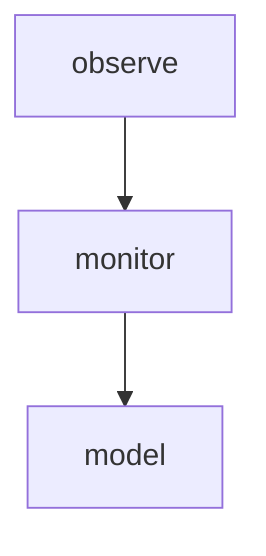

# Module: monitor

## 1. Module Vision

Ядро библиотеки — Service `AgentMonitor`. Владеет реестром провайдеров, координирует сканирование, делегирует `diff` и `observe` в соответствующие модули.

**Parent scope:** [`../../agent-mon.spec.md`](../../agent-mon.spec.md)

## 2. Entity Inventory (Closed-World)

| Name            | Type    | Purpose                                                             |
| --------------- | ------- | ------------------------------------------------------------------- |
| `AgentMonitor`  | Service | Реестр провайдеров, `scanAll()`, `scanOne()`, `diff()`, `observe()` |
| `createMonitor` | Factory | `() → AgentMonitor`                                                 |

## 3. Entity Surfaces

### `AgentMonitor`

- **Type:** Service
- **Purpose:** Владеет реестром провайдеров, координирует сканирование
- **Public Properties:** N/A
- **Public Operations:**
  - `register(key: string, provider: AgentProvider) → void` — добавляет провайдер; бросает `DuplicateProviderError`
  - `unregister(key: string) → void` — удаляет; no-op если не найден
  - `scanAll(opts?: ScanOpts) → Promise<AgentSession[]>` — `Promise.all` по всем провайдерам, склеивает, сортирует по `startedAt` desc
  - `scanOne(key: string, opts?: ScanOpts) → Promise<AgentSession[]>` — вызывает конкретный провайдер; `ProviderNotFoundError` если не зарегистрирован
- **Lifecycle:** Создаётся `createMonitor()`, владеет `Map<string, AgentProvider>`, живёт до сборки мусора
- **Events Emitted:** N/A
- **Errors & Degradation:** `DuplicateProviderError`, `ProviderNotFoundError`; при `scanAll` — ошибка провайдера логируется, не прерывает остальные (N3)
- **Consumers:**
  - Internal: `services/agent-mon/observe/observe.ts`
  - External: CLI

### `createMonitor`

- **Type:** Factory
- **Purpose:** Создать и вернуть `AgentMonitor`
- **Public Properties:** N/A
- **Public Operations:**
  - `() → AgentMonitor` — создаёт `new AgentMonitor()`
- **Lifecycle:** Вызывается один раз при старте consumer'а
- **Events Emitted:** N/A
- **Errors & Degradation:** N/A — конструктор без сайд-эффектов
- **Consumers:** External — CLI

## 4. Module Contracts (DbC)

### Service: `AgentMonitor`

- **Purpose:** Владеет реестром провайдеров, координирует сканирование
- **Runtime Backing:** `real-runtime`
- **Verification Levels:** `unit`
- **Deferred Runtime Scope:** None

**Contract (DbC):**

- Preconditions:
  - `register(key, p)` — `key` непустая строка, `p` implements `AgentProvider`
  - `scanOne(key)` — `key` зарегистрирован
- Postconditions:
  - `register()` — провайдер в реестре; дубликат → `DuplicateProviderError`
  - `unregister(key)` — удалён из реестра; неизвестный ключ → no-op
  - `scanAll()` — `Promise.all`, массив склеен и отсортирован по `startedAt` desc
  - `scanOne()` — неизвестный ключ → `ProviderNotFoundError`
- Invariants:
  - Отказ провайдера в `scanAll()` не прерывает остальные (N3)
  - Реестр провайдеров (`Map`) не мутирует во время `scanAll()`
  - Сервис не кеширует результаты между вызовами

## 5. Public Options & Policies

None.

## 6. File Structure

```
monitor/
├── agent-monitor.ts         // AgentMonitor (Service)
├── create-monitor.ts        // createMonitor (Factory)
└── index.ts                 // реэкспорт
```

**File Mapping:**

- `agent-monitor.ts` — `AgentMonitor` (Map<string, AgentProvider>, register, unregister, scanAll, scanOne)
- `create-monitor.ts` — `createMonitor()`

## 7. Module Decision Log

### D-MON-001 — AgentMonitor as Service, not Port

- **Status:** active
- **Recorded:** session ModuleDecomposition, agent-mon
- **Why:** Только одна реализация в V1. Port требует ≥2 реализаций или test seam per `AX_PORTS_AND_ABSTRACTIONS_DISCIPLINE`. При появлении второго монитора — выделим Port.
- **Risk accepted:** Тесты observe/CLI используют реальный `AgentMonitor` с мок-провайдерами (мокаем `AgentProvider`, не `AgentMonitor`).
- **Rejected alternatives:** Port `AgentMonitor` → нарушает `AX_PORTS_AND_ABSTRACTIONS_DISCIPLINE`.

## 8. Inter-Module Dependencies

- **Depends on:** `model` (`../../model/model.spec.md`)
- **Scope Reference (cross-scope):** None
- **Provides to:** `observe`, CLI



## 9. Handoff to task-scaffolding

- **Implementation files to be created:**
  - `services/agent-mon/monitor/agent-monitor.ts`
  - `services/agent-mon/monitor/create-monitor.ts`
  - `services/agent-mon/monitor/index.ts`
- **Test files to be created:**
  - `services/agent-mon/monitor/__tests__/agent-monitor.test.ts`
  - `services/agent-mon/monitor/__tests__/create-monitor.test.ts`
- **Stack dependencies:**
  - Language: `TypeScript` → `ai/directives/coding/typescript-rules.xml`
  - Test framework: `node:test` → `ai/directives/testing/node-test.xml`
- **Module Rules Additions:** None
- **Open risks & validation needs:** None
