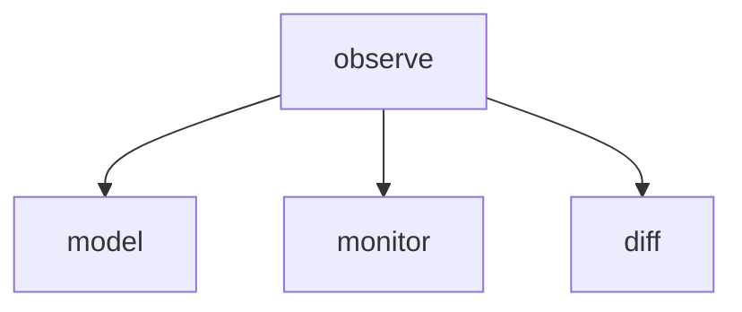

# Module: observe

## 1. Module Vision

Async iterable для непрерывного наблюдения за изменениями сессий. Принимает `AgentMonitor`, каждые N мс делает `scanAll` + `diff`, yield'ит `SessionChanges`.

**Parent scope:** [`../../agent-mon.spec.md`](../../agent-mon.spec.md)

## 2. Entity Inventory (Closed-World)

| Name      | Type     | Purpose                                                                      |
| --------- | -------- | ---------------------------------------------------------------------------- |
| `observe` | Function | `(monitor: AgentMonitor, opts: ObserveOpts) → AsyncIterable<SessionChanges>` |

## 3. Entity Surfaces

### `observe`

- **Type:** Function
- **Purpose:** Бесконечный async iterable, отдающий изменения сессий с заданным интервалом
- **Public Properties:** N/A
- **Public Operations:**
  - `(monitor: AgentMonitor, opts: ObserveOpts) → AsyncIterable<SessionChanges>`
  - Первая итерация: `scanAll()` — НЕ отдаётся как изменение (это baseline)
  - Последующие: `scanAll()` → `diff(prev, curr)` → yield `SessionChanges` → `prev = curr`
  - Интервал: `opts.interval` мс
  - Завершение: по `break` внешнего цикла
- **Lifecycle:** Создаётся потребителем через `for await`, живёт до `break`
- **Events Emitted:** N/A
- **Errors & Degradation:** Ошибка внутри итерации логируется, цикл продолжается. Если упали все провайдеры → yield'ит пустой `SessionChanges`
- **Consumers:** External — CLI

## 4. Module Contracts (DbC)

### Function: `observe`

- **Purpose:** Async iterable для непрерывного наблюдения
- **Runtime Backing:** `real-runtime`
- **Verification Levels:** `unit`, `integration`
- **Deferred Runtime Scope:** None

**Contract (DbC):**

- Preconditions:
  - `monitor` — экземпляр `AgentMonitor` с ≥1 зарегистрированным провайдером
  - `opts.interval >= 100` (защита от спама)
- Postconditions:
  - Первая итерация: выполняет `monitor.scanAll()`, запоминает baseline, НЕ yield'ит
  - Последующие: yield'ит `SessionChanges` каждые `opts.interval` мс
- Invariants:
  - Ошибка в итерации → лог, цикл продолжается
  - Все провайдеры упали → `{ added: [], removed: [], updated: [] }`
  - Не блокирует event loop между итерациями (`setTimeout`)

## 5. Public Options & Policies

`ObserveOpts.interval` — минимальное значение 100 мс, enforced в DbC.

## 6. File Structure

```
observe/
├── observe.ts               // observe()
└── index.ts                 // реэкспорт
```

**File Mapping:**

- `observe.ts` — `observe(monitor, opts) → AsyncIterable<SessionChanges>`

## 7. Module Decision Log

### D-OBS-001 — No AbortSignal in V1

- **Status:** active
- **Recorded:** session ModuleDecomposition, agent-mon
- **Why:** `break` во внешнем цикле достаточно для остановки. `AbortSignal` добавляет сложность без подтверждённого потребителя.
- **Risk accepted:** Если CLI нужно аварийно прервать observe из другого контекста — добавим `signal?: AbortSignal` в V2.
- **Rejected alternatives:** AbortSignal сейчас → YAGNI.

## 8. Inter-Module Dependencies

- **Depends on:** `model` (`../../model/model.spec.md`), `monitor` (`../../monitor/monitor.spec.md`), `diff` (`../../diff/diff.spec.md`)
- **Provides to:** CLI



## 9. Handoff to task-scaffolding

- **Implementation files to be created:**
  - `services/agent-mon/observe/observe.ts`
  - `services/agent-mon/observe/index.ts`
- **Test files to be created:**
  - `services/agent-mon/observe/__tests__/observe.test.ts`
- **Stack dependencies:**
  - Language: `TypeScript` → `ai/directives/coding/typescript-rules.xml`
  - Test framework: `node:test` → `ai/directives/testing/node-test.xml`
- **Module Rules Additions:** None
- **Open risks & validation needs:** Таймер на основе `setTimeout` — проверить точность интервала при высоких нагрузках
