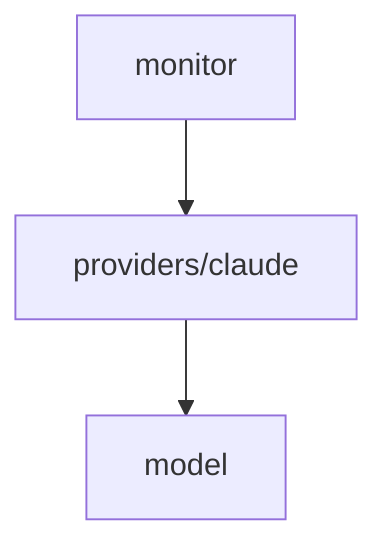

# Module: providers/claude

## 1. Module Vision

Adapter для Claude Code. Реализует `AgentProvider`: сканирует `~/.claude/sessions/<PID>.json`, проверяет живость через `ps`, извлекает model/title из аргументов процесса и JSONL.

**Parent scope:** [`../../../agent-mon.spec.md`](../../../agent-mon.spec.md)

## 2. Entity Inventory (Closed-World)

| Name               | Type     | Purpose                                                             |
| ------------------ | -------- | ------------------------------------------------------------------- |
| `ClaudeProvider`   | Adapter  | Реализует `AgentProvider` для Claude Code                           |
| `psInfo`           | Function | `ps -p PID -o pcpu=,rss=` → `{ cpuPercent, memoryMb } \| null`      |
| `parseClaudeArgs`  | Function | `ps -p PID -o args=` → regex `--model`, `--effort`                  |
| `readSessionJson`  | Function | Парсинг `<PID>.json` из `~/.claude/sessions/`                       |
| `readSessionTitle` | Function | Поиск `ai-title` в `~/.claude/projects/<project>/<sessionId>.jsonl` |
| `PsInfoEntry` | Type | Результат батчевого ps: `{ pid: number, cpuPercent: number, memoryMb: number, args: string }` |
| `SessionJsonData` | Type | Распарсенный session JSON: `{ pid: number, sessionId: string, cwd: string, startedAt: number }` |

## 3. Entity Surfaces

### `ClaudeProvider`

- **Type:** Adapter
- **Purpose:** Сканирование сессий Claude Code
- **Public Properties:**
  - `key: 'claude'` — фиксированный строковый ключ
- **Public Operations:**
  - `scan(opts?) → Promise<AgentSession[]>`:
    1. readdir `~/.claude/sessions/` → `*.json`
    2. Для каждого: `readSessionJson()` → `pid`, `sessionId`, `cwd`, `startedAt`
    3. `psInfo(pid)` — если null → `status: 'completed'`
    4. Если active: `parseClaudeArgs(pid)` → model, effort
    5. `readSessionTitle(cwd, sessionId)` → title
    6. `lastActivityAt` = mtime файла `<PID>.json`
    7. `cpuPercent`, `memoryMb` = `psInfo(pid)` если alive
    8. Фильтр `opts.since` → по `startedAt`
- **Lifecycle:** Stateless — каждый `scan()` независим
- **Events Emitted:** N/A
- **Errors & Degradation:**
  - `~/.claude/sessions/` не существует → `[]`, warn
  - JSON невалиден → пропускает файл, error
  - `ps` упал → `completed`, error
  - JSONL не найден → title из первого user-сообщения; если нет → `'Unknown'`
- **Consumers:**
  - Internal: `services/agent-mon/monitor/agent-monitor.ts`
  - External: CLI (регистрирует через `mon.register('claude', new ClaudeProvider())`)

### `psInfo`

- **Type:** Function
- **Purpose:** Проверить живость PID и получить CPU/RAM
- **Public Operations:**
  - `(pid: number) → { cpuPercent: number, memoryMb: number } | null`
  - null = процесс мёртв
- **Consumers:** Internal — `ClaudeProvider`

### `parseClaudeArgs`

- **Type:** Function
- **Purpose:** Извлечь `--model` и `--effort` из аргументов процесса
- **Public Operations:**
  - `(pid: number) → { model?: string, effort?: string }`
- **Consumers:** Internal — `ClaudeProvider`

### `readSessionJson`

- **Type:** Function
- **Purpose:** Прочитать и распарсить `<PID>.json`
- **Public Operations:**
  - `(filePath: string) → { pid, sessionId, cwd, startedAt } | null`
- **Consumers:** Internal — `ClaudeProvider`

### `readSessionTitle`

- **Type:** Function
- **Purpose:** Найти title сессии в JSONL
- **Public Operations:**
  - `(cwd: string, sessionId: string) → string`
  - Кодирует cwd → project path: `/` → `-`
  - Читает `~/.claude/projects/<project>/<sessionId>.jsonl`
  - Ищет `"type":"ai-title"` → `aiTitle`
  - Fallback: первое user-сообщение
- **Consumers:** Internal — `ClaudeProvider`

## 4. Module Contracts (DbC)

### Adapter: `ClaudeProvider`

- **Implements:** `AgentProvider` (`../../model/model.spec.md`)
- **Purpose:** Сканирование сессий Claude Code
- **Supporting Artifacts:** scope spec §5 Provider Knowledge → Claude
- **Runtime Backing:** `real-runtime`
- **Verification Levels:** `unit`, `integration`
- **Deferred Runtime Scope:** None

**Side Effects:**

- `readdir` / `readFile`: `~/.claude/sessions/`
- `readFile`: `~/.claude/projects/<project>/<sessionId>.jsonl`
- `execSync('ps -p PID')` × 3 варианта
- Все read-only

**Contract (DbC):** наследует pre/post/inv от `AgentProvider`.

## 5. Public Options & Policies

`key: 'claude'` — фиксирован. Формат сессий задокументирован в scope spec §5.

## 6. File Structure

```
providers/claude/
├── claude-provider.ts       // ClaudeProvider
├── ps.ts                    // psInfo, parseClaudeArgs
├── session-json.ts          // readSessionJson, readSessionTitle
└── index.ts                 // реэкспорт
```

**File Mapping:**

- `claude-provider.ts` — `ClaudeProvider` (key, scan — оркеструет вызовы)
- `ps.ts` — `psInfo(pid)`, `parseClaudeArgs(pid)`
- `session-json.ts` — `readSessionJson(path)`, `readSessionTitle(cwd, sessionId)`

## 7. Module Decision Log

### D-CLD-001 — project path encoding: `/` → `-`

- **Status:** active
- **Recorded:** session ModuleDecomposition, agent-mon
- **Why:** Claude кодирует пути в имена папок заменой `/` → `-`. Подтверждено реверсом на 6 сессиях. Альтернативный способ (scan всех projects-папок) медленнее.
- **Risk accepted:** Формат может измениться в будущих версиях Claude → fallback на scan всех папок при провале.

## 8. Inter-Module Dependencies

- **Depends on:** `model` (`../../model/model.spec.md`)
- **Provides to:** `monitor`, CLI



## 9. Handoff to task-scaffolding

- **Implementation files to be created:**
  - `services/agent-mon/providers/claude/claude-provider.ts`
  - `services/agent-mon/providers/claude/ps.ts`
  - `services/agent-mon/providers/claude/session-json.ts`
  - `services/agent-mon/providers/claude/index.ts`
- **Test files to be created:**
  - `services/agent-mon/providers/claude/__tests__/claude-provider.test.ts`
  - `services/agent-mon/providers/claude/__tests__/ps.test.ts`
  - `services/agent-mon/providers/claude/__tests__/session-json.test.ts`
- **Stack dependencies:**
  - Language: `TypeScript` → `ai/directives/coding/typescript-rules.xml`
  - Test framework: `node:test` → `ai/directives/testing/node-test.xml`
- **Module Rules Additions:** None
- **Open risks & validation needs:**
  - Формат `sessions/<PID>.json` может измениться при обновлении Claude
  - Кодирование пути `/` → `-` может измениться
