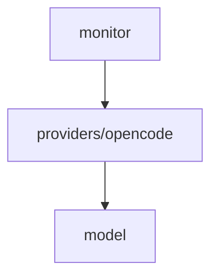

# Module: providers/opencode

## 1. Module Vision

Adapter для OpenCode. Реализует `AgentProvider`: запрашивает `opencode.db` через `node:sqlite`, парсит `model` JSON, извлекает `lastMessage`.

**Parent scope:** [`../../agent-mon.spec.md`](../../agent-mon.spec.md)

## 2. Entity Inventory (Closed-World)

| Name               | Type     | Purpose                                                          |
| ------------------ | -------- | ---------------------------------------------------------------- |
| `OpenCodeProvider` | Adapter  | Реализует `AgentProvider` для OpenCode                           |
| `querySessions`    | Function | SQL: `SELECT ... FROM session WHERE time_archived IS NULL`       |
| `queryLastMessage` | Function | SQL: `SELECT data FROM message WHERE session_id = ? ... LIMIT 1` |
| `parseModelJson`   | Function | Парсинг `model` JSON → `id`                                      |

## 3. Entity Surfaces

### `OpenCodeProvider`

- **Type:** Adapter
- **Purpose:** Сканирование сессий OpenCode через SQLite
- **Public Properties:**
  - `key: 'opencode'` — фиксированный строковый ключ
- **Public Operations:**
  - `scan(opts?) → Promise<AgentSession[]>`:
    1. `new DatabaseSync('~/.local/share/opencode/opencode.db')`
    2. `querySessions(db, opts)` — `WHERE time_archived IS NULL`
    3. Для каждой: `parseModelJson(row.model)` → modelId
    4. `queryLastMessage(db, sessionId)` → lastMessage
    5. `status: 'active'` (time_archived IS NULL)
    6. `lastActivityAt = row.time_updated`
    7. Фильтр `opts.since` → `WHERE time_created >= ?`
    8. `db.close()`
- **Lifecycle:** Stateless — каждое `scan()` открывает/закрывает БД
- **Events Emitted:** N/A
- **Errors & Degradation:**
  - БД не существует → `[]`, warn
  - SQL ошибка → `[]`, error
  - `model` JSON невалиден → `model = 'unknown'`, warn
  - `message.data` невалиден → `lastMessage = undefined`
- **Consumers:**
  - Internal: `services/agent-mon/monitor/agent-monitor.ts`
  - External: CLI (регистрирует через `mon.register('opencode', new OpenCodeProvider())`)

### `querySessions`

- **Type:** Function
- **Purpose:** Выполнить основной запрос к БД
- **Public Operations:**
  - `(db: DatabaseSync, opts?: ScanOpts) → SessionRow[]`
  - SELECT: `id, slug, title, directory, time_created, time_updated, agent, model, tokens_input, tokens_output, parent_id`
  - WHERE: `time_archived IS NULL` + опционально `time_created >= ?`
  - **Примечание:** По умолчанию применяется фильтр `time_updated >= now - 24h` даже без явного `since`, чтобы сузить результаты сканирования. Полный скан — с явным `since: 0`.
  - ORDER BY: `time_updated DESC`
- **Consumers:** Internal — `OpenCodeProvider`

### `queryLastMessage`

- **Type:** Function
- **Purpose:** Получить последнее сообщение сессии
- **Public Operations:**
  - `(db: DatabaseSync, sessionId: string) → string | null`
  - SELECT: `data FROM message WHERE session_id = ? ORDER BY time_updated DESC LIMIT 1`
- **Consumers:** Internal — `OpenCodeProvider`

### `parseModelJson`

- **Type:** Function
- **Purpose:** Извлечь model.id из JSON-строки
- **Public Operations:**
  - `(raw: string | null) → string | undefined`
  - Парсит JSON → `obj.id`; fallback → raw; ошибка → `'unknown'`
- **Consumers:** Internal — `OpenCodeProvider`

## 4. Module Contracts (DbC)

### Adapter: `OpenCodeProvider`

- **Implements:** `AgentProvider` (`../../model/model.spec.md`)
- **Purpose:** Сканирование сессий OpenCode через SQLite
- **Supporting Artifacts:** scope spec §5 Provider Knowledge → OpenCode
- **Runtime Backing:** `real-runtime`
- **Verification Levels:** `unit`, `integration`
- **Deferred Runtime Scope:** None

**Side Effects:**

- `new DatabaseSync(dbPath)` — открытие БД (read-only)
- SQL SELECT × 2
- `db.close()` — закрытие соединения
- Не пишет в БД

**Contract (DbC):** наследует pre/post/inv от `AgentProvider`.

## 5. Public Options & Policies

`key: 'opencode'` — фиксирован. Схема БД задокументирована в scope spec §5.

## 6. File Structure

```
providers/opencode/
├── opencode-provider.ts     // OpenCodeProvider
├── db.ts                    // querySessions, queryLastMessage
├── model-parser.ts          // parseModelJson
└── index.ts                 // реэкспорт
```

**File Mapping:**

- `opencode-provider.ts` — `OpenCodeProvider` (key, scan — оркеструет запросы)
- `db.ts` — `querySessions(db, opts)`, `queryLastMessage(db, sessionId)`
- `model-parser.ts` — `parseModelJson(raw) → string`

## 7. Module Decision Log

### D-OC-001 — node:sqlite over sqlite3 CLI (lazy import mandatory)

- **Status:** active
- **Recorded:** session ModuleDecomposition, agent-mon
- **Why:** `node:sqlite` встроен в Node 22.19, не требует внешних зависимостей. Работает без experimental-флага. Быстрее чем spawn `sqlite3`.
- **Lazy import constraint:** Импорт `node:sqlite` **обязательно динамический** (`await import('node:sqlite')` внутри `scan()`, top-level только `import type`). Статический top-level `import { DatabaseSync }` **запрещён** — он вызывает `ERR_UNKNOWN_BUILTIN_MODULE` на Node < 22 даже для команд, не использующих agent-mon (например `review-issues`).
- **Risk accepted:** `node:sqlite` experimental — отслеживаем стабилизацию. При удалении из Node — fallback на spawn `sqlite3`.
- **Rejected alternatives:** spawn `sqlite3` CLI — медленнее, зависит от внешнего бинаря.

## 8. Inter-Module Dependencies

- **Depends on:** `model` (`../../model/model.spec.md`)
- **Provides to:** `monitor`, CLI



## 9. Handoff to task-scaffolding

- **Implementation files to be created:**
  - `services/agent-mon/providers/opencode/opencode-provider.ts`
  - `services/agent-mon/providers/opencode/db.ts`
  - `services/agent-mon/providers/opencode/model-parser.ts`
  - `services/agent-mon/providers/opencode/index.ts`
- **Test files to be created:**
  - `services/agent-mon/providers/opencode/__tests__/opencode-provider.test.ts`
  - `services/agent-mon/providers/opencode/__tests__/db.test.ts`
  - `services/agent-mon/providers/opencode/__tests__/model-parser.test.ts`
- **Stack dependencies:**
  - Language: `TypeScript` → `ai/directives/coding/typescript-rules.xml`
  - Test framework: `node:test` → `ai/directives/testing/node-test.xml`
- **Module Rules Additions:** None
- **Open risks & validation needs:**
  - `node:sqlite` experimental — нужен мониторинг стабилизации
  - Схема `opencode.db` может измениться при обновлении OpenCode
