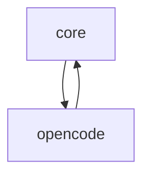

# Tasks: agent-run

## Scope Spec

- [Scope spec](./agent-run.spec.md)

## Cascade Table

<!-- ЗАПОЛНЯЕТ АГЕНТ: действующие правила scope из Scope Graph (транзитивное замыкание depends-on). -->

## Inter-Module DAG

## Tracker

| Task-ID     | Title                       | Module   | Dependencies            | Status   | Reopens |
| ----------- | --------------------------- | -------- | ----------------------- | -------- | ------- |
| COR-model   | Model selection (agent-run) | core     | COR-engine, OPE-adapter | [ ] TODO | —       |
| COR-engine  | Implement core module       | core     | —                       | [ ] TODO | —       |
| OPE-adapter | Implement opencode engine   | opencode | COR-engine              | [ ] TODO | —       |

## Decision Log (scope task level)

<!-- <ACR>-DL-N scope-уровневых решений декомпозиции/планирования. -->
