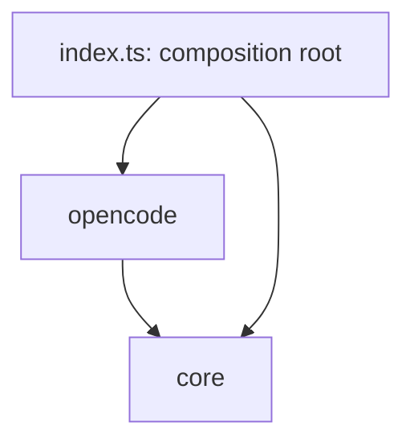

# agent-run: Library Specification

<!--SECTION:SCOPE_TYPE-->
## scope-type
library
<!--/SECTION:SCOPE_TYPE-->

<!--SECTION:VISION-->
## 1. Vision & Primary Goal

Ядро, которое запускает внешний AI-движок и возвращает текстовый ответ. Вызывающий — чаще другой агент, чем человек — даёт текст-задание и (опционально) рабочие директории, получает Markdown-ответ. Вызывающий не обязан знать, какой движок внутри: по умолчанию opencode, дальше — другие.

Главная задача: дать единый простой вызов «запусти агента над этими папками с этим заданием» и спрятать различия движков, изоляцию и режим прав. В v1 — только readonly: движку можно искать и читать, нельзя редактировать.

Отдельная цель — **ошибки как контракт**. Потребитель не человек у терминала, а агент: при любом сбое он должен получить не сырой stderr, а типизированную ошибку с подсказкой — что сломалось и какая помощь нужна от человека. Тогда вызывающий агент либо чинит сам, либо просит оператора.
<!--/SECTION:VISION-->

<!--SECTION:GOLDEN_DX-->
## 2. Approved Golden DX Example

### Ядро (library)

```ts
import { run, AgentRunError } from '@services/agent-run'

// happy: одна или несколько директорий
const res = await run({
  task: 'как связаны эти репозитории и кто кого вызывает?',
  dirs: ['/path/repoA', '/path/repoB'], // пусто → текущая директория
}) // mode: 'readonly' по умолчанию

console.log(res.text) // Markdown-ответ движка
console.log(res.engine) // 'opencode' — кто отработал

// error: типизированно, с подсказкой для оператора
try {
  await run({ task: '…', dirs: ['…'] })
} catch (e) {
  if (e instanceof AgentRunError) {
    e.code // 'VERSION_MISMATCH'
    e.hint // 'попроси оператора: brew upgrade opencode'
  }
}
```

### Команда (CLI, тонкая обёртка)

```text
$ gennady run "как связаны эти репозитории?" --dir ../repoA --dir ../repoB
<markdown-ответ движка>

$ gennady run "…"
✗ Не удалось запустить агента: CLI opencode отстал от версии приложения.
  Что сделать: попроси оператора `brew upgrade opencode`.   [VERSION_MISMATCH]
```

Текст на входе — текст на выходе. И в успехе, и в ошибке.
<!--/SECTION:GOLDEN_DX-->

<!--SECTION:REQUIREMENTS_AND_CONSTRAINTS-->
## 3. Requirements & Constraints

### 3.1 Functional Requirements

- **F1** — обнаружить установленные движки, выбрать дефолт (opencode первым); ничего нет → ошибка `AGENT_NOT_INSTALLED`.
- **F2** — запустить выбранный движок с текстом-заданием.
- **F3** — принять одну или несколько директорий (репозитории/папки), не ограничиваясь cwd; движок видит их все, чтобы анализировать связи между ними.
- **F4** — режим readonly: чтение и поиск разрешены, любое редактирование запрещено и проговорено движку в задании.
- **F5** — вернуть текстовый ответ (Markdown) и идентификатор отработавшего движка.
- **F6** — при сбое бросить типизированную `AgentRunError` (`code` + `hint`): что не так и что нужно от человека.

### 3.2 Non-Functional Constraints

- **N1** — ядро не зависит от CLI; переиспользуется любым потребителем через `@services/agent-run`.
- **N2** — потребитель чаще агент: вывод и ошибки оптимизированы под чтение агентом — Markdown, явные `code` и `hint`.
- **N3** — readonly — это trust boundary: enforcement делегирован permission-движку opencode (см. 3.4).
- **N4** — env-гигиена: ядро управляет окружением подпроцесса (снимает мешающий `HTTPS_PROXY`), иначе корпоративный прокси режет доступ к провайдеру (урок сессии).
- **N5** — нулевые новые зависимости: запуск через встроенный `node:child_process`.
- **N6** — скорость как главное правило: горячий путь `run()` без pre-flight `detect()` (оптимистичный запуск, отсутствие движка ловится по spawn-ошибке); `detect()`/`listEngines()` кэшируются и вне горячего пути; обязательный `timeout` (дефолт 120000 мс) против зависания.

### 3.3 Out-of-Scope

- Стриминг и прогресс выполнения (`onProgress`).
- Долгие stateful-сессии, продолжение/форк сессии.
- MCP-инъекция инструментов.
- Любое редактирование файлов движком (запись/патч).
- Провайдеры кроме opencode (claude/codex/cursor — позже).
- Headless-сервер / демон.

### 3.4 Runtime Backing & Deferred Scope

- **Запуск opencode** — `real-runtime`: реальный подпроцесс `opencode run`.
- **readonly-enforcement** — `real-runtime`, делегирован opencode. Механизм подтверждён: `opencode agent create --permissions "read,glob,grep,webfetch,websearch,lsp"` + `--agent` (allow-list; `edit`/`write`/`bash` вне списка). **Trust boundary:** ядро не перехватывает файловые операции само — полагается на permission-движок opencode. Если движок нарушит профиль, ядро это не остановит.
- **multi-directory доступ** — намерение: первая директория → `--dir`, остальные → `external_directory: allow`. **v1: одна `--dir` + остальные пути в тексте задания; `external_directory` deferred** (Спайк 1). Феасибилити подтверждается спайком.
- **Провайдеры кроме opencode** — `not-implemented` (deferred): контракт `AgentEngine` оставляет точку расширения, реализаций нет.

### 3.5 Rules

| Rule             | Category | Source                 |
| ---------------- | -------- | ---------------------- |
| typescript-rules | coding   | inherited from project |
| node-test        | testing  | inherited from project |
<!--/SECTION:REQUIREMENTS_AND_CONSTRAINTS-->

<!--SECTION:PUBLIC_API_SURFACE-->
## 4. Public API Surface

```ts
// --- Рабочая точка входа ---
export async function run(opts: RunOptions): Promise<RunResult>

// --- Лёгкое «что установлено» (для CLI-подсказок и агентов) ---
export async function listEngines(): Promise<EngineStatus[]>

// --- Типизированная ошибка ---
export class AgentRunError extends Error {
  readonly code: ErrorCode
  readonly hint: string
}

// --- DTO ---
export type RunOptions = {
  task: string // задание текстом
  dirs?: string[] // первая = корень; остальные = разрешённые внешние; пусто = cwd
  mode?: 'readonly' // v1: только readonly
  engine?: string // по умолчанию авто (opencode первым)
  timeout?: number // потолок на запуск, мс (дефолт 120000)
}

export type RunResult = {
  text: string // Markdown-ответ движка
  engine: string // идентификатор отработавшего движка
}

export type EngineStatus = {
  id: string // 'opencode'
  installed: boolean
  version?: string
}

export type ErrorCode =
  | 'AGENT_NOT_INSTALLED' // движок не найден в PATH (spawn ENOENT/EACCES)
  | 'NETWORK_BLOCKED' // прокси/сеть режет доступ к провайдеру
  | 'VERSION_MISMATCH' // CLI движка рассинхронен (напр. schema-ошибка БД)
  | 'MODEL_FORBIDDEN' // нет прав на модель/провайдера
  | 'CREDENTIAL_MISSING' // не задан ключ провайдера
  | 'TIMEOUT' // запуск превысил timeout, подпроцесс убит
  | 'LAUNCH_FAILED' // прочее: сырой stderr + «причина не распознана»
```

Каталог `ErrorCode` растёт по мере новых случаев; сигнатура `run()` при этом стабильна.
<!--/SECTION:PUBLIC_API_SURFACE-->

<!--SECTION:ARCHITECTURE-->
## 5. Architecture

Паттерн: **движок-адаптер + registry**. Один внутренний контракт `AgentEngine`, opencode — первая реализация. `registry` находит установленные движки и выбирает дефолт (opencode первым). Новый движок — новая папка под `engines/`; публичный API и контракт не меняются.

```text
services/agent-run/
  index.ts                     # публично: run, listEngines, AgentRunError, типы
  core/
    agent-engine.type.ts       # AgentEngine — внутр. точка расширения
    run-options.type.ts        # RunOptions, RunResult, EngineStatus
    agent-run-error.ts         # AgentRunError + ErrorCode
  engines/
    opencode/
      opencode-engine.ts       # spawn `opencode run`, readonly-профиль, --dir + external
      opencode-error-map.ts    # exit-код/stderr → ErrorCode + hint
  registry.ts                  # detect движков, дефолт opencode первым
  __tests__/
```

Внутренний контракт расширения:

```ts
interface AgentEngine {
  readonly id: string // 'opencode'
  detect(): Promise<{ installed: boolean; version?: string }>
  run(opts: RunOptions): Promise<RunResult> // кидает AgentRunError
}
```

Поток `run()`: `registry` определяет движок → `opencode-engine` собирает аргументы (`--agent <readonly>`, `--dir <первая>`, доступ к остальным через `external_directory`, чистое окружение) и спавнит `opencode run` → собирает stdout → возвращает `{ text, engine }` либо через `opencode-error-map` бросает `AgentRunError`.

**Маппинг ошибок** изолирован в `opencode-error-map.ts` — единственное место, где сырой сбой движка (exit-код + stderr) превращается в типизированную ошибку с подсказкой.

### 5.1 Rejected Alternatives

- **Взять agent-cli целиком** (`assistant/integrations/agent-cli/`) — отвергнуто. Берётся только идея контракта `detect`/`run`; структура, набор адаптеров (claude/codex/cursor) и рамка «orchestrator/json» не наследуются.
- **Сервер/демон (`opencode serve` + HTTP)** — отвергнуто. Вызывающий зовёт команду и получает текст; сервер не нужен, только подпроцесс.
- **JSON-вывод (`--format json`)** — отвергнуто. Результат — текст/Markdown, как читают человек и агенты; opencode и так печатает текстовый ответ по умолчанию.
- **Контракт стриминга в v1** — отложено (YAGNI); добавится позже без слома `run()`.
<!--/SECTION:ARCHITECTURE-->

<!--SECTION:DECISION_LOG-->
## 6. Decision Log

### D-001 — Свежий scope, agent-cli как донор идей
- **Status:** active
- **Recorded:** session Discovery, agent-run
- **Why:** существующий `agent-cli` вне реестра спек, без opencode, с рамкой orchestrator/json; оператор просил не брать наработку целиком только потому, что она есть.
- **Risk accepted:** дублируем идею контракта detect/run вместо переиспользования ~1100 строк.
- **Rejected alternatives:** принять agent-cli в реестр и refine; pivot.

### D-002 — Одноразовый `opencode run`, без сервера
- **Status:** active
- **Recorded:** session Discovery, agent-run
- **Why:** вызывающий зовёт команду и получает результат; сервер — лишняя сложность для v1.
- **Rejected alternatives:** headless `serve` + HTTP.

### D-003 — Текстовый вывод (Markdown), не JSON
- **Status:** active
- **Recorded:** session Discovery, agent-run
- **Why:** потребитель читает текст; агенты лучше всего обмениваются Markdown; opencode и так отдаёт текст по умолчанию.
- **Rejected alternatives:** `--format json` с разбором событий.

### D-004 — Ошибки как типизированный контракт (code + hint)
- **Status:** active
- **Recorded:** session Discovery, agent-run
- **Why:** потребитель — агент; при сбое нужна машинно-различимая причина и текстовая подсказка для оператора, а не сырой stderr.
- **Risk accepted:** каталог ошибок будет расти; контракт держим стабильным.

### D-005 — readonly через профиль прав opencode (`--agent`)
- **Status:** active
- **Recorded:** session Discovery, agent-run
- **Why:** у opencode есть permission-движок (видели агентов с `edit/write: deny`); надёжнее, чем разбор флагов.
- **Risk accepted:** enforcement делегирован opencode — trust boundary (см. 3.4).

### D-006 — multi-directory через `--dir` + `external_directory`
- **Status:** active
- **Recorded:** session Discovery, agent-run
- **Why:** задача не ограничена одним репозиторием; нужно сопоставлять 2-3 папки/репозитория.
- **Risk accepted:** точная феасибилити доступа к внешним директориям подтверждается спайком на module-decomposition.

### D-007 — Декомпозиция по слою стабильности: `core` + `opencode`
- **Status:** active
- **Recorded:** session ModuleDecomposition, agent-run
- **Why:** граница проходит там, где она реальна — движок-независимое ядро не меняется при добавлении движков, адаптер свой у каждого; ось совпадает с точкой расширения архитектуры.
- **Risk accepted:** для маленького scope два модуля, не один — оправдано осью расширения, не спекулятивно.
- **Rejected alternatives:** 3 модуля (`contracts`/`runtime`/`opencode`) — искусственная граница типов и orchestration для v1; один плоский модуль — прячет точку расширения, потребует передекомпозиции при втором движке.

### D-008 — Оптимистичный запуск вместо pre-flight detect (скорость)
- **Status:** active
- **Recorded:** session SddCritic, agent-run
- **Why:** скорость — главное правило, инструмент зовут агенты в цикле; пред-проверка `--version` на каждый запуск = лишний подпроцесс. Запускаем сразу, отсутствие движка ловим по spawn-ошибке (подтверждено спайком: `error.code` ENOENT/EACCES); `detect()` остаётся для явного `listEngines()` и кэшируется. `timeout` (120000 мс) против зависания.
- **Risk accepted:** TOCTOU-зазор detect↔spawn — закрыт маппингом spawn-ошибки в `AGENT_NOT_INSTALLED`.
- **Rejected alternatives:** detect-then-run на горячем пути (медленнее). Мульти-движковый фолбэк — отложен (в v1 движок один; порядок реестра его уже поддерживает).
<!--/SECTION:DECISION_LOG-->

<!--SECTION:SCOPE_DEPENDENCIES-->
## 7. Scope Dependencies
- **Depends on:** `infra-base` (Node + tsx, node:test, prettier, tsc).
- **Provides to:** `cli` (команда `run` — тонкий потребитель ядра).
<!--/SECTION:SCOPE_DEPENDENCIES-->

<!--SECTION:BOOTSTRAP_REQUIREMENTS-->
## 8. Bootstrap Requirements

| Requirement | Kind | Owner | Resolution |
|---|---|---|---|
| opencode CLI в PATH | tool | operator-action | оператор ставит opencode; отсутствие обрабатывается как `AGENT_NOT_INSTALLED` |
| Папка `services/agent-run/` с `index.ts` | structural | this-scope-task | создать пакет и экспорт через alias `@services/agent-run` |

Новых npm-пакетов не требуется: запуск через встроенный `node:child_process`, типы — TypeScript, тесты — `node --import tsx --test` (всё уже в стеке).
<!--/SECTION:BOOTSTRAP_REQUIREMENTS-->

<!--SECTION:HANDOFF-->
## 9. Handoff to module-decomposition
- **Areas requiring decomposition:** контракт `AgentEngine` + DTO (`core/`); opencode-движок (`engines/opencode/`) — запуск, readonly-профиль, multi-dir, env-гигиена; маппинг ошибок (`opencode-error-map`); `registry` (detect + дефолт).
- **Named abstractions:** `run`, `listEngines`, `AgentRunError`, `RunOptions`, `RunResult`, `EngineStatus`, `ErrorCode`, `AgentEngine`.
- **Spikes до реализации:** (1) доступ к внешним директориям opencode (`external_directory` + `--dir`); (2) точная разводка readonly-профиля (`opencode agent create` vs готовый файл профиля в изолированной config-директории).
- **Open risks:** readonly — trust boundary (enforcement у opencode); каталог `ErrorCode` будет расти.
- **Portal sync needed:** `setup` должен внести `agent-run` в Scope Graph (ребро `agent-run --> infra-base`) и снять метку 🚧 со строки Scopes-таблицы.
- **Follow-up scope:** `cli` (refine) — добавить команду `run`, которая зовёт `@services/agent-run` и печатает `text` либо `code`/`hint` ошибки.
<!--/SECTION:HANDOFF-->

<!--SECTION:MODULE_MAP-->
## 10. Module Map (post-ModuleDecomposition)

Spec hierarchy is materialized at `specs/agent-run/`. Module specs are at `specs/agent-run/<module>/<module>.spec.md`.

### 10.1 Modules

- [`core`](./core/core.spec.md) — движок-независимое ядро: контракт `AgentEngine`, типы, `AgentRunError`, реестр, публичные `run`/`listEngines`.
- [`opencode`](./opencode/opencode.spec.md) — адаптер opencode: запуск `opencode run` в readonly с директориями + маппинг ошибок.

### 10.2 Inter-Module Dependency Map



### 10.3 Stack Dependencies
- Languages: `typescript`
- Test frameworks: `node-test`

### 10.4 Handoff to task-scaffolding
- **Primary input:** `specs/agent-run/agent-run.spec.md` (this file).
- **Required directives:** `ai/directives/coding/typescript-rules.xml`, `ai/directives/testing/node-test.xml`.
- **Open risks & validation needs:** спайк доступа к внешним директориям opencode (с v1-фолбэком); readonly как trust boundary.
<!--/SECTION:MODULE_MAP-->
