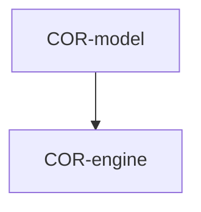

# core — Tasks

## Tracker Index

| Task-ID    | Title                       | Dependencies            | Status   | Reopens |
| ---------- | --------------------------- | ----------------------- | -------- | ------- |
| COR-model  | Model selection (agent-run) | COR-engine, OPE-adapter | [ ] TODO | —       |
| COR-engine | Implement core module       | —                       | [ ] TODO | —       |

## Slug Registry

<!-- один ID на строку; уникальность держится этим списком — одинаковый ID в двух ветках сталкивается здесь при merge. Только добавление. -->

- COR-model
- COR-engine

## Intra-Module DAG

<!-- ребро A → B = «A зависит от B». Кросс-модульные рёбра живут уровнем выше. -->

## Decision Log (module-task level)

<!-- решения декомпозиции/планирования; локальные решения исполнения — в Decision Log самих тикетов. -->

## Conventions

Проектные конвенции объявлены в `specs/3-tasks.md` и наследуются — здесь не повторяются.
