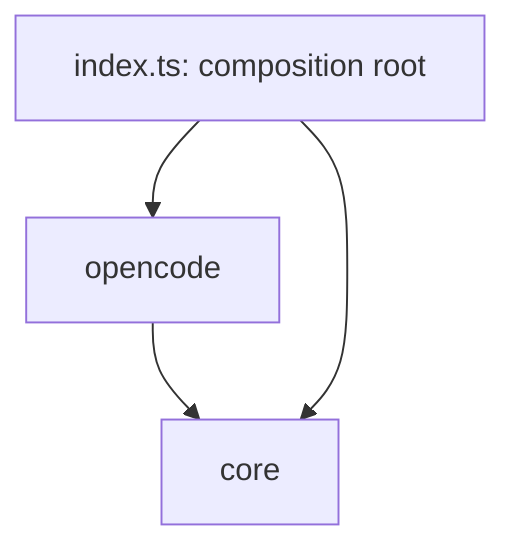

# Module: core

<!--SECTION:MODULE_VISION-->

## 1. Module Vision

Движок-независимое ядро `agent-run`. Родительский scope: [`../agent-run.spec.md`](../agent-run.spec.md).

Владеет контрактом движка (`AgentEngine`), входными/выходными типами, типизированными ошибками, реестром движков и публичными функциями `run` / `listEngines`. Не знает деталей конкретного движка — они живут в модулях-адаптерах (`engines/*`, см. [`../opencode/opencode.spec.md`](../opencode/opencode.spec.md)). При добавлении нового движка этот модуль не меняется.

<!--/SECTION:MODULE_VISION-->

<!--SECTION:MODULE_USAGE_EXAMPLE-->

## 2. Module Usage Example

```ts
import { run, listEngines, AgentRunError } from '@services/agent-run';

// happy path
const res = await run({ task: 'опиши репозиторий одним предложением', dirs: ['/repo'] });
console.log(res.text); // markdown-ответ
console.log(res.engine); // 'opencode'

// что установлено
const engines = await listEngines(); // [{ id: 'opencode', installed: true, version: '1.16.2' }]

// error path
try {
  await run({ task: '…' });
} catch (e) {
  if (e instanceof AgentRunError) console.error(`[${e.code}] ${e.hint}`);
}
```

<!--/SECTION:MODULE_USAGE_EXAMPLE-->

<!--SECTION:ENTITY_INVENTORY-->

## 3. Entity Inventory (Closed-World)

_Это полный список сущностей модуля `core`. Любое введение сущности execution-агентом помимо этого списка считается drift'ом и требует обновления spec._

| Name            | Surface | Type           | Purpose                                                                     |
| --------------- | ------- | -------------- | --------------------------------------------------------------------------- |
| `run`           | 🟢      | Service        | Публичная точка входа: выбрать движок, запустить с заданием, вернуть текст. |
| `listEngines`   | 🟢      | Service        | Список зарегистрированных движков со статусом установки.                    |
| `listModels`    | 🟢      | Service        | Список моделей выбранного движка (вне горячего пути).                       |
| `RunOptions`    | 🟢      | Value Object   | Вход `run`: task, dirs, mode, engine, timeout, model.                       |
| `RunResult`     | 🟢      | Value Object   | Выход `run`: text (markdown) + engine (кто отработал).                      |
| `EngineStatus`  | 🟢      | Value Object   | Статус движка: id, installed, version.                                      |
| `AgentRunError` | 🟢      | Entity (Error) | Типизированная ошибка: code + hint.                                         |
| `ErrorCode`     | 🟢      | Value Object   | Перечисление кодов ошибок (8 классов, вкл. `TIMEOUT`, `MODEL_UNAVAILABLE`). |
| `AgentEngine`   | ⚪      | Port           | Контракт движка: detect + run + listModels. Точка расширения.               |
| `registry`      | ⚪      | Service        | Реестр движков: регистрация, detect, выбор дефолта (opencode первым).       |
| `_resetForTest` | 🔴      | Utility        | Внутренняя функция для сброса состояния реестра между тестами (только в тестах). |

<!--/SECTION:ENTITY_INVENTORY-->

<!--SECTION:ENTITY_SURFACES-->

## 4. Entity Surfaces

### `run`

- **Type:** Service
- **Purpose:** запустить движок с заданием и вернуть текстовый ответ.
- **Public Operations:** `run(options: RunOptions) -> RunResult` — выбрать движок (явный `engine` или дефолт реестра), запустить, вернуть результат.
- **Lifecycle:** stateless-функция.
- **Errors & Degradation:** кидает `AgentRunError` — нет установленных движков (`AGENT_NOT_INSTALLED`) или любая ошибка движка.
- **Consumers:** Internal `index.ts` (re-export); External — CLI-команда `run`, любой агент-потребитель через `@services/agent-run`.

### `listEngines`

- **Type:** Service
- **Purpose:** сказать потребителю, какие движки установлены.
- **Public Operations:** `listEngines() -> EngineStatus[]` — прогнать `detect()` всех зарегистрированных движков.
- **Lifecycle:** stateless-функция.
- **Errors & Degradation:** не кидает; сбой `detect()` одного движка → `installed: false`, остальные не страдают.
- **Consumers:** Internal `index.ts`; External — CLI (подсказка «opencode не установлен»), агенты.

### `listModels`

- **Type:** Service
- **Purpose:** отдать список моделей движка (для CLI-подсказок и обогащения hint при `MODEL_UNAVAILABLE`).
- **Public Operations:** `listModels(engine?: string) -> Promise<string[]>` — резолвит движок (явный id или дефолт), зовёт `engine.listModels()`.
- **Lifecycle:** stateless-функция; вне горячего пути.
- **Errors & Degradation:** не кидает; сбой движка → `[]`.
- **Consumers:** Internal `index.ts`, `run` (на ветке `MODEL_UNAVAILABLE`); External — CLI, агенты.

### `RunOptions`

- **Type:** Value Object
- **Public Properties:** `task: string` (задание); `dirs?: string[]` (рабочие директории, пусто → cwd); `mode?: 'readonly'` (v1 — только это значение); `engine?: string` (явный выбор движка, иначе дефолт); `timeout?: number` (мс, дефолт 1800000 = 30 мин — потолок-предохранитель, не лимит работы); `model?: string` (модель `provider/model`; не задана → дефолт движка).
- **Consumers:** Internal `run`.

### `RunResult`

- **Type:** Value Object
- **Public Properties:** `text: string` (markdown-ответ движка); `engine: string` (id отработавшего движка).
- **Consumers:** Internal `run`; External — потребитель.

### `EngineStatus`

- **Type:** Value Object
- **Public Properties:** `id: string`; `installed: boolean`; `version?: string`.
- **Consumers:** Internal `listEngines`.

### `AgentRunError`

- **Type:** Entity (Error)
- **Purpose:** единая типизированная ошибка ядра — машинный `code` + текстовая подсказка оператору.
- **Public Properties:** `code: ErrorCode`; `hint: string`; `message: string`.
- **Errors & Degradation:** это и есть носитель ошибки.
- **Consumers:** Internal `run`, движки-адаптеры (бросают); External — CLI (печатает `code`/`hint`), агенты.

### `ErrorCode`

- **Type:** Value Object (union)
- **Public Properties:** `'AGENT_NOT_INSTALLED' | 'NETWORK_BLOCKED' | 'VERSION_MISMATCH' | 'MODEL_FORBIDDEN' | 'MODEL_UNAVAILABLE' | 'CREDENTIAL_MISSING' | 'TIMEOUT' | 'LAUNCH_FAILED'`.
- `MODEL_UNAVAILABLE` — запрошенная модель не найдена у движка; hint содержит список доступных моделей (в отличие от `MODEL_FORBIDDEN` — нет прав/403).
- **Consumers:** Internal `AgentRunError`, движки.

### `AgentEngine`

- **Type:** Port
- **Purpose:** контракт, который реализует каждый движок; через него `registry`/`run` работают, не зная конкретики.
- **Public Operations:** `id: string`; `detect() -> Promise<{ installed, version? }>`; `run(options: RunOptions) -> Promise<RunResult>`; `listModels() -> Promise<string[]>` (доступные модели движка, вне горячего пути).
- **Lifecycle:** singleton на движок, регистрируется в реестре.
- **Errors & Degradation:** `run` кидает `AgentRunError` (вкл. `MODEL_UNAVAILABLE` со списком в hint); `detect`/`listModels` не кидают (сбой → пустой список).
- **Consumers:** Internal `registry`, `run`; реализуется в `engines/*` ([`OpencodeEngine`](../opencode/opencode.spec.md)).

### `registry`

- **Type:** Service
- **Purpose:** держать список движков, находить установленные, выбирать дефолт (opencode первым).
- **Public Operations:** `register(engine: AgentEngine)`; `resolve(id?: string) -> AgentEngine` (явный id или дефолт; неизвестный id → `AgentRunError('AGENT_NOT_INSTALLED')`); `list() -> AgentEngine[]`.
- **Lifecycle:** один экземпляр на процесс; наполняется в `index.ts` (composition root).
- **Errors & Degradation:** `resolve()` при пустом реестре (нет зарегистрированных движков вообще) → сигнал для `run` бросить `AGENT_NOT_INSTALLED`. Установленность движка здесь НЕ проверяется — `detect()` на горячем пути не вызывается (см. §5.2), отсутствие реально установленного движка ловится по spawn-ошибке при запуске.
- **Consumers:** Internal `run`, `listEngines`, `index.ts`.

### `_resetForTest`

- **Type:** Utility
- **Purpose:** сбросить внутреннее состояние реестра (кэш detect, список движков) для изоляции тестов.
- **Public Operations:** `_resetForTest()` — сбрасывает кэш `detect` и внутренний список движков к начальному состоянию.
- **Lifecycle:** вызывается только в `__tests__/`; в production-коде не используется.
- **Errors & Degradation:** не кидает.
- **Consumers:** Internal — тесты (`core/__tests__/registry.test.ts`).
<!--/SECTION:ENTITY_SURFACES-->

<!--SECTION:MODULE_CONTRACTS-->

## 5. Module Contracts (DbC)

### 5.1 Ports

#### Port: `AgentEngine`

- **Purpose:** контракт движка — определить наличие и запустить с заданием.
- **Consumers:** Internal `registry`, `run`.
- **Runtime Backing:** `real-runtime` (реализации в `engines/*`)
- **Verification Levels:** `contract`, `unit`
- **Deferred Runtime Scope:** None

**Contract (DbC):**

- Preconditions:
  - `run` вызывается с непустым `options.task`.
- Postconditions:
  - `run` при успехе возвращает `RunResult` с непустым `text` и `engine === this.id`.
  - `run` при неуспехе кидает `AgentRunError`; ничего не пишет на диск (readonly).
  - `run` завершается за конечное время: не позже `timeout` либо кидает `AgentRunError('TIMEOUT')`, не оставляя подпроцесс-сироту.
  - `detect` возвращает `{ installed }` без побочных эффектов кроме запуска `--version`-пробы; вызывается вне горячего пути (см. `registry`).
  - `run` с `options.model`, которой нет у движка → кидает `AgentRunError('MODEL_UNAVAILABLE')`, hint содержит список доступных моделей (движок берёт список только на этой ветке ошибки — вне горячего пути).
  - `listModels` возвращает список доступных моделей движка; не кидает (сбой → `[]`).
- Invariants:
  - `id` стабилен и уникален среди зарегистрированных движков.
  - `model` не задана → движок берёт свой дефолт (не молчаливая подмена при недоступности — а ошибка `MODEL_UNAVAILABLE`).

### 5.2 Services

#### Service: `run`

- **Runtime Backing:** `real-runtime`
- **Verification Levels:** `unit`

**Contract (DbC):**

- Preconditions: `options.task` непустой. **Пустой/пробельный `task` → `run` кидает `AgentRunError('LAUNCH_FAILED', hint: 'task пустой')` до диспетчеризации движку** (защита от ошибки вызывающего; типизированно, не сырой краш).
- Postconditions: вернуть `RunResult` отработавшего движка ИЛИ кинуть `AgentRunError`.
- **Оптимистичный запуск (скорость):** `run` НЕ делает pre-flight `detect()` на горячем пути — резолвит дефолтный движок по порядку реестра (без подпроцесса) и сразу запускает. Отсутствие движка распознаётся по ошибке запуска (spawn `error.code` ENOENT/EACCES → `AGENT_NOT_INSTALLED`), а не предварительной проверкой.
- **Таймаут:** `run` подставляет дефолт `timeout` (1800000 мс = 30 мин), если не задан, и прокидывает его в `engine.run`. **Само прерывание — забота движка** (он владеет подпроцессом): движок по таймеру убивает процесс и кидает `AgentRunError('TIMEOUT')`. `core` гарантию конечного времени делегирует движку (Port postcondition).
- Invariants: `mode` в v1 всегда `readonly` (тип `RunOptions.mode` ограничен `'readonly'` — нарушение ловит компилятор).
- **Будущий фолбэк:** при ≥2 движках `run` может на `AGENT_NOT_INSTALLED` пробовать следующий по порядку реестра. В v1 движок один → фолбэк = вернуть типизированную ошибку. Порядок реестра это уже поддерживает.

#### Service: `listEngines`

- **Runtime Backing:** `real-runtime`
- **Verification Levels:** `unit`

**Contract (DbC):**

- Postconditions: вернуть статус по каждому зарегистрированному движку; сбой `detect` одного → `installed: false`, не роняет вызов (graceful degradation).

#### Service: `listModels`

- **Runtime Backing:** `real-runtime`
- **Verification Levels:** `unit`

**Contract (DbC):**

- Postconditions: `listModels(engine?)` резолвит движок (явный id или дефолт) и возвращает `engine.listModels()`; сбой движка → `[]` (не кидает). Вне горячего пути.

#### Service: `registry`

- **Runtime Backing:** `real-runtime`
- **Verification Levels:** `unit`

**Contract (DbC):**

- Postconditions: `resolve()` без аргумента возвращает дефолт — первый зарегистрированный движок (opencode первым), **без вызова `detect()`** (не спавнит подпроцесс на горячем пути). Установленность проверяется не здесь, а по факту запуска (оптимистичный путь, см. `run`).
- `resolve(id)` с неизвестным id (движок не зарегистрирован) → кидает `AgentRunError('AGENT_NOT_INSTALLED', hint: 'движок "<id>" не зарегистрирован')`; никогда не возвращает `undefined` наружу (иначе `run` упал бы нетипизированно).
- `detect()` вызывается только из `listEngines()` (явный запрос «что стоит») и **кэшируется на время жизни процесса** — повторный `listEngines()` не спавнит `--version` заново.
- Invariants: порядок выбора дефолта детерминирован.

### 5.3 Entity

#### Entity: `AgentRunError`

- **Runtime Backing:** `real-runtime`
- **Verification Levels:** `unit`

**Contract (DbC):**

- Invariants: `code ∈ ErrorCode`; `hint` непустой и адресован человеку (что сделать оператору).
<!--/SECTION:MODULE_CONTRACTS-->

<!--SECTION:PUBLIC_OPTIONS-->

## 6. Public Options & Policies

- `mode: 'readonly'` — единственное допустимое значение в v1; связано с контрактом движка (readonly enforcement в адаптере).
- `engine?: string` — явный выбор движка; не задан → дефолт реестра (opencode первым).
- `dirs?: string[]` — рабочие директории; первая = корень, остальные = разрешённые внешние (обрабатывает адаптер); пусто → cwd.
- `timeout?: number` — потолок на один запуск в мс (дефолт 1800000 = 30 мин); превышение → `AgentRunError('TIMEOUT')`.
- `model?: string` — модель `provider/model`; не задана → дефолт движка; недоступна → `MODEL_UNAVAILABLE` со списком в hint. `listModels()` отдаёт список движка.
- Отложено / not consumed in v1: стриминг, сессии, `--variant` (reasoning effort), MCP — см. scope spec §3.3.
<!--/SECTION:PUBLIC_OPTIONS-->

<!--SECTION:FILE_STRUCTURE-->

## 7. File Structure

```
services/agent-run/
├── index.ts                       # composition root: регистрирует движки, re-export run/listEngines/типов
└── core/
    ├── ports/
    │   └── agent-engine.port.ts    # AgentEngine (Port)
    ├── run.ts                      # run(), listEngines(), listModels()
    ├── registry.ts                 # registry: register/resolve/list
    ├── run-options.type.ts         # RunOptions, RunResult, EngineStatus
    ├── agent-run-error.ts          # AgentRunError, ErrorCode
    └── __tests__/
        ├── run.test.ts
        └── registry.test.ts
```

**File Mapping:**

- `core/ports/agent-engine.port.ts`: `AgentEngine`.
- `core/run.ts`: `run`, `listEngines`, `listModels`.
- `core/registry.ts`: `registry`.
- `core/run-options.type.ts`: `RunOptions`, `RunResult`, `EngineStatus`.
- `core/agent-run-error.ts`: `AgentRunError`, `ErrorCode`.
- `index.ts`: composition root — регистрирует `OpencodeEngine`, re-export публичной поверхности.
<!--/SECTION:FILE_STRUCTURE-->

<!--SECTION:MODULE_DECISION_LOG-->

## 8. Module Decision Log

### D-001 — `AgentEngine` как Port при одной реализации в v1

- **Status:** active
- **Recorded:** session ModuleDecomposition, agent-run
- **Why:** подтверждённая близкая вариативность (claude/codex/cursor) + тестовый шов (registry проверяется на фейковом движке).
- **Risk accepted:** один адаптер в v1 — Port оправдан осью расширения, не спекулятивен.
- **Rejected alternatives:** Service вместо Port (пришлось бы переписывать ядро при втором движке).

### D-002 — Регистрация движков в composition root (`index.ts`), не в `core`

- **Status:** active
- **Recorded:** session ModuleDecomposition, agent-run
- **Why:** `core` должен оставаться движок-независимым; знание про opencode держим в `index.ts`.
- **Risk accepted:** `index.ts` зависит от `opencode`-модуля — это единственная точка связки.

### D-003 — Оптимистичный запуск + кэш detect + таймаут (скорость)

- **Status:** active
- **Recorded:** session SddCritic, agent-run
- **Why:** скорость — главное правило; pre-flight `detect()` на каждый `run()` = лишний подпроцесс. `run` запускает сразу, отсутствие движка ловит по spawn-ошибке; `detect()`/`listEngines()` кэшируются и живут вне горячего пути; `timeout` (дефолт 1800000 мс = 30 мин) защищает от зависания.
- **Risk accepted:** между «нет detect» и spawn есть TOCTOU-зазор — закрыт маппингом spawn-ошибки (ENOENT/EACCES) в `AGENT_NOT_INSTALLED`.
- **Rejected alternatives:** detect-then-run (медленнее на горячем пути).
<!--/SECTION:MODULE_DECISION_LOG-->

<!--SECTION:INTER_MODULE_DEPENDENCIES-->

## 9. Inter-Module Dependencies

- **Depends on:** None (движок-независим). `index.ts` как composition root связывает `opencode`, но контракт `core` от него не зависит.
- **Scope Reference (cross-scope):** None.
- **Provides to:** [`opencode`](../opencode/opencode.spec.md) — контракт `AgentEngine`, типы, `AgentRunError`.



<!--/SECTION:INTER_MODULE_DEPENDENCIES-->

<!--SECTION:HANDOFF-->

## 10. Handoff to task-scaffolding

- **Implementation files to be created:** `index.ts`, `core/ports/agent-engine.port.ts`, `core/run.ts`, `core/registry.ts`, `core/run-options.type.ts`, `core/agent-run-error.ts`.
- **Test files to be created:** `core/__tests__/run.test.ts`, `core/__tests__/registry.test.ts`.
- **Stack dependencies:**
  - Language: `typescript` (resolves to `ai/directives/coding/typescript-rules.xml`)
  - Test framework: `node-test` (resolves to `ai/directives/testing/node-test.xml`)
- **Module Rules Additions:** None
- **Open risks & validation needs:** registry тестируется на фейковом движке (тестовый шов Port); composition-root зависимость `index.ts → opencode`.
<!--/SECTION:HANDOFF-->
