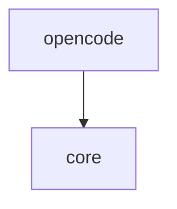

# Module: opencode

<!--SECTION:MODULE_VISION-->

## 1. Module Vision

Адаптер движка opencode. Родительский scope: [`../../agent-run.spec.md`](../../agent-run.spec.md). Реализует контракт [`AgentEngine`](../core/core.spec.md) из модуля `core`.

Знает всё, что специфично для opencode: как запустить `opencode run`, как включить readonly через профиль прав, как отдать рабочие директории, как почистить окружение подпроцесса и как перевести сбой opencode в типизированную `AgentRunError`. Первый из движков; будущие (claude/codex/cursor) — соседи по `engines/`.

<!--/SECTION:MODULE_VISION-->

<!--SECTION:MODULE_USAGE_EXAMPLE-->

## 2. Module Usage Example

```ts
import { OpencodeEngine } from '@services/agent-run/engines/opencode';

const engine = new OpencodeEngine();

await engine.detect(); // { installed: true, version: '1.16.2' }

const res = await engine.run({
  task: 'как связаны эти репозитории?',
  dirs: ['/repoA', '/repoB'],
}); // → { text: '…markdown…', engine: 'opencode' }
// при сбое кидает AgentRunError с code + hint
```

<!--/SECTION:MODULE_USAGE_EXAMPLE-->

<!--SECTION:ENTITY_INVENTORY-->

## 3. Entity Inventory (Closed-World)

_Это полный список сущностей модуля `opencode`. Любое введение сущности execution-агентом помимо этого списка считается drift'ом и требует обновления spec._

| Name                   | Surface | Type         | Purpose                                                                                                 |
| ---------------------- | ------- | ------------ | ------------------------------------------------------------------------------------------------------- |
| `OpencodeEngine`       | ⚪      | Adapter      | Реализация `AgentEngine`: запуск `opencode run` в readonly с директориями.                              |
| `opencodeErrorMap`     | ⚪      | Utility      | Перевод дескриптора сбоя (spawn/exit/stderr) в `ErrorCode` + `hint`.                                    |
| `OpencodeFailure`      | ⚪      | Value Object | Нормализованный дескриптор сбоя на вход `opencodeErrorMap` (`{ spawnErrorCode?, exitCode?, stderr? }`). |
| `OpencodeErrorMapping` | ⚪      | Value Object | Возвращаемый тип `opencodeErrorMap` (`{ code, hint }`).                                                 |
| `composeCleanEnv`      | ⚪      | Utility      | Внутренняя функция: убирает 6 прокси-переменных + ставит `OPENCODE_CONFIG` в env подпроцесса.           |
| `readonly.config.json` | ⚪      | Config asset | Статичный bundled-конфиг: agent `readonly` (deny edit/write/patch); путь в `OPENCODE_CONFIG`.           |

<!--/SECTION:ENTITY_INVENTORY-->

<!--SECTION:ENTITY_SURFACES-->

## 4. Entity Surfaces

### `OpencodeEngine`

- **Type:** Adapter (implements `AgentEngine`)
- **Purpose:** запустить opencode как подпроцесс и вернуть текстовый ответ; включить readonly и доступ к директориям.
- **Public Operations:**
  - `id` = `'opencode'`.
  - `detect() -> { installed, version? }` — запустить `opencode --version`.
  - `listModels() -> Promise<string[]>` — распарсить вывод `opencode models`: разбить по строкам, `trim`, оставить только строки вида `provider/model` (содержат `/`, без пробелов внутри); строки-заголовки/пустые игнорировать; non-zero exit или сбой spawn → `[]` (не кидает). (`opencode models` выводит чистый текст по одной модели в строке — мы это видели; ANSI не ожидается, но `trim` снимает хвосты.)
  - `run(options) -> RunResult` — собрать аргументы (`run <task> --agent <readonly> --model <model или дефолт> --dir <первая>`; остальные директории перечисляются в тексте задания — `external_directory` deferred в v1, Спайк 1), почистить окружение, спавнить, собрать stdout → `{ text, engine: 'opencode' }`.
- **Default model:** `llm-proxy/deepseek-v4-pro` (когда `options.model` не задан).
- **Lifecycle:** singleton, регистрируется в реестре `core` через `index.ts`.
- **Errors & Degradation:** при ненулевом exit или нераспознанном выводе → `opencodeErrorMap` → кидает `AgentRunError`. На `MODEL_UNAVAILABLE` движок обогащает hint выводом `listModels()` (список доступных).
- **Consumers:** Internal — реестр `core` (`../core/core.spec.md`); External — N/A (через публичный `run`).

### `opencodeErrorMap`

- **Type:** Utility (pure function)
- **Purpose:** превратить сырой сбой opencode в типизированную ошибку с подсказкой оператору.
- **Public Operations:** `mapError(failure: { spawnErrorCode?: string; exitCode?: number; stderr?: string }) -> { code: ErrorCode, hint: string }` — на вход нормализованный дескриптор сбоя: либо spawn `error.code` (ENOENT/EACCES), либо exit-код + stderr запущенного процесса. `TIMEOUT` сюда НЕ приходит — его бросает `OpencodeEngine` напрямую по своему таймеру.
- **Lifecycle:** чистая функция, без состояния.
- **Errors & Degradation:** нераспознанный паттерн → `LAUNCH_FAILED` + сырой stderr в hint.
- **Consumers:** Internal — `OpencodeEngine`.
<!--/SECTION:ENTITY_SURFACES-->

<!--SECTION:MODULE_CONTRACTS-->

## 5. Module Contracts (DbC)

### 5.1 Adapters

#### Adapter: `OpencodeEngine`

- **Implements:** [`AgentEngine`](../core/core.spec.md) (`core/ports/agent-engine.port.ts`)
- **Purpose:** запуск opencode в readonly с заданием и директориями.
- **Supporting Artifacts:** статичный файл `readonly.config.json` в пакете (рядом с движком), определяющий agent `readonly` с `permission: { edit: deny, write: deny, patch: deny }` (всё остальное, включая `bash`, остаётся `allow` — агент сохраняет шелл для анализа). Движок ставит `OPENCODE_CONFIG=<путь к файлу>` в окружение подпроцесса и запускает `--agent readonly`. `OPENCODE_CONFIG` **дополняет** конфиг пользователя (провайдеры/ключи сохраняются — проверено: 31 llm-proxy модель видна). Никакой генерации, никакого `/tmp`, ничего не пишем в целевые папки. Путь резолвится через `import.meta.url`.
- **Runtime Backing:** `real-runtime`
- **Verification Levels:** `integration`, `e2e`
- **Deferred Runtime Scope:** доступ к нескольким внешним директориям (`external_directory`) — подтверждается спайком. **v1-фолбэк:** если multi-root окажется ненадёжным — одна `--dir` (первая), остальные пути перечисляются в тексте задания; buildability v1 на спайк не завязана. Стриминг/сессии — не в v1.

**Side Effects:**

- Спавн подпроцесса `opencode run …` **с таймаутом**; при превышении — SIGTERM, затем **SIGKILL после grace-периода 5с**, если процесс не завершился (SIGTERM игнорируем — нужен добивающий SIGKILL, иначе сирота держит pipe и течут fd).
- `OPENCODE_CONFIG` в окружении подпроцесса указывает на bundled `readonly.config.json` (статичный, без генерации).
- Чтение stdout/stderr подпроцесса.
- Очистка окружения подпроцесса: снять **весь набор прокси-переменных** — `HTTPS_PROXY`, `https_proxy`, `HTTP_PROXY`, `http_proxy`, `ALL_PROXY`, `all_proxy` (libcurl/Node читают и строчные; иначе корпоративный прокси режет провайдера — урок сессии).

**Contract (DbC):**

- Preconditions: `options.task` непустой.
- **Оптимистичный запуск:** НЕ делать pre-flight `detect()`; спавнить `opencode run` сразу. Ошибка spawn (`error.code` ENOENT/EACCES) → `AGENT_NOT_INSTALLED` через `opencodeErrorMap`.
- **Модель:** `options.model` или дефолт `llm-proxy/deepseek-v4-pro` → `--model`. Если модель недоступна (opencode не знает её) → `opencodeErrorMap` даёт `MODEL_UNAVAILABLE`, движок обогащает hint списком из `listModels()` (вне горячего пути; только на ветке этой ошибки). Без молчаливой подмены модели.
- Postconditions: при успехе `{ text, engine: 'opencode' }`, `text` = stdout движка; **ни один файл в `dirs` не изменён** (readonly, enforced agent-правами `readonly`). При неуспехе — `AgentRunError` через `opencodeErrorMap`. Превышение `timeout` → `AgentRunError('TIMEOUT')` после SIGTERM (+SIGKILL по grace).
- Invariants: запуск всегда с readonly-профилем; окружение подпроцесса очищено от прокси-переменных (оба регистра); по завершении (успех/ошибка/таймаут) подпроцесс гарантированно мёртв — не сирота.

### 5.2 Utility

#### Utility: `opencodeErrorMap`

- **Runtime Backing:** `real-runtime`
- **Verification Levels:** `unit`

**Contract (DbC):**

- Postconditions: вернуть `{ code, hint }`. Маппинг (6 кодов; `TIMEOUT` сюда не входит — его кидает `OpencodeEngine` напрямую):

  | Сигнал                                                                 | вход                           | `code`                | `hint`                                                                   |
  | ---------------------------------------------------------------------- | ------------------------------ | --------------------- | ------------------------------------------------------------------------ |
  | бинарь не в PATH/не запускается                                        | `spawnErrorCode` ENOENT/EACCES | `AGENT_NOT_INSTALLED` | поставить opencode (`brew install opencode`)                             |
  | `403` / proxy / `ERR_ACCESS_DENIED`                                    | stderr                         | `NETWORK_BLOCKED`     | снять прокси-переменные (`HTTPS_PROXY`/`https_proxy`…) или дать доступ   |
  | `constraint failed.*session_message` / `database schema` / `migration` | stderr                         | `VERSION_MISMATCH`    | CLI отстал → `brew upgrade opencode`; App отстал → обновить opencode App |
  | `Forbidden` на модель/провайдера                                       | stderr                         | `MODEL_FORBIDDEN`     | проверить ключ и права на модель                                         |
  | `unknown model` / `no such model` / `model not found`                  | stderr                         | `MODEL_UNAVAILABLE`   | базовый hint; `OpencodeEngine` дополнит списком из `listModels()`        |
  | `API key … missing` / пустой ключ                                      | stderr                         | `CREDENTIAL_MISSING`  | задать env-ключ провайдера                                               |
  | нераспознанный stderr / прочий ненулевой exit                          | exitCode+stderr                | `LAUNCH_FAILED`       | сырой stderr + «причина не распознана»                                   |

- Invariants: всегда возвращает валидный `ErrorCode`; никогда не кидает сама. Паттерны `VERSION_MISMATCH` намеренно широкие — текст ошибки opencode хрупок к версиям, узкий матч ловит не всё.
- `TIMEOUT` живёт вне error-map: `OpencodeEngine` по своему таймеру делает SIGTERM→SIGKILL и кидает `AgentRunError('TIMEOUT')` сам.
<!--/SECTION:MODULE_CONTRACTS-->

<!--SECTION:PUBLIC_OPTIONS-->

## 6. Public Options & Policies

- Все публичные опции приходят из `RunOptions` (`core`); этот модуль их исполняет:
  - `dirs` → `--dir` (первая) + `external_directory` (остальные); фолбэк — одна `--dir` + пути в тексте задания.
  - `mode: 'readonly'` → bundled `readonly.config.json` через `OPENCODE_CONFIG` + `--agent readonly` (deny edit/write/patch; bash остаётся).
  - `timeout` → потолок подпроцесса; превышение → SIGTERM + `TIMEOUT`.
  - `engine` → не наблюдается здесь (выбор движка — забота реестра).
  - `model` → `--model` (дефолт `llm-proxy/deepseek-v4-pro`); недоступна → `MODEL_UNAVAILABLE` + список.
- Отложено / not consumed in v1: `--format json`, `--variant` (reasoning effort), стриминг, сессии — см. scope spec §3.3.
<!--/SECTION:PUBLIC_OPTIONS-->

<!--SECTION:FILE_STRUCTURE-->

## 7. File Structure

```
services/agent-run/
└── engines/
    └── opencode/
        ├── opencode-engine.ts        # OpencodeEngine (Adapter)
        ├── opencode-error-map.ts     # opencodeErrorMap (Utility)
        └── __tests__/
            ├── opencode-engine.test.ts
            └── opencode-error-map.test.ts
```

**File Mapping:**

- `engines/opencode/opencode-engine.ts`: `OpencodeEngine`.
- `engines/opencode/opencode-error-map.ts`: `opencodeErrorMap`.

Namespace: файлы `opencode-*`, тип `OpencodeEngine` — `rg opencode` находит весь модуль.

<!--/SECTION:FILE_STRUCTURE-->

<!--SECTION:MODULE_DECISION_LOG-->

## 8. Module Decision Log

### D-001 — readonly через эфемерный agent-профиль (`--agent`)

- **Status:** active
- **Recorded:** session ModuleDecomposition, agent-run
- **Why:** у opencode есть permission-движок; профиль прав надёжнее разбора флагов.
- **Risk accepted:** enforcement делегирован opencode (trust boundary, см. scope spec §3.4).

### D-002 — Очистка `HTTPS_PROXY` в окружении подпроцесса

- **Status:** active
- **Recorded:** session ModuleDecomposition, agent-run
- **Why:** прямой урок сессии — корпоративный прокси отдаёт 403 на провайдера.
- **Risk accepted:** если провайдер доступен только через прокси — поймаем `NETWORK_BLOCKED`, что и нужно.

### D-000 — Модуль внутренний (internal-only — not in composition view)

- **Status:** active
- **Recorded:** session ModuleDecomposition, agent-run
- **Why:** все сущности модуля ⚪ internal; потребитель видит движок только через публичный `run()` из `core`, не напрямую. В composition view scope-спеки модуль не фигурирует намеренно.

### D-003 — Каталог ошибок зашит в `opencodeErrorMap`, не в `core`

- **Status:** active
- **Recorded:** session ModuleDecomposition, agent-run
- **Why:** сопоставление паттернов специфично для opencode; `core` держит только сам тип `ErrorCode`.
- **Risk accepted:** каждый новый движок несёт свой error-map — это правильно (паттерны у движков разные).

### D-004 — Оптимистичный запуск + таймаут с SIGTERM

- **Status:** active
- **Recorded:** session SddCritic, agent-run
- **Why:** скорость — главное правило; запускаем `opencode run` сразу, без пред-проверки `--version`. Спайк подтвердил: spawn отдаёт `error.code` (ENOENT/EACCES) → `AGENT_NOT_INSTALLED`. Таймаут (дефолт 120000 мс) + SIGTERM защищают от зависшего подпроцесса.
- **Risk accepted:** TOCTOU-зазор закрыт маппингом spawn-ошибки.

### D-005 — readonly через `opencode agent create` (superseded)

- **Status:** superseded
- **Recorded:** session SddCritic, agent-run
- **Why (на тот момент):** спайк показал команду `opencode agent create --permissions`.
- **Superseded by:** D-010 — при живом прогоне выяснилось, что `opencode agent create` это **AI-генератор** (крутит «Generating agent configuration», вызов модели), а не быстрая запись файла → запуск зависал.

### D-010 — readonly через статичный config + `OPENCODE_CONFIG` (rework)

- **Status:** active
- **Recorded:** session SddExecute (live e2e discovery), agent-run
- **Supersedes:** D-005
- **Was:** `opencode agent create --permissions` генерит профиль per-process.
- **Now:** статичный `readonly.config.json` в пакете (agent `readonly`, deny edit/write/patch), движок ставит `OPENCODE_CONFIG` в окружение подпроцесса + `--agent readonly`. Детерминированно, мгновенно, без генерации.
- **Why:** живой `gennady run` завис — `opencode agent create` оказался AI-генератором (вызов модели на каждый запуск). Проверено: `OPENCODE_CONFIG` дополняет конфиг пользователя (провайдеры сохраняются), агент распознаётся, `gennady run` отвечает «pong».
- **Risk accepted:** `bash` оставлен `allow` (оператор: агенту нужен шелл) → теоретически мутация через шелл возможна; митигация — git + инструкция «только анализ». enforcement делегирован opencode (trust boundary, scope §3.4).
<!--/SECTION:MODULE_DECISION_LOG-->

<!--SECTION:INTER_MODULE_DEPENDENCIES-->

## 9. Inter-Module Dependencies

- **Depends on:** [`core`](../core/core.spec.md) — контракт `AgentEngine`, типы `RunOptions`/`RunResult`, `AgentRunError`, `ErrorCode`.
- **Scope Reference (cross-scope):** None.
- **Provides to:** регистрируется в реестре `core` через `index.ts` (composition root).



<!--/SECTION:INTER_MODULE_DEPENDENCIES-->

<!--SECTION:HANDOFF-->

## 10. Handoff to task-scaffolding

- **Implementation files to be created:** `engines/opencode/opencode-engine.ts`, `engines/opencode/opencode-error-map.ts`.
- **Test files to be created:** `engines/opencode/__tests__/opencode-engine.test.ts`, `engines/opencode/__tests__/opencode-error-map.test.ts`.
- **Stack dependencies:**
  - Language: `typescript` (resolves to `ai/directives/coding/typescript-rules.xml`)
  - Test framework: `node-test` (resolves to `ai/directives/testing/node-test.xml`)
- **Module Rules Additions:** None
- **Open risks & validation needs:**
  - **Спайк 1 (multi-dir):** доступ к нескольким внешним директориям (`external_directory` + `--dir`) — не подтверждён. Фолбэк: одна `--dir` + перечисление путей в задании. Buildability v1 НЕ блокируется.
  - **Спайк 2 (readonly) — ЗАКРЫТ (механизм пересмотрен на live, D-010):** `opencode agent create` оказался AI-генератором → заменён на статичный `readonly.config.json` + `OPENCODE_CONFIG` + `--agent readonly`. Проверено живым `gennady run` (ответ «pong», без зависания).
  - **Тестируемость без живой модели:** `opencode-error-map.test.ts` — чистый unit на строках stderr + spawn `error.code` (полное покрытие 7 кодов без подпроцесса). `opencode-engine.test.ts` — integration/e2e: требует установленного opencode и снятых прокси-переменных; таймаут проверяется на заведомо долгом задании.
  <!--/SECTION:HANDOFF-->
