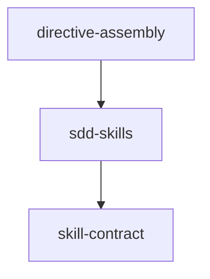

# Tasks: ai-skills

## Scope Spec

- [Scope spec](./ai-skills.spec.md)

## Cascade Table

Effective rules for this scope, from the Scope Graph (depends-on transitive closure). Tier order (low → high on collision): traversed-scopes → target-scope → module → phase.

| Tier                                                                                                                          | coding           | testing   | infra            | docs                                                                                                                                                                                                                                         |
| ----------------------------------------------------------------------------------------------------------------------------- | ---------------- | --------- | ---------------- | -------------------------------------------------------------------------------------------------------------------------------------------------------------------------------------------------------------------------------------------- |
| traversed-scopes (`infra-base`, `cli`, `dbc`, `vcs`, `shared`, `agent-run` — transitive closure of `ai-skills`' `depends-on`) | typescript-rules | node-test | —                | `readme-per-cmd` (declared by `cli`'s own Rules table, Source `cli/cmd/README.md` — not registered in `ai/directives/knowledge.xml`; never activates for a ticket outside `cli`'s own CLI-command files, carried here for completeness only) |
| ai-skills (target)                                                                                                            | typescript-rules | node-test | nodejs-npm-setup | —                                                                                                                                                                                                                                            |
| module:directive-assembly                                                                                                     | —                | —         | —                | —                                                                                                                                                                                                                                            |

<!-- infra-base contributes no separately-listed rule here — its own spec is intentionally minimal
(ai/directives/sdd-v2/formats/infra-base-minimal-spec.xml) and defers its full rule list to
`discovery infra-base`; nodejs-npm-setup is already carried at the ai-skills target-scope tier, so
no cascade gap results. -->

## Inter-Module DAG

## Tracker

| Task-ID     | Title                                             | Module             | Dependencies | Status   | Reopens |
| ----------- | ------------------------------------------------- | ------------------ | ------------ | -------- | ------- |
| DA-lazy-asm | Lazy directive assembly: skeleton + step packages | directive-assembly | —            | [ ] TODO | —       |

## Decision Log (scope task level)

- AI-SKILLS-TASKS-D-1 · этот прогон скаффолдинга покрывает только модуль `directive-assembly`;
  модули `skill-contract` и `sdd-skills` остаются без v2-тикетов (у `sdd-skills` есть legacy
  v1-тикет `tasks/ai-skills/sdd-skills/sdd-skills.task-61.md` — не миграция, не трогается)
- AI-SKILLS-TASKS-D-2 · cross-scope reference `sdd-step` (скоуп `cli`) не заведён в Tracker этого
  скоупа — он принадлежит `cli`, не `ai-skills`, и DEFERRED решением оператора (DA-DL-15 спеки
  `directive-assembly`)
