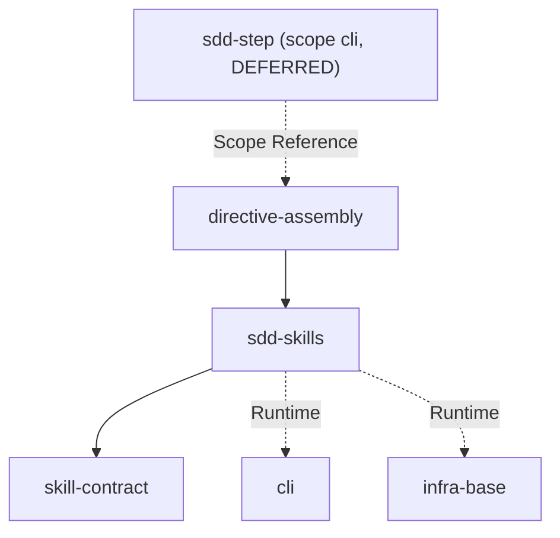

# ai-skills: Library Specification

<!--SECTION:SCOPE_TYPE-->

## scope-type

library

<!--/SECTION:SCOPE_TYPE-->

<!--SECTION:VISION-->

## 1. Vision & Primary Goal

Библиотека AI-навыков для агентов — переиспользуемые текстовые артефакты (`SKILL.md` + scripts + prompts). Навык = тонкий клиент над директивой: самодостаточный workflow, который агент (Claude Code, OpenCode) активирует по trigger-фразам оператора, загружает его body и следует процедуре. Stateful public SDD entries сначала проходят через общий router с одним сохранённым state snapshot; router затем лениво загружает owner.

Навыки разрабатываются в `ai/skills/`, деплоятся в проекты через `npx gennady sync-skills` в `.claude/skills/`. Директивы — в `ai/directives/`, переиспользуются между навыками.

12 навыков: 8 SDD (`sdd` — единая дверь-роутер, `sdd-scaffold`, `sdd-execute` — включая batch-режим intent'ом внутри навыка, `sdd-audit`, `sdd-check`, `sdd-code-review`, `sdd-critic`, `sdd-reconcile` — режимы fix и from-code) + 4 non-SDD (`agent-inbox`, `opencode-get-session`, `prd-interview`, `workspace-permission-setup`). `agent-inbox` — продуктовый навык-оркестратор над командами `inbox`/`vcs-worktree`/`vcs-reply`; принадлежит scope [`agent-inbox`](../agent-inbox/agent-inbox.spec.md), здесь учтён как навык. См. D-005/D-006/D-007 — состав набора менялся после первичного discovery (`alt-opinion` удалён — см. D-006; `sdd-hooks-install` удалён — см. D-007).

<!--/SECTION:VISION-->

<!--SECTION:GOLDEN_DX-->

## 2. Approved Usage Example (Composition View)

Навыки потребляются агентом через 3 паттерна. Детали каждого паттерна — в модульных спеках.

### Directive-based: [`skill-contract` → `DirectiveActivation`](./skill-contract/skill-contract.spec.md#directiveactivation)

```markdown
1. Extract intent → 2. Load & activate directive → 3. Execute plan
```

Потребители: sdd (единая дверь-роутер), sdd-audit, sdd-code-review. Stateful direct entries sdd-scaffold / sdd-critic / sdd-reconcile активируют свою owner-директиву через router с forced intent.

### Orchestrator: [`sdd-skills` → `OrchestratorProtocol`](./sdd-skills/sdd-skills.spec.md#orchestratorprotocol)

```
Plan (read ticket surface) → Dispatch phases (sequential, typed Handoff) → Audit (mandatory)
```

Потребители: sdd-execute (единственный оркестратор — batch-режим — это LOGIC_SWITCH-ветка intent'а внутри того же навыка, не отдельный навык).

### CLI-delegation: `sdd-check` (тонкий репортер над CLI-инструментом)

```bash
npx gennady sdd-check --task <path>
```

Потребители: sdd-check (тонкий репортер над CLI-инструментом `sdd-check` — паттерн prepare → invoke → show).

Навык не содержит логики — только трёхшаговый активатор: извлеки intent, загрузи директиву, активируйся как она, выполни план директивы.

### Паттерн 2: Orchestrator skill (door)

```markdown
---
name: sdd-execute
description: Execute task tickets end-to-end — a LOGIC-SWITCH on intent picks one ticket or a whole batch ...
compatibility: opencode
---

<SddDoor door="execute">
  <Mission>Orchestrate execution of one task ticket: plan phases, dispatch one worker-subagent per
  phase, close the Round, dispatch audit, retry only failing phases on audit FAIL. I PLAN and
  DISPATCH — I never write code, run a phase, or run audit myself.</Mission>

  <ExecutionPlan>
    <Step id="GATHER">
      Run one `npx gennady sdd-state` AND read in full
      `ai/directives/sdd-v2/router.directive.xml`; pass the saved snapshot with forced intent `execute`.
    </Step>
    <Step id="PREFLIGHT">
      Router resolves the live-session conflict/open policy and readiness once, then loads
      `ai/directives/sdd-v2/execute.directive.xml` through its `LOGIC_SWITCH`.
    </Step>
    <Step id="EMBODY">
      Preserve Task-ID (or "next" / "batch") as the execute owner's payload. Follow the owner
      directive's ExecutionPlan; never skip the audit.
    </Step>
  </ExecutionPlan>
</SddDoor>
```

Навык сам не содержит протокола фаз/аудита — это тело `ai/directives/sdd-v2/execute.directive.xml`, которое навык только загружает и активирует.

Оркестратор композирует несколько директив (phase-execution + audit), диспатчит subagent с typed Handoff. Сам код не пишет.

### Паттерн 3: CLI-delegation skill

````markdown
---
name: sdd-check
description: Verify SDD workflow integrity — run the mechanical checks over one ticket or the whole project ...
license: MIT
compatibility: opencode
---

Делегирует CLI `gennady sdd-check`. Не изобретает логику проверки — использует готовый инструмент.

### Шаг 1: Подготовь артефакт

...

### Шаг 2: Запусти CLI

```bash
npx tsx ~/Developer/gennady/cli/gennady.ts sdd-check --task <path>
```
````

### Шаг 3: Покажи результат

CLI возвращает готовый синтез-блок. Покажи как есть.

```

### Файловая структура навыка

```

ai/skills/<name>/
├── SKILL.md # обязателен: YAML frontmatter + markdown body
├── scripts/ # опционально: bash/js утилиты
└── \*.prompt.md # опционально: кастомные промпты для моделей

```
<!--/SECTION:GOLDEN_DX-->

<!--SECTION:REQUIREMENTS_AND_CONSTRAINTS-->
## 3. Requirements & Constraints

### 3.1 Functional Requirements

| ID | Требование |
|---|---|
| FR-01 | **Формат навыка.** YAML frontmatter (`name`, `description`, `compatibility`), markdown body с процедурой активации. Файл: `SKILL.md` в `ai/skills/<name>/` |
| FR-02 | **Активация директивы.** Навык говорит агенту: прочитай директиву по пути (из `ai/directives/`), активируй её, примени к intent'у оператора |
| FR-03 | **Композиция директив.** Навык может активировать несколько директив последовательно (например sdd-execute: phase-execution → audit) |
| FR-04 | **Trigger-фразы.** `description` во frontmatter содержит ключевые фразы, по которым агент-хостер определяет, когда активировать навык |
| FR-05 | **Артефакты навыка.** Навык может поставлять ресурсы: скрипты (`scripts/`), промпты (`*.prompt.md`) |
| FR-06 | **Синхронизация.** Навыки разрабатываются в `ai/skills/`, деплоятся через `npx gennady sync-skills` в `.claude/skills/` проекта |
| FR-07 | **Три execution-паттерна:** directive-based (загрузка + активация + применение), orchestrator (план + dispatch subagent), CLI-delegation (подготовка артефакта → вызов CLI) |
| FR-08 | **README на навыки.** `ai/skills/README.md` — единый README со всеми навыками, типовыми сценариями (use cases) и execution-паттернами. При добавлении/изменении навыка README.md синхронно обновляется |

### 3.2 Non-Functional Constraints

| ID | Ограничение |
|---|---|
| NFR-01 | Навык — текстовый артефакт, не код. Нет runtime-зависимостей кроме директив и скриптов |
| NFR-02 | **Dev/prod dual path mode.** В исходниках (`ai/skills/`) пути указываются в dev-форме: `~/Developer/gennady/ai/directives/...` для директив, `~/Developer/gennady/ai/skills/...` для скриптов (вместо `${SKILL_DIR}`), `npx tsx ~/Developer/gennady/cli/gennady.ts` для CLI-вызовов. При `sync-skills` нормализуются в продуктовые: `ai/directives/...`, `.claude/skills/...`, `npx gennady ...`. Никаких абсолютных путей в продуктовой версии |
| NFR-03 | Scripts — bash, macOS-совместимые. Node.js скрипты только через `tsx` |
| NFR-04 | Директивы — XML, read-only для навыка. Навык не модифицирует директиву |
| NFR-05 | Cross-skill consistency: assume sync. No runtime validation |
| NFR-06 | `compatibility: opencode` для всех навыков. Claude Code игнорирует нераспознанные поля |
| NFR-07 | `ai/skills/README.md` — канонический источник документации навыков с use cases. Синхронизируется с SKILL.md frontmatter при изменениях |

### 3.3 Out-of-Scope

- Валидация cross-skill/directive консистентности
- Интерактивный режим в sync-skills
- Watch-режим синхронизации
- Миграция форматов навыков

### 3.4 Runtime Backing & Deferred Scope

| Capability | Posture | Notes |
|---|---|---|
| SKILL.md + сопутствующие файлы | `real-runtime` | Статические текстовые артефакты в `ai/skills/` |
| Scripts (bash/tsx) | `real-runtime` | macOS, Node 22+ |
| sync-skills деплой | `real-runtime` | В скоупе `cli` |

Ничего не deferred.

### 3.5 Rules

| Rule | Category | Source |
|---|---|---|
| typescript-rules | coding | `ai/directives/coding/typescript-rules.xml` |
| node-test | testing | `ai/directives/testing/node-test.xml` |
| nodejs-npm-setup | infra | `ai/directives/infra/nodejs-npm-setup.xml` |
<!--/SECTION:REQUIREMENTS_AND_CONSTRAINTS-->

<!--SECTION:PUBLIC_API_SURFACE-->
## 4. Public API Surface

| Surface | Описание |
|---|---|
| `name` | Уникальный идентификатор: lowercase, kebab-case, совпадает с именем директории |
| `description` | Человекочитаемое описание с trigger-фразами. Агент матчит по нему intent оператора |
| `SKILL.md body` | Процедура: извлечение intent → загрузка директивы → активация → выполнение |
| `scripts/` | Опционально: bash/js утилиты. Доступны агенту внутри навыка |
| `*.prompt.md` | Опционально: кастомные промпты для моделей |
<!--/SECTION:PUBLIC_API_SURFACE-->

<!--SECTION:ARCHITECTURE-->
## 5. Architecture

**Принцип: навык = тонкий клиент над директивой.**

```

┌──────────────┐ activates ┌──────────────────┐
│ SKILL.md │ ──────────────────▶ │ directive.xml │
│ (frontmatter│ │ (Mission, │
│ + 3 steps) │ │ Belief_State, │
│ │ │ Execution_Plan)│
│ resources: │ └──────────────────┘
│ scripts/ │
│ \*.prompt.md│
└──────────────┘
▲
│ reads & follows
│
┌─────────┐
│ Agent │ (Claude Code / OpenCode)
└─────────┘

````

**Три execution-паттерна:**

| Паттерн | Навык делает | Примеры |
|---|---|---|
| **Directive activation** | Извлекает intent → читает директиву → активируется как она → выполняет план | sdd (router), sdd-audit, sdd-code-review; sdd-scaffold / sdd-critic / sdd-reconcile входят через router forced intent |
| **Orchestrator** | Один snapshot → router forced intent=execute → owner планирует и диспатчит subagent-фазы с typed Handoff → audit. Сам код не пишет | sdd-execute (single/batch payload остаётся у execute owner) |
| **CLI delegation** | Подготавливает артефакт → вызывает `npx gennady <cmd>` → показывает результат | sdd-check |

**sdd-check** — read-only репортер: не загружает директиву, вся логика — в TypeScript-инструменте `shared/sdd/check.ts`, вызываемом через `npx gennady sdd-check --task <path>` / `--all`. Навык только запускает инструмент и релеит находки. Код не пишет, ничего не фиксит.

**Скрипты:** В dev-режиме скрипты доступны по пути `~/Developer/gennady/ai/skills/<skill-name>/scripts/`. При `sync-skills` путь нормализуется в `.claude/skills/<skill-name>/scripts/`. Скрипты есть только у `sdd-execute` (11 файлов, диспатчер `sdd`).

### 5.1 Rejected Alternatives

| Решение | Почему отклонено |
|---|---|
| Навыки с embedded-логикой (вся процедура внутри SKILL.md) | Дублирование между навыками. Директивы переиспользуемы; навыки только активируют |
| Навыки как TypeScript-модули | Навыки потребляются разными агентами (Claude, OpenCode) с разным runtime. Markdown — универсальный формат |
| Одна мега-директива на всё SDD | Разные фазы SDD требуют разного контекста и изоляции. Разделение директив = изоляция контекста subagent'ов |
<!--/SECTION:ARCHITECTURE-->

<!--SECTION:DECISION_LOG-->
## 6. Decision Log

### D-001 — Навык = тонкий клиент над директивой

- **Status:** active
- **Recorded:** session Discovery, ai-skills
- **Why:** Навыки не содержат логику — только активируют переиспользуемые директивы. Директивы — source of truth для поведения; навыки — обёртка, которая заставляет агента прочитать и активировать директиву.
- **Risk accepted:** При изменении директивы все навыки-потребители должны оставаться совместимыми. Смягчается тем, что навык не содержит логики, только путь к директиве.
- **Rejected alternatives:**
  - Embedded-логика в каждом навыке — дублирование, расхождение
  - Навыки без директив — не переиспользуемо

### D-002 — Три execution-паттерна

- **Status:** active
- **Recorded:** session Discovery, ai-skills
- **Why:** Три разных способа активации покрывают все существующие навыки. Directive-based — основной. Orchestrator — для композиции нескольких директив с typed Handoff. CLI delegation — для делегирования готовому CLI.
- **Risk accepted:** Новые навыки могут не вписываться в существующие паттерны. Тогда — новый паттерн или refine спеки.
- **Rejected alternatives:**
  - Один универсальный паттерн — не покрывает orchestrator (subagent dispatch) и CLI-delegation
  - Каждый навык уникален — не переиспользуемо, нет контракта

### D-003 — `compatibility: opencode` для всех навыков

- **Status:** active
- **Recorded:** session Discovery, ai-skills
- **Why:** Навыки разрабатываются для Claude Code, но должны быть совместимы с OpenCode. Поле `compatibility` — опциональное, признано OpenCode (`opencode.ai/docs/skills`), Claude игнорирует нераспознанные поля.
- **Risk accepted:** Отсутствует (Claude и OpenCode оба игнорируют неизвестные поля frontmatter).
- **Rejected alternatives:**
  - `compatibility: claude, opencode` — нестандартный синтаксис; оставляем `opencode` как в существующих навыках

### D-004 — Декомпозиция: 3 модуля по execution-паттерну

- **Status:** active
- **Recorded:** session ModuleDecomposition, ai-skills
- **Why:** Выбрана декомпозиция по execution-паттерну: `skill-contract` (формат и контракты), `sdd-skills` (все SDD-навыки, 12 на момент решения — см. D-005), `alt-opinion` (CLI-delegation). Минимально достаточно для разделения контракта и реализации, не overengineered.
- **Risk accepted:** `sdd-skills` содержит SDD-навыки (12 на момент решения, 9 сейчас — см. D-005) — при росте может потребоваться дальнейшая декомпозиция.
- **Rejected alternatives:**
  - По фазам SDD (6 модулей) — overengineered: большинство модулей содержат 1-2 навыка
  - Монолитный (1 модуль) — нет разделения контракта и реализации

### D-005 — Набор навыков сведён к router + reconcile (cutover на v2)

- **Status:** active
- **Recorded:** reconcile from-code, ai-skills, коммит `fa6fc8f` (full cutover на sdd-v2)
- **Was:** 12 SDD-навыков, каждый — отдельная точка входа (`sdd-discover`, `sdd-continue`, `sdd-infra`, `sdd-module-decomposition`, `sdd-setup`, `sdd-fix`, `sdd-execute-batch` как отдельный оркестратор от `sdd-execute`, плюс `sdd-audit`, `sdd-check`, `sdd-scaffold`, `sdd-critic`, `sdd-execute`). Директивы лежали в `ai/directives/sdd/`.
- **Now:** 9 SDD-навыков. `sdd` — единая дверь-роутер, поглотившая discover/continue/infra/module-decomposition/setup через LOGIC_SWITCH на state + intent. `sdd-fix` слился в `sdd-reconcile` как режим `mode=fix` (второй режим — `mode=from-code`, для случаев когда код обогнал спеку). `sdd-execute-batch` слился в `sdd-execute` как batch-режим (Task-ID / next / batch / all / queue — тот же LOGIC_SWITCH). Добавился `sdd-code-review` (fresh-eyes багхант на диффе Round'а, отдельно от audit и от лита) и `sdd-hooks-install` (bootstrap хуков прогресса). Директивы переехали в `ai/directives/sdd-v2/`; `ai/directives/sdd/` удалена целиком.
- **Why:** Один router-вход снижает нагрузку выбора навыка на оператора и агента-хостера; слияние fix/from-code и batch/single в один навык с LOGIC_SWITCH убирает дублирование протокола дистпетчеризации между близкими по сути входами.
- **Risk accepted:** `sdd-hooks-install` не укладывается в три существующих паттерна активации (`DirectiveActivation` / `OrchestratorDispatching` / `CliDelegation`) — это config-bootstrapper с протоколом целиком внутри `SKILL.md`. Принято как единичное исключение, не как повод вводить четвёртый паттерн на одном навыке.
- **Rejected alternatives:**
  - Оставить 12+ навыков и просто патчить пути на `sdd-v2` — не убирает реальное дублирование входов (fix vs from-code, single vs batch — один и тот же протокол диспетчеризации)

### D-006 — Скилл `alt-opinion` удалён

- **Status:** active
- **Recorded:** operator request, полное удаление скилла-обёртки `alt-opinion`
- **Was:** 14 навыков, включая `alt-opinion` (CLI-delegation модуль, обёртка над `npx gennady alt-opinion`).
- **Now:** 13 навыков. `ai/skills/alt-opinion/` и деплой-копия `.claude/skills/alt-opinion/` удалены; модульная спека `specs/ai-skills/alt-opinion/` удалена. На момент этого решения CLI-команда `gennady alt-opinion` (`cli/cmd/alt-opinion/`) не затрагивалась (вне скоупа этой спеки). **Обновление:** позднее сама CLI-команда тоже удалена целиком — см. D-021 в [`specs/cli/cli.spec.md`](../cli/cli.spec.md); команды `gennady alt-opinion` больше нет.
- **Why:** Скилл-обёртка признана избыточной по решению оператора. (Рассуждение на момент D-006: CLI-команда тогда оставалась доступной напрямую без навыка-посредника. Позднее её тоже удалили — см. `Now` выше и D-021; сейчас команды нет.)
- **Risk accepted:** Отсутствует — паттерн CLI-delegation остаётся представлен `sdd-check`, четвёртый паттерн не требуется.

### D-007 — Скилл `sdd-hooks-install` удалён

- **Status:** active
- **Recorded:** operator request, полное удаление скилла-bootstrap'а `sdd-hooks-install`
- **Was:** 13 навыков, включая `sdd-hooks-install` (config-bootstrapper, единичное исключение из трёх execution-паттернов — см. историческую формулировку в D-005: правил `.claude/settings.json` / `.gitignore` проекта-потребителя, чтобы включить live-стриминг прогресса sdd-execute через `.claude/sdd-progress.ndjson`).
- **Now:** 12 навыков. `ai/skills/sdd-hooks-install/` и деплой-копия `.claude/skills/sdd-hooks-install/` удалены. Модульная спека `sdd-skills` (`specs/ai-skills/sdd-skills/sdd-skills.spec.md`) и упоминания в `specs/cli/cli.spec.md`, `specs/cli/sync-skills/sync-skills.spec.md` очищены от ссылок на навык. Три execution-паттерна (Directive activation / Orchestrator / CLI delegation) снова покрывают весь набор навыков без исключений.
- **Why:** Скилл-bootstrapper признан ненужным по решению оператора — механизм live-прогресса (хуки, `.claude/sdd-progress.ndjson`) как таковой не переносился этой правкой, удалён только сам навык-инсталлятор.
- **Risk accepted:** Отсутствует — единичное исключение из паттернов активации (см. D-005) снято вместе с навыком; четвёртый паттерн больше не нужен ни по какой причине.

### D-008 — Единый router-front для stateful public SDD entries

- **Status:** active
- **Recorded:** RC follow-up, session-entry coherence
- **Why:** `sdd`, `sdd-scaffold`, `sdd-execute`, `sdd-critic`, `sdd-reconcile` должны одинаково разрешать живую session и не повторять `sdd-state`. Каждый entry собирает один snapshot; direct entry добавляет forced intent; router один раз выполняет conflict/open, спрашивает SCALE только для root/scope/module/infra/interface, которые его потребляют, и лениво загружает owner.
- **Risk accepted:** Router знает четыре public forced intents, но не знает их внутренний payload/ExecutionPlan.
- **Rejected alternatives:**
  - Дублировать session bootstrap в каждом SKILL — дешевле локально, но неизбежно расходится.
  - Удалить direct entries — лишает оператора явных execute/scaffold/reconcile/critic дверей.
<!--/SECTION:DECISION_LOG-->

<!--SECTION:SCOPE_DEPENDENCIES-->
## 7. Scope Dependencies

- **Depends on:** `infra-base` (Node.js 22+, TypeScript, node:test, Vite), `cli` (sync-skills для деплоя, gennady CLI для sdd-check)
- **Provides to:** Все скоупы, использующие SDD-воркфлоу (cli, vcs, dbc, agent-mon, agent-mon-cli)
<!--/SECTION:SCOPE_DEPENDENCIES-->

<!--SECTION:MODULE_MAP-->
## 8. Module Map

Spec hierarchy is materialized at `specs/ai-skills/`. Module specs are at `specs/ai-skills/<module>/<module>.spec.md`.

### 8.1 Modules
- [`skill-contract`](./skill-contract/skill-contract.spec.md) — Контракт навыка: frontmatter, naming, паттерны активации, файловая структура
- [`sdd-skills`](./sdd-skills/sdd-skills.spec.md) — 8 SDD-навыков: полный воркфлоу Specification-Driven Development
- [`directive-assembly`](./directive-assembly/directive-assembly.spec.md) — Ленивая сборка SDD-директив: скелет + пакеты шагов, доставляемые путём+Read (CLI-инструмент `sdd-step`, scope `cli`, — отложенный инструмент, DEFERRED_DECISION), рядом с существующей monolith-сборкой

`alt-opinion` (CLI-delegation модуль) удалён — см. D-006.

### 8.2 Inter-Module Dependency Map



### 8.3 Stack Dependencies

- Languages: TypeScript (для classify-scripts.ts)
- Test frameworks: node:test

### 8.4 Handoff to Task Scaffolding

- **Primary input:** `specs/ai-skills/ai-skills.spec.md` (this file).
- **Required directives:** `ai/directives/coding/typescript-rules.xml`, `ai/directives/testing/node-test.xml`
- **Open risks & validation needs:**
  - ~~Абсолютные пути в телах SKILL.md требуют релативизации~~ → Закрыто D-M007 (sync-skills): PathNormalizer заменяет dev-пути на продуктовые при синхронизации
  - Скрипты завязаны на macOS/bash — не кроссплатформенны
  - `${SKILL_DIR}` заменён на dev-пути `~/Developer/gennady/ai/skills/...`; при sync-skills нормализуется в `.claude/skills/...`
  <!--/SECTION:MODULE_MAP-->

<!--SECTION:BOOTSTRAP_REQUIREMENTS-->

## 9. Bootstrap Requirements

| #     | Requirement                                     | Kind | Owner           | Resolution                            |
| ----- | ----------------------------------------------- | ---- | --------------- | ------------------------------------- |
| BR-01 | Создать `specs/ai-skills/ai-skills.spec.md`     | file | this-scope-task | Уже создан в STEP_8                   |
| BR-02 | Добавить ai-skills в Portal (`specs/README.md`) | file | operator-action | Запустить `/sdd` (router — ветка portal) после discovery |

Все остальные зависимости (12 SKILL.md, директивы, скрипты, CLI) уже существуют в репозитории.

<!--/SECTION:BOOTSTRAP_REQUIREMENTS-->

<!--SECTION:HANDOFF-->

## 10. Handoff to module-decomposition

- **Primary input:** `specs/ai-skills/ai-skills.spec.md`
- **Areas requiring decomposition:**
  - SDD-навыки (12) — группа directive-based + orchestrator
  - Общий контракт: формат SKILL.md, frontmatter-схема, структура директорий
- **Named abstractions:**
  - `SKILL.md` — артефакт навыка (frontmatter + body)
  - Directive activation pattern (3-step)
  - Orchestrator pattern (plan → dispatch → audit)
  - CLI delegation pattern (prepare → invoke → show)
- **Bootstrap tickets ready for cascade:** see §8
- **Open risks:**
  - ~~Абсолютные пути в теле существующих навыков (`/Users/k.lebedev/...`) — требуют релативизации при рефакторинге~~ → Закрыто: PathNormalizer в sync-skills (D-M007) + dev-пути в исходниках
  - `sdd-execute` скрипты привязаны к macOS/bash — не кроссплатформенны
  <!--/SECTION:HANDOFF-->

```

```
````
