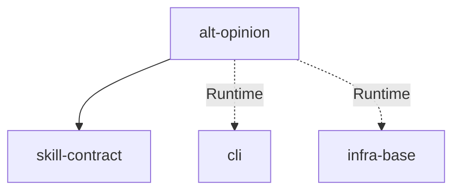

# Module: alt-opinion

→ Parent scope: [`../../ai-skills.spec.md`](../../ai-skills.spec.md)

<!--SECTION:MODULE_VISION-->

## 1. Module Vision

Навык `alt-opinion` — мульти-модельный анализ через CLI `gennady alt-opinion`. Единственный non-SDD навык. Паттерн: CLI-delegation (подготовка артефакта → вызов CLI → показ результата). Не содержит логики — делегирует готовому CLI.

Два режима:

- **С аргументами:** оператор передаёт путь к спеке/директиве → прямой запуск
- **Без аргументов (default):** авто-аудит текущего контекста сессии → резюме → запуск

Модели по умолчанию: kimi-k2.6 (эксперт 1), glm-5.1 (эксперт 2), deepseek-v4-pro (синтез).

Поставляемые артефакты: `opinion.prompt.md` (общий промпт для моделей), `synth.prompt.md` (промпт для синтеза).

<!--/SECTION:MODULE_VISION-->

<!--SECTION:MODULE_USAGE_EXAMPLE-->

## 2. Module Usage Example

**Режим с аргументами:**

```bash
npx gennady alt-opinion \
  --model="llmproxy/kimi-k2.6" \
  --model="llmproxy/glm-5.1" \
  --synthModel="llmproxy/deepseek-v4-pro" \
  --file="/path/to/spec.md"
```

**Режим без аргументов (default):**

```
Пользователь: «alt-opinion», «оцени», «мнение», «разбор»

→ Агент формирует резюме сессии в ~/.config/opencode/alt-opinion/session-artifact.md
→ Запускает CLI с этим артефактом
→ Показывает результат
```

**Кастомные промпты:**

```bash
npx gennady alt-opinion \
  --modelPrompt="./custom.prompt.md" \
  --synthPrompt="./synth.prompt.md" \
  --file="/path/to/spec.md"
```

<!--/SECTION:MODULE_USAGE_EXAMPLE-->

<!--SECTION:ENTITY_INVENTORY-->

## 3. Entity Inventory (Closed-World)

_Это полный список сущностей модуля. Любое введение сущности execution-агентом помимо этого списка считается drift'ом и требует обновления spec._

| Name              | Type         | Purpose                                                                          |
| ----------------- | ------------ | -------------------------------------------------------------------------------- |
| `AltOpinionSkill` | Entity       | Навык alt-opinion: SKILL.md + режимы + CLI-контракт                              |
| `AltOpinionMode`  | Enumeration  | Режим работы: `with-args` (аргументы переданы) или `default` (авто-аудит сессии) |
| `ModelConfig`     | Value Object | Конфигурация моделей: эксперты + синтезатор                                      |
| `SessionArtifact` | Artifact     | Авто-сгенерированное резюме сессии для default-режима                            |
| `OpinionPrompt`   | Artifact     | `opinion.prompt.md` — общий промпт для всех моделей-экспертов                    |
| `SynthPrompt`     | Artifact     | `synth.prompt.md` — промпт для синтезирующей модели                              |
| `EnvConfig`       | Value Object | Обязательные переменные окружения: `LLM_PROXY_API_KEY`, `LLM_PROXY_BASE_URL`     |

<!--/SECTION:ENTITY_INVENTORY-->

<!--SECTION:ENTITY_SURFACES-->

## 4. Entity Surfaces

### `AltOpinionSkill`

- **Type:** Entity
- **Purpose:** Навык alt-opinion в `ai/skills/alt-opinion/`
- **Public Properties:**
  - `name: 'alt-opinion'`
  - `pattern: 'cli-delegation'`
  - `modes: AltOpinionMode[]`
- **Lifecycle:** Статический артефакт. Деплоится через sync-skills
- **Consumers:** Агенты (Claude Code, OpenCode)

### `AltOpinionMode`

- **Type:** Enumeration
- **Purpose:** Режим работы навыка
- **Values:**
  - `with-args` — оператор передал путь к спеке/директиве
  - `default` — оператор не передал аргументов → авто-аудит контекста сессии
- **Consumers:** `AltOpinionSkill`

### `ModelConfig`

- **Type:** Value Object
- **Purpose:** Конфигурация моделей для CLI
- **Public Properties:**
  - `models: string[]` — эксперты (по умолчанию: `llmproxy/kimi-k2.6`, `llmproxy/glm-5.1`)
  - `synthModel: string` — синтезатор (по умолчанию: `llmproxy/deepseek-v4-pro`)
  - `modelPrompt?: string` — путь к общему промпту
  - `synthPrompt?: string` — путь к промпту синтеза
- **Lifecycle:** Immutable. Значения по умолчанию в коде навыка; оператор может переопределить
- **Consumers:** CLI `gennady alt-opinion`

### `SessionArtifact`

- **Type:** Artifact
- **Purpose:** Авто-сгенерированное резюме текущей сессии для default-режима
- **Public Properties:**
  - `path: string` — `~/.config/opencode/alt-opinion/session-artifact.md`
  - `content: string` — резюме сессии + ключевые артефакты из контекста
- **Lifecycle:** Создаётся агентом в default-режиме, передаётся CLI через `--file`
- **Consumers:** CLI `gennady alt-opinion`

### `OpinionPrompt`

- **Type:** Artifact
- **Purpose:** Общий промпт для всех моделей-экспертов
- **Location:** `ai/skills/alt-opinion/opinion.prompt.md`
- **Lifecycle:** Статический файл. Может быть переопределён через `--modelPrompt`
- **Consumers:** CLI `gennady alt-opinion`

### `SynthPrompt`

- **Type:** Artifact
- **Purpose:** Промпт для синтезирующей модели
- **Location:** `ai/skills/alt-opinion/synth.prompt.md`
- **Lifecycle:** Статический файл. Может быть переопределён через `--synthPrompt`
- **Consumers:** CLI `gennady alt-opinion`

### `EnvConfig`

- **Type:** Value Object
- **Purpose:** Обязательные переменные окружения для CLI
- **Public Properties:**
  - `LLM_PROXY_API_KEY: string` — API ключ
  - `LLM_PROXY_BASE_URL: string` — базовый URL LLM-прокси
- **Lifecycle:** Устанавливаются оператором в окружении
- **Consumers:** CLI `gennady alt-opinion`
<!--/SECTION:ENTITY_SURFACES-->

<!--SECTION:MODULE_CONTRACTS-->

## 5. Module Contracts (DbC)

### Entity: `AltOpinionSkill`

- **Purpose:** Навык мульти-модельного анализа
- **Consumers:** Агенты (Claude Code, OpenCode)
- **Runtime Backing:** `real-runtime`
- **Verification Levels:** `contract`
- **Deferred Runtime Scope:** None

**Contract (DbC):**

- **Preconditions:**
  - `npx gennady` доступен в проекте
  - `LLM_PROXY_API_KEY` и `LLM_PROXY_BASE_URL` установлены
  - Для default-режима: агент имеет доступ к контексту сессии
- **Postconditions:**
  - CLI выполнен (параллельный опрос моделей + синтез)
  - Результат (синтез-блок с телеметрией) показан пользователю
- **Invariants:**
  - Ровно один bash-вызов (CLI сам делает параллельный опрос, синтез, форматирование)
  - Навык не создаёт промежуточные оркестраторы/сабагенты
  - Навык не добавляет комментариев к выводу CLI
  - Абсолютные пути для всех файлов

### Artifact: `SessionArtifact`

- **Purpose:** Резюме сессии для default-режима
- **Consumers:** CLI `gennady alt-opinion`
- **Runtime Backing:** `real-runtime`
- **Verification Levels:** `contract`
- **Deferred Runtime Scope:** None

**Contract (DbC):**

- **Preconditions:**
  - Агент имеет доступ к контексту текущей сессии
  - `~/.config/opencode/alt-opinion/` существует или может быть создана
- **Postconditions:**
  - Файл `session-artifact.md` записан
  - Содержит резюме сессии + ключевые артефакты
- **Invariants:**
  - Файл перезаписывается при каждом запуске default-режима
  <!--/SECTION:MODULE_CONTRACTS-->

<!--SECTION:PUBLIC_OPTIONS-->

## 6. Public Options & Policies

| Option          | Binding                   | Status   |
| --------------- | ------------------------- | -------- |
| `--model`       | `ModelConfig.models`      | ✅ bound |
| `--synthModel`  | `ModelConfig.synthModel`  | ✅ bound |
| `--modelPrompt` | `ModelConfig.modelPrompt` | ✅ bound |
| `--synthPrompt` | `ModelConfig.synthPrompt` | ✅ bound |
| `--file`        | аргумент CLI              | ✅ bound |
| Env vars        | `EnvConfig`               | ✅ bound |

Все опции привязаны. Нет отложенных.

<!--/SECTION:PUBLIC_OPTIONS-->

<!--SECTION:FILE_STRUCTURE-->

## 7. File Structure

```
ai/skills/alt-opinion/
├── SKILL.md              # тело навыка: режимы, процесс, правила
├── opinion.prompt.md     # общий промпт для моделей-экспертов
└── synth.prompt.md       # промпт для синтезирующей модели
```

**File Mapping:**
| Путь | Компонент |
|---|---|
| `SKILL.md` | `AltOpinionSkill` — тело навыка |
| `opinion.prompt.md` | `OpinionPrompt` |
| `synth.prompt.md` | `SynthPrompt` |

<!--/SECTION:FILE_STRUCTURE-->

<!--SECTION:MODULE_DECISION_LOG-->

## 8. Module Decision Log

### D-M003 — alt-opinion как отдельный модуль

- **Status:** active
- **Recorded:** session ModuleDecomposition, ai-skills, alt-opinion
- **Why:** alt-opinion — единственный навык с CLI-delegation паттерном, не относится к SDD. Выделен в отдельный модуль для изоляции non-SDD контракта.
- **Risk accepted:** Добавление новых CLI-delegation навыков потребует либо расширения этого модуля, либо создания нового.
- **Rejected alternatives:**
  - Включение в sdd-skills — смешивает паттерны и домены (SDD vs general AI)
  <!--/SECTION:MODULE_DECISION_LOG-->

<!--SECTION:INTER_MODULE_DEPENDENCIES-->

## 9. Inter-Module Dependencies

- **Depends on:** `skill-contract` (паттерн CLI-delegation, frontmatter)
- **Scope Reference (cross-scope):** `cli` (команда `gennady alt-opinion`), `infra-base` (Node.js 22+, bash)
- **Provides to:** Все проекты, использующие мульти-модельный анализ



<!--/SECTION:INTER_MODULE_DEPENDENCIES-->

<!--SECTION:HANDOFF-->

## 10. Handoff to Task Scaffolding

- **Implementation files to be created:** Навык уже существует в `ai/skills/alt-opinion/`. Изменений не требуется.
- **Test files to be created:** Интеграционные тесты CLI `gennady alt-opinion` (в скоупе `cli`)
- **Stack dependencies:**
  - Language: TypeScript
  - Test framework: node:test
- **Module Rules Additions:** None

| Rule | Category | Source |
| ---- | -------- | ------ |
| —    | —        | —      |

- **Open risks & validation needs:**
  - Промпты (`opinion.prompt.md`, `synth.prompt.md`) требуют актуализации при смене моделей
  - Зависимость от внешнего LLM-прокси — навык не работает без `LLM_PROXY_API_KEY`
  - Путь `~/.config/opencode/alt-opinion/` для session-artifact — специфичен для OpenCode; для Claude Code может потребоваться другой путь
  <!--/SECTION:HANDOFF-->
