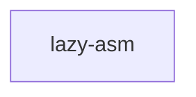

# directive-assembly — Tasks

## Tracker Index

| Task-ID     | Title                                             | Dependencies | Status   | Reopens |
| ----------- | ------------------------------------------------- | ------------ | -------- | ------- |
| DA-lazy-asm | Lazy directive assembly: skeleton + step packages | —            | [ ] TODO | —       |

## Slug Registry

<!-- one slug per line; this IS the uniqueness mechanism — the same slug in two branches collides on merge here, surfacing "same feature" instead of hiding it. Append-only. -->

- lazy-asm

## Intra-Module DAG

<!-- edge A → B = "A depends on B". Cross-module / cross-scope edges live one level up, not here. -->
<!-- single ticket, no intra-module edges yet. -->

## Decision Log (module-task level)

- DA-TASKS-D-1 · весь модуль `directive-assembly` (DA-REQ-1..16) сведён в один тикет `DA-lazy-asm` с
  9 фазами вместо нескольких тикетов (почему: `AX_DAG_AND_TICKET_BOUNDARIES` — модуль-спека — единица
  декомпозиции по умолчанию; ни (P) параллелизм между исполнителями, ни (C) переполнение контекста
  одной фазы не оправдывают разбиение; см. `DA-lazy-asm-D-1` в самом тикете)
- DA-TASKS-D-2 · `sdd-step` (скоуп `cli`) — DEFERRED_DECISION самой спеки (DA-DL-15) — тикет для него
  не создаётся в этом прогоне скаффолдинга

## Conventions

Project-wide conventions (Execution-Log token vocabulary, Baseline Completion Rule, post-task audit hook, file-header) are declared once in `specs/3-tasks.md` and inherited here — not repeated.
