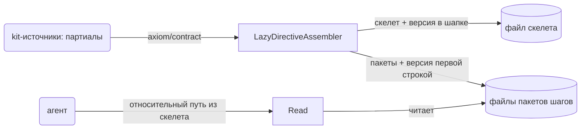
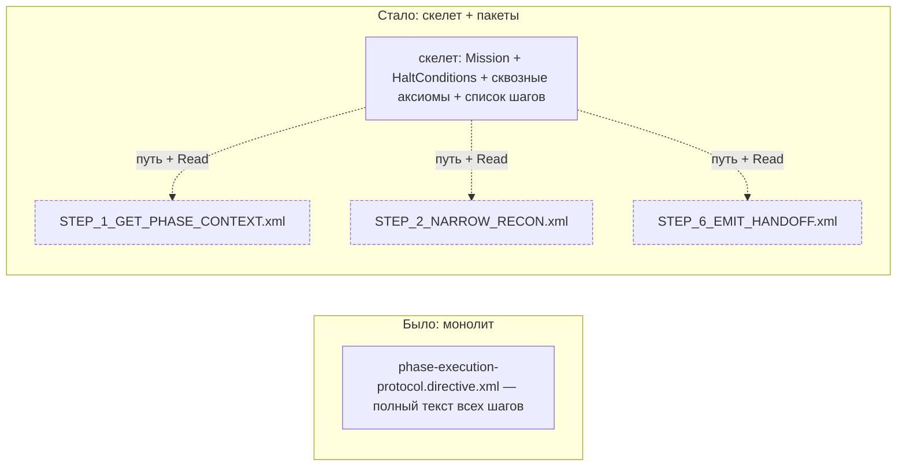
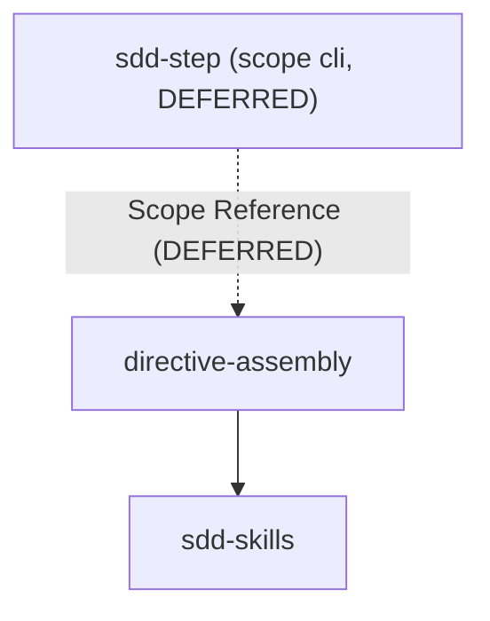
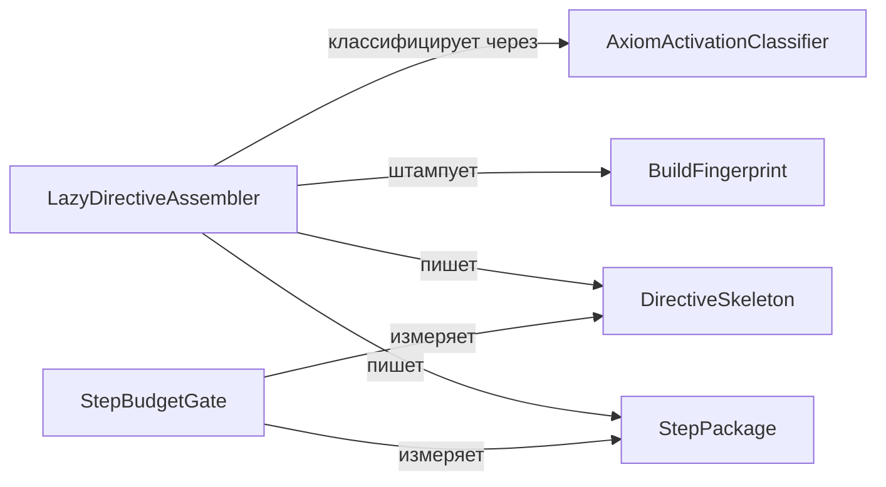

# Module: `directive-assembly`

<!--SECTION:MODULE_VISION-->

## Module Vision

Ленивая сборка SDD-директив: расширение существующего генератора (`ai/kit/build-directives.ts` +
`ai/kit/delta-assembly.ts`) вторым режимом сборки — рядом с уже работающим monolith. Директива
сегодня — единый Handlebars-рендер, который агент читает целиком на старте: весь Mission, все
шаги, все форматы сразу, независимо от того, на каком шаге агент находится сейчас. Этот модуль
вводит lazy-режим: директива распадается на СКЕЛЕТ (Mission, HaltConditions, сквозные аксиомы,
короткий список шагов, контракт стиля вывода) и ПАКЕТЫ ШАГОВ — отдельные генерируемые файлы,
каждый с полным текстом одного шага и его одношаговыми аксиомами. Пакет доставляется путём: шаг скелета несёт относительный путь к файлу `steps/<step-id>.xml`, агент читает его штатным Read, без CLI-инструмента (DA-DL-12, supersedes DA-DL-4). Версия сборки — человекочитаемая npm-версия пакета (`0.8.4-draft.40`) печатается один раз в шапке скелета и первой строкой каждого файла пакета, видна в трейсе через обычный Read.
CLI-инструмент [`sdd-step`](../../cli/sdd-step/sdd-step.spec.md), изначально задуманный как канал выдачи, отложен решением оператора (DEFERRED_DECISION, DA-DL-15) — спека сохранена как проект, не реализуется, пока живые прогоны не покажут потерю агентов на сырых ошибках чтения.

Оба режима — монолит и lazy — сосуществуют: выбор за глобальным флагом сборки с точечным
override на уровне директивы в манифесте (`ai/kit/assembly-manifest.json`). Первая боевая сборка
в режиме lazy — образцовая, на трёх директивах-тяжеловесах (`audit`, `scaffold`,
`phase-execution-protocol`), выбранных по измеренному размеру и доле одношаговых аксиом (см.
Decision Log).

Модуль расширяет генератор, которым сегодня неформально владеет
[`sdd-skills`](../sdd-skills/sdd-skills.spec.md) (директивы SDD v2, партиалы, `build-directives.ts`)
— первая формальная спека на эту машинерию. → Parent scope:
[`../ai-skills.spec.md`](../ai-skills.spec.md) (§8 Module Map).

<!--/SECTION:MODULE_VISION-->

<!--SECTION:OVERVIEW-->

## Overview



_Путь данных: сборка кладёт скелет и пакеты на диск, агент читает пакет штатным Read по напечатанному в скелете пути — DA-REQ-4, DA-REQ-5, DA-REQ-7._



_Монолит → скелет + пакеты для тяжеловесов — DA-REQ-3, DA-REQ-4, DA-REQ-9._

<!--/SECTION:OVERVIEW-->

<!--SECTION:MODULE_USAGE_EXAMPLE-->

## Module Usage Example

```bash
# --- сборка в lazy-режиме для пилотной директивы (манифест override) ---
$ npm run build:directives -- --assembly=lazy
✓ sdd-v2/audit.directive.xml (lazy: skeleton 5 420 tok, 6 пакетов)
✓ sdd-v2/scaffold.directive.xml (lazy: skeleton 4 980 tok, 5 пакетов)
✓ sdd-v2/phase-execution-protocol.directive.xml (lazy: skeleton 5 810 tok, 7 пакетов)
· sdd-v2/router.directive.xml (monolith, delta: -3)
...
Generated 24 directive(s), 18 step package(s).

# --- фрагмент собранного скелета (то, что видит агент); первая строка — версия сборки ---
$ cat ai/directives/sdd-v2/phase-execution-protocol.directive.xml
0.8.4-draft.40
пакеты шагов собираются `npm run build:directives -- --assembly=lazy`; отсутствие файла пакета = сборка/синхронизация устарела
...
<Step id="STEP_1_GET_PHASE_CONTEXT">
  Читает read-manifest фазы и Execution Log, определяет, что уже сделано.
  Получи полный текст шага: прочитай `ai/directives/sdd-v2/phase-execution-protocol/steps/STEP_1_GET_PHASE_CONTEXT.xml`
</Step>
<Step id="STEP_2_NARROW_RECON">
  Сужает разведку контекста фазы до нужного минимума перед реализацией.
  Получи полный текст шага: прочитай `ai/directives/sdd-v2/phase-execution-protocol/steps/STEP_2_NARROW_RECON.xml` (первая строка файла — версия `0.8.4-draft.40`, как в шапке скелета)
</Step>
...

# --- монолит остаётся доступен без изменений для директив без override ---
$ npm run build:directives
· sdd-v2/router.directive.xml (monolith, delta: -3)
✓ sdd-v2/migration-v1-v2.directive.xml (monolith, delta: -1)
...
```

<!--/SECTION:MODULE_USAGE_EXAMPLE-->

<!--SECTION:BDD_SCENARIOS-->

## BDD Scenarios

- **Given** директива в манифесте помечена `lazy`, **when** запускается `build:directives`,
  **then** генератор пишет один файл скелета и по одному файлу пакета на шаг, скелет не содержит
  полного текста ни одного шага (DA-REQ-3, DA-REQ-4).
- **Given** директива не упомянута в `overrides` манифеста, **when** запускается
  `build:directives` без `--assembly`, **then** директива собирается в monolith — поведение,
  идентичное сборке до этой спеки (DA-REQ-1).
- **Given** шапка скелета несёт версию сборки `0.8.4-draft.40`, **when** файл одного из его
  пакетов на диске записан первой строкой с иной версией (например, после частичной пересборки),
  **then** это — детектируемый пост-фактум дефект: сессионный репорт/аудит должен назвать
  директиву, несовпавший шаг и обе версии, а не всплыть тихо во время самого чтения агентом
  (DA-REQ-8).
- **Given** сборка в режиме lazy сгенерировала скелет со ссылками на `STEP_A`..`STEP_E`, **when**
  файл пакета `STEP_C.xml` не был записан (дефект разбиения), **then** гейт сборки проваливает
  билд с именем директивы и шага — скелет со ссылкой в пустоту на диск не попадает (DA-REQ-12).
- **Given** скелет собран корректно, **when** агент получает отказ чтения файла пакета
  (пост-сборочное состояние: частичный sync, каталог steps/ удалён), **then** в шапке скелета,
  уже находящейся в контексте агента, есть строка-подсказка с командой пересборки — следующий ход
  агента предопределён без разведки (DA-REQ-13).
- **Given** после правки пакет шага вырос сверх 20 000 символов ИЛИ содержит строку длиннее 2000
  символов, **when** запускается CI-гейт бюджетов, **then** сборка проваливается с указанием
  директивы, шага и величины превышения — файлы на диск не пишутся тихо с превышением (DA-REQ-14).

<!--/SECTION:BDD_SCENARIOS-->

<!--SECTION:MODULE_REQUIREMENTS-->

## Requirements

### DA-REQ-1 [должен]

**Когда** оператор запускает сборку директив (`build:directives`), **генератор должен** выбрать
режим сборки одной директивы — `monolith` или `lazy` — по следующему приоритету: явный
per-directive override в `ai/kit/assembly-manifest.json`, иначе флаг `--assembly=<mode>` командной
строки, иначе `defaultMode` того же манифеста, иначе `monolith`.

> Полный cutover на lazy одним шагом рискован — точечный override позволяет обкатать режим на
> одной директиве, не трогая остальные 20+.

### DA-REQ-2 [должен]

**Когда** директива входит в пилотный набор тяжеловесов (`audit`, `scaffold`,
`phase-execution-protocol`), **манифест сборки должен** нести для неё явный override `lazy` —
первая боевая сборка demonстрирует режим на измеренно самых тяжёлых директивах, а не на случайной.

> `phase-execution-protocol` — шаги 3.3–3.7k токенов каждый, `BeliefState` 7.6–8.4k токенов,
> 58–72% аксиом активируются ровно в одном шаге; это трёхкратно наибольший выигрыш от lazy-схемы
> среди всех директив sdd-v2 (см. DA-DL-10).

### DA-REQ-3 [должен]

**Когда** директива собирается в режиме `lazy`, **генератор должен** сформировать скелет,
содержащий Mission, HaltConditions, сквозные аксиомы (см. DA-REQ-9), список шагов (заголовок + 1–2
строки сути + точная команда получения пакета на каждый шаг) и контракт стиля вывода — и не
содержащий полного текста ни одного шага.

> Скелет — то, что агент держит в контексте весь сеанс; полный текст шага туда не помещается,
> иначе lazy-режим вырождается в тот же монолит под новым именем.

### DA-REQ-4 [должен]

**Когда** генератор собирает директиву в режиме `lazy`, **он должен** записать полный текст
каждого шага, его одношаговые аксиомы и его форматы/контракты в отдельный файл
`ai/directives/sdd-v2/<имя>/steps/<step-id>.xml`, где `<step-id>` — дословное значение атрибута
`id` соответствующего `<Step>` в директиве (например `STEP_2_NARROW_RECON` для
`phase-execution-protocol`), без позиционной нумерации и без каких-либо преобразований этого
значения; файл генерируется тем же `build-directives`, синхронизируется тем же `sync`, что и
скелет, и видим инспектору директив на равных с ним основаниях.

> Позиционная нумерация (`STEP_1.xml`, `STEP_2.xml`) расходится с реальным `id` шага при любой
> вставке/удалении шага в директиве — дословный `id` не расходится, потому что это одно и то же
> значение, которое уже печатает скелет в команде получения пакета (DA-REQ-5) и которое резолвит
> `sdd-step` (SS-REQ-2).

> Пакет — не временный артефакт сборки: он живёт рядом со скелетом, проходит тот же путь
> распространения (npm-пакет → `sync` → проект-потребитель) и должен открываться инспектором,
> иначе аудит директивы окажется слеп к половине её содержимого.

### DA-REQ-5 [должен]

**Когда** скелет описывает шаг в списке шагов, **генератор должен** сопроводить его точным
относительным путём к файлу пакета (`ai/directives/sdd-v2/<directive>/steps/<step-id>.xml`), так
чтобы агент прочитал этот файл штатным инструментом чтения файлов (Read) — без CLI-команды и без
аргумента версии.

> Антипаттерн «забыл подгрузить тело» (`2026-08-22-lazy-directive-loading.research.md`, находка 6)
> — единственный аргумент за CLI-выдачу, переживший факт-чек, но сам по себе не оправдывает новую
> команду без эмпирики: точный путь дешевле закрывает тот же риск (DA-DL-12, supersedes DA-DL-4).
> `sdd-step` — DEFERRED_DECISION (DA-DL-15): возврат, если живые прогоны покажут потерю агентов на
> сырых ошибках чтения.

### DA-REQ-6 [должен]

**Скелет lazy-директивы должен** укладываться в целевой бюджет ≤6000 токенов и никогда не
превышать жёсткий потолок 8000 токенов; каждый сгенерированный пакет шага должен укладываться в
лимит ≤20 000 символов И ≤2000 символов на строку (DA-DL-5, обновлено DA-DL-14, величина обновлена
DA-DL-16) — все бюджеты проверяются механическим гейтом в CI (`StepBudgetGate`, DA-REQ-14).

> Цель 4–8k токенов на вход — прямой запрос оператора; индустриальный потолок «то, что грузится по
> триггеру» сходится на том же порядке (agentskills.io: <5000 токенов + ~100 метаданные). Лимит
> пакета больше не обосновывается «хардлимитом CLI» (механизм А не идёт через CLI, DA-DL-12):
> реальный канал доставки — Read, чей нижний из проверенных строгих пределов (50 000 символов у
> opencode, `2026-08-22-truncation-and-fingerprints.research.md`) 20 000 символов держит с запасом
> 2.5×; величина пересчитана под этот канал после того, как живое исполнение спеки вскрыло
> невыполнимость прежних 8000 на реальном контенте трёх пилотных директив (DA-DL-16) — единственный
> реальный риск сверх общего объёма пакета остаётся построчным, оба хоста режут строку на 2000
> символах независимо от размера файла, отсюда отдельный лимит ≤2000/строку, не тронутый этим
> пересчётом.

### DA-REQ-7 [должен]

**Когда** генератор собирает директиву в режиме `lazy`, **он должен** записать человекочитаемую
версию сборки (npm-версию пакета, например `0.8.4-draft.40`) один раз в шапке скелета и то же
буквальное значение первой строкой каждого файла пакета — никаких аргументов версии в тексте
скелета, никаких hex-хешей.

> Хеш отклонён факт-чеком (Options §2): дороже в токенах (BPE ~1 токен/символ на hex), измеримо
> влияет на распределение вероятностей модели даже как случайный токен (`arXiv:2505.09338`), не
> несёт смысла человеку/агенту. Рассинхрон шапки и первой строки пакета ловится пост-фактум по
> трейсу (DA-REQ-8, DA-DL-13, supersedes DA-DL-6).

### DA-REQ-8 [должен · нештатная]

**Если** версия сборки в шапке скелета не совпадает с версией, записанной первой строкой в файле
пакета шага на диске, **то это должно** быть детектируемым пост-фактум дефектом — материалом
сессионного репорта/аудита сборки, называющим директиву, несовпавший шаг и обе версии. Механизм А
(путь+Read) не имеет отдельного проверяющего инструмента на момент чтения — сверка не происходит
на лету, только пост-фактум.

> Рассинхрон означает, что скелет и пакет собраны разными прогонами — текст шага может уже не
> соответствовать актуальному скелету; тихое отсутствие сверки — тот же honesty-риск, ради закрытия
> которого заведён механизм версии (DA-DL-13, supersedes DA-DL-6 — живая ошибка требовала CLI, при
> механизме А его нет; условие возврата — то же DEFERRED_DECISION, что у `sdd-step`, DA-DL-15).

### DA-REQ-9 [должен]

**Когда** генератор определяет, в каких шагах активируется аксиома директивы, **он должен**
использовать тот же механизм сигнала активации, что уже реализован и работает в
`ai/kit/audit-axiom-activation.mjs` (прецедент/реализация): аксиома считается активированной в
`<Step>`, если её `id` детерминированно встречается (литеральное вхождение `id` аксиомы) в теле
этого `<Step>` сгенерированной директивы — тот же принцип, что скрипт уже применяет к телу
`<ExecutionPlan>`/`<PhaseProcedure>` целиком, здесь применённый с точностью до отдельного `<Step>`.
На основе этого сигнала генератор **должен** отнести к сквозным (эагерным, место в скелете) любую
аксиому, активируемую в ≥2 шагах либо вне тела шагов, и поместить в пакет шага только аксиому,
активируемую ровно в одном шаге.

> Инвариант, не гарантированно присутствующий в контексте каждого шага, перестаёт быть
> инвариантом — прямой прецедент: CLAUDE.md эагерно во всех не-fork саб-агентах Claude Code
> (`2026-08-22-lazy-directive-loading.research.md`, «Лидеры рынка»).
>
> Сигнал активации — не новое изобретение: `ai/kit/audit-axiom-activation.mjs` уже механически
> проверяет вхождение `id` аксиомы в план директивы для отдельного правила авторства (AUTHORING.md
> §10); `AxiomActivationClassifier` переиспользует ровно этот механизм детекции, не параллельную
> эвристику.

### DA-REQ-10 [должен]

**Когда** lazy-директива участвует в графе дельта-сборки (`ai/kit/delta-assembly.ts`), **генератор
должен** выполнить lazy-разбиение над множеством `partials_ORIGINAL(directive) − ctx(directive,
вызывающее ребро)`, никогда над исходным полным множеством партиалов — партиал, уже гарантированный
контекстом вызывающей цепочки, не размещается повторно ни в скелете, ни в каком пакете.

> Делать это независимо и мирить результаты постфактум рискует либо дублированием партиала
> (он окажется и в контексте вызывающего, и в пакете), либо случайной потерей (обе стороны решат,
> что партиал — «чужая забота»). Порядок «сначала дельта, потом lazy» снимает вопрос по построению
> (см. DA-DL-8).

### DA-REQ-11 [должен]

**Текст скелета и каждого пакета шага должен** состоять из полных предложений со структурной
плотностью — теги/заголовки/таблицы/абсолютные маркеры вместо повторения контекста; телеграфный
(«caveman») стиль запрещён.

> Умеренное телеграфное сжатие теряет 2–5% instruction-following, глубокое — 10–15% (Telegraph
> English, `arXiv:2605.04426`); многоходовой агентный замер того же приёма (`ponytail`/`caveman`,
> 90 живых сессий Claude Code) показывает ухудшение токенов/стоимости/времени, а не улучшение —
> см. DA-DL-9.

### DA-REQ-12 [должен · нештатная]

**Если** сборка в режиме lazy напечатала в скелете путь к файлу пакета шага, **то этот файл
должен** существовать на диске к моменту завершения сборки — гейт сборки проверяет каждый
напечатанный путь и проваливает сборку с именем директивы и шага, а не оставляет скелет со
ссылкой в пустоту.

> Под механизмом путь+Read (DA-DL-12) «файл пакета отсутствует» — дефект сборки, а не сценарий
> выдачи: агент, получивший ENOENT на пути из скелета, потерян (следующий ход — угадывание).
> Единственная точка, где это ловится механически, — сама сборка. Ветки выдачи «неизвестный шаг /
> файл отсутствует» с обучающими сообщениями — поверхность отложенного `sdd-step`
> (DEFERRED_DECISION, DA-DL-15), не действующее требование этого модуля.

### DA-REQ-13 [должен · нештатная]

**Если** агент при исполнении lazy-директивы получил отказ чтения файла пакета (артефакты
частично синхронизированы, каталог steps/ удалён руками), **то шапка скелета должна** заранее
нести одну строку-подсказку восстановления («пакеты шагов собираются `npm run build:directives --
--assembly=lazy`; отсутствие файла = сборка/синхронизация устарела»), чтобы следующий ход агента
был пересборкой, а не разведкой.

> Гейт DA-REQ-12 гарантирует целостность на момент сборки, но не защищает от пост-сборочных
> состояний (частичный sync, ручное удаление). Подсказка в шапке — пассивная страховка без
> инструмента: она уже в контексте агента в момент отказа.

### DA-REQ-14 [должен · нештатная]

**Если** при сборке скелет lazy-директивы превышает 8000 токенов, ИЛИ сгенерированный пакет шага
превышает 20 000 символов, ИЛИ какая-либо строка пакета превышает 2000 символов (DA-DL-5, обновлено
DA-DL-14, величина обновлена DA-DL-16), **то механический CI-гейт должен** провалить сборку, назвав
директиву (и, для пакета, конкретный шаг), какой из трёх лимитов превышен, и величину превышения —
файлы не записываются на диск с превышением молча.

> Бюджет, не проверяемый механически, деградирует до необязательной рекомендации в первую же
> правку — прецедент собственного `sdd-verify` (гейты обязаны провалиться, не только предупредить).

### DA-REQ-15 [должен]

**Смена содержимого директивы (правка шага или сквозной аксиомы) должна** быть покрыта
guard-тестом, обнаруживающим разрыв связки скелет↔пакеты↔вывод инструмента, по образцу
`ai/kit/__tests__/delta-assembly.test.ts` — молчаливая рассинхронизация после правки директивы
недопустима. Тот же guard-тест **должен** для каждой из трёх пилотных директив (`audit`,
`scaffold`, `phase-execution-protocol`) собрать её в обоих режимах (`monolith` и `lazy`) и сверить,
что конкатенация скелета и пакетов в порядке шагов эквивалентна monolith-рендеру за вычетом
служебных строк списка шагов и версийной строки-шапки каждого пакета — регрессионный тест
инварианта «без потерь» (см. Invariants в Module Contracts), не разовая ручная проверка на пилоте.

> Дельта-сборка уже доказала этот класс риска на себе (партиал, забытый в контексте вызывающего);
> lazy добавляет второй независимый источник того же класса ошибки (скелет↔пакет), и его нужно
> закрыть тем же инструментом — тестом, а не ревью.

### DA-REQ-16 [должен]

**Когда** правка директивы меняет состав её `BeliefState` (добавление/удаление сквозной аксиомы,
добавление/удаление шага), **оператор должен** переоценить директиву на кандидатство lazy-override:
директива становится кандидатом, если размер её `BeliefState` превышает 6000 токенов ИЛИ доля
одношаговых аксиом (по `AxiomActivationClassifier`) превышает 50% от общего числа аксиом директивы.
Эта переоценка обязательна при каждой такой правке — не разовый пилот на трёх директивах DA-DL-10.

> Три директивы пилота (DA-DL-10) — образцовый первый прогон, не закрытый список навечно: правило
> триггера делает выбор будущих кандидатов на lazy воспроизводимым по мере роста других директив
> sdd-v2, вместо повторного разового ad-hoc измерения размеров и доли одношаговых аксиом.

<!--/SECTION:MODULE_REQUIREMENTS-->

<!--SECTION:INTER_MODULE_DEPENDENCIES-->

## Inter-Module Dependencies

- **Depends on:** [`sdd-skills`](../sdd-skills/sdd-skills.spec.md) — расширяет его директивы,
  партиалы и генератор (`ai/kit/build-directives.ts`, `ai/kit/delta-assembly.ts`), сегодня не
  специфицированные ни одной спекой; эта спека — первая формальная поверхность над этой машинерией
- **Scope Reference (cross-scope):** [`sdd-step`](../../cli/sdd-step/sdd-step.spec.md) (scope
  `cli`) — DEFERRED (DA-DL-15): изначально спроектирован как потребитель формата
  скелета/пакета/версии этого модуля; отложен, спека сохранена как проект на случай возврата, не
  строится и не потребляет формат сейчас
- **Provides to:** N/A (отложенный `sdd-step` — потенциальный потребитель из другого скоупа, не
  модуль этого)
- **Test-time dependency (cross-scope):** снята — доставка идёт путём+Read (DA-DL-12), не требует
  CLI-бинаря. Сквозной тест «monolith↔lazy через `sdd-step`» остаётся в File Structure заготовкой
  на случай DEFERRED_DECISION (DA-DL-15) — `skip`, «`sdd-step` отложен», не удаляется. Модульный
  guard-тест от `sdd-step` не зависел и раньше.



_Кто расширяет чей генератор — DA-REQ-4; `sdd-step` отложен, ссылка сохранена для возврата._

<!--/SECTION:INTER_MODULE_DEPENDENCIES-->

<!--SECTION:ENTITY_INVENTORY-->

## Entity Inventory

_Это полный список сущностей модуля. Любое введение сущности execution-агентом помимо этого списка считается drift'ом и требует обновления spec._

| Name                             | Type         | Purpose                                                                                                                                                                                                                                                            |
| -------------------------------- | ------------ | ------------------------------------------------------------------------------------------------------------------------------------------------------------------------------------------------------------------------------------------------------------------ |
| `AssemblyMode`                   | Value Object | `'monolith' \| 'lazy'` — режим сборки одной директивы                                                                                                                                                                                                              |
| `AssemblyManifest`               | Value Object | Глобальный `defaultMode` + per-directive `overrides` (`ai/kit/assembly-manifest.json`)                                                                                                                                                                             |
| `DEFAULT_ASSEMBLY_MANIFEST_PATH` | Constant     | Project-root-relative путь к манифесту по умолчанию (`ai/kit/assembly-manifest.json`), подставляется `resolveAssemblyMode`, когда вызывающий код не передал свой `manifestPath`                                                                                    |
| `resolveAssemblyMode`            | Function     | Резолвит режим сборки одной директивы по приоритету override → `--assembly` флаг → `defaultMode` манифеста → встроенный `monolith` (DA-REQ-1)                                                                                                                      |
| `DirectiveSkeleton`              | Value Object | Собранный скелет: Mission+HaltConditions+сквозные аксиомы+список шагов+контракт вывода+отпечаток+подсказка восстановления (DA-REQ-13)                                                                                                                              |
| `StepPackage`                    | Value Object | Полный текст одного шага + его одношаговые аксиомы + форматы — отдельный файл                                                                                                                                                                                      |
| `LazyAssemblyInput`              | Value Object | Вход `assemble`/`LazyDirectiveAssembler.assemble`: имя директивы, delta-вычтенный текст (`partials_ORIGINAL − ctx`), отпечаток сборки                                                                                                                              |
| `LazyAssemblyResult`             | Value Object | Выход `assemble`: один `DirectiveSkeleton` + массив `StepPackage`, один на каждый `<Step>`                                                                                                                                                                         |
| `BuildFingerprint`               | Value Object | Версия сборки директивы — человекочитаемая npm-версия (не хеш), штампуется в шапку скелета и первую строку каждого пакета (DA-DL-13, supersedes DA-DL-6)                                                                                                           |
| `stampFingerprint`               | Function     | Валидирует человекочитаемую версию сборки и штампует её как `BuildFingerprint`; отклоняет пустую строку и hex-хеш-подобный вход (DA-REQ-7)                                                                                                                         |
| `VersionMismatch`                | Value Object | Одна пара скелет/пакет с расходящимся отпечатком — материал пост-фактум находки (DA-REQ-8)                                                                                                                                                                         |
| `findVersionMismatches`          | Function     | Пост-фактум сверка отпечатка в шапке скелета против первой строки каждого пакета (DA-REQ-8)                                                                                                                                                                        |
| `AxiomActivation`                | Value Object | `'cross-cutting' \| 'single-step'` — вердикт размещения одной аксиомы/контракта                                                                                                                                                                                    |
| `StepBodyEntry`                  | Value Object | `id` + полный текст одного `<Step>` — вход `classify`/`AxiomActivationClassifier.classify`                                                                                                                                                                         |
| `AxiomActivationClassifier`      | Service      | Классифицирует аксиому: сквозная (≥2 шага/вне шагов) против одношаговой                                                                                                                                                                                            |
| `classify`                       | Function     | Бэрное-имя alias для `AxiomActivationClassifier.classify`                                                                                                                                                                                                          |
| `LazyCandidacyMetrics`           | Value Object | Измеренный размер `BeliefState` (токены) + доля одношаговых аксиом — вход `isLazyCandidate` (DA-REQ-16)                                                                                                                                                            |
| `isLazyCandidate`                | Function     | Решает кандидатство директивы на lazy-override по порогам DA-REQ-16 (`BeliefState` > 6000 токенов ИЛИ доля одношаговых аксиом > 50%)                                                                                                                               |
| `LazyDirectiveAssembler`         | Service      | Оркестрирует lazy-разбиение партиалов после дельта-вычитания, генерирует скелет+пакеты                                                                                                                                                                             |
| `assemble`                       | Function     | Бэрное-имя alias для `LazyDirectiveAssembler.assemble`                                                                                                                                                                                                             |
| `StepBudgetGate`                 | Module       | Механический CI-гейт бюджетов скелета/пакета (DA-REQ-6, DA-REQ-14) — по факту кода плоский набор экспортов (`check` + три лимит-константы + два входных типа), без объекта-неймспейса в отличие от `AxiomActivationClassifier`/`LazyDirectiveAssembler` (DA-DL-17) |
| `SKELETON_TOKEN_LIMIT`           | Constant     | Жёсткий потолок токенов скелета = 8000 (DA-REQ-6)                                                                                                                                                                                                                  |
| `PACKAGE_CHAR_LIMIT`             | Constant     | Жёсткий потолок символов пакета = 20 000 (DA-REQ-6; величина поднята с 8000 DA-DL-16)                                                                                                                                                                              |
| `PACKAGE_LINE_CHAR_LIMIT`        | Constant     | Жёсткий потолок символов на строку пакета = 2000 (DA-REQ-6)                                                                                                                                                                                                        |
| `StepPackageInput`               | Value Object | Вход `check`: `stepId` + полный рендеренный текст пакета                                                                                                                                                                                                           |
| `StepBudgetFinding`              | Value Object | Одно превышение бюджета: артефакт, вид лимита, лимит, величина превышения                                                                                                                                                                                          |
| `check`                          | Function     | Измеряет `DirectiveSkeleton`/`StepPackage[]` против трёх бюджетов, возвращает список находок (пустой при отсутствии превышений)                                                                                                                                    |

`SkeletonPackageBindingGuard` не входит в эту таблицу: по факту кода это не экспортируемая
сущность (ни один `.ts`-файл не экспортирует символ с этим именем) — только
`describe('SkeletonPackageBindingGuard', ...)`, тест-сюит в
`ai/kit/__tests__/skeleton-package-binding.guard.test.ts` (см. File Structure). Полная поверхность
документирована в Entity Surfaces ниже с явной пометкой «guard-тест», не Service (DA-DL-17).

Ошибки: throw при некорректном манифесте (структурная ошибка конфигурации сборки, не
runtime-ошибка выдачи) → владелец: `LazyDirectiveAssembler`. При механизме А (путь+Read) отдельного
инструмента выдачи нет — рассинхрон версии не всплывает как runtime-ошибка, только пост-фактум
(DA-REQ-8); CLI-специфичные ошибки (версия/шаг/файл) остаются проектом отложенного `sdd-step`
(DA-DL-15), не действующей поверхностью этого модуля.

<!--/SECTION:ENTITY_INVENTORY-->

<!--SECTION:ENTITY_SURFACES-->

## Entity Surfaces

Основная поверхность — `LazyDirectiveAssembler` (оркестратор разбиения) и
`AxiomActivationClassifier` (правило скелет/пакет); `BuildFingerprint` и `StepBudgetGate` —
поддерживающие сущности вокруг них (`StepBudgetGate` — плоский модуль функций/констант, не
объект-неймспейс, см. его блок ниже). Вспомогательные типы и чистые функции, введённые вокруг этих
четырёх (резолюция режима, штамп/сверка версии, тип вердикта активации, кандидатство на lazy),
документированы отдельными компактными блоками ниже — для закрытого мира модуля, не потому что
каждый из них несёт собственный контракт. `SkeletonPackageBindingGuard` — не Service и не
production-сущность вовсе: guard-тест уровня модуля; см. его блок с явной пометкой.

<details>
<summary>Полные поверхности сущностей</summary>

### `AssemblyManifest`

- **Type:** Value Object
- **Purpose:** Хранит глобальный дефолт режима сборки и точечные override на директиву.
- **Public Properties:** `defaultMode: AssemblyMode`; `overrides: Record<string, AssemblyMode>` (ключ — id директивы, `sdd-v2/<name>.directive.xml`)
- **Lifecycle:** Читается один раз на запуск сборки из `ai/kit/assembly-manifest.json`; не мутируется во время сборки
- **Errors & Degradation:** Файл отсутствует → эффективный `defaultMode = 'monolith'`, `overrides = {}` (поведение до этой спеки, без изменений); файл присутствует, но не парсится как JSON → сборка должна упасть явной ошибкой конфигурации, не тихим фолбэком
- **Usage Waiver:** Экспортирован по Exit-критерию фазы P1, до появления собственных потребителей —
  интеграция в `build-directives.ts` шла фазой P3, юнит-тесты фазами P4/P5; на момент проверки
  `yagni` в P1 обе фазы ещё не были выполнены, что и вызвало yagni-находку по всей этой группе
  экспортов (Execution Log P1, `2026-08-22T23:56:42.379Z`).
- **Consumers:**
  - Internal: `build-directives.ts`, `LazyDirectiveAssembler`
  - External: N/A

### `AxiomActivationClassifier`

- **Type:** Service
- **Purpose:** Для каждой аксиомы директивы определяет, сквозная она (эагерная) или одношаговая (в пакет).
- **Public Operations:** классифицировать аксиому по множеству шагов, в теле которых она активируется
- **Errors & Degradation:** Аксиома, активируемая в 0 шагах (мёртвая) — не решение этой сущности; передаётся как отдельная находка в `sdd-critic`/`yagni`, не блокирует сборку
- **Usage Waiver:** Экспортирован по Exit-критерию фазы P1, до появления собственных потребителей —
  интеграция в `build-directives.ts` шла фазой P3, юнит-тесты фазами P4/P5; на момент проверки
  `yagni` в P1 обе фазы ещё не были выполнены, что и вызвало yagni-находку по всей этой группе
  экспортов (Execution Log P1, `2026-08-22T23:56:42.379Z`).
- **Consumers:**
  - Internal: `LazyDirectiveAssembler`
  - External: N/A

### `LazyDirectiveAssembler`

- **Type:** Service
- **Purpose:** Оркестрирует lazy-сборку одной директивы: делит `partials_ORIGINAL − ctx` на скелет и пакеты, штампует отпечаток, пишет файлы.
- **Public Operations:** собрать `DirectiveSkeleton` + `StepPackage[]` из рендеренного текста директивы и результата `AxiomActivationClassifier`
- **Errors & Degradation:** Директива без ни одного `<Step>` — lazy-сборка для неё не имеет смысла (нечего выносить в пакеты); генератор должен отклонить `lazy`-override для такой директивы явной ошибкой конфигурации, а не тихо выдать пустой список шагов
- **Usage Waiver:** Экспортирован по Exit-критерию фазы P1, до появления собственных потребителей —
  интеграция в `build-directives.ts` шла фазой P3, юнит-тесты фазами P4/P5; на момент проверки
  `yagni` в P1 обе фазы ещё не были выполнены, что и вызвало yagni-находку по всей этой группе
  экспортов (Execution Log P1, `2026-08-22T23:56:42.379Z`).
- **Consumers:**
  - Internal: `build-directives.ts`
  - External: N/A

### Вспомогательные экспорты `lazy-assembly.ts` (типы и чистые функции вокруг основных сущностей)

- **Members:** `DEFAULT_ASSEMBLY_MANIFEST_PATH`, `resolveAssemblyMode`, `stampFingerprint`,
  `VersionMismatch`, `findVersionMismatches`, `AxiomActivation`, `LazyCandidacyMetrics`,
  `isLazyCandidate`, `LazyAssemblyResult`
- **Type:** Constant / Function / Value Object — см. Entity Inventory для точного типа каждого
- **Purpose:** Резолюция режима сборки директивы (`resolveAssemblyMode` + свой дефолт-путь
  `DEFAULT_ASSEMBLY_MANIFEST_PATH`, DA-REQ-1); штамп и пост-фактум сверка версии
  (`stampFingerprint`, `findVersionMismatches`, `VersionMismatch`, DA-REQ-7/8); тип вердикта
  активации аксиомы/контракта (`AxiomActivation`, DA-REQ-9); кандидатство директивы на
  lazy-override (`isLazyCandidate`, `LazyCandidacyMetrics`, DA-REQ-16); тип результата
  `LazyDirectiveAssembler.assemble` (`LazyAssemblyResult`)
- **Errors & Degradation:** См. соответствующие требования (DA-REQ-1, DA-REQ-7, DA-REQ-8,
  DA-REQ-16) — каждая функция описана там при первом упоминании; сюда сведены только сигнатуры
  ради закрытого мира, не отдельные контракты
- **Usage Waiver:** Все девять экспортированы по Exit-критерию фазы P1 раньше своих потребителей —
  интеграция в `build-directives.ts` шла фазой P3, юнит-тесты фазами P4/P5; на момент проверки
  `yagni` в P1 обе фазы ещё не были выполнены, что и вызвало yagni-находку по всем 16 именам этой
  группы, включая поля `VersionMismatch`/`LazyCandidacyMetrics` (Execution Log P1,
  `2026-08-22T23:56:42.379Z`).
- **Consumers:**
  - Internal: `build-directives.ts` (частично: `resolveAssemblyMode`, `stampFingerprint`),
    `ai/kit/__tests__/lazy-assembly.test.ts`
  - External: N/A

### Прочие бэрные экспорты `lazy-assembly.ts`

- **Members:** `StepBodyEntry`, `LazyAssemblyInput`, `classify`, `assemble`
- **Type:** Value Object (`StepBodyEntry`, `LazyAssemblyInput`) / Function alias (`classify`, `assemble`)
- **Purpose:** `StepBodyEntry` и `LazyAssemblyInput` — входные типы `classify`/`assemble`
  соответственно; `classify` и `assemble` — бэрные-имя алиасы для
  `AxiomActivationClassifier.classify` и `LazyDirectiveAssembler.assemble`, чтобы вызывающий код
  мог импортировать глагол напрямую, без обращения через объект сервиса
- **Consumers:**
  - Internal: определение алиасов — `AxiomActivationClassifier`, `LazyDirectiveAssembler`; тесты
  - External: N/A

### `StepBudgetGate`

- **Type:** Module (плоский набор экспортов — функция + именованные лимит-константы + входные
  типы; без объекта-неймспейса, в отличие от `AxiomActivationClassifier`/`LazyDirectiveAssembler`
  — см. Decision Log DA-DL-17)
- **Purpose:** Механически проверяет размер скелета и каждого пакета против бюджетов DA-REQ-6/DA-REQ-14.
- **Public Operations:** `check(skeletonText, packages)` — измеряет и возвращает список
  превышений; лимит-константы `SKELETON_TOKEN_LIMIT` (8000 токенов), `PACKAGE_CHAR_LIMIT`
  (20 000 символов, DA-DL-16), `PACKAGE_LINE_CHAR_LIMIT` (2000 символов); входные типы
  `StepPackageInput`, `StepBudgetFinding`
- **Errors & Degradation:** Превышение → непустой список находок, сборка (или отдельный CI-шаг) завершается ошибкой; список пуст → тихий успех
- **Consumers:**
  - Internal: `build-directives.ts` (`check`, через импорт `check as checkStepBudgets`), CI-пайплайн (`npm run check:directive-budgets`)
  - External: N/A

### `SkeletonPackageBindingGuard`

- **Type:** Guard Test — НЕ Service, НЕ production-сущность. По факту кода ни один `.ts`-файл не
  экспортирует символ с этим именем: он существует только как `describe('SkeletonPackageBindingGuard',
...)` в `ai/kit/__tests__/skeleton-package-binding.guard.test.ts` (DA-DL-17). Оставлен здесь как
  полная поверхность конкретно этого guard-теста, а не как элемент закрытого мира продакшн-кода.
- **Purpose:** Guard-тест уровня модуля: правка директивы не должна молча разваливать связку
  скелет↔пакеты, и monolith↔lazy разбиение не должно терять/дублировать аксиомы. Работает по
  файлам на диске и плану сборки (`LazyDirectiveAssembler`), без вызова стороннего бинаря
  `sdd-step` — `directive-assembly` не зависит от `cli`-пакета на этапе этого теста. Отдельный,
  сквозной интеграционный тест, вызывающий реальный `sdd-step`, — вне этой сущности (см.
  Inter-Module Dependencies).
- **Public Operations (тест-кейсы, не API):** для фикстуры lazy-директивы — пересобрать, прочитать
  скелет и файлы пакетов напрямую, сверить, что отпечаток версии и покрытие шагов согласованы с
  планом сборки; для каждой из трёх пилотных директив — собрать в режимах `monolith` и `lazy` и
  сверить эквивалентность «без потерь» (DA-REQ-15)
- **Errors & Degradation:** Разрыв связки или расхождение monolith/lazy → тест красный с указанием,
  какой шаг/файл/аксиома рассинхронизированы
- **Consumers:**
  - Internal: CI (`node:test`)
  - External: N/A

</details>
<!--/SECTION:ENTITY_SURFACES-->

<!--SECTION:MODULE_CONTRACTS-->

## Module Contracts

Две Service-сущности (`LazyDirectiveAssembler`, `AxiomActivationClassifier`) и один Module
(`StepBudgetGate` — плоский набор функций/констант, не объект-неймспейс, DA-DL-17) без Port:
реализация расширяет уже существующий `ai/kit/build-directives.ts`, который читает партиалы через
`node:fs` напрямую, без абстракции источника — единственный источник здесь файлы на диске, как и до
этой спеки, подтверждённой вариативности (тестовая фикстура vs реальный диск) для ЭТОГО модуля не
заведено (`AX_PORTS_AND_ABSTRACTIONS_DISCIPLINE`). Граф зависимостей:



_Кто зависит от кого при lazy-сборке — DA-REQ-3, DA-REQ-4, DA-REQ-6. `SkeletonPackageBindingGuard`
не входит в этот граф — это guard-тест, не Service/Module (см. его блок в Entity Surfaces); он
проверяет `DirectiveSkeleton`/`StepPackage` по факту файлов на диске, не как зависимость времени
выполнения._

| Step | Participant              | Action                                                                     | Data                             |
| ---- | ------------------------ | -------------------------------------------------------------------------- | -------------------------------- |
| 1    | Operator/CI              | `npm run build:directives -- --assembly=lazy`                              | флаг + манифест                  |
| 2    | `build-directives.ts`    | вызывает `buildDeltaPlan` (без изменений, `ai/kit/delta-assembly.ts`)      | `partials_ORIGINAL`, `ctx`       |
| 3    | `LazyDirectiveAssembler` | партиционирует `partials_ORIGINAL − ctx` через `AxiomActivationClassifier` | сквозные vs одношаговые партиалы |
| 4    | `LazyDirectiveAssembler` | штампует `BuildFingerprint` (версия сборки)                                | человекочитаемая npm-версия      |
| 5    | `LazyDirectiveAssembler` | записывает `DirectiveSkeleton` + `StepPackage[]` на диск                   | файлы скелета и пакетов          |
| 6    | `StepBudgetGate`         | измеряет размеры, проваливает CI при превышении                            | отчёт о бюджете                  |

_Сборка lazy-директивы от партиалов до файлов на диске — DA-REQ-3, DA-REQ-4, DA-REQ-7, DA-REQ-14._

<details>
<summary>Контракты DbC</summary>

### Services & Modules

#### Service: `LazyDirectiveAssembler`

- **Purpose:** Делит делта-вычтенный набор партиалов директивы на скелет и пакеты, штампует единый отпечаток.
- **Consumers:**
  - Internal: `build-directives.ts`
  - External: N/A
- **Runtime Backing:** `not-implemented`
- **Verification Levels:** `unit`, `integration`
- **Deferred Runtime Scope:** None

**Contract (DbC):**

- `assemble`:
  - Pre: директива классифицирована как `lazy` (манифест/флаг); её рендеренный текст содержит ≥1 `<Step>`
  - Post: возвращает один `DirectiveSkeleton` и по одному `StepPackage` на каждый `<Step>`; каждый `StepPackage` несёт то же значение `BuildFingerprint`, что записано в шапку скелета; ни один партиал из `ctx(directive, edge)` не попадает ни в скелет, ни в пакет
  - On pre-violation: директива без `<Step>` и с override `lazy` → явная ошибка конфигурации сборки, не пустой скелет

#### Service: `AxiomActivationClassifier`

- **Purpose:** Разделяет аксиомы директивы на сквозные и одношаговые.
- **Consumers:**
  - Internal: `LazyDirectiveAssembler`
  - External: N/A
- **Runtime Backing:** `not-implemented`
- **Verification Levels:** `unit`
- **Deferred Runtime Scope:** None

**Contract (DbC):**

- `classify`:
  - Pre: множество шагов директивы, в теле которых активируется данная аксиома — вычисляется
    детерминированным вхождением `id` аксиомы в текст каждого `<Step>` (тот же механизм сканирования
    id, уже реализованный в `ai/kit/audit-axiom-activation.mjs` для `<ExecutionPlan>`/
    `<PhaseProcedure>` целиком, здесь примененный на уровне отдельного `<Step>`)
  - Post: аксиома в ≥2 шагах ИЛИ вне тела любого шага → `cross-cutting` (скелет); аксиома в ровно 1 шаге → `single-step` (пакет этого шага)
  - On pre-violation: аксиома в 0 шагах → `cross-cutting` (безопасный дефолт — остаётся видимой, не прячется в несуществующий пакет), но помечается как потенциальная YAGNI-находка для отдельного прогона `yagni`

#### Service: `StepBudgetGate`

- **Note:** заголовок сохраняет слово «Service» ради стабильности якоря, на который ссылается
  тикет (`#service-stepbudgetgate`); по факту кода и по Entity Inventory это Module — плоский
  набор экспортов (`check` + лимит-константы + входные типы), не объект-неймспейс (DA-DL-17).
- **Purpose:** Проваливает сборку/CI при превышении бюджетов скелета или пакета.
- **Consumers:**
  - Internal: CI-пайплайн
  - External: N/A
- **Runtime Backing:** `not-implemented`
- **Verification Levels:** `unit`, `integration`
- **Deferred Runtime Scope:** None

**Contract (DbC):**

- `check`:
  - Pre: сгенерированный `DirectiveSkeleton` и его `StepPackage[]`
  - Post: скелет ≤8000 токенов И пакет ≤20 000 символов И каждая строка пакета ≤2000 символов
    (DA-DL-5/14/16) → пустой список находок; иначе — находки с артефактом, лимитом и величиной превышения
  - On pre-violation: N/A (чистая функция измерения, не имеет precondition сверх наличия артефактов)

**Invariants:**

- Версия сборки, записанная в шапку скелета и в первую строку каждого его пакета одним и тем же
  прогоном сборки, идентична побайтово во всех местах — иначе пост-фактум сверка по трейсу
  (DA-REQ-8) теряет смысл.
- Без потерь: конкатенация скелета и всех его пакетов в порядке шагов эквивалентна
  monolith-рендеру той же директивы за вычетом служебных строк списка шагов и версийной
  строки-шапки каждого пакета — ни одна аксиома директивы не теряется и не дублируется между
  скелетом и пакетами при lazy-разбиении.

</details>
<!--/SECTION:MODULE_CONTRACTS-->

<!--SECTION:PUBLIC_OPTIONS-->

## Public Options & Policies

Режим сборки — единственная публично управляемая политика этого модуля.

<details>
<summary>Опции и политики</summary>

- **`--assembly=<monolith|lazy>`** (флаг `build:directives`) — глобальный дефолт режима на этот
  прогон сборки; действует для директив без записи в `overrides` манифеста
- **`ai/kit/assembly-manifest.json`** — `{ "defaultMode": "monolith" | "lazy", "overrides": { "<directive-id>": "monolith" | "lazy" } }`; `overrides` побеждает и флаг, и собственный `defaultMode` манифеста для названной директивы
- Приоритет разрешения режима одной директивы: `overrides[id]` → `--assembly=` → `defaultMode` → встроенный дефолт `monolith` (DA-REQ-1)

</details>
<!--/SECTION:PUBLIC_OPTIONS-->

<!--SECTION:FILE_STRUCTURE-->

## File Structure

```
ai/kit/
├── build-directives.ts              (расширяется: читает AssemblyManifest, диспетчеризует monolith|lazy)
├── assembly-manifest.json            (NEW: AssemblyManifest)
├── lazy-assembly.ts                  (NEW: LazyDirectiveAssembler, AxiomActivationClassifier, BuildFingerprint)
├── step-budget-gate.ts               (NEW: StepBudgetGate)
└── __tests__/
    ├── lazy-assembly.test.ts
    ├── step-budget-gate.test.ts
    ├── skeleton-package-binding.guard.test.ts   (SkeletonPackageBindingGuard, по образцу delta-assembly.test.ts; monolith↔lazy эквивалентность по файлам/плану, без вызова sdd-step)
    └── skeleton-package-binding.e2e.test.ts     (заготовка на случай возврата DEFERRED_DECISION; skip — sdd-step отложен решением оператора (DA-DL-15), см. Inter-Module Dependencies)

ai/directives/sdd-v2/
├── phase-execution-protocol.directive.xml       (скелет при mode=lazy)
├── phase-execution-protocol/
│   └── steps/
│       ├── STEP_1_GET_PHASE_CONTEXT.xml
│       ├── STEP_2_NARROW_RECON.xml
│       └── STEP_6_EMIT_HANDOFF.xml
├── audit.directive.xml
├── audit/steps/STEP_*.xml
├── scaffold.directive.xml
└── scaffold/steps/STEP_*.xml
```

**File Mapping:**

- `ai/kit/lazy-assembly.ts`: `LazyDirectiveAssembler`, `AxiomActivationClassifier`, `BuildFingerprint`, plus every supporting export in Entity Inventory (`resolveAssemblyMode`, `stampFingerprint`, `findVersionMismatches`, `isLazyCandidate`, `classify`, `assemble`, and their constant/type companions)
- `ai/kit/assembly-manifest.json`: `AssemblyManifest`
- `ai/kit/step-budget-gate.ts`: `StepBudgetGate` (Module: `check`, `SKELETON_TOKEN_LIMIT`, `PACKAGE_CHAR_LIMIT`, `PACKAGE_LINE_CHAR_LIMIT`, `StepPackageInput`, `StepBudgetFinding`)
- `ai/kit/__tests__/skeleton-package-binding.guard.test.ts`: `SkeletonPackageBindingGuard` (guard-тест, не экспортируемая сущность — DA-DL-17)
<!--/SECTION:FILE_STRUCTURE-->

<!--SECTION:RESEARCH-->

## Research

| Документ                                                                                                 | Что ресёрчили                                                                                                                                                                                                                                                                                     | Что дал для спеки                                                                                                                                                                                                                                                                 |
| -------------------------------------------------------------------------------------------------------- | ------------------------------------------------------------------------------------------------------------------------------------------------------------------------------------------------------------------------------------------------------------------------------------------------- | --------------------------------------------------------------------------------------------------------------------------------------------------------------------------------------------------------------------------------------------------------------------------------- |
| [2026-08-22-lazy-directive-loading](../research/2026-08-22-lazy-directive-loading.research.md)           | Ленивая/поэтапная загрузка инструкций в LLM-агентах: progressive disclosure, JIT retrieval, антипаттерны                                                                                                                                                                                          | Форма «маленькое эагерное ядро + ленивый хвост» (DA-REQ-3, DA-REQ-9); первоначальное решение оператора — скелет+пакеты выдаются CLI, аксиомы эагерны, бюджеты под гейтом (базис DA-REQ-1..7) — доставка CLI впоследствии суперсидирована (DA-DL-12), см. последнюю строку таблицы |
| [2026-08-22-prompt-compression](../research/2026-08-22-prompt-compression.research.md)                   | Компрессия смысла в промптах: ML-компрессоры, телеграфный стиль, структурная плотность                                                                                                                                                                                                            | Отказ от телеграфного сжатия текста директивы, структурная плотность полными предложениями (DA-REQ-11, DA-DL-9)                                                                                                                                                                   |
| [2026-08-22-ponytail](../research/2026-08-22-ponytail.research.md)                                       | Формат общения и структура промптов продукта ponytail (108k+ звёзд)                                                                                                                                                                                                                               | Многоходовой (не однократный) замер того же телеграфного приёма — усиливает DA-REQ-11/DA-DL-9; подтверждение формы «эагерное ядро + ленивый хвост» на живом продукте, не только у вендора                                                                                         |
| [2026-08-22-truncation-and-fingerprints](../research/2026-08-22-truncation-and-fingerprints.research.md) | Факт-чек двух допущений: защищает ли CLI-выдача от усечения на объёме ≤8000 символов; чем хеш-отпечаток хуже/лучше человекочитаемой версии — по официальной документации/исходному коду Claude Code и opencode, академии про contextual entrainment, первоисточникам Anthropic про prompt caching | Снял оба довода в пользу первоначального дизайна: усечение не грозит на ≤8000 символах ни на одном хосте (единственный реальный риск — построчный лимит ≤2000 символов); хеш дороже и не нейтрален для модели/кеша — основа решений А/Б/В (DA-DL-12..15)                          |

<!--/SECTION:RESEARCH-->

<!--SECTION:MODULE_DECISION_LOG-->

## Module Decision Log

Семнадцать записей: режимы сборки и приоритет, форма скелета/пакета, CLI-выдача и честная ошибка
версии (обе позднее суперсидированы), эагерность аксиом, порядок с дельта-сборкой, отказ от
телеграфа, пилотные директивы, guard-тесты; плюс четыре записи после факт-чека
`2026-08-22-truncation-and-fingerprints.research.md`: доставка путём+Read, пост-фактум сверка
версии, обновлённое обоснование лимитов, DEFERRED_DECISION про `sdd-step`; плюс одна запись после
живого исполнения спеки на реальном контенте: величина бюджета пакета шага пересчитана под
Read-канал (8000 → 20 000 символов); плюс одна запись после независимого аудита: `StepBudgetGate`
зафиксирован как Module (не Service), `SkeletonPackageBindingGuard` — как guard-тест, а не
production-сущность.

<details>
<summary>Полные записи Decision Log</summary>

### DA-DL-1 2026-08-22 — режим сборки выбирается по приоритету override → флаг → манифест-дефолт → `monolith` (почему: полный cutover на lazy одним шагом рискован для 20+ директив; per-directive override даёт обкатку на одной директиве без глобального переключения; отвергнуто: отдельный переключатель на уровне агента-хоста (Claude Code vs opencode) — контент не должен зависеть от хоста, только бюджет пакета константен на этапе сборки, не runtime-переключатель; риск: два пути сборки поддерживаются параллельно до полного cutover)

### DA-DL-2 2026-08-22 — скелет = Mission+HaltConditions+сквозные аксиомы+список шагов+контракт вывода, без тел шагов (почему: сходится с трёхуровневым progressive disclosure Agent Skills, правилом Cursor «1–2 always-apply», и CLAUDE.md-эагерностью в саб-агентах Claude Code — все три источника сходятся на форме «маленькое эагерное ядро», не на «всё лениво»; отвергнуто: полностью ленивое дерево без стабильного эагерного ядра — не поддержано ни одним источником ресёрча `2026-08-22-lazy-directive-loading.research.md`)

### DA-DL-3 2026-08-22 — пакет шага — отдельный генерируемый файл `ai/directives/sdd-v2/<name>/steps/<step-id>.xml` (дословный `id` шага, не позиционный номер), не динамический слайс монолита по якорю (почему: пакет несёт версийный отпечаток и собственный бюджетный гейт — отдельный артефакт проще гейтить/синкать/показывать инспектору, чем слайс по требованию; отвергнуто: читать секцию монолита через уже существующий `sdd-extract` по якорю — отклонено, контракт `sdd-extract` не предполагает версийной сверки, смешение доменов ослабило бы его узкую однозначность)

### DA-DL-4 2026-08-22 — пакет выдаёт CLI (`sdd-step`), агент не читает файл пакета сам (почему: закрывает задокументированный антипаттерн «описание подавило чтение тела / забыл подгрузить» из `2026-08-22-lazy-directive-loading.research.md`, находка 6; отвергнуто: путь к файлу пакета в тексте скелета, читаемый агентом напрямую — отклонено, нет версийной сверки, нет принудительной печати отпечатка, воспроизводит тот же антипаттерн, который вся схема должна закрыть)

### DA-DL-5 2026-08-22 — хардлимит пакета шага = 8000 символов, скелет ≤6000 токенов цель / ≤8000 жёсткий потолок (почему: Bash-тул Claude Code по умолчанию усекает вывод СЕРЕДИНОЙ на 30 000 символах (github.com/anthropics/claude-code issue #19901; platform.claude.com/docs/en/agents-and-tools/tool-use/bash-tool, проверено 2026-08-22); opencode жёстко зашивает `MAX_BYTES = 50 * 1024` и `MAX_LINES = 2000` (github.com/anomalyco/opencode issues #22565, #13770, проверено 2026-08-22) — 8000 символов даёт >3.5× запас под более строгим лимитом Claude Code и >6× под байтовым лимитом opencode, поглощая обёрточный текст (эхо команды, баннер кода возврата), который делит с пакетом общий бюджет вне контроля инструмента; отвергнуто: использовать сырой лимит хоста (30 000/50 КБ) как бюджет — отклонено, СЕРЕДИННОЕ усечение у Claude Code может незаметно вырезать строку отпечатка версии прямо из тела пакета, что подрывает DA-REQ-7/DA-REQ-8; риск: шаг, которому объективно нужно >8000 символов неделимого текста, должен быть разбит на подшаги, а не получить исключение из бюджета)

### DA-DL-6 2026-08-22 — рассинхрон версии — жёсткая, честная ошибка, никогда не тихая деградация (почему: входное требование оператора №6 недвусмысленно; отвергнуто: warn-и-продолжить с устаревшим пакетом — отклонено, риск выполнить шаг по тексту, которого скелет уже не описывает)

### DA-DL-7 2026-08-22 — сквозные аксиомы остаются эагерными, лениво не грузятся никем (почему: прецедент CLAUDE.md во всех не-fork саб-агентах Claude Code + анти-паттерн Cursor «10+ always-apply правил → усреднённое нарушение всех» (`2026-08-22-lazy-directive-loading.research.md`); отвергнуто: лениво грузить аксиому, активируемую в ≥2 шагах, только при первом обращении к любому из них — отклонено, инвариант, не гарантированный в контексте каждого шага, перестаёт быть инвариантом)

### DA-DL-8 2026-08-22 — lazy-разбиение выполняется ПОСЛЕ дельта-вычитания, над остатком `partials_ORIGINAL − ctx`, а не независимо (почему: все три пилотных тяжеловеса сегодня — узлы с `ctx = ∅` (audit/scaffold — Class 1 точки входа скиллов, phase-execution-protocol — Class 3 subagent-мир по `ai/kit/delta-assembly.ts`), то есть для пилота дельта не вычитает ничего и lazy — единственная действующая ось сжатия без конфликта порядка уже сегодня; общее правило для будущих Class 2 кандидатов фиксирует порядок на будущее; отвергнуто: считать lazy-разбиение независимо от дельты и мирить результаты постфактум — отклонено, нет чистого способа примирить два независимых утверждения «партиал уже присутствует» без риска дублирования либо потери)

### DA-DL-9 2026-08-22 — текст скелета/пакетов — полные предложения со структурной плотностью, телеграфный стиль отвергнут (почему: умеренное телеграфное сжатие теряет 2–5% instruction-following, глубокое — 10–15% (Telegraph English, arXiv:2605.04426); многоходовой агентный замер того же приёма (`ponytail`/`caveman`, 90 живых сессий Claude Code) показывает ухудшение токенов (+7%), стоимости (+3%) и времени (+2%) против безскилльного бейзлайна, а не выигрыш — прямая многоходовая эмпирика, не только однократная; отвергнуто: ML-компрессор класса LLMLingua в пайплайне генерации — отклонено, метод валидирован на сжатии контекста/RAG, не на рукописных инструкциях (`2026-08-22-prompt-compression.research.md`))

### DA-DL-10 2026-08-22 — первый пилот: `audit`, `scaffold`, `phase-execution-protocol`, собранные lazy первыми как образец (почему: измеренные размеры — шаги `phase-execution-protocol` 3.3–3.7k токенов каждый, `BeliefState` 7.6–8.4k токенов, 58–72% аксиом одношаговые — три директивы с наибольшим измеренным выигрышем от разбиения; та же пара пороговых величин (`BeliefState` >6000 токенов ИЛИ доля одношаговых аксиом >50%), измеренная для пилота разово, зафиксирована как повторяемое правило триггера кандидатства на будущее в DA-REQ-16 — переоценка при каждой правке, меняющей состав `BeliefState`, не только на старте; отвергнуто: пересобрать все директивы sdd-v2 одновременно — отклонено, первый прогон должен остаться единичным образцом по входному решению №1, не big-bang миграцией)

### DA-DL-11 2026-08-22 — guard-тесты связки скелет↔пакеты↔вывод по образцу `ai/kit/__tests__/delta-assembly.test.ts` (почему: тот же класс риска, что дельта-сборка уже закрыла тестом для своей связки контекст↔партиалы — симметричный guard для lazy закрывает именно названный входным требованием сценарий «правка директивы молча ломает выдачу»; отвергнуто: полагаться на структурные warn'ы `sdd-check` — отклонено, `sdd-check` проверяет структуру спек/тикетов, а не согласованность собранного вывода с исходником, другой класс артефакта)

### DA-DL-12 2026-08-22 — supersedes DA-DL-4: доставка пакета шага — относительный путь к `steps/<step-id>.xml`, печатаемый в скелете, читаемый агентом штатным Read (почему: факт-чек `2026-08-22-truncation-and-fingerprints.research.md` показал, что «защита от усечения» — довод, на котором стояла DA-DL-4 — не работает на объёме ≤8000 символов ни на одном из четырёх проверенных каналов (Read/Bash Claude Code, `read`/`truncate` opencode) — минимальный порог хоста больше 8000 символов в 3.75–6.25 раза; единственный аргумент, переживший факт-чек — антипаттерн «забыл подгрузить» (лазy-loading research, находка 6) — реален, но сам по себе не оправдывает новую CLI-команду без эмпирики живых прогонов; отвергнуто: сохранить `sdd-step` обязательным каналом — статус понижен до DEFERRED_DECISION, см. DA-DL-15; риск: путь+Read может воспроизвести тот же антипаттерн — условие возврата к CLI зафиксировано именно на этот случай)

### DA-DL-13 2026-08-22 — supersedes DA-DL-6: версийная сверка выполняется не жёсткой ошибкой в момент выдачи, а пост-фактум — сравнением версии в шапке скелета с версией первой строки каждого файла пакета, материалом сессионного репорта/аудита сборки (почему: DA-DL-6 предполагал живой проверяющий инструмент (`sdd-step`); при механизме доставки путём+Read (DA-DL-12) отдельного проверяющего инструмента на момент чтения нет — Read не сверяет версии; пост-фактум сверка по трейсу достаточна, потому что рассинхрон — редкий случай устаревшей сборки, не штатный путь исполнения; отвергнуто: тихо игнорировать рассинхрон без какой-либо сверки — отклонено, тот же honesty-провал, ради закрытия которого заведён весь механизм версии; риск: дефект обнаруживается позже, чем при живой проверке — смягчается тем, что пост-фактум сверка — механическая часть аудита/сессионного репорта, не факультативная)

### DA-DL-14 2026-08-22 — supersedes обоснование DA-DL-5 (число 8000 символов на пакет не меняется; добавлен отдельный построчный гейт ≤2000 символов): обоснование хардлимита пакета переносится с «хардлимит невырезаемости вывода CLI» на прямую находку факт-чека — построчный лимит хостов, а не общий размер, единственный реальный риск усечения на объёме ≤8000 символов (почему: факт-чек показал, что общий объём ≤8000 символов не рискует усечением ни на одном хосте (минимальный порог хоста 30 000/50 000 символов — в 3.75–6.25 раза больше), тогда как построчный лимит 2000 символов у обоих хостов реален независимо от общего размера, если пакет собран как однострочный блок; отвергнуто: оставить только общий лимит 8000 символов без построчного — отклонено, не покрывает реальный риск, обнаруженный факт-чеком)

### DA-DL-15 2026-08-22 — DEFERRED_DECISION: CLI-инструмент `sdd-step` отложен, спека сохранена как проект инструмента, не реализуется на этом этапе (почему: доставка путём+Read (DA-DL-12) закрывает все требования текущего этапа без CLI; единственный переживший факт-чек аргумент в пользу CLI — риск антипаттерна «забыл подгрузить» — гипотетический, не подтверждённый живым прогоном; условие возврата — живые прогоны покажут, что сырые ошибки чтения (ENOENT, опечатки в пути) реально теряют агентов на механизме путь+Read, тогда инструмент оправдан эмпирикой, а не гипотезой; отвергнуто: реализовать `sdd-step` сейчас «на будущее» — отклонено, строить инструмент без эмпирического подтверждения риска противоречит духу факт-чека, который и привёл к этому решению)

### DA-DL-16 2026-08-23 — supersedes величину DA-DL-5/DA-DL-14: хардлимит пакета шага поднят с 8000 до 20 000 символов; построчный лимит ≤2000 символов не меняется (почему: живое исполнение спеки на реальном контенте показало, что бюджет 8000 невыполним — измеренные худшие пакеты (тело шага + его одношаговые аксиомы) составили audit/STEP_1_MECHANICAL 13 440 символов, scaffold/STEP_3_TASK_GENERATION 15 568, phase-execution-protocol/STEP_5_VERIFY 15 422, при телах самих шагов ≤7 166 символов — превышение даёт именно состав пакета (тело + аксиомы), не раздутость самого шага; обоснование DA-DL-5 стояло на хардлимите Bash-вывода Claude Code (30 000 символов, серединное усечение), потому что тогда пакет выдавала CLI-команда — после DA-DL-12 канал доставки сменился на путь+Read, и Bash-лимит перестал быть релевантным ограничением для этого механизма; строгий предел актуального канала (Read) по факт-чеку (`2026-08-22-truncation-and-fingerprints.research.md`) — 50 КБ/50 000 символов у opencode (нижний из двух хостов, у Claude Code Read governed токен-лимитом того же порядка); 20 000 символов даёт 2.5× запас под этим пределом и вмещает худший измеренный пакет (15 568) с запасом ~28% на дальнейший рост контента директив; построчный лимит ≤2000 символов не пересматривается — он реален для обоих хостов независимо от общего объёма и не был затронут пивотом канала; отдельно: корень ошибки — при пивоте канала (DA-DL-12) величина бюджета осталась унаследованной от прежнего канала (Bash) и не была пересчитана вместе с ним — решение пережило своё собственное основание, и этот класс дрифта не виден на этапе спеки/ревью, ловится только реальным прогоном на реальном контенте; отвергнуто: оставить 8000 без изменений — отклонено, факт живого исполнения (не гипотеза) показывает недостижимость на реальном контенте всех трёх пилотных директив; отвергнуто: поднять лимит вплотную к пределу канала (например 45 000–48 000) — отклонено, не оставляет запаса на рост контента и воспроизводит тот же паттерн «бюджет на грани хардлимита канала», который уже подвёл однажды)

### DA-DL-17 2026-08-23 — независимый аудит группы: `StepBudgetGate` документируется как Module (плоский набор экспортов `check`+три лимит-константы+два входных типа), не Service; `SkeletonPackageBindingGuard` вынесен из Entity Inventory — это guard-тест (`describe('SkeletonPackageBindingGuard', ...)` в `ai/kit/__tests__/skeleton-package-binding.guard.test.ts`), не экспортируемая production-сущность (почему: `gennady lint --inventory-reverse` не находил ни одного экспорта этих двух имён — P2 реализовал `step-budget-gate.ts` как чистую функцию `check` плюс три именованные константы плюс два типа, без объекта-неймспейса по образцу `AxiomActivationClassifier`/`LazyDirectiveAssembler` (ни одного второго вызова, оправдывающего обёртку, — единственный вызов `check` идёт из `build-directives.ts`, конструкция-обёртка добавила бы уровень индирекции без потребителя, тот же принцип `AX_NO_PREMATURE_ABSTRACTIONS`, что уже применён внутри `step-budget-gate.ts` к его инлайновому CLI-блоку); `SkeletonPackageBindingGuard` никогда не существовал как код — только как имя тест-сюита, введённое P7 по образцу `ai/kit/__tests__/delta-assembly.test.ts`, где сам образец тоже не заводит отдельно экспортируемую сущность под именем guard'а; отвергнуто: задним числом обернуть `step-budget-gate.ts` в объект `StepBudgetGate = { check, ... }` — отклонено, это код-изменение, а зона этой правки — только спека/тикет/трекер, реализация уже прошла свои fix-прогоны; отвергнуто: удалить `StepBudgetGate`/`SkeletonPackageBindingGuard` из спеки полностью — отклонено, оба имени остаются осмысленными концептуальными якорями (Requirements, тикет, тесты уже ссылаются на них), спека должна честно описывать их реальную форму, а не вычёркивать)

</details>
<!--/SECTION:MODULE_DECISION_LOG-->

<!--SECTION:HANDOFF-->

## Handoff to Tasks

- **Implementation files to be created:** см. File Structure
- **Test files to be created:** `ai/kit/__tests__/lazy-assembly.test.ts`, `ai/kit/__tests__/step-budget-gate.test.ts`, `ai/kit/__tests__/skeleton-package-binding.guard.test.ts`, `ai/kit/__tests__/skeleton-package-binding.e2e.test.ts` (skip — `sdd-step` отложен решением оператора, DA-DL-15; заготовка на случай возврата DEFERRED_DECISION)
- **Stack dependencies:**
  - Language: `typescript` (resolves to `ai/directives/coding/typescript-rules.xml`)
  - Test framework: `node:test` (resolves to `ai/directives/testing/node-test.xml`)
- **Module Rules Additions:** None (наследует scope-wide baseline `ai-skills`)

  | Rule | Category | Source |
  | ---- | -------- | ------ |

- **Open risks & validation needs:**
  - Точный файл-путь директивы `scaffold` (`scaffold.directive.xml` или иное реальное имя шаблона)
    не подтверждён grep'ом по существующим `.hbs` — уточнить при реализации, до генерации путей
    пакетов
  - Лимиты пакета (≤20 000 символов, ≤2000/строку, DA-DL-14/16) обоснованы факт-чеком
    документации/кода хостов (`2026-08-22-truncation-and-fingerprints.research.md`) и измерением
    трёх пилотных директив на реальном контенте (DA-DL-16), не живым прогоном инструмента чтения;
    требует проверки живым Read реального пакета внутри Claude Code и opencode до включения гейта в
    CI
  - `AxiomActivationClassifier` для аксиомы, активируемой в 0 шагах (мёртвая) — решение «остаётся
    сквозной + помечается YAGNI-находкой» не проверено на реальном корпусе аксиом трёх пилотных
    директив
  - Формат `ai/kit/assembly-manifest.json` — новый файл конфигурации; нет предшествующего примера
    в репозитории для схемы валидации при парсинге
  - Отпечаток (DA-REQ-7) — голая `version` из `package.json` (например `0.8.4`, без draft/build
  суффикса), что буквально удовлетворяет DA-REQ-7, но ослабляет рационале DA-DL-13 (пост-фактум
  сверка ловит рассинхрон скелета и пакета): сверка работает только если версия менялась между
  прогонами сборки. Два прогона сборки подряд без бампа `package.json` (например, прерванная и
  затем повторённая пересборка в рамках одной версии пакета) штампуют одинаковый отпечаток везде
  — `findVersionMismatches` вернёт пустой список даже если один из прогонов был частичным, и
  рассинхрон в этом случае не детектируется никак. Это не дефект кода (реализация делает ровно то,
  что требует DA-REQ-7) — известная граница механизма пост-фактум сверки при текущей схеме
  версионирования, а не гарантия обнаружения любого рассинхрона.
  <!--/SECTION:HANDOFF-->
